# 1.2: Transform and Process Data

## Knowledge in:

- Creation of ETL pipelines based on business requirements
- Volume, velocity, and variety of data (for example, structured data, unstructured data)
- Cloud computing and distributed computing
- How to use Apache Spark to process data
- Intermediate data staging locations

### **1. Creation of ETL Pipelines Based on Business Requirements**

### **Primary Functions:**

An **ETL (Extract, Transform, Load) pipeline** is a sequence of processes used to:

1. **Extract** data from one or more sources.
2. **Transform** the data to meet business needs (e.g., filtering, joining datasets, applying business rules).
3. **Load** the transformed data into a target storage system such as a data lake, warehouse, or database.

AWS services such as **AWS Glue**, **AWS Lambda**, and **Amazon EMR** enable the creation of ETL pipelines. Glue is the primary service used for managing serverless ETL tasks, while EMR provides a managed Hadoop/Spark environment for more complex or large-scale ETL workloads.

### **Patterns (When to Use):**

- **AWS Glue**: Ideal for serverless ETL tasks, particularly if your data resides in **S3** or needs to be cataloged and processed regularly.
    - **Example:** Automating nightly data transformations of customer transactions stored in S3.
- **Amazon EMR with Apache Spark**: Use for large-scale data transformations that require distributed computing and more control over the underlying infrastructure.
    - **Example:** Processing multi-terabyte datasets with complex transformations across a Spark cluster.

### **Antipatterns (When Not to Use):**

- Avoid using **AWS Glue** for very complex transformations or massive datasets, as it may be less performant than EMR for large-scale processing.
- Avoid building manual ETL workflows without automation (e.g., without **Step Functions** or **Glue Workflows**) for critical jobs, as it may increase the risk of operational errors.

### **Benefits of Managed vs. Serverless Services:**

- **Managed Service (Amazon EMR):**
    - **Scalability**: Highly customizable and scalable for large, distributed workloads.
    - **Complexity**: More configuration is needed to set up clusters, manage infrastructure, and control costs.
    - **Cost**: You pay for the EC2 instances used in the cluster.
- **Serverless (AWS Glue):**
    - **Scalability**: Automatically scales based on the volume of data being processed.
    - **Simplicity**: Less setup and management overhead.
    - **Cost**: Pay-per-use pricing model, which is cost-effective for small to medium-sized data workloads.

### **Mermaid Diagram: ETL Pipeline Using AWS Glue**

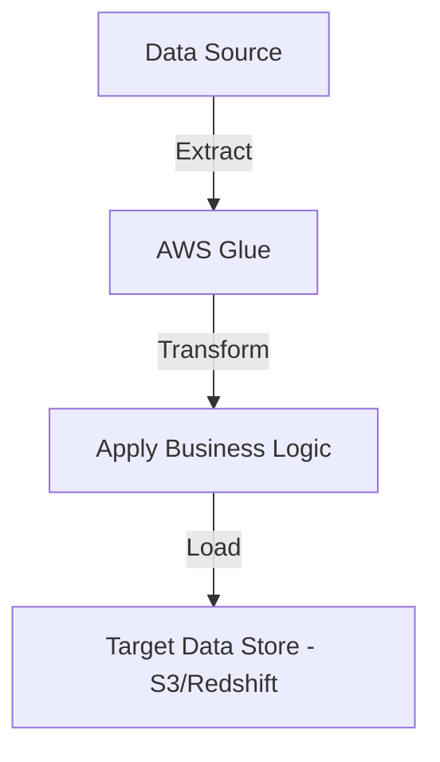

### **AWS Documentation Links:**

- [AWS Glue Documentation](https://docs.aws.amazon.com/glue/index.html)
- [Amazon EMR Documentation](https://docs.aws.amazon.com/emr/index.html)

---

### **2. Volume, Velocity, and Variety of Data**

### **Primary Functions:**

- **Volume**: Refers to the amount of data generated (e.g., gigabytes, terabytes). In AWS, services like **Amazon S3** and **Amazon Redshift** handle massive volumes of data.
- **Velocity**: Refers to the speed at which data is generated and processed. Streaming services like **Amazon Kinesis** and **MSK (Managed Streaming for Apache Kafka)** handle high-velocity data.
- **Variety**: Refers to the different types of data (e.g., structured, semi-structured, unstructured). AWS services like **AWS Glue** and **Amazon S3** manage and process various data types.

### **Patterns (When to Use):**

- **S3 for high-volume, diverse data storage**: Suitable for both structured and unstructured data (e.g., log files, images, videos).
- **Amazon Kinesis for high-velocity data ingestion**: Ideal for real-time data analytics, monitoring, or any scenario requiring immediate processing of high-frequency data streams.
- **Glue Data Catalog for managing metadata**: Use Glue to catalog structured or semi-structured data for easy discovery and processing.

### **Antipatterns (When Not to Use):**

- Avoid using **Amazon Redshift** for raw, unstructured data like images or logs—Redshift is best suited for structured, analytical workloads.
- Avoid using **Kinesis** if the data doesn’t require real-time processing. Batch processing using **S3** and **Glue** might be more efficient and cost-effective for low-velocity data.

### **Benefits of Managed vs. Serverless Services:**

- **Managed Services (Kinesis, Redshift)**:
    - **Scalability**: Kinesis and Redshift scale well for high-throughput and high-velocity data ingestion.
    - **Cost**: Pay for the provisioned throughput and storage, which may result in higher costs for continuous or high-volume streams.
- **Serverless Services (Glue, S3)**:
    - **Simplicity**: Easier to set up and manage, with a focus on pay-per-use and flexibility to handle various data types.
    - **Cost**: Cost-effective for large-scale, batch processing workloads where real-time processing isn’t necessary.

### **Mermaid Diagram: Managing Volume, Velocity, and Variety**

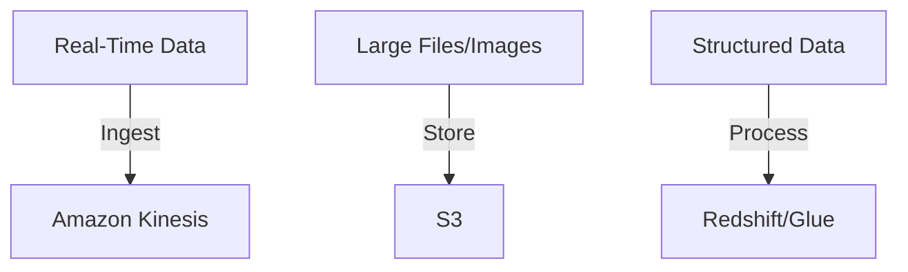

### **AWS Documentation Links:**

- [Amazon Kinesis Documentation](https://docs.aws.amazon.com/kinesis/index.html)
- [Amazon S3 Documentation](https://docs.aws.amazon.com/s3/index.html)

---

### **3. Cloud Computing and Distributed Computing**

### **Primary Functions:**

- **Cloud Computing**: Using AWS resources like compute, storage, and networking services on-demand over the internet. Services like **Amazon EC2**, **AWS Lambda**, and **Amazon RDS** offer scalable and managed compute environments.
- **Distributed Computing**: Processing data across multiple servers or nodes to increase throughput and reduce processing time. **Amazon EMR** with **Apache Hadoop** or **Apache Spark** is commonly used for distributed data processing.

### **Patterns (When to Use):**

- **Amazon EMR for distributed big data processing**: Use it when you need to process large datasets across multiple servers, with tools like **Apache Spark** or **Hadoop** for parallel processing.
    - **Example:** Analyzing terabytes of clickstream data or running large-scale machine learning algorithms across a cluster.
- **EC2 for flexible, compute-intensive tasks**: Use EC2 for tasks that require full control over the infrastructure or custom configurations.
    - **Example:** Running a custom machine learning model or high-performance computing workloads.

### **Antipatterns (When Not to Use):**

- Avoid using **Amazon EC2** for workloads that can easily be handled by **serverless** solutions (e.g., Lambda, Glue) unless you need low-level control.
- Avoid using **Amazon EMR** for small datasets or infrequent jobs. In those cases, **AWS Glue** or **Lambda** is more efficient.

### **Benefits of Managed vs. Serverless Services:**

- **Managed Services (Amazon EMR, EC2)**:
    - **Control**: Allows full control over the environment, suitable for complex configurations.
    - **Cost**: Higher cost due to the need to provision and manage servers and clusters.
- **Serverless (AWS Lambda, Glue)**:
    - **Simplicity**: No need to manage infrastructure, and services auto-scale based on usage.
    - **Cost**: Pay-per-use model reduces costs for intermittent workloads.

### **Mermaid Diagram: Distributed Computing on AWS**

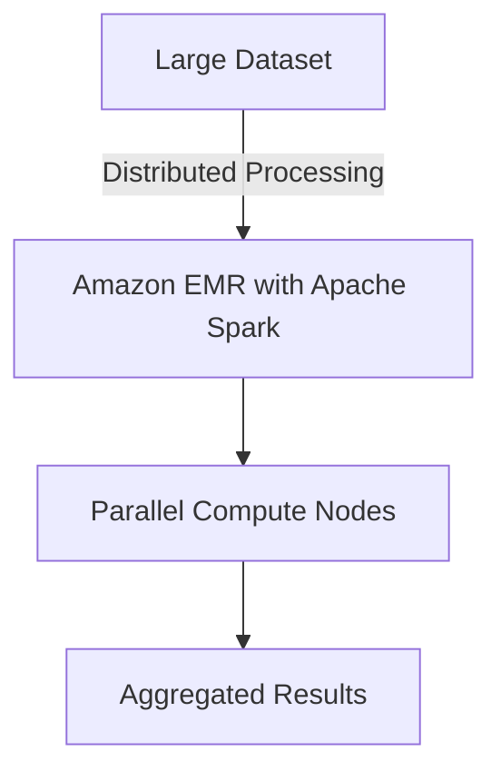

### **AWS Documentation Links:**

- [Amazon EMR Documentation](https://docs.aws.amazon.com/emr/index.html)
- [Amazon EC2 Documentation](https://docs.aws.amazon.com/ec2/index.html)

---

### **4. How to Use Apache Spark to Process Data**

### **Primary Functions:**

**Apache Spark** is a distributed data processing engine that handles large-scale data in-memory, speeding up computations for tasks like ETL, machine learning, and real-time streaming. **Amazon EMR** is the primary service that runs Spark clusters in AWS, allowing users to perform distributed data processing tasks without managing the infrastructure.

### **Patterns (When to Use):**

- Use **Apache Spark on Amazon EMR** when working with massive datasets that need to be processed in parallel, such as processing log data, running machine learning models, or performing real-time analytics.
    - **Example:** Running a Spark job to process petabytes of data stored in S3 and writing results to Redshift for analytics.

### **Antipatterns (When Not to Use):**

- Avoid using Spark if the dataset size is small or if the computational requirements are modest, as the overhead of setting up a Spark cluster may outweigh its benefits. Consider using **AWS Glue** or **Lambda** for smaller workloads.

### **Benefits of Managed vs. Serverless Services:**

- **Managed (Amazon EMR with Apache Spark)**:
    - *

Control**: Customizable Spark cluster settings allow fine-tuned performance optimizations.

- **Scalability**: Dynamically scale Spark jobs based on the volume of data processed.
- **Cost**: Costs are based on the provisioned EC2 instances running the Spark jobs.
- **Serverless Alternatives (AWS Glue)**:
    - **Ease of Use**: AWS Glue is easier to manage and configure but doesn’t provide the same level of control over Spark clusters.
    - **Cost**: Glue has a pay-per-use pricing model, ideal for small to medium-sized workloads.

### **Mermaid Diagram: Spark Workflow on Amazon EMR**

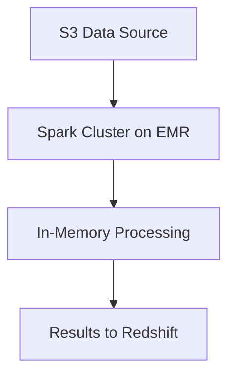

### **AWS Documentation Links:**

- [Apache Spark on Amazon EMR](https://docs.aws.amazon.com/emr/latest/ReleaseGuide/emr-spark.html)

---

### **5. Intermediate Data Staging Locations**

### **Primary Functions:**

Intermediate data staging locations act as temporary storage points during the processing of data, before the final transformation or loading step. **Amazon S3** is commonly used as a staging area due to its scalability and integration with other AWS services.

### **Patterns (When to Use):**

- Use **Amazon S3** as a staging area when processing large datasets in steps, such as loading raw data into S3, performing transformations using AWS Glue, and writing the final dataset to Redshift.
    - **Example:** Using S3 to stage raw log files before processing them with Spark or Glue.

### **Antipatterns (When Not to Use):**

- Avoid storing intermediate data in services like **DynamoDB** or **Redshift**, which are more suited for structured, final datasets rather than temporary, unstructured data.

### **Benefits of Managed vs. Serverless Services:**

- **Managed (S3)**:
    - **Simplicity**: Easily integrates with other AWS services for staging, offering durability and scalability.
    - **Cost**: Pay for the storage used with flexible pricing options for infrequent access.
- **Serverless (Glue or Lambda for Data Transformation)**:
    - **Simplicity**: No need to manage infrastructure for processing, but data must still be staged in S3 for transformations.

### **Mermaid Diagram: Intermediate Data Staging with S3**

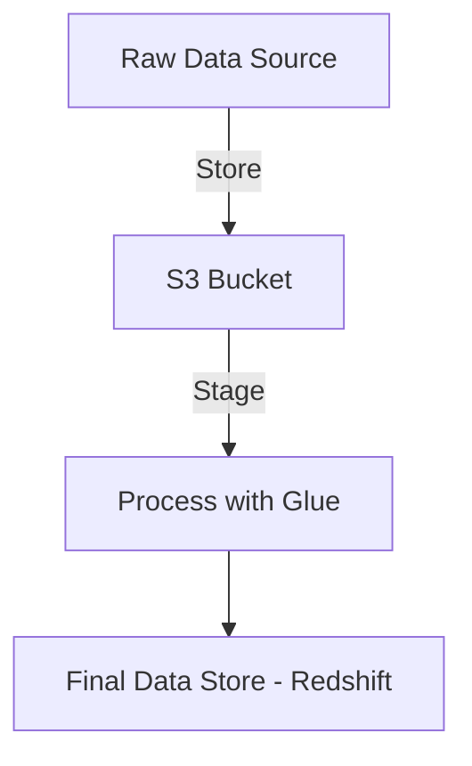

### **AWS Documentation Links:**

- [Amazon S3 Documentation](https://docs.aws.amazon.com/s3/index.html)

---

## Skills in:

- Optimizing container usage for performance needs (for example, Amazon Elastic Kubernetes Service [Amazon EKS], Amazon Elastic Container Service [Amazon ECS])
- Connecting to different data sources (for example, Java Database Connectivity [JDBC], Open Database Connectivity [ODBC])
- Integrating data from multiple sources
- Optimizing costs while processing data
- Implementing data transformation services based on requirements (for example, Amazon EMR, AWS Glue, Lambda, Amazon Redshift)
- Transforming data between formats (for example, from .csv to Apache Parquet)
- Troubleshooting and debugging common transformation failures and performance issues
- Creating data APIs to make data available to other systems by using AWS
services

---

### **1. Optimizing Container Usage for Performance Needs (Amazon EKS, Amazon ECS)**

### **Detailed Steps/Exercises:**

### **Exercise 1: Setting Up and Optimizing Amazon ECS (Elastic Container Service)**

1. **Create a Task Definition in ECS:**
    - Go to the **ECS Console**.
    - Click **Create new task definition** and select the **Fargate** launch type.
    - Configure **container resources**, such as CPU and memory based on your performance needs (e.g., 512MB memory, 1vCPU).
2. **Create a Cluster and Run the Task:**
    - After creating the task definition, create an ECS cluster.
    - Choose the **Fargate** launch type and run your task.
3. **Monitor Performance:**
    - Use **CloudWatch** metrics to monitor container performance (CPU, memory utilization).
    - Adjust the task definition's resource allocation based on the workload and monitor performance impacts.

### **Exercise 2: Using Amazon EKS (Elastic Kubernetes Service)**

1. **Create an EKS Cluster:**
    - Use the **EKS Console** or **eksctl** to create an EKS cluster:
        
        ```bash
        eksctl create cluster --name my-eks-cluster --region us-west-2
        
        ```
        
2. **Deploy a Kubernetes Application:**
    - Deploy your application to the EKS cluster and specify resource limits for the pods in the deployment file:
        
        ```yaml
        resources:
          limits:
            cpu: "500m"
            memory: "512Mi"
        
        ```
        
3. **Auto-Scaling:**
    - Enable auto-scaling based on pod resource usage by configuring a **Horizontal Pod Autoscaler**:
        
        ```bash
        kubectl autoscale deployment my-deployment --cpu-percent=80 --min=1 --max=10
        
        ```
        

### **Mermaid Diagram: ECS Performance Optimization**

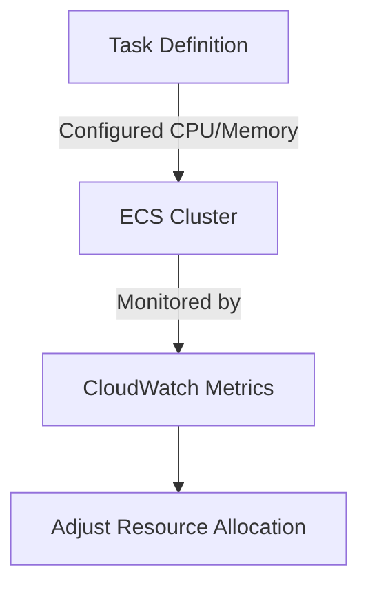

### **AWS Documentation Links:**

- [Amazon ECS Documentation](https://docs.aws.amazon.com/ecs/index.html)
- [Amazon EKS Documentation](https://docs.aws.amazon.com/eks/index.html)

### **Use Case Scenarios:**

- Running containerized applications that need to scale based on user traffic or load, such as microservices-based architectures, e-commerce platforms, or real-time data processing apps.

### **Common Pitfalls or Challenges:**

- **Pitfall:** Overprovisioning CPU or memory, leading to unnecessary costs.
- **Solution:** Monitor with **CloudWatch** and fine-tune the resource limits based on real-world performance data.

---

### **2. Connecting to Different Data Sources (JDBC, ODBC)**

### **Detailed Steps/Exercises:**

### **Exercise 1: Connecting to Amazon RDS with JDBC**

1. **Create an RDS Instance (MySQL):**
    - Go to **Amazon RDS Console** and create a MySQL instance.
2. **Configure the JDBC Connection:**
    - Use a Java application to connect via JDBC. Include the MySQL JDBC driver in your project.
    - Sample Java code:
        
        ```java
        String url = "jdbc:mysql://<rds-endpoint>:3306/mydatabase";
        Connection conn = DriverManager.getConnection(url, "username", "password");
        
        ```
        

### **Exercise 2: Connecting to Amazon Redshift with ODBC**

1. **Create a Redshift Cluster:**
    - Go to **Amazon Redshift Console** and create a new Redshift cluster.
2. **Install ODBC Driver:**
    - Download and install the Redshift ODBC driver.
3. **Use ODBC to Connect:**
    - Configure the ODBC connection with your Redshift credentials and cluster endpoint.

### **Mermaid Diagram: Connecting via JDBC/ODBC**

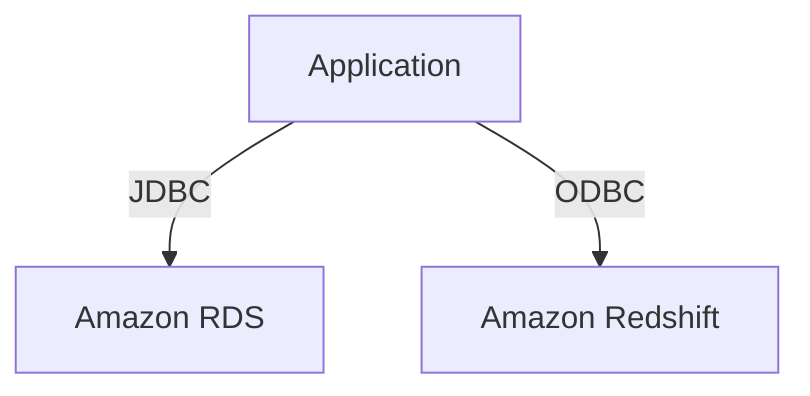

### **AWS Documentation Links:**

- [JDBC with RDS](https://docs.aws.amazon.com/AmazonRDS/latest/UserGuide/UsingWithRDS.Java.html)
- [ODBC with Redshift](https://docs.aws.amazon.com/redshift/latest/mgmt/configure-odbc-connection.html)

### **Use Case Scenarios:**

- Applications that need to fetch data from relational databases (RDS) or data warehouses (Redshift) for reporting, analytics, or data transformation purposes.

### **Common Pitfalls or Challenges:**

- **Pitfall:** Incorrect network or security group settings can block database connections.
- **Solution:** Ensure your application can connect by properly configuring **security groups** and **VPC settings**.

---

### **3. Integrating Data from Multiple Sources**

### **Detailed Steps/Exercises:**

### **Exercise 3: Integrating Data Using AWS Glue**

1. **Set Up a Glue Crawler:**
    - Use **AWS Glue** to crawl two data sources (e.g., one in **S3** and one in **RDS**) to catalog their metadata.
2. **Create an ETL Job in Glue:**
    - Use **Glue Studio** to create a transformation job that joins datasets from both sources.
    - Output the transformed data into a **Redshift** cluster for further analysis.

### **Mermaid Diagram: Data Integration with AWS Glue**

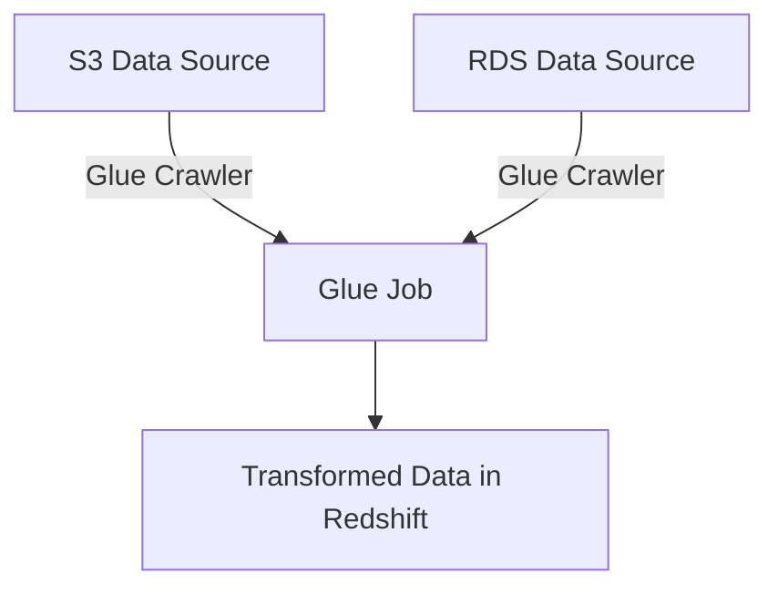

### **AWS Documentation Links:**

- [AWS Glue Documentation](https://docs.aws.amazon.com/glue/index.html)

### **Use Case Scenarios:**

- Businesses that aggregate data from various sources such as databases, logs, or data lakes for unified analysis, such as marketing data integrations or customer analytics platforms.

### **Common Pitfalls or Challenges:**

- **Pitfall:** Data schema mismatches or poor data quality.
- **Solution:** Use Glue Data Catalog to profile data and identify inconsistencies early.

---

### **4. Optimizing Costs While Processing Data**

### **Detailed Steps/Exercises:**

### **Exercise 4: Cost Optimization with AWS Glue and S3**

1. **Use S3 Infrequent Access:**
    - Move less frequently accessed data in **Amazon S3** to **S3 Infrequent Access** or **Glacier** to reduce storage costs.
2. **Optimize Glue Job Execution:**
    - Schedule Glue jobs during off-peak hours using **Amazon EventBridge** to reduce computing costs.

### **Mermaid Diagram: Cost Optimization Strategy**

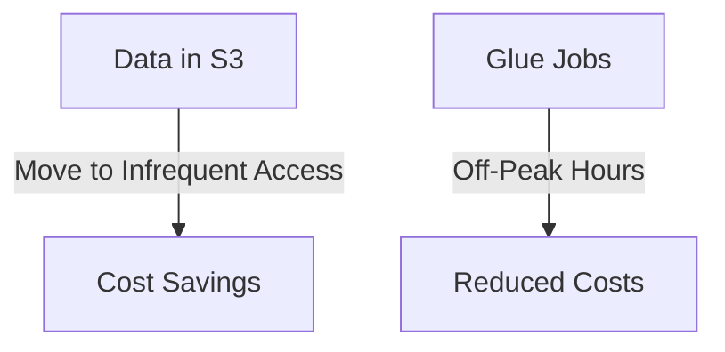

### **AWS Documentation Links:**

- [S3 Storage Classes](https://docs.aws.amazon.com/AmazonS3/latest/dev/storage-class-intro.html)
- [AWS Glue Pricing](https://aws.amazon.com/glue/pricing/)

### **Use Case Scenarios:**

- Organizations looking to optimize storage costs or reduce computational expenses, especially for long-running data transformation pipelines.

### **Common Pitfalls or Challenges:**

- **Pitfall:** Mismanagement of storage classes leading to higher-than-expected costs.
- **Solution:** Regularly review **S3 Lifecycle Policies** to ensure data is being stored in the most cost-effective class.

---

### **5. Implementing Data Transformation Services (EMR, Glue, Lambda, Redshift)**

### **Detailed Steps/Exercises:**

### **Exercise 5: Transforming Data with AWS Glue**

1. **Set Up a Glue Job:**
    - Use **AWS Glue** to create a new ETL job that reads data from S3, transforms it, and writes the output to Redshift.
2. **Transform Data Using Lambda:**
    - Create a **Lambda function** that transforms incoming JSON files by filtering and formatting data before saving it to S3.

### **Mermaid Diagram: Data Transformation Workflow**

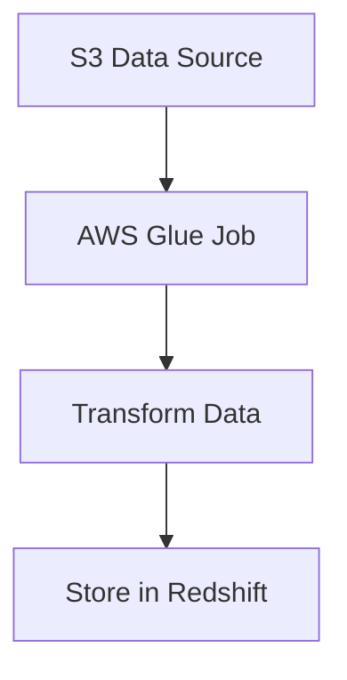

### **AWS Documentation Links:**

- [AWS Glue](https://docs.aws.amazon.com/glue/index.html)
- [AWS Lambda](https://docs.aws.amazon.com/lambda/latest/dg/welcome.html)

### **Use Case Scenarios:**

- Data transformation workflows, such as converting customer transaction data into analytics-ready formats or transforming IoT data streams before loading them into a data warehouse.

### **Common Pitfalls or Challenges:**

- **Pitfall:** Long job runtimes due to inefficient transformation logic.
- **Solution:** Optimize transformations by using appropriate file formats (e.g., **Apache Parquet**) to reduce I/O and storage overhead.

---

### **6. Transforming Data Between Formats (CSV to Parquet)**

### **Detailed Steps/Exercises:**

### **Exercise 6: Converting CSV to Parquet with AWS Glue**

1. **Set Up Glue ETL Job:**
- Use AWS Glue to read **CSV** files from S3, convert them to **Parquet**, and write the output to a different S3 bucket.
1. **Glue Studio Job:**
    - Define the transformation step in **Glue Studio** by selecting the input format as CSV and the output format as Parquet.

### **Mermaid Diagram: CSV to Parquet Transformation**

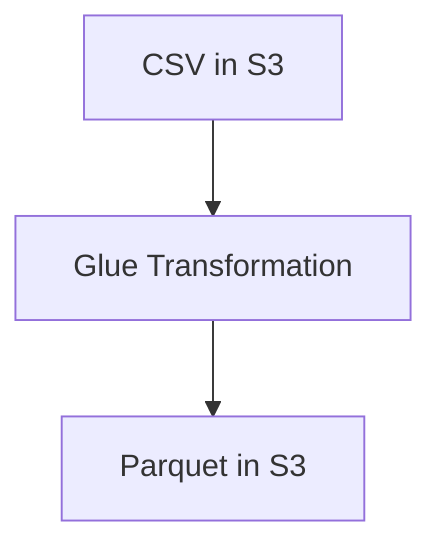

### **AWS Documentation Links:**

- [Converting CSV to Parquet](https://docs.aws.amazon.com/glue/latest/dg/convert-csv-to-parquet.html)

### **Use Case Scenarios:**

- Use cases where transforming raw CSV logs into a more optimized format like **Apache Parquet** for faster query performance in **Amazon Athena** or **Redshift Spectrum**.

### **Common Pitfalls or Challenges:**

- **Pitfall:** High storage costs due to large uncompressed CSV files.
- **Solution:** Use Parquet, which is a columnar storage format that compresses data efficiently.

---

### **7. Troubleshooting and Debugging Common Transformation Failures**

### **Detailed Steps/Exercises:**

### **Exercise 7: Debugging a Failed Glue Job**

1. **Monitor Glue Job Logs:**
    - Check **CloudWatch Logs** for detailed error messages from failed Glue jobs.
2. **Common Fixes:**
    - Ensure that the input schema matches the expected format.
    - Verify that data permissions are correctly set for the source and destination.

### **AWS Documentation Links:**

- [Troubleshooting Glue Jobs](https://docs.aws.amazon.com/glue/latest/dg/troubleshooting-glue.html)

### **Use Case Scenarios:**

- Handling transformation failures during data pipeline executions, such as incorrect file formats or access permission issues.

---

### **8. Creating Data APIs with AWS Services**

### **Detailed Steps/Exercises:**

### **Exercise 8: Create a REST API to Access Data from DynamoDB Using API Gateway**

1. **Create DynamoDB Table:**
    - Create a DynamoDB table (e.g., `CustomerData`) and insert sample data.
2. **Create API in API Gateway:**
    - Create a **REST API** that interacts with the DynamoDB table to retrieve data.
3. **Lambda Function as a Data Source:**
    - Create a **Lambda** function that fetches data from DynamoDB and connects to API Gateway.
4. **Deploy and Test API:**
    - Deploy the API and test it by making GET requests to fetch customer data.

### **Mermaid Diagram: API Gateway with DynamoDB and Lambda**

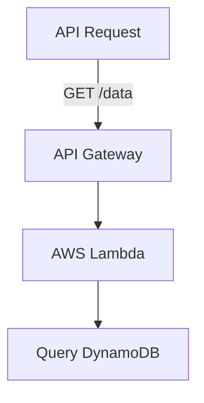

### **AWS Documentation Links:**

- [Creating APIs with API Gateway](https://docs.aws.amazon.com/apigateway/latest/developerguide/welcome.html)
- [Lambda with DynamoDB](https://docs.aws.amazon.com/lambda/latest/dg/with-ddb.html)

### **Use Case Scenarios:**

- Exposing internal datasets to external applications through REST APIs for use in mobile apps or analytics dashboards.

### **Common Pitfalls or Challenges:**

- **Pitfall:** Slow query performance when interacting with large datasets.
- **Solution:** Use **DynamoDB indexes** or optimize the data model for efficient querying.

---