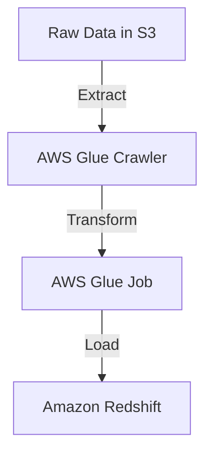
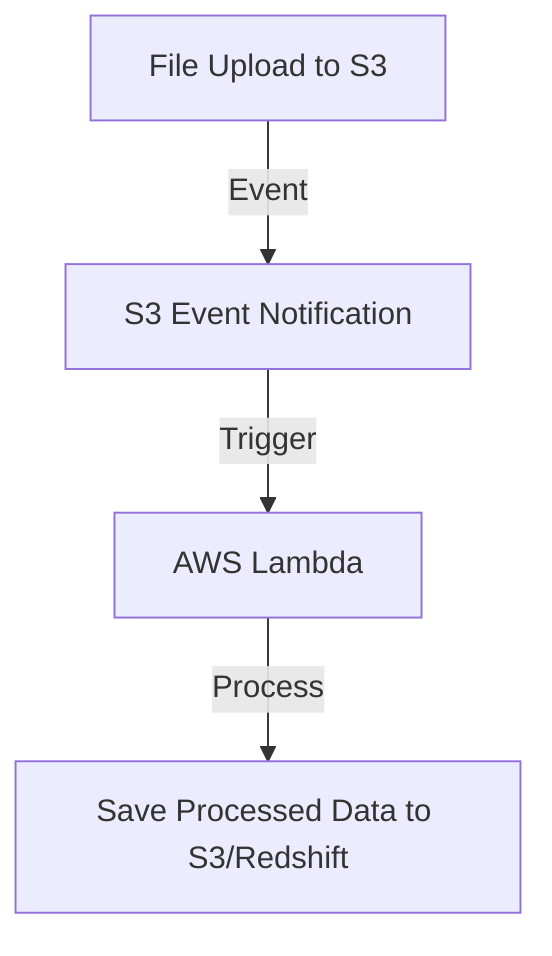
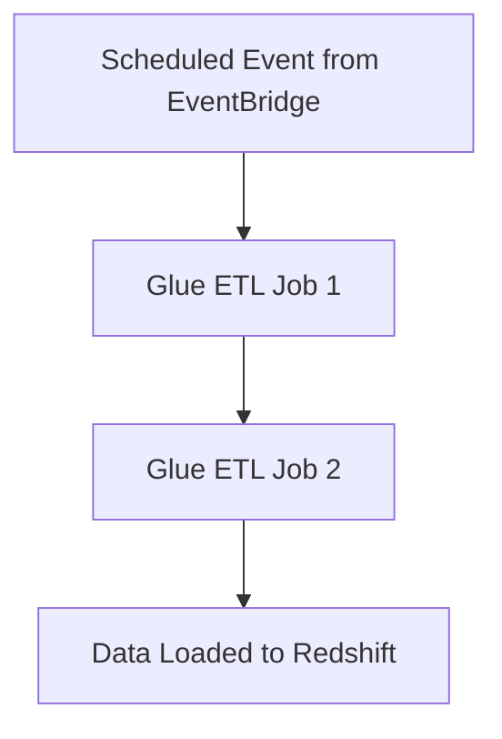
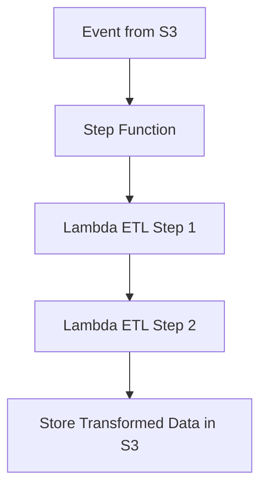
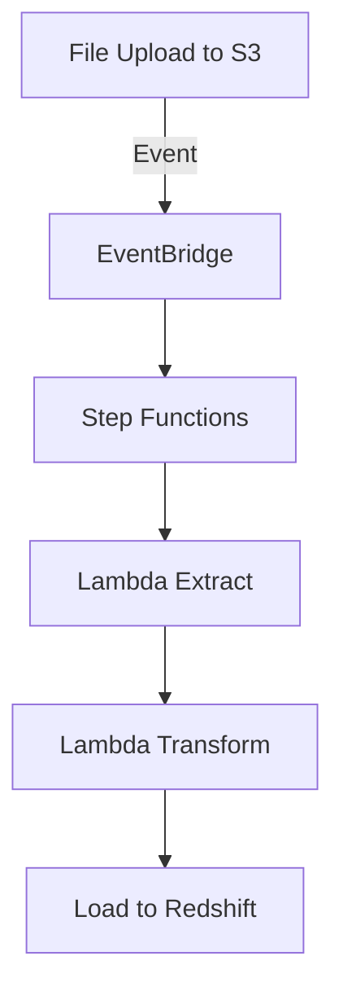
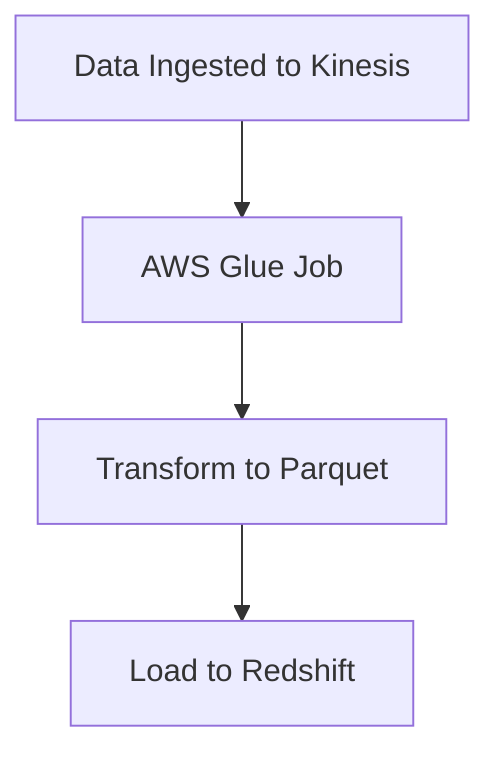
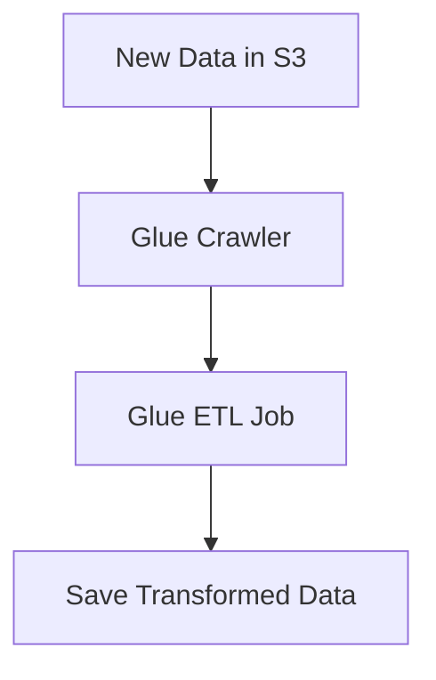
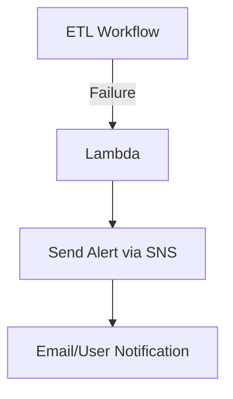

# 1.3. Orchestrate data pipelines

## Knowledge of:

- How to integrate various AWS services to create ETL pipelines
- Event-driven architecture
- How to configure AWS services for data pipelines based on schedules or dependencies
- Serverless workflows

---

### **1. How to Integrate Various AWS Services to Create ETL Pipelines**

### **Primary Functions:**

An ETL (Extract, Transform, Load) pipeline in AWS integrates various services to extract data from different sources, transform the data as per business requirements, and load it into a target system. The key AWS services for building ETL pipelines include:

- **AWS Glue:** A serverless data integration service used to discover, prepare, and combine data for analytics, machine learning, and application development. Glue can automate the ETL process.
- **Amazon S3:** Used as both a data lake and an intermediate storage system during ETL processes.
- **Amazon Redshift:** A data warehouse service used for storing transformed data and running analytical queries on large datasets.
- **AWS Lambda:** Serverless compute service for lightweight data transformations and orchestrating ETL flows.
- **Amazon EMR (Elastic MapReduce):** A managed Hadoop and Spark platform for large-scale data transformations.

### **Patterns (When to Use):**

- **AWS Glue** is ideal for serverless, automated ETL pipelines that handle medium-to-large datasets. It can crawl data in **S3**, transform it, and load it into databases like **Amazon Redshift** or **DynamoDB**.
- **Amazon EMR** is suitable for more complex ETL workloads, particularly when dealing with very large datasets or when you need fine-tuned control over Apache Hadoop, Spark, or Presto.
- **Lambda + S3** can be used for lightweight ETL tasks, where Lambda functions process incoming data in real-time and load it into **S3** or a database.
- **Amazon Redshift** is the best destination for structured data after transformations, particularly for running SQL-based analytics queries.

### **Antipatterns (When Not to Use):**

- Avoid using **Lambda** for heavy data transformations involving large datasets, as the function execution time is limited to 15 minutes, and it’s less cost-effective for large-scale data processing.
- Avoid **AWS Glue** if you require very custom processing logic, as Glue’s managed environment may not offer enough flexibility compared to **EMR**.

### **Benefits of Managed vs. Serverless Services:**

- **Managed Services (Amazon EMR, Redshift):**
    - **Scalability**: Automatically scales to handle large datasets.
    - **Flexibility**: Offers fine-grained control over configurations and integrations with distributed processing frameworks (e.g., Hadoop, Spark).
    - **Cost**: You pay for the infrastructure provisioned, which can lead to higher costs during idle times or low workloads.
- **Serverless Services (AWS Glue, Lambda):**
    - **Simplicity**: Minimal setup and management required. Automatically scales based on workload.
    - **Cost**: Pay only for what you use, with no need to manage underlying servers. Ideal for smaller to medium-sized data processing tasks.

### **Mermaid Diagram: ETL Pipeline Using AWS Glue**



### **AWS Documentation Links:**

- [AWS Glue Documentation](https://docs.aws.amazon.com/glue/index.html)
- [Amazon EMR Documentation](https://docs.aws.amazon.com/emr/index.html)

---

### **2. Event-Driven Architecture**

### **Primary Functions:**

Event-driven architectures in AWS rely on services reacting to events, such as a file upload or a database update. This is critical in designing real-time data pipelines and workflows that process data immediately upon receiving new information. Key services include:

- **Amazon S3 Event Notifications:** Triggers actions when an object is uploaded, deleted, or modified in an S3 bucket.
- **Amazon SNS (Simple Notification Service):** Used to send messages between AWS services or to external subscribers.
- **Amazon EventBridge:** A serverless event bus that connects AWS services and external sources, enabling complex event-driven workflows.
- **AWS Lambda:** Executes code in response to events such as S3 uploads or database updates.
- **Amazon Kinesis Data Streams:** Processes and streams real-time data for tasks such as analytics, monitoring, or log aggregation.

### **Patterns (When to Use):**

- Use **S3 Event Notifications** to trigger data processing workflows automatically when new data arrives, such as triggering a **Lambda** function to process an uploaded file.
- Use **Amazon Kinesis** when you need to process real-time streaming data, such as log monitoring or social media analytics.
- Use **Amazon EventBridge** to orchestrate complex workflows across multiple services, enabling more sophisticated event-driven architectures.

### **Antipatterns (When Not to Use):**

- Avoid using **EventBridge** for workflows that require strict, step-by-step dependencies or workflows with high latency, as EventBridge is designed for asynchronous event processing.
- Avoid using event-driven architectures for batch processing where there’s no need for real-time or near-real-time processing.

### **Benefits of Managed vs. Serverless Services:**

- **Managed Services (Kinesis, SNS):**
    - **Real-Time Processing**: Ideal for real-time data streams and analytics. Kinesis can handle continuous data streams, while SNS handles message distribution.
    - **Cost**: Higher for long-running, continuous streams (Kinesis).
- **Serverless (S3 Event Notifications, Lambda):**
    - **Simplicity**: Minimal infrastructure management, pay-as-you-go pricing, and automatic scaling based on event volume.
    - **Cost**: Lower for event-driven actions that occur sporadically.

### **Mermaid Diagram: Event-Driven Architecture Using S3 and Lambda**



### **AWS Documentation Links:**

- [S3 Event Notifications](https://docs.aws.amazon.com/AmazonS3/latest/userguide/NotificationHowTo.html)
- [Amazon EventBridge Documentation](https://docs.aws.amazon.com/eventbridge/index.html)
- [Amazon SNS Documentation](https://docs.aws.amazon.com/sns/index.html)

---

### **3. How to Configure AWS Services for Data Pipelines Based on Schedules or Dependencies**

### **Primary Functions:**

Scheduling and dependency management are critical in automating data pipelines that need to run at specific times or based on certain events. AWS provides several services for this:

- **Amazon EventBridge:** Allows you to schedule jobs (e.g., run daily at midnight) or trigger workflows based on custom events or API calls.
- **AWS Glue Workflows:** Manages complex ETL workflows by defining dependencies between jobs, crawlers, and triggers.
- **AWS Step Functions:** Orchestrates data pipelines and manages dependencies between multiple AWS services in a state machine format.

### **Patterns (When to Use):**

- Use **AWS Glue Workflows** to orchestrate data pipelines involving multiple steps, such as data extraction, transformation, and loading into Redshift. Glue also allows you to schedule recurring jobs.
- Use **EventBridge** when you need to trigger pipelines based on time-based events (e.g., scheduling daily batch jobs).
- Use **Step Functions** for complex workflows where the success or failure of one task determines the next step, such as retrying a failed ETL job.

### **Antipatterns (When Not to Use):**

- Avoid using **EventBridge** for very complex workflows where dependencies between tasks need to be tightly controlled. In these cases, **Step Functions** provide more granular control over task execution and retries.
- Avoid scheduling Glue jobs or other tasks without proper error-handling mechanisms, as this could lead to data inconsistencies or job failures.

### **Benefits of Managed vs. Serverless Services:**

- **Managed Services (Step Functions):**
    - **Control**: Allows fine-grained control over workflows, retries, and error handling.
    - **Cost**: Costs increase based on the number of transitions between steps.
- **Serverless (EventBridge, Glue Workflows):**
    - **Simplicity**: Easier to configure and manage, especially for time-based jobs or workflows with a few dependencies.
    - **Cost**: Lower for simple, recurring jobs with fewer dependencies.

### **Mermaid Diagram: Scheduled Data Pipeline Using Glue Workflows**



### **AWS Documentation Links:**

- [AWS Glue Workflows](https://docs.aws.amazon.com/glue/latest/dg/aws-glue-api-crawler-workflows.html)
- [Amazon EventBridge Documentation](https://docs.aws.amazon.com/eventbridge/latest/userguide/what-is-amazon-eventbridge.html)
- [AWS Step Functions Documentation](https://docs.aws.amazon.com/step-functions/index.html)

---

### **4. Serverless Workflows**

### **Primary Functions:**

Serverless workflows leverage services like **AWS Lambda**, **Amazon EventBridge**, **AWS Step Functions**, and **AWS Glue** to automate and orchestrate tasks without managing any infrastructure. This approach eliminates the need for provisioning servers, handling maintenance, or

worrying about scaling.

- **AWS Lambda:** Allows you to run code in response to events without provisioning or managing servers.
- **Amazon EventBridge:** Provides a centralized event bus that integrates with Lambda and other services to trigger workflows.
- **AWS Step Functions:** Coordinates tasks between different AWS services in a serverless, state-machine-based workflow.
- **AWS Glue:** Orchestrates ETL processes, which can be triggered in response to events or scheduled at regular intervals.

### **Patterns (When to Use):**

- Use **Lambda + EventBridge** for simple event-driven workflows that require lightweight, serverless compute.
    - **Example:** Triggering Lambda functions based on data uploads to **S3** for data transformations or validations.
- Use **Step Functions** for more complex workflows that involve multiple services or when you need error handling and retries.
    - **Example:** A multi-step ETL pipeline where Step Functions orchestrate Lambda functions and Glue jobs to process and load data.

### **Antipatterns (When Not to Use):**

- Avoid using **Step Functions** for workflows that are very simple and don’t require detailed task orchestration—**Lambda** with **EventBridge** is a more lightweight solution.
- Avoid using serverless workflows for tasks that require low-latency, constant execution (e.g., real-time high-frequency trading), as serverless models have inherent cold-start latency.

### **Benefits of Managed vs. Serverless Services:**

- **Managed Services (Step Functions, Glue):**
    - **Control**: Provides advanced features for managing state, handling errors, and retries.
    - **Cost**: Costs can rise quickly with complex workflows and many state transitions.
- **Serverless (Lambda, EventBridge):**
    - **Simplicity**: Very easy to set up and scales automatically based on event triggers.
    - **Cost**: Pay only for the time that the function executes, making it highly cost-effective for sporadic tasks.

### **Mermaid Diagram: Serverless Workflow Using Step Functions**



### **AWS Documentation Links:**

- [AWS Lambda Documentation](https://docs.aws.amazon.com/lambda/index.html)
- [AWS Step Functions Documentation](https://docs.aws.amazon.com/step-functions/index.html)

---

## Skills in:

- Using orchestration services to build workflows for data ETL pipelines (for example, Lambda, EventBridge, Amazon Managed Workflows for Apache Airflow [Amazon MWAA], AWS Step Functions, AWS Glue workflows)
- Building data pipelines for performance, availability, scalability, resiliency, and fault tolerance
- Implementing and maintaining serverless workflows
- Using notification services to send alerts (for example, Amazon Simple Notification Service [Amazon SNS], Amazon Simple Queue Service [Amazon SQS])

---

### **1. Using Orchestration Services to Build Workflows for Data ETL Pipelines**

### **AWS Services:**

- **AWS Lambda**: Executes code in response to events or as part of a pipeline.
- **Amazon EventBridge**: Central event bus for triggering workflows based on events.
- **Amazon MWAA (Managed Workflows for Apache Airflow)**: A managed service to orchestrate Apache Airflow pipelines.
- **AWS Step Functions**: Orchestrates multiple AWS services and coordinates state transitions.
- **AWS Glue Workflows**: Manages ETL pipelines and job dependencies.

### **Detailed Steps/Exercises:**

### **Exercise 1: Orchestrating an ETL Workflow with AWS Step Functions**

1. **Create a Lambda Function for Data Extraction:**
    - Go to **Lambda Console** and create a new function.
    - Use the following Python code to extract data from S3:
        
        ```python
        import json
        import boto3
        
        s3 = boto3.client('s3')
        
        def lambda_handler(event, context):
            # Extract data from S3
            bucket = 'source-bucket'
            key = 'data/input-file.json'
            obj = s3.get_object(Bucket=bucket, Key=key)
            data = obj['Body'].read().decode('utf-8')
            return {
                'statusCode': 200,
                'body': json.loads(data)
            }
        
        ```
        
2. **Create a Step Function State Machine:**
    - Go to **AWS Step Functions** and create a new state machine.
    - Add a task for the **Lambda function** you created.
    - Add other tasks for transformation (using a different Lambda) and loading into a database (e.g., Amazon Redshift or S3).
3. **Monitor and Run the Workflow:**
    - Start the workflow in the Step Functions console and monitor the execution graph.
4. **EventBridge Integration:**
    - Optionally, use **EventBridge** to trigger the Step Function workflow when new data is uploaded to the S3 bucket.

### **Mermaid Diagram: ETL Pipeline with Step Functions and Lambda**



### **AWS Documentation Links:**

- [AWS Step Functions Documentation](https://docs.aws.amazon.com/step-functions/index.html)
- [AWS Lambda Documentation](https://docs.aws.amazon.com/lambda/latest/dg/welcome.html)
- [Amazon EventBridge Documentation](https://docs.aws.amazon.com/eventbridge/index.html)

### **Use Case Scenarios:**

- Automating ETL workflows that extract data from **S3**, transform it using **Lambda**, and load it into **Redshift**.
- Integrating multiple AWS services to manage the state of complex data pipelines with error handling and retries.

### **Common Pitfalls or Challenges:**

- **Challenge:** Managing workflow complexity when scaling pipelines.
- **Solution:** Use **Step Functions** for error handling, retries, and dependency management in complex workflows.

---

### **2. Building Data Pipelines for Performance, Availability, Scalability, Resiliency, and Fault Tolerance**

### **AWS Services:**

- **Amazon Kinesis**: Handles real-time data streaming with scalability and resiliency.
- **AWS Glue**: Serverless ETL service for building scalable data pipelines.
- **Amazon S3**: Provides scalable, highly available storage.
- **Amazon RDS/Redshift**: Highly available and fault-tolerant data storage solutions.

### **Detailed Steps/Exercises:**

### **Exercise 2: Building a Scalable Data Pipeline with AWS Glue and Amazon Kinesis**

1. **Create a Kinesis Stream:**
    - Go to **Kinesis Console**, create a new stream with sufficient shards based on throughput needs.
2. **Ingest Data into the Kinesis Stream:**
    - Use the AWS CLI to send records to the Kinesis stream:
        
        ```bash
        aws kinesis put-record --stream-name myStream --partition-key 1 --data "sample data"
        
        ```
        
3. **Create a Glue ETL Job:**
    - Go to **AWS Glue**, create an ETL job to process data from the **Kinesis stream** and transform it into **Parquet** format.
    - Use the Glue Job Wizard to configure your input as the Kinesis stream and output as an **S3** bucket.
4. **Enable Auto Scaling for Glue Jobs:**
    - Enable **Dynamic Frame Pruning** and **Auto Scaling** options in Glue for handling large-scale data transformations.
5. **Load Data into Amazon RDS or Redshift:**
    - Use another Glue job to load the transformed Parquet files into **Amazon Redshift** for analysis.

### **Mermaid Diagram: Scalable Data Pipeline with Kinesis and Glue**



### **AWS Documentation Links:**

- [Amazon Kinesis Documentation](https://docs.aws.amazon.com/kinesis/index.html)
- [AWS Glue Documentation](https://docs.aws.amazon.com/glue/index.html)

### **Use Case Scenarios:**

- Real-time data analytics pipelines that scale based on data velocity and volume, such as clickstream analysis or IoT data processing.
- Use AWS Glue with **dynamic scaling** to handle fluctuating data volumes.

### **Common Pitfalls or Challenges:**

- **Challenge:** Ensuring fault tolerance and availability.
- **Solution:** Use **Kinesis** with multiple shards and enable **S3 versioning** and **cross-region replication** for data redundancy.

---

### **3. Implementing and Maintaining Serverless Workflows**

### **AWS Services:**

- **AWS Lambda**: Serverless compute for event-driven actions.
- **AWS Glue Workflows**: Orchestrates serverless ETL processes.
- **Amazon EventBridge**: Central hub for serverless event-driven workflows.
- **AWS Step Functions**: Manages and orchestrates serverless workflows.

### **Detailed Steps/Exercises:**

### **Exercise 3: Building a Serverless Workflow Using AWS Glue Workflows**

1. **Set Up an AWS Glue Crawler:**
    - Go to **AWS Glue** and create a crawler to scan an S3 bucket for new data.
2. **Create a Glue ETL Job:**
    - Set up a job to transform the raw data from the S3 bucket.
3. **Create a Glue Workflow:**
    - Go to the **Glue Console** and create a new workflow that includes:
        - The **crawler** as the first step.
        - The **ETL job** as the second step, triggered once the crawler finishes.
4. **Monitor the Workflow:**
    - Use **CloudWatch** to monitor the Glue workflow and track job success or failure.

### **Mermaid Diagram: Serverless Workflow with AWS Glue**



### **AWS Documentation Links:**

- [AWS Glue Workflows Documentation](https://docs.aws.amazon.com/glue/latest/dg/orchestrating-etl-glue-workflows.html)
- [AWS Lambda Documentation](https://docs.aws.amazon.com/lambda/index.html)

### **Use Case Scenarios:**

- Automating serverless ETL pipelines that process incoming data from **S3** or other sources without managing any underlying infrastructure.

### **Common Pitfalls or Challenges:**

- **Challenge:** Managing complex dependency chains in workflows.
- **Solution:** Use **Step Functions** or **Glue Workflows** to model dependencies and error-handling paths.

---

### **4. Using Notification Services to Send Alerts (SNS, SQS)**

### **AWS Services:**

- **Amazon SNS (Simple Notification Service)**: Push-based messaging for sending notifications to users or other services.
- **Amazon SQS (Simple Queue Service)**: Pull-based messaging that decouples services by queuing messages until they are processed.
- **AWS Lambda**: Can trigger SNS/SQS messages based on events.

### **Detailed Steps/Exercises:**

### **Exercise 4: Sending Alerts with SNS and Lambda**

1. **Create an SNS Topic:**
    - Go to **SNS Console** and create a new topic (e.g., `DataPipelineAlerts`).
    - Subscribe an email address or a Lambda function to this topic.
2. **Trigger an SNS Notification:**
    - Modify your **Step Functions** or **Lambda** ETL process to send an alert when a job fails.
    - In the **Lambda function**, publish a message to the SNS topic:
        
        ```python
        import boto3
        
        sns = boto3.client('sns')
        
        def lambda_handler(event, context):
            sns.publish(
                TopicArn='arn:aws:sns:us-west-2:123456789012:DataPipelineAlerts',
                Message='ETL job failed',
                Subject='ETL Failure Alert'
            )
        
        ```
        
3. **Verify Notifications:**
- Check your email or Lambda logs to confirm that SNS notifications are received when a failure occurs in the ETL workflow.

### Mermaid Diagram: Notification with SNS and Lambda



### **AWS Documentation Links:**

- [Amazon SNS Documentation](https://docs.aws.amazon.com/sns/index.html)
- [Amazon SQS Documentation](https://docs.aws.amazon.com/sqs/index.html)

### **Use Case Scenarios:**

- Real-time alerts for pipeline failures or significant events, such as notifying DevOps teams when a critical ETL job fails.
- Decoupling workflows by using **SQS** for queuing jobs that need to be processed asynchronously.

### **Common Pitfalls or Challenges:**

- **Challenge:** Delays in processing messages due to incorrect configurations.
- **Solution:** Ensure that **SNS** topics and **SQS** queues are properly configured with correct permissions, and use **dead-letter queues** for failed messages.

---