# 1.4: Apply programming concepts

## Knowledge of:

- Continuous integration and continuous delivery (CI/CD) (implementation, testing, and deployment of data pipelines)
- SQL queries (for data source queries and data transformations)
- Infrastructure as code (IaC) for repeatable deployments (for example, AWS Cloud Development Kit [AWS CDK], AWS CloudFormation)
- Distributed computing
- Data structures and algorithms (for example, graph data structures and tree data structures)
- SQL query optimization

---

### **1. Continuous Integration and Continuous Delivery (CI/CD) for Data Pipelines**

### **Primary Functions:**

Continuous Integration (CI) and Continuous Delivery (CD) are essential practices for automating the build, test, and deployment processes of data pipelines. The primary functions of CI/CD in the data engineering context are:

- **Continuous Integration (CI):** Automating the testing and validation of changes to data pipelines (e.g., code updates in an ETL script).
- **Continuous Delivery (CD):** Automatically deploying the validated changes to production environments.

Key AWS services:

- **AWS CodePipeline:** Automates the release process by orchestrating the different stages of CI/CD.
- **AWS CodeBuild:** Compiles source code, runs tests, and produces artifacts.
- **AWS CodeDeploy:** Automates the deployment of applications, including updates to Lambda functions or Glue jobs.

### **Patterns (When to Use):**

- Use **CodePipeline** to automate the build and deployment of data pipelines (e.g., Glue ETL jobs or Lambda functions).
    - **Example:** A change in the source code of a Glue job triggers a new deployment to update the ETL pipeline.
- Use **CodeBuild** to automatically run integration tests for pipeline components (e.g., testing the correctness of SQL transformations or Python scripts in Glue).

### **Antipatterns (When Not to Use):**

- Avoid manually deploying changes to data pipelines, as this can introduce inconsistencies and increase the risk of failure in production.
- Avoid using CI/CD for very static workloads that rarely change, as the automation overhead may not justify the benefits.

### **Benefits of Managed vs. Serverless Services:**

- **Managed (CodeBuild, CodeDeploy):**
    - **Control:** Gives more granular control over the build, test, and deployment process.
    - **Scalability:** Can handle larger codebases and complex build pipelines.
    - **Cost:** Costs are higher if builds are frequent due to the need to run build and test environments.
- **Serverless (Lambda-based Deployments):**
    - **Simplicity:** Ideal for deploying small, serverless components like Lambda functions or Glue scripts.
    - **Cost:** Lower for smaller, serverless components, as you only pay for what you use.

### **Mermaid Diagram: CI/CD Pipeline for Data Pipelines**

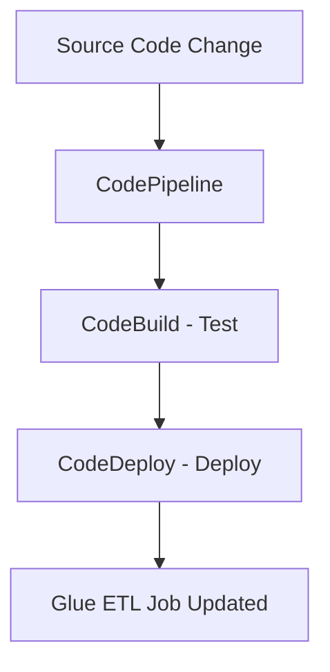

### **AWS Documentation Links:**

- [AWS CodePipeline Documentation](https://docs.aws.amazon.com/codepipeline/index.html)
- [AWS CodeBuild Documentation](https://docs.aws.amazon.com/codebuild/index.html)
- [AWS CodeDeploy Documentation](https://docs.aws.amazon.com/codedeploy/index.html)

---

### **2. SQL Queries (for Data Source Queries and Data Transformations)**

### **Primary Functions:**

SQL (Structured Query Language) is used to query and transform structured data within databases or data warehouses. SQL is used in data pipelines for:

- **Data Extraction:** Fetching raw data from databases like **Amazon RDS** or **Amazon Redshift**.
- **Data Transformation:** Applying filters, joins, aggregations, and other transformations on raw data before loading it into target systems.

Key AWS services:

- **Amazon RDS/Redshift:** Databases that support SQL-based querying and transformations.
- **Amazon Athena:** A serverless query service that allows you to run SQL queries on data stored in **S3**.

### **Patterns (When to Use):**

- Use **SQL queries** in **Redshift** or **RDS** to perform complex transformations, aggregations, and joins on structured datasets.
    - **Example:** Running a SQL query in **Redshift** to join sales and customer tables and produce a report on regional sales.
- Use **Amazon Athena** for querying data directly from **S3** in SQL without needing to provision any servers.

### **Antipatterns (When Not to Use):**

- Avoid using SQL for unstructured or semi-structured data that requires more complex, non-relational processing. In such cases, consider **AWS Glue** or **Lambda** for ETL processes.
- Avoid overly complex SQL queries with multiple joins and nested subqueries as they can lead to performance bottlenecks.

### **Benefits of Managed vs. Serverless Services:**

- **Managed (Redshift, RDS):**
    - **Control:** Allows detailed optimization of queries and indexing.
    - **Performance:** Highly optimized for large-scale analytical workloads (e.g., Redshift).
- **Serverless (Athena):**
    - **Simplicity:** No need to manage or provision servers, making it ideal for ad hoc analysis.
    - **Cost:** Pay per query, making it cost-effective for sporadic data analysis tasks.

### **Mermaid Diagram: SQL Data Transformation Workflow**

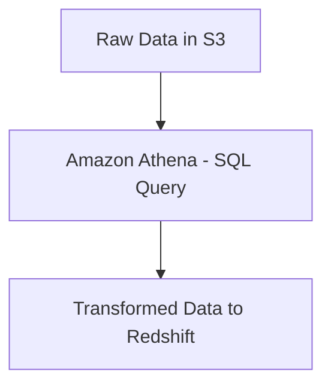

### **AWS Documentation Links:**

- [Amazon Athena Documentation](https://docs.aws.amazon.com/athena/index.html)
- [Amazon Redshift Documentation](https://docs.aws.amazon.com/redshift/index.html)

---

### **3. Infrastructure as Code (IaC) for Repeatable Deployments**

### **Primary Functions:**

Infrastructure as Code (IaC) allows you to define, provision, and manage your infrastructure through code. AWS offers tools like **CloudFormation** and **AWS CDK** for defining cloud resources in a programmatic way, making deployments repeatable and consistent.

Key AWS services:

- **AWS CloudFormation:** Defines and provisions AWS resources using declarative JSON or YAML templates.
- **AWS CDK (Cloud Development Kit):** Provides a higher-level abstraction using programming languages (e.g., Python, JavaScript) to define AWS infrastructure.

### **Patterns (When to Use):**

- Use **CloudFormation** to define repeatable, declarative templates for provisioning data pipelines, including S3 buckets, Glue jobs, Lambda functions, and Redshift clusters.
- Use **AWS CDK** when you need more flexibility and want to define infrastructure in a programming language, along with CI/CD integration.

### **Antipatterns (When Not to Use):**

- Avoid manually provisioning infrastructure through the AWS Console, as this can lead to inconsistencies and difficulty in scaling or replicating environments.
- Avoid using **AWS CDK** if you prefer simple declarative templates, as CloudFormation might be sufficient for simpler environments.

### **Benefits of Managed vs. Serverless Services:**

- **Managed (CloudFormation):**
    - **Control:** Full control over the resource provisioning process with detailed templates.
    - **Complexity:** CloudFormation templates can become complex for large-scale environments.
- **Serverless (CDK):**
    - **Simplicity:** Easier to manage with familiar programming languages.
    - **Cost:** Similar to CloudFormation, as both services provision infrastructure with pay-per-use billing.

### **Mermaid Diagram: IaC Workflow with AWS CloudFormation**

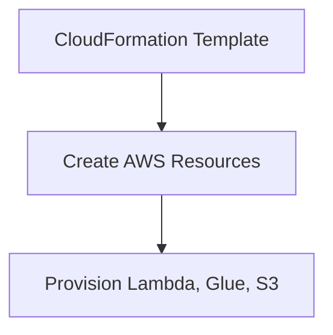

### **AWS Documentation Links:**

- [AWS CloudFormation Documentation](https://docs.aws.amazon.com/cloudformation/index.html)
- [AWS CDK Documentation](https://docs.aws.amazon.com/cdk/index.html)

---

### **4. Distributed Computing**

### **Primary Functions:**

Distributed computing involves distributing workloads across multiple servers or nodes to increase parallelism, fault tolerance, and scalability. It is commonly used for large-scale data processing tasks.

Key AWS services:

- **Amazon EMR (Elastic MapReduce):** A managed service that uses distributed computing frameworks like Apache Hadoop and Apache Spark.
- **AWS Lambda:** A serverless compute service that can distribute work by invoking parallel functions across multiple datasets.
- **Amazon S3:** Acts as distributed, scalable storage for input/output data in distributed computing environments.

### **Patterns (When to Use):**

- Use **Amazon EMR** to handle large-scale data transformations using Hadoop, Spark, or Presto. EMR allows you to run distributed computing jobs across many nodes.
    - **Example:** Processing terabytes of log files stored in **S3** using a distributed Spark job.

### **Antipatterns (When Not to Use):**

- Avoid using distributed computing for small datasets or lightweight transformations, as the overhead of managing distributed systems will outweigh the benefits.
- Avoid using Lambda functions if the process is stateful and requires coordination between nodes—use **EMR** instead for complex workflows.

### **Benefits of Managed vs. Serverless Services:**

- **Managed (EMR):**
    - **Scalability:** Can scale up to hundreds or thousands of nodes.
    - **Flexibility:** Allows fine-tuned control over the distributed computing environment.
- **Serverless (Lambda):**
    - **Simplicity:** Best for stateless, event-driven functions that can be parallelized across smaller tasks.
    - **Cost:** Lower for short-lived, sporadic tasks compared to running long-lived clusters.

### 

**Mermaid Diagram: Distributed Computing with EMR and S3**

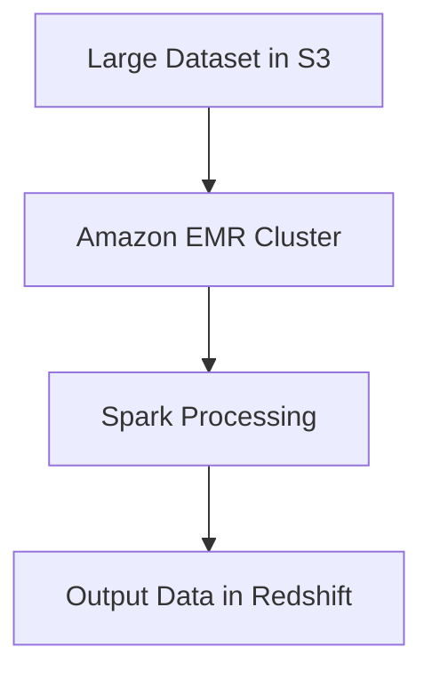

### **AWS Documentation Links:**

- [Amazon EMR Documentation](https://docs.aws.amazon.com/emr/index.html)

---

### **5. Data Structures and Algorithms**

### **Primary Functions:**

Data structures and algorithms are foundational to efficient data processing and transformations. Common data structures include:

- **Graphs:** Used for representing relationships between entities (e.g., social networks, recommendation engines).
- **Trees:** Used for hierarchical data storage and searching algorithms.

Key AWS services:

- **Amazon Neptune:** A managed graph database service used to model and process graph data.
- **Amazon DynamoDB:** Can represent tree structures (e.g., hierarchical or nested data) for fast lookups and scalability.

### **Patterns (When to Use):**

- Use **Amazon Neptune** for graph-based applications such as fraud detection, social network analysis, or recommendation systems.
- Use **DynamoDB** to store hierarchical data, where tree-based queries (e.g., traversals) are frequent.

### **Antipatterns (When Not to Use):**

- Avoid using a relational database (e.g., RDS) for highly connected data structures like graphs, as it can lead to complex and inefficient SQL queries.
- Avoid using **Neptune** if your data structure isn’t inherently graph-based or if the relationships between entities are not highly connected.

### **Benefits of Managed vs. Serverless Services:**

- **Managed (Neptune, DynamoDB):**
    - **Scalability:** Both Neptune and DynamoDB scale automatically based on usage.
    - **Cost:** Costs increase with high throughput or large datasets.
- **Serverless (Lambda for Tree Traversals):**
    - **Simplicity:** Lambda can be used to trigger recursive tree traversals or small graph processing tasks.
    - **Cost:** Only pay for the time that the Lambda function runs.

### **Mermaid Diagram: Graph Processing with Amazon Neptune**

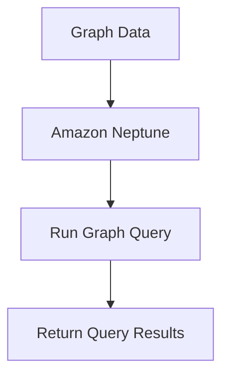

### **AWS Documentation Links:**

- [Amazon Neptune Documentation](https://docs.aws.amazon.com/neptune/index.html)
- [Amazon DynamoDB Documentation](https://docs.aws.amazon.com/dynamodb/index.html)

---

### **6. SQL Query Optimization**

### **Primary Functions:**

SQL query optimization ensures that data queries are run efficiently, reducing query runtime and resource usage. Key concepts include:

- **Indexes:** Create indexes on frequently queried columns to improve lookup speed.
- **Partitioning:** Splitting large tables into smaller, more manageable partitions.
- **Join Optimization:** Reducing the complexity of joins by minimizing the number of joins or restructuring queries.

Key AWS services:

- **Amazon Redshift:** Optimized for large-scale analytical queries.
- **Amazon RDS:** Supports SQL query optimization for relational databases.

### **Patterns (When to Use):**

- Use **Amazon Redshift** to optimize complex analytical queries with techniques like query optimization, sort keys, and distribution keys.
- Use **RDS** for optimizing transactional queries through indexing and normalization.

### **Antipatterns (When Not to Use):**

- Avoid running complex joins and queries on unindexed tables, as it can lead to significant performance degradation.
- Avoid over-indexing, which can slow down writes and increase storage overhead.

### **Benefits of Managed vs. Serverless Services:**

- **Managed (Redshift, RDS):**
    - **Performance:** Redshift is optimized for large-scale, complex queries with large datasets.
    - **Cost:** Costs scale based on storage and query performance requirements.
- **Serverless (Athena):**
    - **Simplicity:** Serverless queries with Athena are simpler to set up but may not offer the same optimization benefits for large datasets.
    - **Cost:** Pay per query, making it cost-effective for smaller-scale queries.

### **Mermaid Diagram: SQL Query Optimization in Redshift**

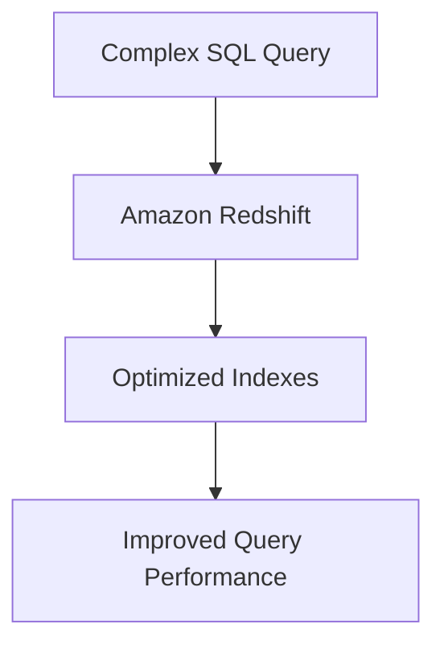

### **AWS Documentation Links:**

- [Amazon Redshift Query Optimization](https://docs.aws.amazon.com/redshift/latest/dg/c_best-practices-best-practices-query-performance.html)
- [Amazon RDS Documentation](https://docs.aws.amazon.com/rds/index.html)

---

## Skills in:

- Optimizing code to reduce runtime for data ingestion and transformation
- Configuring Lambda functions to meet concurrency and performance needs
- Performing SQL queries to transform data (for example, Amazon Redshift stored procedures)
- Structuring SQL queries to meet data pipeline requirements
- Using Git commands to perform actions such as creating, updating, cloning, and branching repositories
- Using the AWS Serverless Application Model (AWS SAM) to package and deploy serverless data pipelines (for example, Lambda functions, Step Functions, DynamoDB tables)
- Using and mounting storage volumes from within Lambda functions

---

### **1. Optimizing Code to Reduce Runtime for Data Ingestion and Transformation**

### **Detailed Steps/Exercises:**

### **Exercise 1: Optimizing a Glue Job for Faster Data Transformation**

1. **Set Up a Glue Job:**
    - Create a Glue job in the **AWS Glue Console** to process a CSV file from **Amazon S3**.
    - Choose **Python** as the runtime environment.
2. **Optimize Memory Allocation:**
    - When creating the job, configure the memory for each worker to match the data size. Increase the number of workers if necessary.
3. **Enable Dynamic Frame Pruning:**
    - Modify your Glue job to enable **Dynamic Frame Pruning**. This helps reduce the amount of data processed by the job by removing unnecessary columns early in the transformation.
    
    ```python
    dynamic_frame = dynamic_frame.drop_fields(['unnecessary_column1', 'unnecessary_column2'])
    
    ```
    
4. **Optimize the Partitioning Strategy:**
    - When loading data into **Amazon S3** or **Redshift**, partition your data by key attributes (e.g., date or region) to reduce the scan size of future queries.
5. **Test and Measure Performance:**
    - Run the Glue job and monitor the job duration. Adjust the number of workers and memory until the job runtime is optimal.

### **Mermaid Diagram: Optimized Glue ETL Workflow**

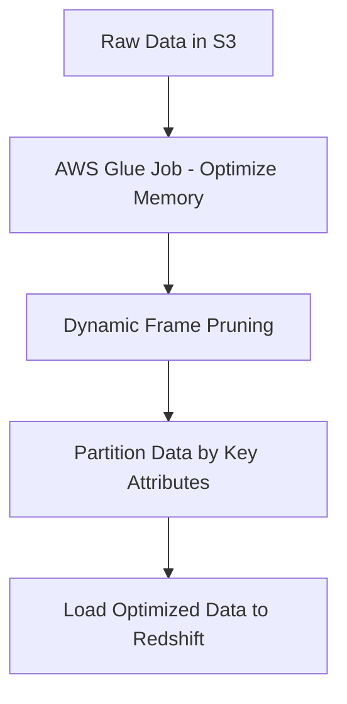

### **AWS Documentation Links:**

- [AWS Glue Performance Optimization](https://docs.aws.amazon.com/glue/latest/dg/aws-glue-programming-python-optimizing.html)

### **Use Case Scenarios:**

- Optimizing Glue jobs to process large datasets more efficiently, such as customer transaction data or clickstream logs.
- Reducing data transformation runtimes in pipelines where speed is critical, such as in real-time analytics.

### **Common Pitfalls or Challenges:**

- **Challenge:** Allocating too much memory or too many workers can lead to higher costs.
- **Solution:** Continuously monitor job performance and fine-tune resource allocation based on actual workload demands.

---

### **2. Configuring Lambda Functions to Meet Concurrency and Performance Needs**

### **Detailed Steps/Exercises:**

### **Exercise 2: Configuring Lambda Function Concurrency and Performance**

1. **Create a Lambda Function:**
    - In the **AWS Lambda Console**, create a new Lambda function for processing real-time data from **Kinesis** or **S3**.
2. **Set Reserved Concurrency:**
    - Set a reserved concurrency limit for the Lambda function to control how many concurrent executions it can handle. For example, set a concurrency limit of 100.
    - Navigate to the **Concurrency settings** and configure reserved concurrency.
3. **Configure Provisioned Concurrency:**
    - For functions that need low latency, enable **Provisioned Concurrency** to ensure the function is always warmed up and ready to handle requests.
    - You can set this using the AWS CLI:
        
        ```bash
        aws lambda put-provisioned-concurrency-config --function-name MyFunction --provisioned-concurrent-executions 10
        
        ```
        
4. **Optimize Memory Allocation:**
    - Adjust the memory allocated to the Lambda function. Higher memory also increases CPU, which can reduce function execution time.
    - Test different memory settings (e.g., 512 MB, 1024 MB, 2048 MB) to find the optimal balance between performance and cost.
5. **Monitor with CloudWatch:**
    - Use **Amazon CloudWatch** to monitor the function’s performance, including **invocation duration** and **concurrency usage**.

### **Mermaid Diagram: Lambda Performance Configuration**

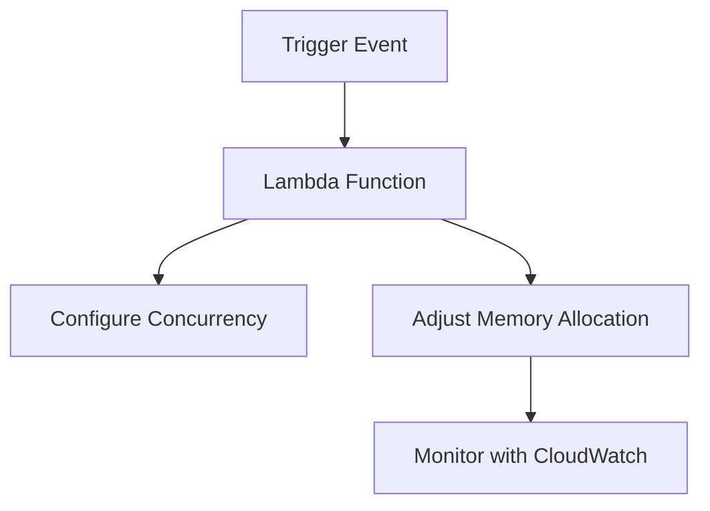

### **AWS Documentation Links:**

- [AWS Lambda Concurrency](https://docs.aws.amazon.com/lambda/latest/dg/configuration-concurrency.html)
- [AWS Lambda Provisioned Concurrency](https://docs.aws.amazon.com/lambda/latest/dg/configuration-concurrency.html#configuration-provisioned-concurrency)

### **Use Case Scenarios:**

- Handling bursts of traffic in event-driven architectures where you need to process large amounts of data in parallel (e.g., real-time log processing, image uploads).
- Low-latency API services where the function must be immediately available to respond to requests.

### **Common Pitfalls or Challenges:**

- **Challenge:** Not accounting for concurrency limits can lead to throttling.
- **Solution:** Set appropriate concurrency limits based on expected workloads and enable **provisioned concurrency** for latency-sensitive workloads.

---

### **3. Performing SQL Queries to Transform Data (Amazon Redshift Stored Procedures)**

### **Detailed Steps/Exercises:**

### **Exercise 3: Using Redshift Stored Procedures to Transform Data**

1. **Create a Redshift Cluster:**
    - In the **Amazon Redshift Console**, create a Redshift cluster.
2. **Create a Table in Redshift:**
    - Create a table to store sales data:
        
        ```sql
        CREATE TABLE sales_data (
            sale_id INT,
            product_name VARCHAR(50),
            sale_date DATE,
            sale_amount DECIMAL(10, 2)
        );
        
        ```
        
3. **Create a Stored Procedure:**
    - Write a stored procedure to transform sales data by calculating the total sales amount for each day:
        
        ```sql
        CREATE OR REPLACE PROCEDURE calculate_daily_sales()
        LANGUAGE plpgsql
        AS $$
        BEGIN
            INSERT INTO daily_sales (sale_date, total_amount)
            SELECT sale_date, SUM(sale_amount)
            FROM sales_data
            GROUP BY sale_date;
        END;
        $$;
        
        ```
        
4. **Call the Stored Procedure:**
    - Run the procedure to transform the data:
        
        ```sql
        CALL calculate_daily_sales();
        
        ```
        
5. **Monitor Query Performance:**
    - Use **Redshift Query Editor** or **CloudWatch** to monitor query performance and optimize the stored procedure if necessary.

### **Mermaid Diagram: Redshift Stored Procedure Workflow**

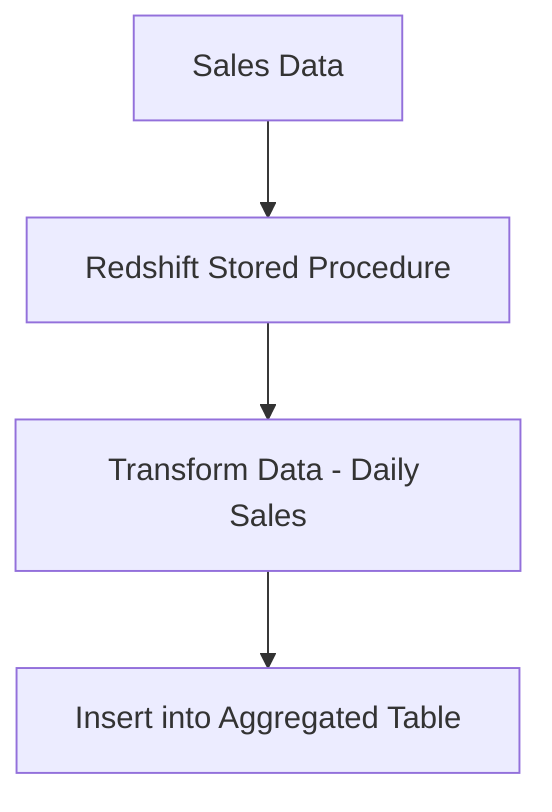

### **AWS Documentation Links:**

- [Amazon Redshift Stored Procedures](https://docs.aws.amazon.com/redshift/latest/dg/stored-procedure-overview.html)

### **Use Case Scenarios:**

- Transforming large datasets in a Redshift data warehouse, such as aggregating daily or weekly sales, generating reports, or preparing data for downstream analytics.

### **Common Pitfalls or Challenges:**

- **Challenge:** Stored procedures can lead to long-running queries if not optimized.
- **Solution:** Regularly analyze query plans and optimize joins, indexes, and aggregations.

---

### **4. Structuring SQL Queries to Meet Data Pipeline Requirements**

### **Detailed Steps/Exercises:**

### **Exercise 4: Structuring SQL Queries in Redshift for Optimal Performance**

1. **Create Partitioned and Indexed Tables:**
    - When creating tables in **Redshift**, add appropriate indexes and sort keys to optimize query performance:
        
        ```sql
        CREATE TABLE user_activity (
            user_id INT,
            activity_type VARCHAR(50),
            event_time TIMESTAMP
        )
        SORTKEY(event_time);
        
        ```
        
2. **Optimize Queries:**
    - Use simple, efficient SQL queries to reduce runtime. Avoid complex joins and subqueries. Example query for fetching recent activity:
        
        ```sql
        SELECT user_id, activity_type, event_time
        FROM user_activity
        WHERE event_time > CURRENT_DATE - INTERVAL '7 days';
        
        ```
        
3. **Analyze Query Performance:**
    - Use the `EXPLAIN` command to analyze the query execution plan and ensure that it is optimized.
4. **Test Different Query Structures:**
    - Experiment with different query structures, such as replacing joins with subqueries or using window functions for analytics:
        
        ```sql
        SELECT user_id, SUM(activity_type)
        OVER (PARTITION BY user_id ORDER BY event_time) AS cumulative_activity
        FROM user_activity;
        
        ```
        

### **AWS Documentation Links:**

- [Amazon Redshift Query Tuning](https://docs.aws.amazon.com/redshift/latest/dg/c-best-practices-best-practices-query-performance.html)

### **Use Case Scenarios:**

- Optimizing SQL queries for analytics pipelines that require fast access to large datasets in **Redshift**, such as real-time user activity tracking or financial reporting.

### **Common Pitfalls or Challenges:**

- **Challenge:** Poorly structured SQL queries can lead to slow query performance.
- **Solution:** Use **EXPLAIN** to analyze queries and ensure that you are utilizing the right indexes, sort keys, and partitioning strategies.

---

### **5. Using Git Commands for Repository Actions (Creating, Updating, Cloning, Branching)**

### **Detailed Steps/Exercises:**

### *Exercise 5: Using

Git Commands to Manage Code for Data Pipelines**

1. **Create a Git Repository:**
    - Initialize a new repository:
        
        ```bash
        git init my-data-pipeline
        cd my-data-pipeline
        
        ```
        
2. **Create a Branch:**
    - Create a new branch for development work:
        
        ```bash
        git checkout -b feature/etl-optimization
        
        ```
        
3. **Clone a Repository:**
    - Clone an existing repository to your local machine:
        
        ```bash
        git clone <https://github.com/user/repository.git>
        
        ```
        
4. **Stage and Commit Changes:**
    - Stage changes and commit them to the repository:
        
        ```bash
        git add .
        git commit -m "Optimized ETL pipeline for faster performance"
        
        ```
        
5. **Push Changes to a Remote Repository:**
    - Push the committed changes to a remote repository:
        
        ```bash
        git push origin feature/etl-optimization
        
        ```
        

### **Mermaid Diagram: Git Workflow**

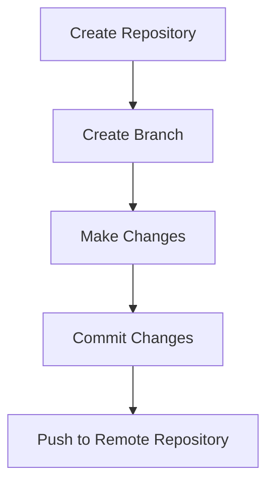

### **AWS Documentation Links:**

- [Git Documentation](https://git-scm.com/doc)

### **Use Case Scenarios:**

- Managing code for data pipelines, including ETL scripts and configuration files, using Git for version control, collaboration, and deployment.

### **Common Pitfalls or Challenges:**

- **Challenge:** Merging conflicts between branches can cause delays.
- **Solution:** Regularly pull changes from the main branch and resolve conflicts early.

---

### **6. Using AWS Serverless Application Model (AWS SAM) for Packaging and Deploying Serverless Data Pipelines**

### **Detailed Steps/Exercises:**

### **Exercise 6: Deploying a Serverless Pipeline with AWS SAM**

1. **Install AWS SAM CLI:**
    - Install the SAM CLI on your machine:
        
        ```bash
        brew tap aws/tap
        brew install aws-sam-cli
        
        ```
        
2. **Create a SAM Template for a Lambda Function:**
    - Create a `template.yaml` file to define a Lambda function and DynamoDB table:
        
        ```yaml
        Resources:
          MyFunction:
            Type: AWS::Serverless::Function
            Properties:
              Handler: app.lambda_handler
              Runtime: python3.8
              Events:
                ApiEvent:
                  Type: Api
                  Properties:
                    Path: /myapi
                    Method: get
          MyTable:
            Type: AWS::DynamoDB::Table
            Properties:
              TableName: MyTable
              AttributeDefinitions:
                - AttributeName: id
                  AttributeType: S
              KeySchema:
                - AttributeName: id
                  KeyType: HASH
        
        ```
        
3. **Build and Package the Application:**
    - Use SAM to build and package your Lambda function:
        
        ```bash
        sam build
        sam package --s3-bucket my-sam-bucket
        
        ```
        
4. **Deploy the Application:**
    - Deploy the application with SAM:
        
        ```bash
        sam deploy --guided
        
        ```
        

### **Mermaid Diagram: Serverless Application Deployment with AWS SAM**

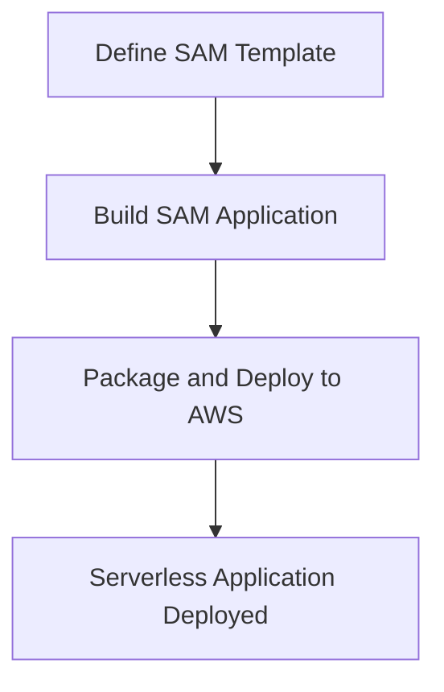

### **AWS Documentation Links:**

- [AWS SAM Documentation](https://docs.aws.amazon.com/serverless-application-model/index.html)

### **Use Case Scenarios:**

- Deploying serverless data pipelines that consist of **Lambda functions**, **DynamoDB tables**, and **API Gateway** for processing and serving data.

### **Common Pitfalls or Challenges:**

- **Challenge:** Misconfigurations in SAM templates can cause deployment failures.
- **Solution:** Use **SAM CLI** to validate templates before deployment and test locally with `sam local invoke`.

---

### **7. Using and Mounting Storage Volumes from Within Lambda Functions**

### **Detailed Steps/Exercises:**

### **Exercise 7: Mounting EFS in Lambda**

1. **Create an EFS (Elastic File System):**
    - In the **AWS EFS Console**, create a new file system and configure access permissions.
2. **Create a Lambda Function:**
    - In the **Lambda Console**, create a new Lambda function for data processing tasks that require persistent storage.
3. **Mount the EFS in Lambda:**
    - Attach the EFS to the Lambda function by configuring the file system in the Lambda function settings.
    - Use the following code to read and write files in the mounted EFS:
        
        ```python
        import os
        
        def lambda_handler(event, context):
            file_path = '/mnt/efs/myfile.txt'
            with open(file_path, 'r') as file:
                data = file.read()
            return data
        
        ```
        
4. **Test the Lambda Function:**
    - Test the Lambda function to ensure it can read and write data to the EFS volume.

### **Mermaid Diagram: Lambda Function with EFS**

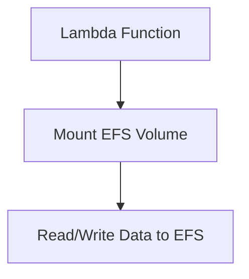

### **AWS Documentation Links:**

- [AWS Lambda with EFS](https://docs.aws.amazon.com/lambda/latest/dg/configuration-filesystem.html)

### **Use Case Scenarios:**

- Data pipelines that need persistent storage for large files, such as machine learning model training datasets or data processing jobs that require stateful file access.

### **Common Pitfalls or Challenges:**

- **Challenge:** Misconfiguring EFS permissions can prevent the Lambda function from accessing the file system.
- **Solution:** Ensure correct IAM roles and security group configurations are applied to both the Lambda function and the EFS.

---