# 2.1: Choose a data store

## Knowledge in:

- Storage platforms and their characteristics
- Storage services and configurations for specific performance demands
- Data storage formats (for example, .csv, .txt, Parquet)
- How to align data storage with data migration requirements
• How to determine the appropriate storage solution for specific access patterns
• How to manage locks to prevent access to data (for example, Amazon Redshift, Amazon RDS)

---

### **1. Storage Platforms and Their Characteristics**

### **Primary Functions:**

AWS provides various storage platforms, each optimized for different use cases based on data volume, access frequency, and durability. These platforms include:

- **Amazon S3 (Simple Storage Service):** Object storage service that offers high durability, scalability, and security, suitable for data lakes, backups, and large datasets.
- **Amazon EBS (Elastic Block Store):** Persistent block storage for use with EC2 instances, providing low-latency and high-performance storage for databases or applications requiring frequent read/write operations.
- **Amazon EFS (Elastic File System):** Scalable file storage that can be mounted to multiple EC2 instances, ideal for workloads that require shared storage.
- **Amazon Glacier and S3 Glacier Deep Archive:** Long-term archival storage designed for infrequent access but high durability, suitable for compliance or historical data storage.

### **Patterns (When to Use):**

- Use **Amazon S3** for object storage when dealing with large datasets like images, videos, and data lakes that require high durability and low-cost storage.
- Use **Amazon EBS** for workloads with high IOPS (Input/Output Operations Per Second) requirements, such as relational databases (e.g., MySQL, PostgreSQL).
- Use **Amazon EFS** for workloads that require shared access across multiple instances, such as content management systems or web server clusters.
- Use **Amazon Glacier** for archiving data that is rarely accessed but must be retained for compliance or legal reasons.

### **Antipatterns (When Not to Use):**

- Avoid using **Amazon S3** for workloads requiring fast, consistent, low-latency access (e.g., databases), as S3 is optimized for high throughput but not low-latency transactions.
- Avoid using **Amazon Glacier** for data that needs frequent access since retrieval times can take minutes to hours.
- Avoid using **Amazon EFS** for small, transactional workloads due to its higher cost relative to other storage types.

### **Benefits of Managed vs. Serverless Services:**

- **Managed (EBS, EFS):**
    - **Scalability:** EBS scales vertically by increasing volume size; EFS scales automatically as you add or remove files.
    - **Cost:** EBS is billed per provisioned storage; EFS is priced based on usage.
- **Serverless (S3, Glacier):**
    - **Scalability:** S3 and Glacier are fully serverless, automatically scaling without user intervention.
    - **Cost:** Pay for what you store in S3/Glacier, with tiered pricing based on access frequency (e.g., S3 Standard vs. S3 Infrequent Access).

### **Mermaid Diagram: AWS Storage Platform Use Cases**

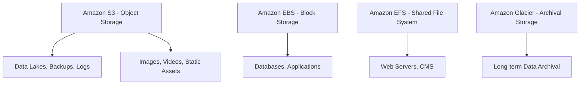

### **AWS Documentation Links:**

- [Amazon S3 Documentation](https://docs.aws.amazon.com/s3/index.html)
- [Amazon EBS Documentation](https://docs.aws.amazon.com/ebs/index.html)
- [Amazon EFS Documentation](https://docs.aws.amazon.com/efs/index.html)

---

### **2. Storage Services and Configurations for Specific Performance Demands**

### **Primary Functions:**

Different workloads demand different storage configurations for optimal performance. AWS storage services allow you to customize settings like IOPS, throughput, and redundancy to meet these needs.

- **Amazon S3 Storage Classes:** Provides options like S3 Standard (frequent access), S3 Infrequent Access, and S3 One Zone-IA, which offer different performance and cost trade-offs.
- **Amazon EBS Volumes:** Configurable as General Purpose SSD (gp2/gp3), Provisioned IOPS SSD (io1/io2), or HDD-based volumes for higher throughput or capacity.
- **Amazon EFS Performance Modes:** Choose between **General Purpose** for low-latency access or **Max I/O** for high throughput but with higher latencies.

### **Patterns (When to Use):**

- Use **S3 Standard** for frequently accessed objects, such as static website content or media files, where high throughput and durability are needed.
- Use **Provisioned IOPS EBS (io1/io2)** for performance-sensitive databases like **Amazon RDS** or **MongoDB**, where high IOPS are required.
- Use **EFS General Purpose** when low-latency file access is required, such as for machine learning models or real-time data sharing across instances.

### **Antipatterns (When Not to Use):**

- Avoid using **Provisioned IOPS EBS** if your application doesn't require high IOPS, as this can significantly increase costs. Use **gp3** volumes for balanced performance.
- Avoid using **S3 Standard** for archival data that is rarely accessed, as it is more expensive than **S3 Infrequent Access** or **Glacier**.

### **Benefits of Managed vs. Serverless Services:**

- **Managed (EBS, EFS):**
    - **Performance:** EBS provides high-performance SSD options, while EFS can handle distributed file access at scale.
    - **Cost:** Pricing can vary significantly depending on the performance tier chosen (e.g., gp3 vs. io2).
- **Serverless (S3):**
    - **Simplicity:** No need to manage file systems or provision volumes.
    - **Cost:** S3 offers tiered pricing models that allow cost savings based on access frequency.

### **Mermaid Diagram: Storage Configurations Based on Performance Needs**

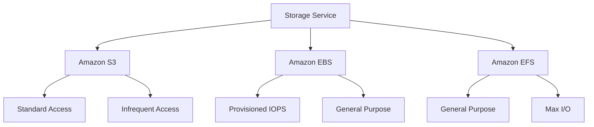

### **AWS Documentation Links:**

- [Amazon S3 Storage Classes](https://docs.aws.amazon.com/AmazonS3/latest/dev/storage-class-intro.html)
- [Amazon EBS Volume Types](https://docs.aws.amazon.com/AWSEC2/latest/UserGuide/ebs-volume-types.html)
- [Amazon EFS Performance Modes](https://docs.aws.amazon.com/efs/latest/ug/performance.html)

---

### **3. Data Storage Formats (for example, .csv, .txt, Parquet)**

### **Primary Functions:**

Data storage formats define how data is stored and compressed, impacting query performance, storage costs, and compatibility with processing engines. Common formats include:

- **CSV (.csv):** A simple, widely-used format for storing tabular data, often used for smaller datasets or data interchange between systems.
- **TXT (.txt):** Plain text format, often used for logs or unstructured text data.
- **Parquet:** A columnar storage format optimized for analytics workloads. It provides efficient data compression and retrieval, reducing storage costs and speeding up queries in tools like **Amazon Athena** and **Amazon Redshift Spectrum**.

### **Patterns (When to Use):**

- Use **CSV** for small datasets, compatibility across systems, or when you need human-readable output.
- Use **Parquet** for large datasets that will be queried frequently, especially when using columnar queries (e.g., in data lakes, analytics pipelines).
    - **Example:** Use Parquet in **S3** to store logs, as querying specific columns can significantly reduce query scan size and cost.

### **Antipatterns (When Not to Use):**

- Avoid **CSV** for large datasets when performance is crucial, as it leads to slower query times compared to Parquet.
- Avoid using **Parquet** for transactional workloads where row-based data access is required, as its columnar format is better suited for analytical queries.

### **Benefits of Managed vs. Serverless Services:**

- **Managed (Redshift, RDS):**
    - **Performance:** Both can handle row and columnar storage, but Parquet in Redshift Spectrum speeds up large-scale queries.
- **Serverless (Athena, S3):**
    - **Simplicity:** Storing data in Parquet format in **S3** and querying it via **Athena** is both cost-efficient and performance-optimized for analytics.

### **Mermaid Diagram: Data Storage Formats for AWS Services**

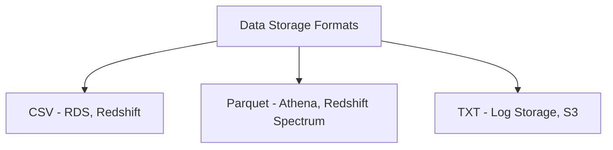

### **AWS Documentation Links:**

- [Amazon Parquet Format](https://docs.aws.amazon.com/athena/latest/ug/parquet.html)
- [Amazon Redshift Spectrum]([https://docs.aws.amazon.com/redshift/latest/dg/c-using-redshift](https://docs.aws.amazon.com/redshift/latest/dg/c-using-redshift)
- spectrum.html)

---

### **4. Aligning Data Storage with Data Migration Requirements**

### **Primary Functions:**

Data migration involves moving data from one storage system to another, often requiring careful alignment between the source and destination formats, security requirements, and access patterns. AWS services that assist with data migration include:

- **AWS DataSync:** Automates data movement between on-premises storage and AWS storage services such as S3, EFS, and FSx.
- **AWS Snowball:** Used for transferring large datasets physically when network bandwidth is limited.
- **AWS Database Migration Service (DMS):** Supports continuous replication of databases between different storage platforms, such as from an on-premises database to Amazon RDS.

### **Patterns (When to Use):**

- Use **AWS DataSync** to transfer large datasets from on-premises NAS systems to **Amazon S3** or **Amazon EFS**.
    - **Example:** Migrating historical log data from local file systems to S3 for long-term storage.
- Use **DMS** for live migrations and continuous replication of transactional databases (e.g., **MySQL** to **Amazon Aurora**).

### **Antipatterns (When Not to Use):**

- Avoid using **Snowball** for small data migrations, as it's better suited for bulk transfers of several terabytes or more.
- Avoid using **DataSync** for real-time data synchronization, as it's optimized for batch transfers rather than live data streaming.

### **Benefits of Managed vs. Serverless Services:**

- **Managed (DataSync, Snowball):**
    - **Control:** Handles high-volume migrations, with network-optimized or physical transfer options.
    - **Cost:** Pricing can be high for larger datasets but cheaper than bandwidth-based network transfers.
- **Serverless (DMS):**
    - **Simplicity:** Handles schema conversion and database replication without server management.
    - **Cost:** More cost-effective for smaller, continuous replication workloads.

### **Mermaid Diagram: Data Migration with AWS Services**

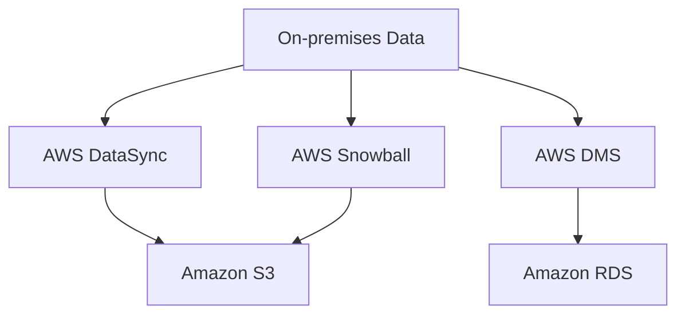

### **AWS Documentation Links:**

- [AWS DataSync](https://docs.aws.amazon.com/datasync/index.html)
- [AWS DMS Documentation](https://docs.aws.amazon.com/dms/index.html)

---

### **5. Determining the Appropriate Storage Solution for Specific Access Patterns**

### **Primary Functions:**

Selecting the right storage solution depends on the access patterns of the data (e.g., frequent vs. infrequent access, read/write-intensive vs. read-heavy workloads). AWS offers a range of storage services optimized for different access patterns:

- **Frequent Access (Hot Data):** **S3 Standard**, **EBS gp3**, **EFS General Purpose** are ideal for data that requires quick, frequent access.
- **Infrequent Access (Cold Data):** **S3 Infrequent Access**, **Glacier**, **EBS Throughput Optimized HDD** (st1) provide cost-effective options for data that is rarely accessed but still needs to be retained.

### **Patterns (When to Use):**

- Use **S3 Standard** for applications that need frequent access to large files, such as media streaming platforms.
- Use **S3 Infrequent Access** for long-term storage of data that is accessed occasionally, such as user logs or backups.

### **Antipatterns (When Not to Use):**

- Avoid using **S3 Standard** for long-term archival of cold data due to higher storage costs. Use **Glacier** for such purposes.
- Avoid using **EBS gp3** for infrequent access workloads as it incurs unnecessary costs for underutilized performance.

### **Benefits of Managed vs. Serverless Services:**

- **Managed (EBS, EFS):**
    - **Performance:** Customizable based on access pattern and performance requirements (e.g., gp3 for frequent writes, st1 for throughput).
    - **Cost:** Higher for performance-optimized volumes but more flexible for specific workload needs.
- **Serverless (S3, Glacier):**
    - **Simplicity:** Automatically manages data based on access patterns with tiered storage classes.
    - **Cost:** Lower costs for infrequently accessed data with serverless S3 storage classes.

### **Mermaid Diagram: Storage Solutions Based on Access Patterns**

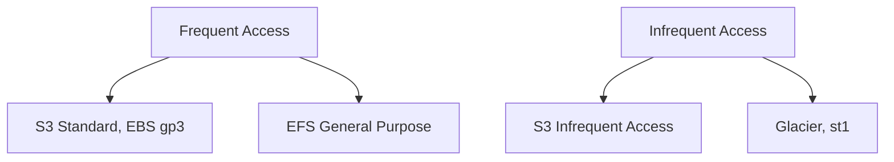

### **AWS Documentation Links:**

- [S3 Storage Class Analysis](https://docs.aws.amazon.com/AmazonS3/latest/dev/storage-class-intro.html)
- [Amazon EBS Volume Types](https://docs.aws.amazon.com/AWSEC2/latest/UserGuide/ebs-volume-types.html)

---

### **6. Managing Locks to Prevent Access to Data (Amazon Redshift, Amazon RDS)**

### **Primary Functions:**

Locks are used in databases to maintain data consistency and integrity when multiple transactions occur simultaneously. AWS provides mechanisms to manage locks in services such as **Amazon Redshift** and **Amazon RDS**.

- **Amazon Redshift:** Implements locks for transactions to ensure data integrity during concurrent updates.
- **Amazon RDS (Relational Databases):** Uses standard SQL-based locks (e.g., row-level, table-level) to prevent conflicting writes or updates.

### **Patterns (When to Use):**

- Use **Amazon Redshift's** locking mechanisms to prevent data corruption during concurrent data loads and updates in a data warehouse environment.
- Use **RDS locks** in transactional databases to ensure that rows or tables are not modified simultaneously by multiple transactions, leading to data anomalies.

### **Antipatterns (When Not to Use):**

- Avoid using complex lock management in **read-heavy** workloads where no data updates are occurring. In such cases, **Amazon Aurora** can handle high-concurrency reads without requiring locks.

### **Benefits of Managed vs. Serverless Services:**

- **Managed (Redshift, RDS):**
    - **Control:** You can manage transaction isolation levels and locks to avoid race conditions and dirty reads.
    - **Cost:** Lock contention and transaction delays can lead to higher costs in terms of performance degradation.
- **Serverless (Athena):**
    - **Simplicity:** In serverless environments like **Athena**, no locking is needed as the data is immutable in **S3**.

### **Mermaid Diagram: Lock Management in Databases**

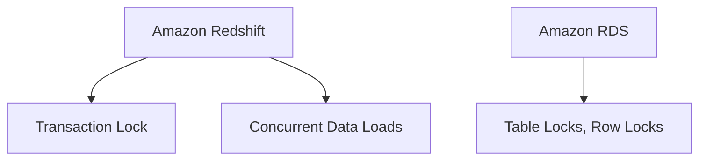

### **AWS Documentation Links:**

- [Amazon Redshift Locks](https://docs.aws.amazon.com/redshift/latest/dg/c_locking.html)
- [Amazon RDS Transactions](https://docs.aws.amazon.com/AmazonRDS/latest/UserGuide/USER_ConnectToPostgreSQLInstance.html)

---

## Skills in:

- Implementing the appropriate storage services for specific cost and performance requirements (for example, Amazon Redshift, Amazon EMR, AWS Lake Formation, Amazon RDS, DynamoDB, Amazon Kinesis Data Streams, Amazon MSK)
- Configuring the appropriate storage services for specific access patterns and requirements (for example, Amazon Redshift, Amazon EMR, Lake Formation, Amazon RDS, DynamoDB)
- Applying storage services to appropriate use cases (for example, Amazon S3)
- Integrating migration tools into data processing systems (for example, AWS Transfer Family)
- Implementing data migration or remote access methods (for example, Amazon Redshift federated queries, Amazon Redshift materialized views, Amazon Redshift Spectrum)

---

### **1. Implementing Appropriate Storage Services for Specific Cost and Performance Requirements**

### **Services Covered:**

- **Amazon Redshift:** A petabyte-scale data warehouse service optimized for complex analytical queries.
- **Amazon EMR:** A managed cluster platform that runs big data frameworks such as Apache Hadoop and Spark.
- **AWS Lake Formation:** A service that simplifies setting up a secure data lake.
- **Amazon RDS:** A managed relational database service for workloads requiring SQL-based queries.
- **DynamoDB:** A fast, serverless NoSQL database for key-value and document data.
- **Amazon Kinesis Data Streams:** A real-time data streaming service for high throughput.
- **Amazon MSK:** A managed Kafka service for building real-time data pipelines.

### **Detailed Steps/Exercises:**

### **Exercise 1: Configuring Amazon Redshift for High Performance at Low Cost**

1. **Create a Redshift Cluster**:
    - Go to the **Redshift Console** and create a new cluster.
    - Choose the right instance type based on workload needs (e.g., RA3 nodes for scalable storage).
    - Use **Redshift Spectrum** for querying data directly from **S3** to save costs.
2. **Optimize Query Performance**:
    - Use **sort keys** and **distribution keys** for large tables to speed up query performance.
    - Use **materialized views** to cache frequently queried results.
3. **Cost Optimization**:
    - Enable **concurrency scaling** to automatically add temporary capacity for unpredictable workloads.
    - Use **Reserved Instances** or **Redshift Serverless** to reduce costs.

### **Exercise 2: Setting Up DynamoDB for Low-Latency Reads/Writes**

1. **Create a DynamoDB Table**:
    - In the **DynamoDB Console**, create a new table with a **partition key** and optional **sort key** based on query patterns.
2. **Configure Provisioned Capacity**:
    - For high-throughput workloads, enable **auto-scaling** to adjust read and write capacity automatically.
3. **Enable DynamoDB Streams**:
    - Turn on **DynamoDB Streams** to capture item-level changes for downstream processing in **Kinesis** or **Lambda**.

### **Mermaid Diagram: Cost-Effective Redshift with S3 Integration**

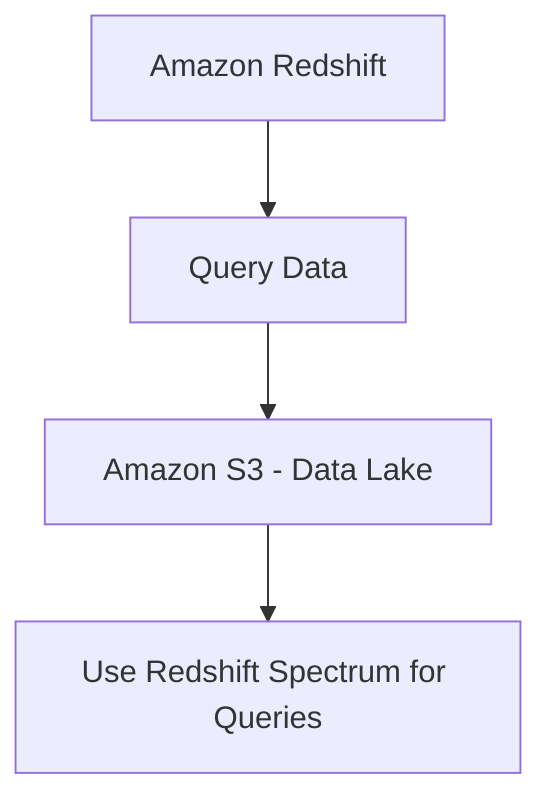

### **AWS Documentation Links:**

- [Amazon Redshift Documentation](https://docs.aws.amazon.com/redshift/index.html)
- [DynamoDB Documentation](https://docs.aws.amazon.com/dynamodb/index.html)

### **Use Case Scenarios:**

- **Amazon Redshift** is ideal for complex analytical queries on large datasets, where cost control and performance are critical.
- **DynamoDB** is perfect for low-latency, high-throughput workloads such as user profiles, IoT data, and shopping cart applications.

### **Common Pitfalls or Challenges:**

- **Challenge:** Misconfiguring Redshift distribution keys can lead to performance bottlenecks.
- **Solution:** Analyze query patterns and adjust distribution keys based on the most commonly joined columns.

---

### **2. Configuring the Appropriate Storage Services for Specific Access Patterns and Requirements**

### **Services Covered:**

- **Amazon Redshift**, **Amazon EMR**, **Lake Formation**, **Amazon RDS**, **DynamoDB**

### **Detailed Steps/Exercises:**

### **Exercise 3: Configuring Amazon RDS for Transactional Workloads**

1. **Create an RDS Instance**:
    - In the **RDS Console**, create a new database instance using **MySQL** or **PostgreSQL**.
    - Choose **General Purpose SSD** (gp3) storage for balanced cost and performance or **Provisioned IOPS** for high-performance transactional workloads.
2. **Enable Multi-AZ Deployment**:
    - For high availability and fault tolerance, enable **Multi-AZ** deployment, which replicates your database across multiple Availability Zones.
3. **Set Up Read Replicas**:
    - Create **Read Replicas** to offload read-heavy workloads and improve performance without impacting the primary database.

### **Exercise 4: Configuring Amazon EMR for Distributed Data Processing**

1. **Launch an EMR Cluster**:
    - In the **EMR Console**, create a new EMR cluster with **Spark** as the application.
    - Choose **instance types** based on workload size (e.g., m5.xlarge for general-purpose computing, r5.xlarge for memory-optimized workloads).
2. **Attach an S3 Data Lake**:
    - Store your data in **Amazon S3** and configure EMR to read and write data directly from S3.
3. **Optimize for Performance**:
    - Use **EMRFS Consistent View** to ensure consistent reads from S3.
    - Enable **auto-scaling** to adjust the number of nodes in the cluster based on workload demands.

### **Mermaid Diagram: High Availability RDS Setup**

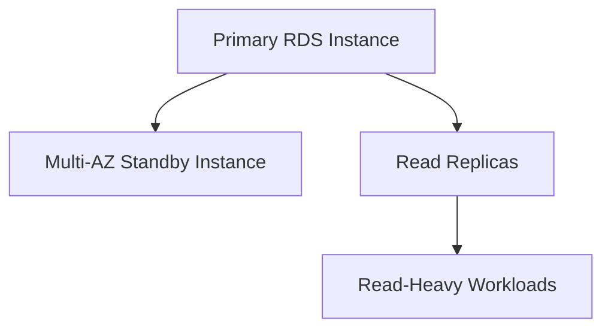

### **AWS Documentation Links:**

- [Amazon RDS Documentation](https://docs.aws.amazon.com/rds/index.html)
- [Amazon EMR Documentation](https://docs.aws.amazon.com/emr/index.html)

### **Use Case Scenarios:**

- **Amazon RDS** is ideal for transactional workloads like e-commerce, where consistent reads and writes are crucial.
- **Amazon EMR** is suited for distributed data processing tasks such as log analysis, machine learning, or data transformations in a big data environment.

### **Common Pitfalls or Challenges:**

- **Challenge:** Using **RDS Single-AZ** setups for critical databases can result in downtime.
- **Solution:** Always enable **Multi-AZ** for production databases to ensure high availability.

---

### **3. Applying Storage Services to Appropriate Use Cases**

### **Services Covered:**

- **Amazon S3**

### **Detailed Steps/Exercises:**

### **Exercise 5: Optimizing Amazon S3 for Data Lake Use Cases**

1. **Create an S3 Bucket**:
    - In the **S3 Console**, create a new bucket with default settings for **S3 Standard** storage.
2. **Enable S3 Versioning**:
    - Turn on **versioning** to retain previous versions of files, ensuring data integrity and recoverability.
3. **Set Up Lifecycle Policies**:
    - Implement a **lifecycle policy** to move data from **S3 Standard** to **S3 Infrequent Access** after 30 days and then to **Glacier** after 90 days to save on storage costs.
4. **Enable S3 Access Logging**:
    - Configure **Access Logging** for security and compliance purposes, keeping track of all access requests to your bucket.

### **Mermaid Diagram: S3 Data Lifecycle Management**

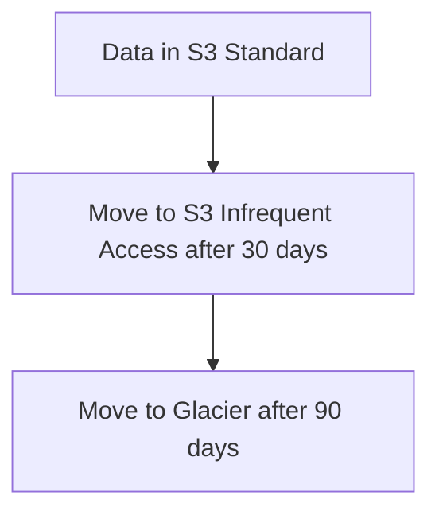

### **AWS Documentation Links:**

- [Amazon S3 Documentation](https://docs.aws.amazon.com/s3/index.html)

### **Use Case Scenarios:**

- **Amazon S3** is perfect for building data lakes to store vast amounts of structured and unstructured data. Its tiered storage model allows businesses to balance cost and performance by moving data to lower-cost storage over time.

### **Common Pitfalls or Challenges:**

- **Challenge:** Not using lifecycle policies can result in unnecessarily high storage costs.
- **Solution:** Regularly audit your data and set up automated lifecycle policies to optimize costs.

---

### **4. Integrating Migration Tools into Data Processing Systems**

### **Services Covered:**

- **AWS Transfer Family** (SFTP, FTPS, and FTP), **AWS Database Migration Service (DMS)**

### **Detailed Steps/Exercises:**

### **Exercise 6: Using AWS Transfer Family to Move Files to S3**

1. **Set Up an SFTP Server**:
    - In the **AWS Transfer Family Console**, create a new SFTP server endpoint that connects to your **S3** bucket.
2. **Add User and Configure Access**:
    - Create a user in the **Transfer Family Console**, assign IAM roles, and configure access to specific S3 buckets.
3. **Upload Files via SFTP**:
    - Use any SFTP client to upload files to the S3 bucket via the SFTP server.
4. **Automate Processing in S3**:
    - Set up **S3 Event Notifications** to trigger an **AWS Lambda** function for automatic processing of the newly uploaded files.

### **Exercise 7: Using AWS DMS for Database Migration**

1. **Set Up a DMS Task**:
    - In the **DMS Console**, create a replication instance to manage the migration between the source database (e.g., on-premises MySQL) and the target database (e.g., **Amazon RDS**).
2. **Configure Source and Target Endpoints**:
    - Define the source and target endpoints in DMS, ensuring that the target endpoint is properly configured

for **RDS** or **Redshift**.

1. **Run the DMS Task**:
    - Start the migration task, enabling **continuous replication** if you need ongoing updates from the source to the target database.

### **Mermaid Diagram: SFTP to S3 Integration**

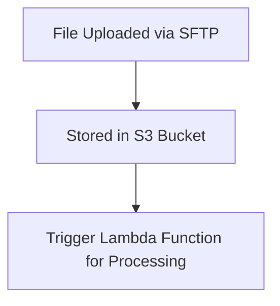

### **AWS Documentation Links:**

- [AWS Transfer Family Documentation](https://docs.aws.amazon.com/transfer/index.html)
- [AWS DMS Documentation](https://docs.aws.amazon.com/dms/index.html)

### **Use Case Scenarios:**

- **AWS Transfer Family** is ideal for securely transferring files from on-premises systems or external users into **S3** for further processing.
- **AWS DMS** simplifies live database migrations to AWS-managed databases (e.g., **RDS**, **Redshift**) while supporting schema conversions and continuous replication.

### **Common Pitfalls or Challenges:**

- **Challenge:** Incorrect configuration of user roles in AWS Transfer Family can lead to failed uploads or unauthorized access.
- **Solution:** Thoroughly test IAM role configurations and use **S3 Access Logs** to monitor access to files.

---

### **5. Implementing Data Migration or Remote Access Methods**

### **Services Covered:**

- **Amazon Redshift Federated Queries**, **Amazon Redshift Materialized Views**, **Amazon Redshift Spectrum**

### **Detailed Steps/Exercises:**

### **Exercise 8: Using Redshift Federated Queries to Access RDS Data**

1. **Set Up an Amazon Redshift Cluster**:
    - Create a **Redshift Cluster** via the console.
2. **Configure RDS Endpoint for Federated Query**:
    - In **Redshift Console**, configure an external schema that points to an RDS endpoint (e.g., PostgreSQL) using **AWS Secrets Manager** for authentication.
    - Example SQL:
        
        ```sql
        CREATE EXTERNAL SCHEMA rds_schema FROM POSTGRES
        DATABASE 'mydb'
        URI 'jdbc:redshift://rds-instance.amazonaws.com:5439/dev'
        IAM_ROLE 'arn:aws:iam::123456789012:role/MyRedshiftRole'
        SECRET_ARN 'arn:aws:secretsmanager:region:123456789012:secret:mysecret';
        
        ```
        
3. **Query RDS from Redshift**:
    - Use **SQL** in Redshift to query data from RDS using the federated schema.
    
    ```sql
    SELECT * FROM rds_schema.my_table LIMIT 10;
    
    ```
    

### **Exercise 9: Using Redshift Spectrum to Query Data from S3**

1. **Set Up S3 as an External Data Source**:
    - In **Redshift**, create an external schema pointing to **S3** where your Parquet files are stored.
2. **Run Queries Against S3 Data**:
    - Query data stored in S3 using **SQL** directly from Redshift.
    
    ```sql
    SELECT * FROM spectrum_schema.s3_table LIMIT 100;
    
    ```
    
3. **Optimize with Materialized Views**:
    - Create a **materialized view** on top of the external schema to speed up repeated queries:
    
    ```sql
    CREATE MATERIALIZED VIEW my_view AS
    SELECT * FROM spectrum_schema.s3_table;
    
    ```
    

### **Mermaid Diagram: Federated Query Setup in Redshift**

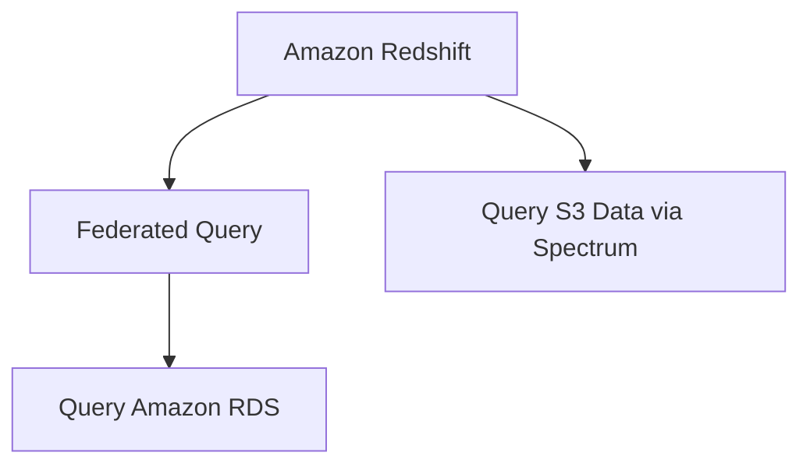

### **AWS Documentation Links:**

- [Redshift Federated Queries](https://docs.aws.amazon.com/redshift/latest/dg/federated-overview.html)
- [Redshift Spectrum Documentation](https://docs.aws.amazon.com/redshift/latest/dg/c-using-redshift-spectrum.html)

### **Use Case Scenarios:**

- **Redshift Federated Queries** allow querying across both RDS and Redshift, which is useful when you have datasets stored in multiple databases.
- **Redshift Spectrum** is ideal for running SQL queries against large data lakes stored in **S3** without moving the data into Redshift.

### **Common Pitfalls or Challenges:**

- **Challenge:** Federated queries can suffer from latency if there is high network traffic between Redshift and RDS.
- **Solution:** Monitor query performance and optimize by reducing the size of the dataset retrieved in federated queries.

---