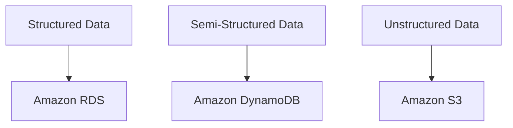
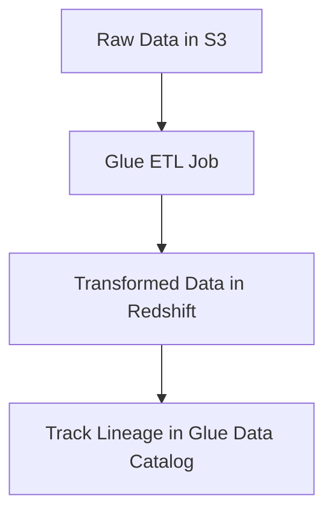
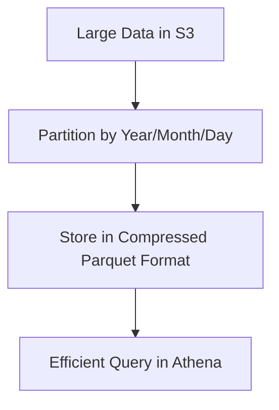
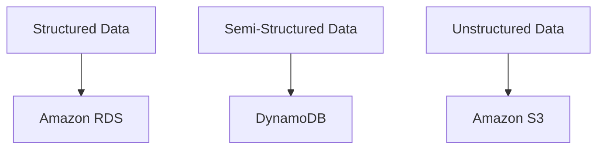
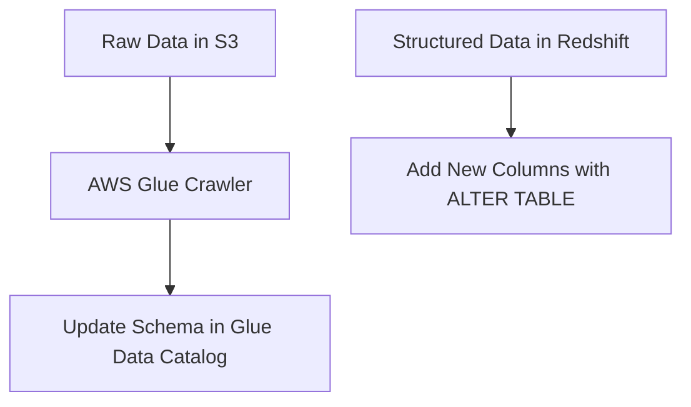
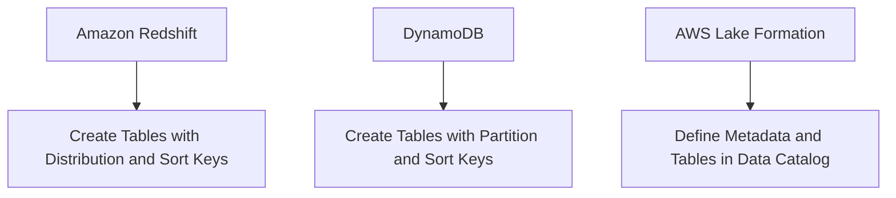
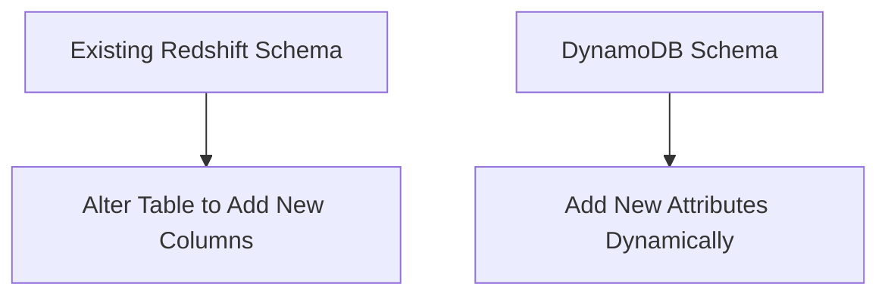
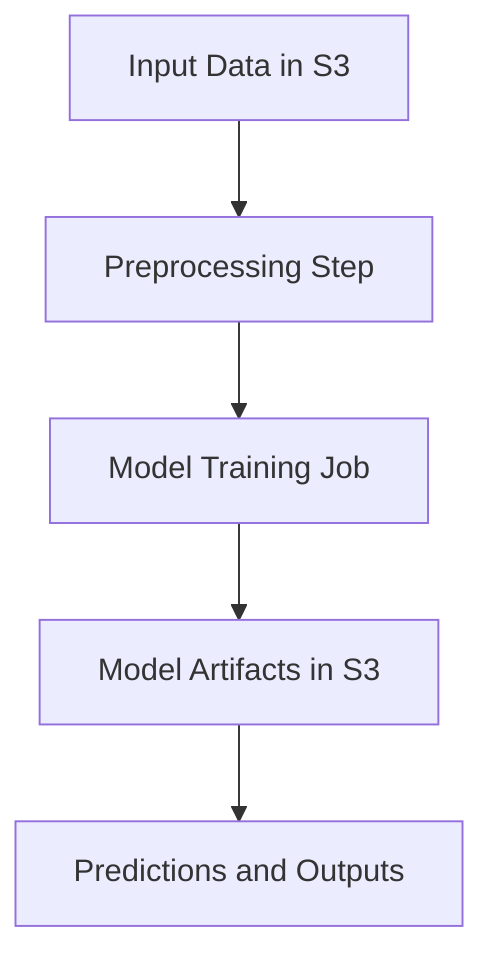

# 2.4: Design data models and schema evolution

## Knowledge of:

- Data modeling concepts
- How to ensure accuracy and trustworthiness of data by using data lineage
- Best practices for indexing, partitioning strategies, compression, and other data optimization techniques
- How to model structured, semi-structured, and unstructured data
- Schema evolution techniques

---

### **1. Data Modeling Concepts**

### **Primary Functions:**

Data modeling defines the structure, relationships, and constraints of data within a database. AWS offers several storage services that support different data models, including relational, NoSQL, and document-based models.

Key AWS services for data modeling:

- **Amazon RDS** (Relational Database Service): Suitable for **structured data** with predefined schemas, supporting SQL-based queries.
- **Amazon DynamoDB**: A NoSQL key-value and document database, optimized for **semi-structured** data, with flexible schemas.
- **Amazon S3**: Ideal for storing **unstructured data**, such as images, logs, and videos, with metadata stored in **AWS Glue Data Catalog**.

### **Patterns (When to Use):**

- Use **Amazon RDS** for relational databases where strict schemas and relationships between entities are necessary (e.g., financial systems, CRM).
- Use **DynamoDB** for highly scalable, low-latency applications that handle semi-structured or dynamic data, like IoT data or user session management.
- Use **Amazon S3** for storing unstructured or raw data, such as multimedia files, logs, or backup files.

### **Antipatterns (When Not to Use):**

- Avoid using **RDS** for datasets that do not require strong relational modeling, as it may increase complexity and costs. Use **DynamoDB** for more flexible data storage.
- Avoid storing highly structured transactional data in **S3**, since it does not offer relational capabilities or indexing for fast querying. Use **RDS** or **Redshift** for those use cases.

### **Benefits of Managed vs. Serverless Services:**

- **Managed (RDS, DynamoDB)**:
    - **Scalability**: RDS provides automatic scaling options (e.g., Aurora) for relational data, while DynamoDB scales horizontally to handle massive traffic.
    - **Cost**: Managed databases (RDS) come with higher operational costs but provide full control over database configuration.
- **Serverless (S3, DynamoDB On-Demand)**:
    - **Simplicity**: S3’s serverless architecture automatically scales for unstructured data storage, while DynamoDB’s on-demand mode provides cost-effective scalability for unpredictable workloads.
    - **Cost**: Serverless options typically offer lower costs, as you only pay for the storage or read/write requests made.

### **Mermaid Diagram: Data Modeling with RDS, DynamoDB, and S3**



### **AWS Documentation Links:**

- [Amazon RDS Documentation](https://docs.aws.amazon.com/rds/index.html)
- [Amazon DynamoDB Documentation](https://docs.aws.amazon.com/dynamodb/index.html)
- [Amazon S3 Documentation](https://docs.aws.amazon.com/s3/index.html)

---

### **2. How to Ensure Accuracy and Trustworthiness of Data by Using Data Lineage**

### **Primary Functions:**

**Data lineage** refers to tracking the origins, movement, and transformation of data across systems. It helps ensure the accuracy and trustworthiness of data by providing visibility into how data is processed and where it originates.

Key AWS tools:

- **AWS Glue**: Provides built-in support for data lineage through **Glue Jobs**, where you can track how data is transformed in ETL processes.
- **Amazon EMR**: Enables data lineage for large-scale data processing by tracking input and output data transformations in Hadoop or Spark jobs.
- **AWS Lake Formation**: Helps manage data lakes with governance features, including data lineage and access control.

### **Patterns (When to Use):**

- Use **AWS Glue** to track ETL workflows and transformations. The Glue Data Catalog helps document how datasets are processed, ensuring compliance and data trustworthiness.
    - **Example**: An organization tracks the lineage of transformed sales data using Glue jobs, ensuring visibility from raw data in S3 to the final dataset in Redshift.
- Use **AWS Lake Formation** for managing data lineage in large data lakes, ensuring that data transformations and access are fully auditable.

### **Antipatterns (When Not to Use):**

- Avoid manually tracking lineage across diverse systems using spreadsheets or static documentation, as it can quickly become outdated and error-prone.
- Avoid ignoring lineage for data-critical operations such as regulatory reporting, as this can lead to compliance failures.

### **Benefits of Managed vs. Serverless Services:**

- **Managed (Glue, Lake Formation)**:
    - **Automation**: Glue automatically tracks data transformation lineage during ETL processes, making it easier to manage.
    - **Cost**: Managed services like Glue or Lake Formation can incur costs based on the number of resources and jobs tracked.
- **Serverless (S3 with Glue)**:
    - **Flexibility**: Storing raw data in S3 and using Glue to manage metadata provides a cost-effective serverless approach to track data lineage.
    - **Cost**: Lower cost for using serverless architecture, as you only pay for the jobs run in Glue.

### **Mermaid Diagram: Data Lineage Tracking with AWS Glue**



### **AWS Documentation Links:**

- [AWS Glue Data Lineage](https://docs.aws.amazon.com/glue/latest/dg/monitor-data-lineage.html)
- [AWS Lake Formation](https://docs.aws.amazon.com/lake-formation/index.html)

---

### **3. Best Practices for Indexing, Partitioning Strategies, Compression, and Other Data Optimization Techniques**

### **Primary Functions:**

Optimizing data storage and access is essential for improving performance, reducing costs, and ensuring efficient query execution. Key optimization techniques include:

- **Indexing**: Improves query performance by creating indexes on frequently accessed columns (e.g., in **RDS**, **Redshift**).
- **Partitioning**: Divides large datasets into smaller, more manageable parts to improve query performance (e.g., **DynamoDB**, **Athena**, **Redshift**).
- **Compression**: Reduces storage costs and improves query efficiency by storing data in compressed formats (e.g., **Redshift** and **S3** support Parquet or ORC formats).

### **Patterns (When to Use):**

- Use **indexes** in **RDS** or **Redshift** for columns frequently used in filtering, sorting, or joining. Indexing can drastically reduce query time for complex SQL queries.
- Use **partitioning** for large datasets stored in **DynamoDB**, **Redshift**, or **Athena**. Partitioning data by date or key allows the system to scan only the necessary partitions during a query.
    - **Example**: Partitioning S3 data by year, month, and day allows **Athena** to perform cost-effective queries on time-series data.
- Use **compression** formats like **Parquet** or **ORC** when storing structured or semi-structured data in **S3**, as they reduce storage costs and improve read performance.

### **Antipatterns (When Not to Use):**

- Avoid over-indexing in **RDS**, as too many indexes can slow down **write operations** and increase storage costs.
- Avoid partitioning small datasets unnecessarily, as it adds complexity and does not provide meaningful performance improvements.

### **Benefits of Managed vs. Serverless Services:**

- **Managed (RDS, Redshift)**:
    - **Performance**: Managed services like RDS and Redshift provide built-in optimization techniques like indexing, compression, and partitioning.
    - **Cost**: Costs can increase for higher performance configurations, such as provisioned IOPS for RDS or multiple partitions in Redshift.
- **Serverless (Athena, S3 with Parquet)**:
    - **Simplicity**: Serverless solutions like Athena provide automatic partition pruning, allowing efficient queries with minimal setup.
    - **Cost**: Lower costs for storage and queries, as serverless solutions like S3 are priced per GB stored and per query run.

### **Mermaid Diagram: Optimizing Queries with Partitioning and Compression**



### **AWS Documentation Links:**

- [Amazon RDS Indexing](https://docs.aws.amazon.com/AmazonRDS/latest/UserGuide/USER_WorkingWithDBInstance.html)
- [Amazon Athena Partitioning](https://docs.aws.amazon.com/athena/latest/ug/partitions.html)
- [Redshift Compression](https://docs.aws.amazon.com/redshift/latest/dg/t_Compressing_data_on_disk.html)

---

### **4. How to Model Structured, Semi-Structured, and Unstructured Data**

### **Primary Functions:**

Data

modeling varies depending on whether the data is structured, semi-structured, or unstructured. AWS provides different services to manage each type:

- **Structured Data**: Typically stored in relational databases like **Amazon RDS** or **Amazon Redshift**, where data follows a defined schema (e.g., SQL-based systems).
- **Semi-Structured Data**: Often stored in **DynamoDB** or **Amazon S3** (in JSON or CSV format). These datasets have flexible schemas that can change over time.
- **Unstructured Data**: Stored in **Amazon S3**, where the data has no predefined structure (e.g., images, videos, or logs).

### **Patterns (When to Use):**

- Use **RDS** or **Redshift** for highly structured data where consistent schemas and relationships are required (e.g., financial data, customer databases).
- Use **DynamoDB** or **S3** for semi-structured data like JSON or XML files, where flexibility is needed (e.g., IoT sensor data or user sessions).
- Use **S3** for storing unstructured data like multimedia, raw logs, and large binary files.

### **Antipatterns (When Not to Use):**

- Avoid using **structured relational databases** like RDS for unstructured data, as it would result in higher costs and inefficient storage.
- Avoid using **DynamoDB** for highly relational data, as it is optimized for key-value or document data rather than complex joins and relationships.

### **Benefits of Managed vs. Serverless Services:**

- **Managed (RDS, Redshift)**:
    - **Performance**: Managed databases like RDS and Redshift offer performance optimizations for structured data with complex relationships.
    - **Cost**: Can be costly for high-throughput workloads.
- **Serverless (S3, DynamoDB)**:
    - **Flexibility**: Serverless options like DynamoDB and S3 offer scalability and flexibility for storing semi-structured and unstructured data without worrying about infrastructure management.
    - **Cost**: Lower costs for handling unpredictable data patterns.

### **Mermaid Diagram: Data Modeling for Structured, Semi-Structured, and Unstructured Data**



### **AWS Documentation Links:**

- [Amazon DynamoDB Data Modeling](https://docs.aws.amazon.com/amazondynamodb/latest/developerguide/Introduction.html)
- [Amazon Redshift Data Modeling](https://docs.aws.amazon.com/redshift/latest/dg/t_Creating_tables.html)

---

### **5. Schema Evolution Techniques**

### **Primary Functions:**

**Schema evolution** refers to managing changes to data structures over time without disrupting existing applications or pipelines. In AWS, services such as **AWS Glue**, **Amazon Redshift**, and **DynamoDB** provide tools for managing schema changes dynamically.

Key services and tools:

- **AWS Glue**: Automatically manages schema changes in ETL jobs using the **Glue Data Catalog**.
- **Amazon Redshift**: Supports schema modifications (e.g., adding columns) with minimal impact on existing queries.
- **DynamoDB**: Allows flexible schemas at the item level, where new attributes can be added without needing to modify existing data.

### **Patterns (When to Use):**

- Use **AWS Glue** to handle schema changes in data lakes where data formats and schemas evolve over time. Glue can automatically detect changes in schema and update the Data Catalog.
- Use **Redshift** for structured data where the schema evolves gradually. Schema updates (e.g., adding new columns) can be handled using **ALTER TABLE** without affecting existing queries.

### **Antipatterns (When Not to Use):**

- Avoid manually managing schema changes in large datasets, as it can lead to inconsistency and broken pipelines. Use automated tools like Glue Crawlers to handle schema evolution.
- Avoid over-complicating schema evolution in **DynamoDB**, as it can lead to inconsistent data structures if not properly managed.

### **Benefits of Managed vs. Serverless Services:**

- **Managed (Redshift, Glue)**:
    - **Control**: Redshift and Glue offer strong control over how schemas evolve, providing mechanisms to handle changes smoothly.
    - **Cost**: Managed services may incur higher costs due to schema management overhead.
- **Serverless (DynamoDB, S3)**:
    - **Flexibility**: Serverless options like DynamoDB allow flexible schema evolution without predefined table schemas.
    - **Cost**: Cost-effective for handling large-scale, flexible data with evolving schemas.

### **Mermaid Diagram: Schema Evolution with AWS Glue and Redshift**



### **AWS Documentation Links:**

- [AWS Glue Schema Evolution](https://docs.aws.amazon.com/glue/latest/dg/schema-evolution.html)
- [Amazon Redshift Schema Changes](https://docs.aws.amazon.com/redshift/latest/dg/c_ALTER_TABLE.html)

---

## Skills in:

- Designing schemas for Amazon Redshift, DynamoDB, and Lake Formation
- Addressing changes to the characteristics of data
- Performing schema conversion (for example, by using the AWS Schema Conversion Tool [AWS SCT] and AWS DMS Schema Conversion)
- Establishing data lineage by using AWS tools (for example, Amazon SageMaker ML Lineage Tracking)

---

### **1. Designing Schemas for Amazon Redshift, DynamoDB, and Lake Formation**

### **Detailed Steps/Exercises:**

### **Exercise 1: Designing a Schema for Amazon Redshift**

1. **Create a Redshift Cluster**:
    - Go to the **Amazon Redshift Console** and create a new cluster with suitable node types (e.g., **dc2.large** for performance or **ra3** for scalable storage).
2. **Connect to the Cluster**:
    - Use **psql** or the **Redshift Query Editor** to connect to your Redshift cluster.
3. **Create a Schema for a Relational Database**:
    - Start by defining tables with the appropriate data types, distribution styles (e.g., `KEY`, `ALL`, `EVEN`), and sort keys for optimizing query performance.
    - Example:
        
        ```sql
        CREATE TABLE customers (
          customer_id INT PRIMARY KEY,
          first_name VARCHAR(50),
          last_name VARCHAR(50),
          email VARCHAR(100),
          create_date TIMESTAMP
        ) DISTSTYLE KEY DISTKEY (customer_id) SORTKEY (create_date);
        
        ```
        
4. **Insert Sample Data**:
    - Populate the table with sample data:
    
    ```sql
    INSERT INTO customers (customer_id, first_name, last_name, email, create_date)
    VALUES (1, 'John', 'Doe', 'john.doe@example.com', '2023-01-01 10:00:00');
    
    ```
    
5. **Query the Data**:
    - Run a simple query to test the schema:
    
    ```sql
    SELECT * FROM customers WHERE customer_id = 1;
    
    ```
    

### **Exercise 2: Designing a Schema for DynamoDB**

1. **Create a DynamoDB Table**:
    - Go to the **DynamoDB Console** and create a table with a **partition key** and an optional **sort key**.
    - Example: A table to store user activity with `user_id` as the partition key and `activity_date` as the sort key.
    - Example CLI command:
    
    ```bash
    aws dynamodb create-table \\
      --table-name UserActivity \\
      --attribute-definitions \\
        AttributeName=user_id,AttributeType=S \\
        AttributeName=activity_date,AttributeType=S \\
      --key-schema \\
        AttributeName=user_id,KeyType=HASH \\
        AttributeName=activity_date,KeyType=RANGE \\
      --provisioned-throughput ReadCapacityUnits=5,WriteCapacityUnits=5
    
    ```
    
2. **Insert Data into the Table**:
    - Insert items using the `put-item` command:
    
    ```bash
    aws dynamodb put-item \\
      --table-name UserActivity \\
      --item '{"user_id": {"S": "user1"}, "activity_date": {"S": "2023-09-01"}, "activity": {"S": "login"}}'
    
    ```
    
3. **Query Data Using Partition and Sort Keys**:
    - Query data by specifying the `user_id` and `activity_date`:
    
    ```bash
    aws dynamodb query \\
      --table-name UserActivity \\
      --key-condition-expression "user_id = :user_id and activity_date = :date" \\
      --expression-attribute-values  '{":user_id":{"S":"user1"}, ":date":{"S":"2023-09-01"}}'
    
    ```
    

### **Exercise 3: Designing a Schema in AWS Lake Formation**

1. **Create a Data Lake in AWS Lake Formation**:
    - First, ensure **S3** is set up as the data lake storage.
    - Go to the **AWS Lake Formation Console** and register the **S3** bucket as the data lake storage location.
2. **Create a Database in AWS Lake Formation**:
    - Use **AWS Glue** to create a new database that will act as a metadata catalog for the data lake:
    
    ```bash
    aws glue create-database --database-input '{"Name": "my_lake_db"}'
    
    ```
    
3. **Define Tables Using AWS Glue Data Catalog**:
    - Create tables based on the data stored in S3 (e.g., CSV, Parquet). AWS Glue crawlers can automate this process by inferring the schema.
    - Example CLI command:
    
    ```bash
    aws glue create-table --database-name my_lake_db --table-input file://table_definition.json
    
    ```
    
4. **Grant Access to Users**:
    - Use **Lake Formation** permissions to grant users and roles access to specific tables or columns, ensuring that only authorized users can query or manage the data.

### **Mermaid Diagram: Schema Design for Redshift, DynamoDB, and Lake Formation**



### **AWS Documentation Links:**

- [Amazon Redshift Documentation](https://docs.aws.amazon.com/redshift/index.html)
- [Amazon DynamoDB Documentation](https://docs.aws.amazon.com/dynamodb/index.html)
- [AWS Lake Formation Documentation](https://docs.aws.amazon.com/lake-formation/index.html)

### **Use Case Scenarios:**

- **Amazon Redshift**: Ideal for structured data that requires complex queries and large-scale analytics.
- **DynamoDB**: Suitable for semi-structured data with high read/write throughput and flexible schemas.
- **Lake Formation**: Useful for managing metadata in data lakes where multiple users need fine-grained access control.

### **Common Pitfalls or Challenges:**

- **Challenge**: Poor selection of distribution keys in Redshift can lead to query performance bottlenecks.
    - **Solution**: Analyze query patterns and optimize table distribution styles.
- **Challenge**: Incorrect partition key design in DynamoDB can lead to uneven data distribution and throttling.
    - **Solution**: Use partition keys that ensure even data distribution across partitions.

---

### **2. Addressing Changes to the Characteristics of Data**

### **Detailed Steps/Exercises:**

### **Exercise 4: Updating Redshift Schema to Handle New Data Characteristics**

1. **Alter an Existing Table in Redshift**:
    - Use the `ALTER TABLE` statement to add new columns to accommodate new data attributes.
    
    ```sql
    ALTER TABLE customers ADD COLUMN phone_number VARCHAR(20);
    
    ```
    
2. **Analyze Impact on Queries**:
    - Ensure that adding new columns or changing data types does not break existing queries. Test queries to verify compatibility.
3. **Use Redshift Spectrum for Unstructured Data**:
    - If new unstructured data arrives, you can use **Redshift Spectrum** to query data directly from S3 without modifying the core schema in Redshift.

### **Exercise 5: Modifying DynamoDB Table for New Data Patterns**

1. **Add a New Attribute Dynamically**:
    - In DynamoDB, you don’t need to modify the schema to add a new attribute. Simply add the new attribute when inserting data:
    
    ```bash
    aws dynamodb put-item \\
      --table-name UserActivity \\
      --item '{"user_id": {"S": "user1"}, "activity_date": {"S": "2023-09-01"}, "device_type": {"S": "mobile"}, "activity": {"S": "login"}}'
    
    ```
    
2. **Update Indexes if Necessary**:
    - If the new data characteristic requires indexing, update the table’s **Global Secondary Indexes (GSI)** to include the new attribute.

### **Mermaid Diagram: Schema Changes for Redshift and DynamoDB**



### **AWS Documentation Links:**

- [Redshift Alter Table](https://docs.aws.amazon.com/redshift/latest/dg/r_ALTER_TABLE.html)
- [DynamoDB Global Secondary Indexes](https://docs.aws.amazon.com/amazondynamodb/latest/developerguide/GSI.html)

### **Use Case Scenarios:**

- **Redshift**: Handle changes to structured data, such as adding new fields, while maintaining the integrity of existing queries.
- **DynamoDB**: Seamlessly handle schema changes with flexible data models, allowing new attributes without schema modifications.

### **Common Pitfalls or Challenges:**

- **Challenge**: Schema changes in Redshift may require downtime or reloading of data.
    - **Solution**: Plan schema changes during maintenance windows and test schema alterations in non-production environments.

---

### **3. Performing Schema Conversion Using AWS Schema Conversion Tool (SCT) and AWS DMS**

### **Detailed Steps/Exercises:**

### **Exercise 6: Using AWS Schema Conversion Tool (SCT) to Migrate a Database**

1. **Download and Install AWS SCT**:
    - Download **AWS Schema Conversion Tool (SCT)** from the AWS website.
2. **Connect to Source and Target Databases**:
    - Open **AWS SCT**, connect to your source database (

e.g., **Oracle** or **SQL Server**) and the target database (e.g., **Amazon Aurora** or **Redshift**).

1. **Analyze and Convert the Schema**:
    - Use SCT to analyze the source schema and generate a schema conversion report. This report will highlight any compatibility issues.
    - Convert the schema to the target format (e.g., **PostgreSQL** for Aurora or **Redshift**).
2. **Apply the Converted Schema**:
    - Apply the converted schema to the target database using the **SCT** or by exporting the converted schema and running it in the target environment.

### **Exercise 7: Using AWS DMS to Migrate Data**

1. **Set Up an AWS DMS Replication Instance**:
    - In the **AWS DMS Console**, create a new replication instance.
2. **Configure Source and Target Endpoints**:
    - Define the source (e.g., **Oracle**) and target (e.g., **Amazon Aurora**) endpoints.
3. **Run a Data Migration Task**:
    - Create a migration task in **AWS DMS** to replicate data from the source database to the target.
    - Example CLI:
    
    ```bash
    aws dms start-replication-task \\
      --replication-task-arn arn:aws:dms:task-id \\
      --start-replication-task-type full-load
    
    ```
    
4. **Monitor Migration**:
    - Use the **DMS Console** to monitor the progress of the migration task.

### **Mermaid Diagram: Schema Conversion with AWS SCT and DMS**

```mermaid
graph TD;
    A[Source Database (Oracle)] --> B[AWS Schema Conversion Tool];
    B --> C[Converted Schema for Amazon Aurora];
    C --> D[AWS DMS Migration Task];
    D --> E[Data Migrated to Amazon Aurora];

```

### **AWS Documentation Links:**

- [AWS Schema Conversion Tool Documentation](https://docs.aws.amazon.com/SchemaConversionTool/latest/userguide/Welcome.html)
- [AWS DMS Documentation](https://docs.aws.amazon.com/dms/index.html)

### **Use Case Scenarios:**

- **AWS SCT**: Migrate databases from on-premises or other cloud providers (e.g., Oracle, SQL Server) to **Amazon Aurora** or **Redshift**.
- **AWS DMS**: Perform real-time data migration with minimal downtime, supporting continuous replication.

### **Common Pitfalls or Challenges:**

- **Challenge**: Complex schema conversions may result in compatibility issues, especially with stored procedures and triggers.
    - **Solution**: Use AWS SCT to generate conversion reports and manually adjust problematic objects.

---

### **4. Establishing Data Lineage by Using AWS Tools**

### **Detailed Steps/Exercises:**

### **Exercise 8: Using Amazon SageMaker ML Lineage Tracking**

1. **Create a SageMaker Model Training Job**:
    - Use the **SageMaker Console** or **SageMaker SDK** to create a training job.
2. **Enable Lineage Tracking**:
    - Enable data lineage tracking to monitor datasets, transformations, and model artifacts.
    - Example using **SageMaker SDK**:
    
    ```python
    from sagemaker.lineage.context import Context
    
    context = Context.create(
        source_uri="s3://bucket/input-data/",
        source_type="S3",
        description="Data preprocessing step for model training"
    )
    
    ```
    
3. **Track Model Artifacts**:
    - Track the lineage of model artifacts (e.g., datasets, model versions, and output predictions) using the **SageMaker Lineage Tracker**.
    - Example:
    
    ```python
    from sagemaker.lineage.artifact import Artifact
    
    model_artifact = Artifact.create(
        source_uri="s3://bucket/model.tar.gz",
        source_type="S3",
        description="Model output artifact"
    )
    
    ```
    
4. **Visualize Lineage**:
    - Use the **SageMaker Console** to view the full lineage graph, which tracks data from the source to model artifacts and predictions.

### **Mermaid Diagram: Data Lineage with SageMaker ML Lineage Tracking**



### **AWS Documentation Links:**

- [Amazon SageMaker ML Lineage Tracking](https://docs.aws.amazon.com/sagemaker/latest/dg/lineage-tracking.html)

### **Use Case Scenarios:**

- **SageMaker ML Lineage Tracking**: Track and visualize the data transformations, model artifacts, and predictions in a machine learning pipeline.

### **Common Pitfalls or Challenges:**

- **Challenge**: Incorrect lineage tracking configurations can lead to missing data transformations.
    - **Solution**: Ensure that all preprocessing steps and model artifacts are properly tracked by enabling the necessary tracking features during pipeline creation.

---