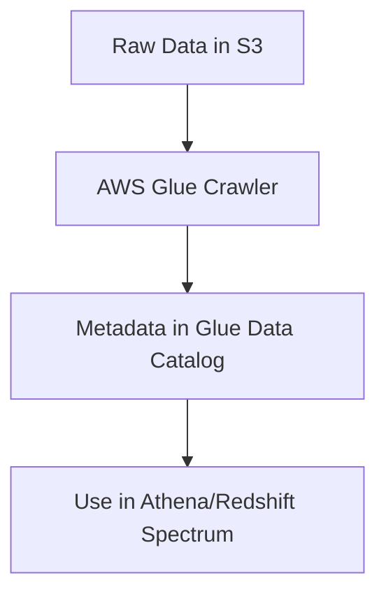
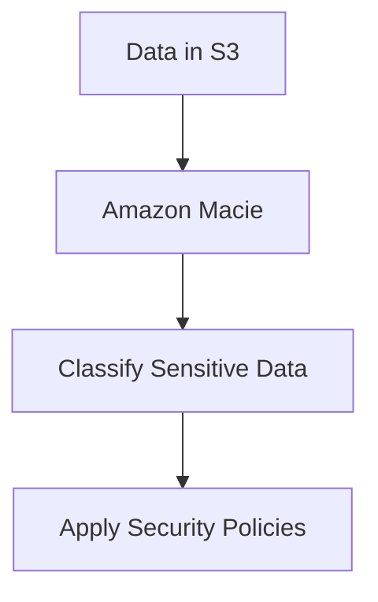
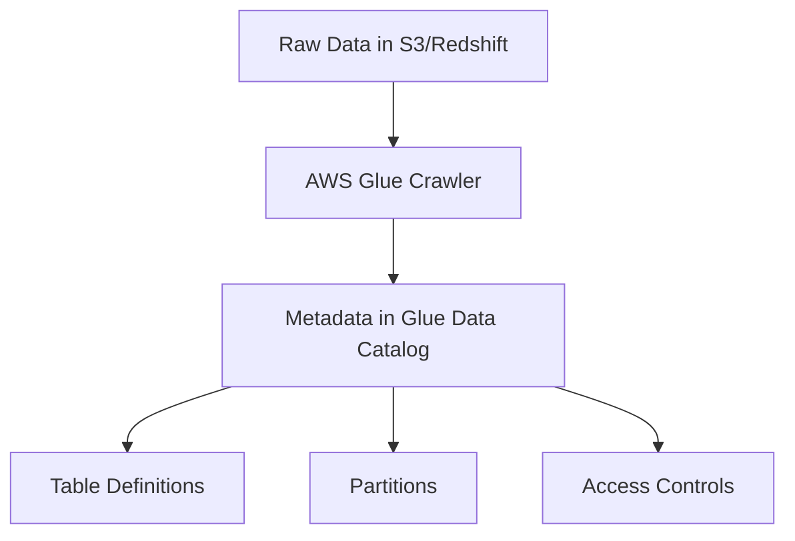
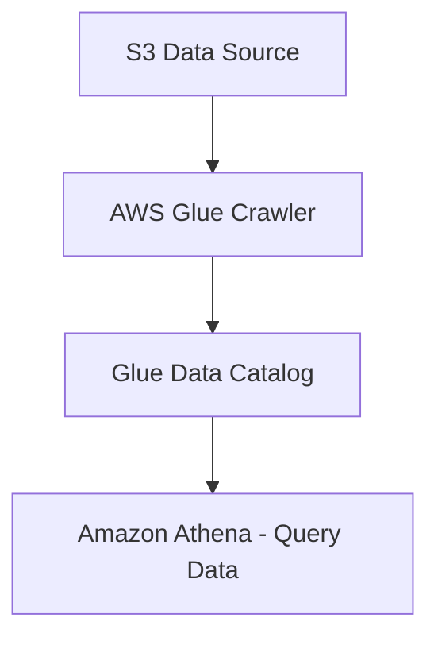
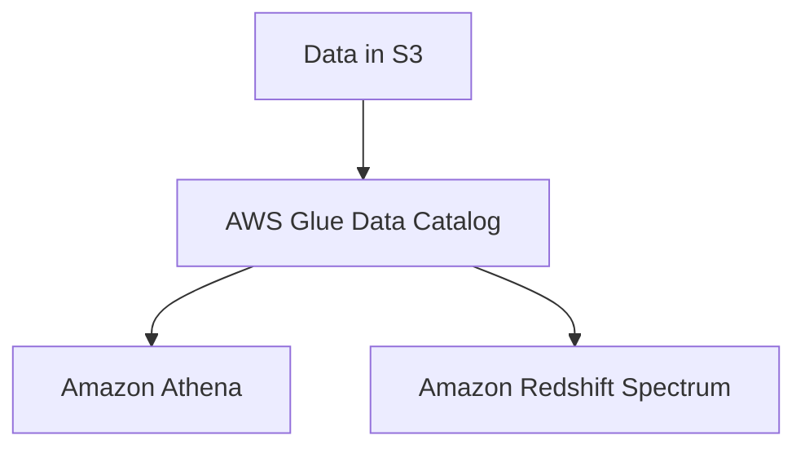
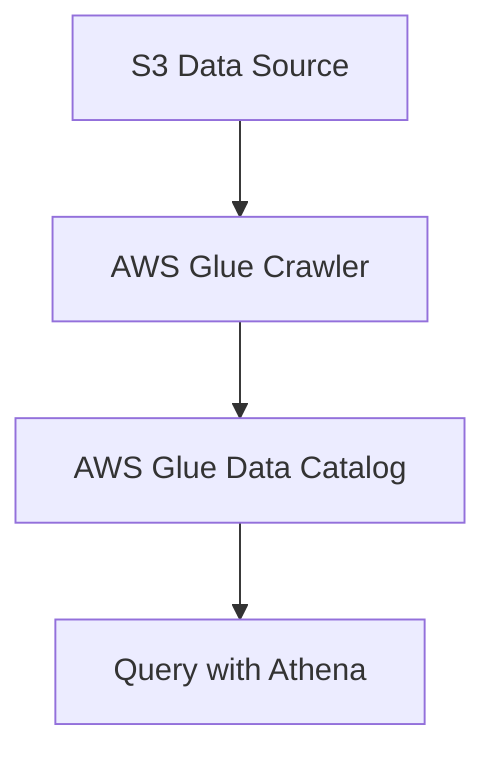
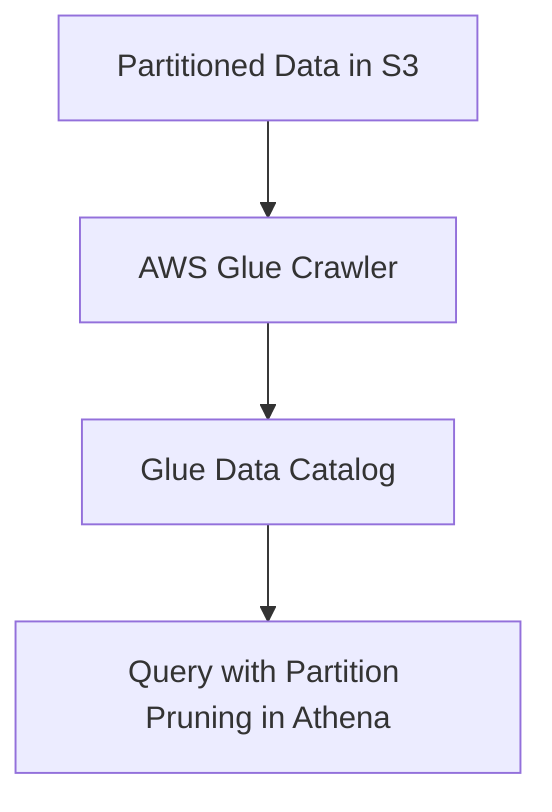
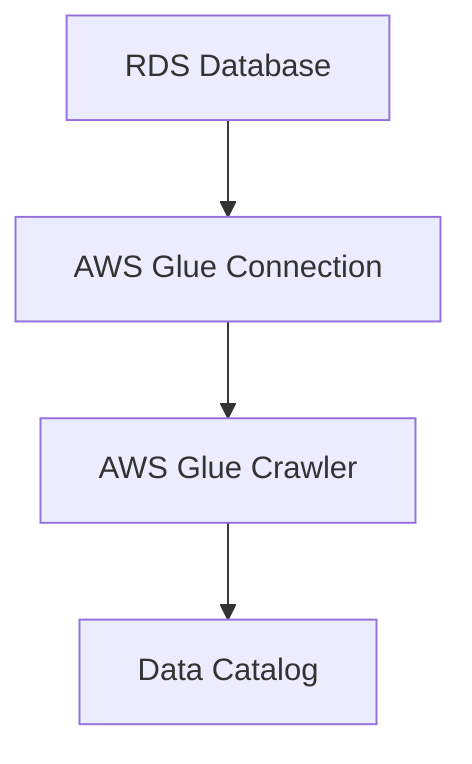

# 2.2: Understand data cataloging systems

## Knowledge of:

- How to create a data catalog
- Data classification based on requirements
- Components of metadata and data catalogs

---

### **1. How to Create a Data Catalog**

### **Primary Functions:**

A **data catalog** is a centralized repository of metadata about data assets in an organization, which provides essential details such as data location, schema, and access permissions. It helps data engineers and analysts easily find, understand, and access the data for analytics and processing.

Key AWS service for creating a data catalog:

- **AWS Glue Data Catalog**: A fully managed metadata repository integrated with AWS Glue. It automatically crawls your data, collects metadata, and stores this metadata in a searchable catalog.

Core functions of **AWS Glue Data Catalog**:

- **Metadata storage**: Stores metadata about datasets, such as table schemas, partition information, and data types.
- **Crawlers**: Automatically traverse datasets (e.g., in S3 or RDS) to infer schema and update the catalog.
- **Integration with AWS services**: Works with services like Amazon Athena, Redshift Spectrum, and Amazon EMR to enable querying and processing.
- **ETL integration**: Enables transformation pipelines using AWS Glue for data preparation and transformation.

### **Patterns (When to Use):**

- Use **AWS Glue Data Catalog** when you need a unified metadata store to manage diverse datasets across **Amazon S3**, **Amazon RDS**, or **Amazon Redshift**.
    - **Example**: A company uses Amazon S3 to store raw data and wants to automate the discovery of new datasets with metadata automatically updated in the catalog.
- Use Glue Data Catalog with **Amazon Athena** or **Amazon Redshift Spectrum** to enable serverless querying of S3-based data lakes.

### **Antipatterns (When Not to Use):**

- Avoid manually creating and maintaining metadata for large datasets that are frequently updated. Manual processes are prone to errors, and automation (e.g., Glue Crawlers) provides a more scalable approach.
- Avoid using **AWS Glue Data Catalog** if your data is stored exclusively in a non-AWS service without support for Glue integration. For those, consider a different cataloging tool that can better integrate with external sources.

### **Benefits of Managed vs. Serverless Services:**

- **Managed (AWS Glue Data Catalog)**:
    - **Scalability**: Automatically scales to manage metadata for large datasets.
    - **Simplicity**: No need to manually manage metadata, as crawlers automatically catalog and update schemas.
- **Serverless (Athena + Glue)**:
    - **Flexibility**: Serverless querying with **Athena** allows direct querying of S3 data with cataloged metadata.
    - **Cost**: Serverless models are cost-effective, especially for sporadic workloads since you only pay per query execution.

### **Mermaid Diagram: AWS Glue Data Catalog Workflow**



### **AWS Documentation Links:**

- [AWS Glue Data Catalog](https://docs.aws.amazon.com/glue/latest/dg/aws-glue-data-catalog.html)
- [AWS Glue Crawlers](https://docs.aws.amazon.com/glue/latest/dg/add-crawler.html)

---

### **2. Data Classification Based on Requirements**

### **Primary Functions:**

**Data classification** refers to categorizing data based on its sensitivity, criticality, and how it should be handled to meet regulatory, security, or business requirements. AWS provides tools to classify and protect data based on these requirements.

Key services and concepts:

- **Amazon Macie**: A fully managed data security service that uses machine learning to automatically discover, classify, and protect sensitive data such as PII (Personally Identifiable Information) stored in Amazon S3.
- **AWS Glue Data Catalog Classifiers**: Used to customize how AWS Glue categorizes datasets during cataloging, such as defining custom classifiers for non-standard file formats.

Core functions:

- **Classification of sensitive data**: **Macie** automatically identifies data such as credit card numbers, SSNs, and other sensitive information.
- **Custom classification**: **AWS Glue Classifiers** allow you to define specific patterns or rules to catalog data beyond the default classifications (e.g., custom log file formats).

### **Patterns (When to Use):**

- Use **Amazon Macie** to classify and protect sensitive data (e.g., PII) in S3, ensuring compliance with data privacy regulations like GDPR or HIPAA.
    - **Example**: An organization storing customer data in S3 uses Macie to automatically identify and classify data containing PII.
- Use **AWS Glue Classifiers** to handle non-standard data formats in your ETL processes. For instance, if your organization stores log data in a custom format, creating a classifier ensures Glue can correctly catalog the data.

### **Antipatterns (When Not to Use):**

- Avoid manually inspecting and classifying sensitive data, especially for large-scale data lakes. Manual classification introduces human error and is inefficient compared to automated solutions like Macie.
- Avoid using default Glue Classifiers for non-standard data formats, as they may misclassify or ignore critical data points. Instead, define custom classifiers to ensure accurate cataloging.

### **Benefits of Managed vs. Serverless Services:**

- **Managed (Macie)**:
    - **Simplicity**: Fully managed, with built-in machine learning capabilities to automatically classify and detect sensitive data.
    - **Cost**: Pricing is based on the number of S3 objects inspected, so it scales with the size of the data lake.
- **Serverless (Glue Classifiers)**:
    - **Flexibility**: Serverless Glue crawlers can handle custom data formats and automatically classify data during ETL processes.
    - **Cost**: Glue crawlers are priced per DPU-hour, making them cost-effective for intermittent crawling tasks.

### **Mermaid Diagram: Data Classification with Amazon Macie**



### **AWS Documentation Links:**

- [Amazon Macie Documentation](https://docs.aws.amazon.com/macie/index.html)
- [AWS Glue Classifiers](https://docs.aws.amazon.com/glue/latest/dg/custom-classifier.html)

---

### **3. Components of Metadata and Data Catalogs**

### **Primary Functions:**

Metadata provides context about data assets, including details like schema, ownership, and access control policies. Data catalogs collect and organize this metadata to make it easily accessible.

Key components of a data catalog:

- **Table definitions**: Describe the structure of the data, including column names, data types, and partitioning information.
- **Partitions**: Subdivisions of datasets that optimize query performance by enabling selective access to parts of the data.
- **Schema evolution tracking**: Supports managing schema changes over time, ensuring backward compatibility in ETL processes.
- **Access control metadata**: Describes permissions for accessing specific datasets, enabling compliance with security and governance requirements.
- **Lineage**: Tracks how data is transformed and moves across pipelines, providing visibility into its origins and transformations.

### **Patterns (When to Use):**

- Use **AWS Glue Data Catalog** for managing metadata of datasets stored across **S3**, **RDS**, and **Redshift**. Its integration with AWS analytics services allows easy querying and processing.
    - **Example**: A data engineering team catalogs its datasets in S3 using Glue, enabling analysts to use **Amazon Athena** to run SQL queries on the data.
- Use **Lake Formation** to manage security policies and fine-grained access controls on data catalog entries, particularly in regulated industries that require strict data governance.

### **Antipatterns (When Not to Use):**

- Avoid manually managing schema evolution across datasets. Manual tracking can lead to inconsistencies and broken pipelines when schema changes are introduced. Use Glue’s built-in schema evolution tracking instead.
- Avoid managing metadata on a per-dataset basis using spreadsheets or static documentation. Instead, leverage **Glue Data Catalog** or **Lake Formation** for real-time metadata management.

### **Benefits of Managed vs. Serverless Services:**

- **Managed (Lake Formation)**:
    - **Data Governance**: Fine-grained access control and security for catalogs with comprehensive policy management.
    - **Scalability**: Supports large data lakes with complex access requirements.
- **Serverless (Glue)**:
    - **Flexibility**: Seamlessly integrates with serverless data processing services like **Athena** and **Redshift Spectrum**.
    - **Cost**: Pay only for the metadata storage and Glue Crawlers you use, making it ideal for dynamically updating datasets.

### **Mermaid Diagram: AWS Glue Data Catalog Metadata Components**



### **AWS Documentation Links:**

- [AWS Glue Data Catalog](https://docs.aws.amazon.com/glue/latest/dg/aws-glue-data-catalog.html)
- [AWS Lake Formation Documentation](https://docs.aws.amazon.com/lake-formation/index.html)

---

### Summary of Key Concepts

for **Data Store Management** in the **AWS Certified Data Engineer - Associate** Exam

### **How to Create a Data Catalog:**

- **AWS Glue Data Catalog**: Automates the process of metadata discovery and organization, integrates with S3, Redshift, Athena, and provides schema evolution support.

### **Data Classification Based on Requirements:**

- **Amazon Macie**: Automatically classifies sensitive data in S3 (e.g., PII) to ensure compliance with regulations.
- **AWS Glue Classifiers**: Used for custom data classification during ETL jobs.

### **Components of Metadata and Data Catalogs:**

- **Table Definitions**, **Partitions**, **Schema Evolution Tracking**, **Access Controls**, and **Lineage**: The core elements that describe the structure, permissions, and lifecycle of datasets cataloged in AWS Glue.

---

## Skills in:

- Using data catalogs to consume data from the data’s source
- Building and referencing a data catalog (for example, AWS Glue Data Catalog, Apache Hive metastore)
- Discovering schemas and using AWS Glue crawlers to populate data catalogs
- Synchronizing partitions with a data catalog
- Creating new source or target connections for cataloging (for example, AWS Glue)

---

### **1. Using Data Catalogs to Consume Data from the Data’s Source**

### **Detailed Steps/Exercises:**

### **Exercise 1: Querying Data from an AWS Glue Data Catalog with Amazon Athena**

1. **Create a Glue Data Catalog**:
    - Use the AWS Glue Console to create a new **database** in the Data Catalog. This will serve as the logical grouping for your data.
    - Example:
        
        ```bash
        aws glue create-database --database-input '{"Name": "my_catalog_db"}'
        
        ```
        
2. **Run a Glue Crawler to Populate the Catalog**:
    - Create a Glue Crawler to automatically discover tables and schemas in an **S3** bucket. Configure the crawler to store the metadata in the **Glue Data Catalog**.
        - **Data Source**: Choose your **S3 bucket** with raw data.
        - **Output**: Choose the **database** you just created.
3. **Use Amazon Athena to Query Data**:
    - In **Athena**, open the query editor and ensure that the Glue Data Catalog is set as your data source.
    - Example query:
        
        ```sql
        SELECT * FROM "my_catalog_db"."my_table" LIMIT 10;
        
        ```
        

### **Mermaid Diagram: Using Glue Data Catalog with Athena**



### **AWS Documentation Links:**

- [AWS Glue Data Catalog Documentation](https://docs.aws.amazon.com/glue/latest/dg/aws-glue-data-catalog.html)
- [Amazon Athena Documentation](https://docs.aws.amazon.com/athena/index.html)

### **Use Case Scenarios:**

- When you need to query large, structured datasets in **Amazon S3** without moving the data into a relational database. Using **Athena** with **AWS Glue Data Catalog** allows for serverless queries with no data movement.

### **Common Pitfalls or Challenges:**

- **Challenge**: Incorrectly configured crawler may fail to recognize schema or partitioning properly.
- **Solution**: Ensure that the **Glue Crawler** is correctly set up with the right classifiers and data format.

---

### **2. Building and Referencing a Data Catalog (AWS Glue Data Catalog, Apache Hive Metastore)**

### **Detailed Steps/Exercises:**

### **Exercise 2: Building a Data Catalog in AWS Glue**

1. **Create a Database** in Glue Data Catalog:
    - In the **AWS Glue Console**, create a new **database** where your metadata (tables and schemas) will be stored.
    - Example CLI:
        
        ```bash
        aws glue create-database --database-input '{"Name": "my_glue_db"}'
        
        ```
        
2. **Create a Table** with Metadata:
    - Define a table in the database. You can use a Glue Crawler (recommended) or manually define the table’s schema.
    - Example:
        
        ```bash
        aws glue create-table --database-name my_glue_db --table-input file://table-definition.json
        
        ```
        
3. **Access the Data via Amazon Athena or Redshift Spectrum**:
    - Using the metadata stored in the Glue Data Catalog, you can query data from **S3** directly in **Athena** or **Redshift Spectrum**.

### **Mermaid Diagram: Building and Accessing a Data Catalog**



### **AWS Documentation Links:**

- [AWS Glue Data Catalog Overview](https://docs.aws.amazon.com/glue/latest/dg/aws-glue-data-catalog.html)
- [Redshift Spectrum Documentation](https://docs.aws.amazon.com/redshift/latest/dg/c-using-redshift-spectrum.html)

### **Use Case Scenarios:**

- Build a **Glue Data Catalog** to organize metadata for a data lake stored in **S3**. This is especially useful when data is queried by multiple services like **Athena**, **Redshift Spectrum**, and **EMR**.

### **Common Pitfalls or Challenges:**

- **Challenge**: Inconsistent metadata when manually building a catalog.
- **Solution**: Automate the cataloging process with **Glue Crawlers** to keep the metadata synchronized with the data source.

---

### **3. Discovering Schemas and Using AWS Glue Crawlers to Populate Data Catalogs**

### **Detailed Steps/Exercises:**

### **Exercise 3: Discovering Schema with AWS Glue Crawler**

1. **Set Up a Glue Crawler**:
    - In the **AWS Glue Console**, create a new crawler. Specify the data source (e.g., an **S3** bucket), and the Glue Crawler will automatically infer the schema.
    - Choose an **IAM role** with appropriate permissions to read the data source.
2. **Configure Crawler Settings**:
    - Define the target **Data Catalog** database where the crawler should store the metadata.
    - Schedule the crawler to run periodically if the schema or data changes often.
3. **Run the Crawler**:
    - Start the crawler. Once it completes, check the **AWS Glue Console** to see the new tables and schemas it has discovered.
    - Example:
        
        ```bash
        aws glue start-crawler --name my-crawler
        
        ```
        
4. **Query the Newly Cataloged Data**:
    - In **Athena**, you can now query the data based on the newly cataloged tables.
    
    ```sql
    SELECT * FROM "my_catalog_db"."my_new_table" LIMIT 10;
    
    ```
    

### **Mermaid Diagram: AWS Glue Crawler Workflow**



### **AWS Documentation Links:**

- [AWS Glue Crawlers](https://docs.aws.amazon.com/glue/latest/dg/add-crawler.html)

### **Use Case Scenarios:**

- Automatically catalog data in **S3**, RDS, or other sources. Glue Crawlers can infer the schema and partitioning, enabling you to query the data directly via Athena or Redshift without manual intervention.

### **Common Pitfalls or Challenges:**

- **Challenge**: Incorrect or missing schema inference.
- **Solution**: Customize **Glue Classifiers** if the default classifiers cannot detect the schema correctly, especially for non-standard formats like logs.

---

### **4. Synchronizing Partitions with a Data Catalog**

### **Detailed Steps/Exercises:**

### **Exercise 4: Synchronizing S3 Partitions with AWS Glue Data Catalog**

1. **Create a Glue Crawler for Partitioned Data**:
    - In the **AWS Glue Console**, create a crawler that can detect new partitions. Choose **S3** as the data source and point it to the root folder where partitioned data is stored (e.g., `/year=2023/month=01/day=05/`).
2. **Run the Crawler to Update Partitions**:
    - Run the crawler to synchronize the partitions with the **AWS Glue Data Catalog**.
    - Example:
        
        ```bash
        aws glue start-crawler --name my-partition-crawler
        
        ```
        
3. **Automate Partition Synchronization**:
    - Schedule the crawler to run periodically to detect and update new partitions as they are added to the dataset.
4. **Query Data by Partition in Athena**:
    - Use **partition pruning** to optimize queries by selecting only the relevant partitions (e.g., for a specific date).
    
    ```sql
    SELECT * FROM "my_catalog_db"."my_table"
    WHERE year = '2023' AND month = '01' AND day = '05';
    
    ```
    

### **Mermaid Diagram: Synchronizing Partitions with AWS Glue**



### **AWS Documentation Links:**

- [AWS Glue Crawlers and Partitions](https://docs.aws.amazon.com/glue/latest/dg/adding-new-partitions.html)

### **Use Case Scenarios:**

- When working with partitioned datasets (e.g., daily logs or event data), keeping the Glue Data Catalog synchronized with the new partitions ensures that queries only scan relevant partitions, improving query performance.

### **Common Pitfalls or Challenges:**

- **Challenge**: Crawlers may not automatically detect new partitions in a custom partitioning scheme.
- **Solution**: Define a **custom classifier** or explicitly configure the crawler to handle non-standard partition structures.

---

### **5. Creating New Source or Target Connections for Cataloging (AWS Glue)**

### **Detailed Steps/Exercises:**

### **Exercise 5: Creating a Connection to an RDS Database for AWS Glue**

1. **Set Up the RDS Instance**:
    - Ensure that **Amazon RDS** is running, and security groups allow access from AWS Glue. Ensure that you’ve enabled **IAM Authentication** for secure access.
2. 

**Create a Connection in AWS Glue**:

- In the **AWS Glue Console**, go to **Connections** and create a new connection to your **RDS instance**.
    - Choose **JDBC** as the connection type.
    - Input your **RDS** details, including the endpoint, port, and database name.
    - Use **Secrets Manager** to securely store the database credentials.
- Example:
    
    ```bash
    aws glue create-connection --name my-rds-connection --connection-input file://rds-connection-definition.json
    
    ```
    
1. **Use the Connection in a Glue ETL Job or Crawler**:
    - Create a Glue Crawler or an ETL job that uses this connection to catalog data or transform it into your data lake.
2. **Validate the Connection**:
    - In the **AWS Glue Console**, test the connection to ensure Glue can connect to the RDS instance.

### **Mermaid Diagram: AWS Glue Connection to RDS**



### **AWS Documentation Links:**

- [AWS Glue Connections](https://docs.aws.amazon.com/glue/latest/dg/populate-add-connection.html)
- [Amazon RDS IAM Authentication](https://docs.aws.amazon.com/AmazonRDS/latest/UserGuide/UsingWithRDS.IAMDBAuth.html)

### **Use Case Scenarios:**

- Establishing connections to databases like **RDS**, **Redshift**, or other JDBC-compatible databases allows you to automate data ingestion and cataloging from structured data sources.

### **Common Pitfalls or Challenges:**

- **Challenge**: Incorrect security group configuration for RDS or Glue may cause connection failures.
- **Solution**: Ensure that the **Glue security group** has access to the **RDS security group**, and use **Secrets Manager** for secure credential management.

---