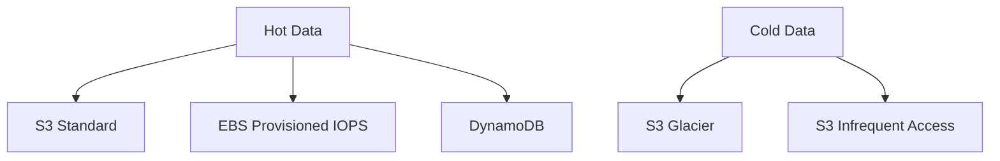
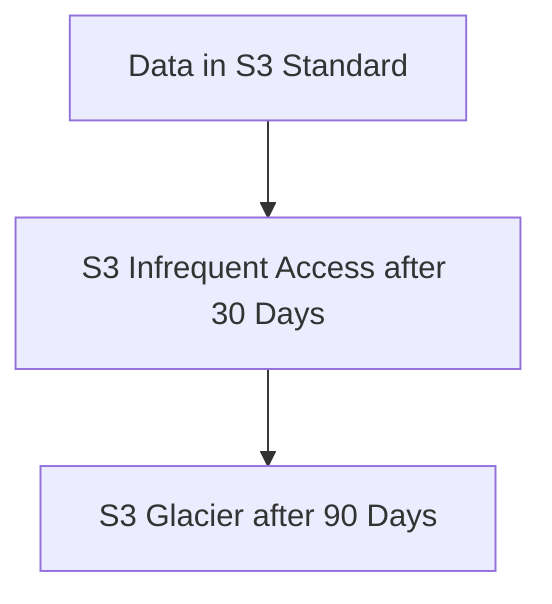
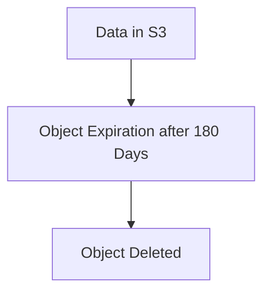
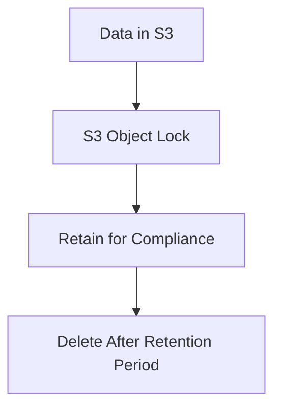
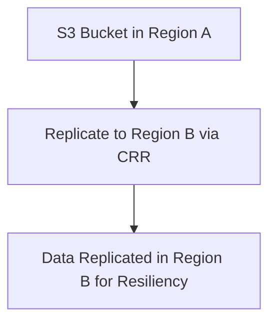
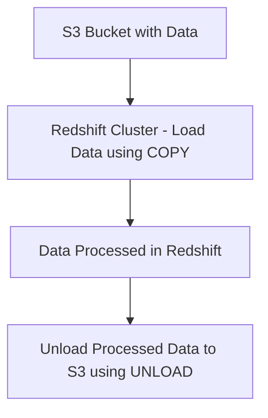
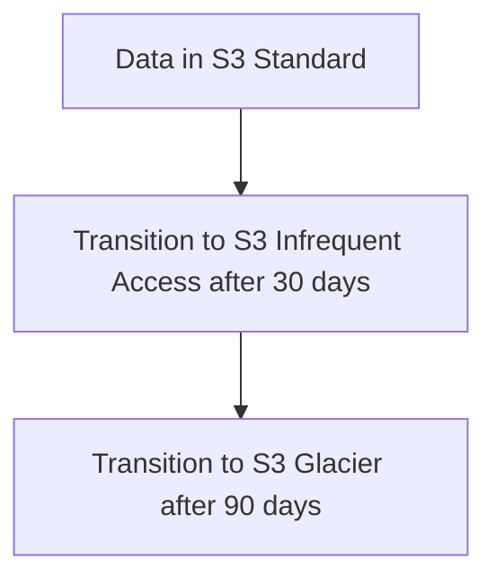
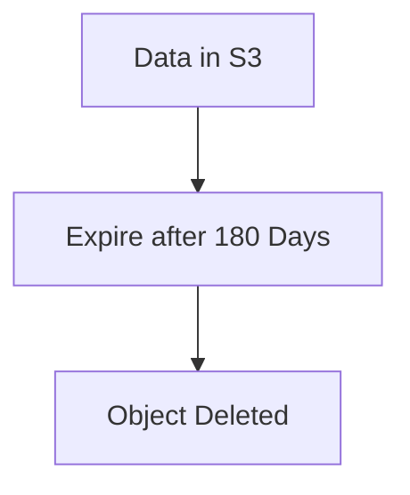
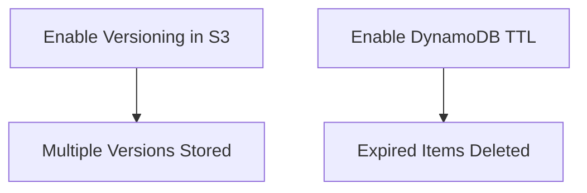

# 2.3: Manage the lifecycle of data

## Knowledge in:

- Appropriate storage solutions to address hot and cold data requirements
- How to optimize the cost of storage based on the data lifecycle
- How to delete data to meet business and legal requirements
- Data retention policies and archiving strategies
- How to protect data with appropriate resiliency and availability

---

### **1. Appropriate Storage Solutions to Address Hot and Cold Data Requirements**

### **Primary Functions:**

AWS provides various storage services optimized for different data access patterns—**hot data** (frequently accessed) and **cold data** (infrequently accessed).

- **Hot Data**: Data that needs fast access with low latency.
    - **Amazon S3 Standard**: Optimized for frequently accessed data with low latency and high throughput.
    - **Amazon EBS (Elastic Block Store)**: Provides high-performance block storage for EC2 instances with options like **gp3** and **Provisioned IOPS** for fast, frequent access.
    - **Amazon DynamoDB**: Low-latency, key-value store designed for high-performance, real-time data.
- **Cold Data**: Data that is rarely accessed but must be retained for long-term storage.
    - **Amazon S3 Glacier** and **S3 Glacier Deep Archive**: Cost-effective storage for long-term archival of data that is rarely retrieved.
    - **Amazon S3 Infrequent Access (IA)**: A lower-cost option for data that is accessed less frequently but still requires rapid retrieval.

### **Patterns (When to Use):**

- Use **S3 Standard** for applications that need frequent access to large data files, such as real-time analytics or content delivery (e.g., videos, images).
- Use **EBS Provisioned IOPS** for low-latency access to databases running on **EC2** instances.
- Use **S3 Glacier** for long-term data retention that needs to be accessed very rarely but still requires durable, highly reliable storage.

### **Antipatterns (When Not to Use):**

- Avoid using **S3 Standard** for archival data that is accessed rarely. The higher cost of S3 Standard does not justify its use for cold data.
- Avoid using **EBS** for static, large-scale data that doesn’t require frequent access, as S3 is more cost-effective for such cases.
- Avoid storing frequently accessed data in **S3 Glacier** or **S3 Infrequent Access**, as retrieval times can take hours and incur retrieval costs.

### **Benefits of Managed vs. Serverless Services:**

- **Managed (EBS, DynamoDB)**:
    - **Performance**: High throughput and low-latency performance for frequently accessed data.
    - **Cost**: Higher cost for continuous usage of provisioned resources (e.g., Provisioned IOPS on EBS).
- **Serverless (S3, Glacier)**:
    - **Scalability**: S3 and Glacier automatically scale to meet storage demands.
    - **Cost**: Lower cost for infrequently accessed data, with tiered pricing models for cold storage.

### **Mermaid Diagram: Storage Solutions for Hot and Cold Data**



### **AWS Documentation Links:**

- [Amazon S3 Storage Classes](https://docs.aws.amazon.com/AmazonS3/latest/dev/storage-class-intro.html)
- [Amazon EBS Documentation](https://docs.aws.amazon.com/ebs/index.html)
- [Amazon S3 Glacier](https://docs.aws.amazon.com/amazonglacier/latest/dev/introduction.html)

---

### **2. How to Optimize the Cost of Storage Based on the Data Lifecycle**

### **Primary Functions:**

Optimizing storage costs involves selecting the appropriate AWS storage class or service based on the lifecycle of the data—from frequent access (hot data) to archival (cold data). Key AWS services for optimizing cost:

- **Amazon S3 Lifecycle Policies**: Allows automatic transitioning of objects between S3 storage classes based on predefined rules (e.g., moving from **S3 Standard** to **S3 Glacier**).
- **Amazon S3 Intelligent-Tiering**: Automatically moves data between frequent and infrequent access tiers based on changing access patterns, with no retrieval costs for accessing infrequent data.

### **Patterns (When to Use):**

- Use **S3 Lifecycle Policies** for large datasets where access frequency declines over time. Automatically transition data from **S3 Standard** to **S3 Infrequent Access** and eventually to **S3 Glacier**.
    - **Example**: Automatically move data from **S3 Standard** to **S3 Glacier** after 90 days of no access.
- Use **S3 Intelligent-Tiering** when data access patterns are unpredictable. It moves data between **frequent** and **infrequent** access tiers based on actual usage, avoiding manual lifecycle configurations.

### **Antipatterns (When Not to Use):**

- Avoid using **S3 Standard** for data that becomes cold after a known period of time. Instead, set up lifecycle rules to transition data to **S3 Glacier** or **S3 IA** to save on costs.
- Avoid using **S3 Intelligent-Tiering** for small datasets, as the per-object monitoring costs may outweigh the benefits for smaller data sets.

### **Benefits of Managed vs. Serverless Services:**

- **Managed (Lifecycle Policies)**:
    - **Control**: Allows full control over when and how data is transitioned between storage classes based on custom rules.
    - **Cost**: Saves costs through predefined transitions, especially for predictable data usage patterns.
- **Serverless (Intelligent-Tiering)**:
    - **Simplicity**: No need to manually set up lifecycle rules; S3 automatically adjusts storage tiers based on usage.
    - **Cost**: Suitable for large datasets with fluctuating access patterns, offering cost savings over manual approaches.

### **Mermaid Diagram: S3 Lifecycle Management**



### **AWS Documentation Links:**

- [S3 Lifecycle Policies](https://docs.aws.amazon.com/AmazonS3/latest/dev/object-lifecycle-mgmt.html)
- [S3 Intelligent-Tiering](https://docs.aws.amazon.com/AmazonS3/latest/dev/storage-class-intro.html#sc-dynamic-data-access)

---

### **3. How to Delete Data to Meet Business and Legal Requirements**

### **Primary Functions:**

Data deletion policies are crucial for compliance with legal and regulatory requirements, such as GDPR, HIPAA, or internal company policies. AWS services provide mechanisms to automate and secure data deletion:

- **Amazon S3 Object Expiration**: Enables automatic deletion of objects after a specified period.
- **AWS Backup**: Provides centralized backup management and retention policies, including the option to automatically delete backups after retention periods.
- **AWS Identity and Access Management (IAM)**: Controls who can delete data by enforcing strict access controls and permission policies.

### **Patterns (When to Use):**

- Use **S3 Object Expiration** to automatically delete old or obsolete objects after a certain time period.
    - **Example**: Set an expiration policy for logs stored in **S3** to delete them after 180 days to meet internal data retention policies.
- Use **AWS Backup** to create deletion policies for snapshots of databases or file systems to ensure old backups are deleted after a specified retention period.

### **Antipatterns (When Not to Use):**

- Avoid manually deleting data without tracking the deletion for compliance purposes. Use **automated policies** to ensure deletion is consistent and auditable.
- Avoid setting overly short retention periods in environments where legal requirements necessitate long-term storage (e.g., financial records).

### **Benefits of Managed vs. Serverless Services:**

- **Managed (AWS Backup)**:
    - **Automation**: Automatically applies deletion policies to backups and other data resources, ensuring compliance.
    - **Cost**: Reduces costs by automatically cleaning up outdated backups.
- **Serverless (S3 Object Expiration)**:
    - **Simplicity**: Automatically deletes S3 objects after a certain period with no additional infrastructure management.
    - **Cost**: Eliminates costs for obsolete or expired data storage.

### **Mermaid Diagram: S3 Object Expiration Policy**



### **AWS Documentation Links:**

- [Amazon S3 Object Expiration](https://docs.aws.amazon.com/AmazonS3/latest/dev/object-lifecycle-mgmt.html#lifecycle-expire-object)
- [AWS Backup](https://docs.aws.amazon.com/aws-backup/index.html)

---

### **4. Data Retention Policies and Archiving Strategies**

### **Primary Functions:**

Data retention policies define how long data should be kept and when it should be deleted or archived. Archiving strategies ensure data is moved to lower-cost storage once it becomes inactive. Key services for implementing these strategies include:

- **Amazon S3 Glacier**: Long-term archival storage designed for infrequent access but requiring high durability.
- **AWS Backup Retention Policies**: Manages the lifecycle of backups across AWS services, ensuring data is retained or deleted based on regulatory or business needs.
- **Amazon S3 Object Lock**: Prevents the deletion of S3 objects

to enforce retention policies for regulatory compliance.

### **Patterns (When to Use):**

- Use **AWS Backup Retention Policies** to enforce long-term retention of backups and snapshots to comply with legal requirements (e.g., financial records stored for 7 years).
- Use **S3 Object Lock** for compliance with regulations that require data to be immutable for a set period (e.g., **WORM** storage for healthcare data).
- Use **S3 Glacier** for archiving data that must be retained but rarely accessed, like old customer records or regulatory documents.

### **Antipatterns (When Not to Use):**

- Avoid storing archival data in **S3 Standard**, as it is more expensive than **Glacier** or **Glacier Deep Archive**.
- Avoid using **S3 Object Lock** for data that requires frequent updates, as it makes the objects immutable.

### **Benefits of Managed vs. Serverless Services:**

- **Managed (AWS Backup, S3 Glacier)**:
    - **Automation**: Backup retention policies automatically ensure data is archived and retained as required.
    - **Cost**: Glacier provides very low-cost storage for archived data, while **AWS Backup** automates the retention and deletion process.
- **Serverless (S3 Object Lock)**:
    - **Simplicity**: Ensures compliance with regulatory requirements by preventing the deletion of data within the retention period.
    - **Cost**: Cost-effective for regulatory data that must remain immutable for long periods.

### **Mermaid Diagram: S3 Object Lock for Data Retention**



### **AWS Documentation Links:**

- [Amazon S3 Object Lock](https://docs.aws.amazon.com/AmazonS3/latest/dev/object-lock.html)
- [AWS Backup Retention Policies](https://docs.aws.amazon.com/aws-backup/latest/devguide/creating-backup-plan.html)

---

### **5. How to Protect Data with Appropriate Resiliency and Availability**

### **Primary Functions:**

Protecting data with appropriate resiliency and availability ensures that data remains accessible and recoverable in the event of failures or disasters. AWS offers various services and strategies to ensure high availability and durability:

- **Amazon S3**: Designed for **99.999999999% (11 nines)** durability and availability across multiple Availability Zones.
- **Amazon S3 Cross-Region Replication (CRR)**: Automatically replicates objects across AWS regions for disaster recovery and improved resiliency.
- **Amazon EBS Snapshots**: Provides point-in-time snapshots of EBS volumes for backup and disaster recovery.
- **AWS Backup**: Centralized backup solution for managing data protection across AWS services like **RDS**, **EFS**, and **EBS**.

### **Patterns (When to Use):**

- Use **S3 Cross-Region Replication (CRR)** for disaster recovery when you need to replicate critical data to another region to ensure availability in the event of regional failures.
- Use **AWS Backup** to automate backups of EC2 instances, databases (RDS), and file systems (EFS) to ensure data recovery in case of accidental deletion or corruption.

### **Antipatterns (When Not to Use):**

- Avoid using **S3 Cross-Region Replication** for non-critical data that doesn’t need to be highly available across multiple regions, as it increases storage and transfer costs.
- Avoid manually managing backups of individual resources when **AWS Backup** can automate this process.

### **Benefits of Managed vs. Serverless Services:**

- **Managed (CRR, AWS Backup)**:
    - **Resiliency**: **Cross-Region Replication** ensures data availability across multiple geographic locations for disaster recovery.
    - **Automation**: AWS Backup automates the process of backing up resources, ensuring consistency and reducing manual overhead.
- **Serverless (S3, EBS Snapshots)**:
    - **Scalability**: S3 provides durable, highly available storage without any need for managing infrastructure.
    - **Cost**: Cost-effective for scalable, durable storage across AWS regions with minimal manual intervention.

### **Mermaid Diagram: S3 Cross-Region Replication**



### **AWS Documentation Links:**

- [Amazon S3 Cross-Region Replication](https://docs.aws.amazon.com/AmazonS3/latest/dev/crr.html)
- [Amazon EBS Snapshots](https://docs.aws.amazon.com/AWSEC2/latest/UserGuide/EBSSnapshots.html)

---

## Skills in:

- Performing load and unload operations to move data between Amazon S3 and Amazon Redshift
- Managing S3 Lifecycle policies to change the storage tier of S3 data
- Expiring data when it reaches a specific age by using S3 Lifecycle policies
- Managing S3 versioning and DynamoDB TTL

---

### **1. Performing Load and Unload Operations to Move Data Between Amazon S3 and Amazon Redshift**

### **Detailed Steps/Exercises:**

### **Exercise 1: Loading Data from Amazon S3 to Amazon Redshift**

1. **Create an S3 Bucket**:
    - In the **S3 Console**, create a bucket to store your CSV or Parquet data.
    - Upload the data files into the bucket.
2. **Create a Redshift Cluster**:
    - In the **Amazon Redshift Console**, create a new cluster. Use **dc2.large** instance types for performance testing or **RA3 nodes** for scalable storage.
    - Set up the **IAM Role** that allows Redshift to access S3.
3. **Set Up the IAM Role and Attach Permissions**:
    - Create an **IAM Role** for Redshift with the **AmazonS3ReadOnlyAccess** policy.
    - Attach this IAM role to your Redshift cluster.
4. **Create a Redshift Table**:
    - In **Redshift Query Editor** or using SQL client tools (e.g., **psql**), create the destination table.
    
    ```sql
    CREATE TABLE sales_data (
      sale_id INT,
      sale_date DATE,
      product_name VARCHAR(100),
      sale_amount DECIMAL(10,2)
    );
    
    ```
    
5. **Copy Data from S3 into Redshift**:
    - Use the **COPY** command in Redshift to load data from S3 into the Redshift table.
    
    ```sql
    COPY sales_data
    FROM 's3://my-bucket/sales-data.csv'
    IAM_ROLE 'arn:aws:iam::account-id:role/MyRedshiftRole'
    CSV;
    
    ```
    

### **Exercise 2: Unloading Data from Amazon Redshift to Amazon S3**

1. **Unload Data to S3**:
    - Use the **UNLOAD** command to export data from Redshift back to an S3 bucket in a desired format (e.g., **CSV** or **Parquet**).
    
    ```sql
    UNLOAD ('SELECT * FROM sales_data')
    TO 's3://my-bucket/sales-data-unload/'
    IAM_ROLE 'arn:aws:iam::account-id:role/MyRedshiftRole'
    FORMAT AS PARQUET;
    
    ```
    
2. **Verify the Exported Data in S3**:
    - Check the S3 bucket to ensure that the unloaded data has been written in the specified format.

### **Mermaid Diagram: Load and Unload Between S3 and Redshift**



### **AWS Documentation Links:**

- [Amazon Redshift COPY Command](https://docs.aws.amazon.com/redshift/latest/dg/r_COPY.html)
- [Amazon Redshift UNLOAD Command](https://docs.aws.amazon.com/redshift/latest/dg/r_UNLOAD.html)

### **Use Case Scenarios:**

- Loading raw data from **S3** into **Redshift** for large-scale analytics and reporting.
- Exporting processed data from **Redshift** to **S3** for archival or integration with other systems (e.g., data lakes or downstream analytics tools).

### **Common Pitfalls or Challenges:**

- **Challenge**: Incorrect IAM role permissions can prevent Redshift from accessing S3.
    - **Solution**: Ensure the IAM role attached to Redshift has **AmazonS3ReadOnlyAccess** and is correctly referenced in the **COPY** and **UNLOAD** commands.
- **Challenge**: Large datasets can lead to slow data loading.
    - **Solution**: Use proper data distribution keys and sort keys to optimize table performance, and consider using the **gzip** compression format for data files in S3.

---

### **2. Managing S3 Lifecycle Policies to Change the Storage Tier of S3 Data**

### **Detailed Steps/Exercises:**

### **Exercise 3: Implementing an S3 Lifecycle Policy**

1. **Create an S3 Bucket**:
    - In the **S3 Console**, create a bucket to store your data.
    - Upload data to the bucket that will transition to different storage classes over time.
2. **Set Up a Lifecycle Policy**:
    - In the S3 bucket’s **Management** tab, go to **Lifecycle Rules** and create a new rule.
    - Define the rule to transition data between storage classes:
        - Transition to **S3 Infrequent Access** after 30 days.
        - Transition to **S3 Glacier** after 90 days.
    - Example CLI for Lifecycle Policy:
        
        ```bash
        aws s3api put-bucket-lifecycle-configuration --bucket my-bucket --lifecycle-configuration file://lifecycle.json
        
        ```
        
        Example `lifecycle.json`:
        
        ```json
        {
          "Rules": [
            {
              "ID": "Move to IA and Glacier",
              "Prefix": "",
              "Status": "Enabled",
              "Transitions": [
                {
                  "Days": 30,
                  "StorageClass": "STANDARD_IA"
                },
                {
                  "Days": 90,
                  "StorageClass": "GLACIER"
                }
              ]
            }
          ]
        }
        
        ```
        
3. **Monitor the Transition**:
    - Verify that objects in the bucket transition to **S3 IA** after 30 days and to **S3 Glacier** after 90 days.

### **Mermaid Diagram: S3 Lifecycle Policy for Storage Tiering**



### **AWS Documentation Links:**

- [Amazon S3 Lifecycle Policies](https://docs.aws.amazon.com/AmazonS3/latest/dev/lifecycle-configuration-examples.html)

### **Use Case Scenarios:**

- Automatically manage data storage costs by transitioning less frequently accessed data from **S3 Standard** to **S3 Infrequent Access** and then to **S3 Glacier**.

### **Common Pitfalls or Challenges:**

- **Challenge**: Misconfiguring lifecycle rules can lead to early data transitions or data remaining in the wrong storage class.
    - **Solution**: Thoroughly test the lifecycle policy on test buckets to ensure correct behavior before applying it to production datasets.

---

### **3. Expiring Data When It Reaches a Specific Age by Using S3 Lifecycle Policies**

### **Detailed Steps/Exercises:**

### **Exercise 4: Configuring an S3 Expiration Policy**

1. **Create an S3 Bucket**:
    - In the **S3 Console**, create a bucket for storing temporary data (e.g., logs or backups).
2. **Set Up a Lifecycle Expiration Rule**:
    - Go to the **Management** tab of the bucket and set a new **Lifecycle Rule**.
    - Define an expiration rule to delete objects after a specific time period, such as 180 days.
    - Example CLI for Expiration Rule:
        
        ```bash
        aws s3api put-bucket-lifecycle-configuration --bucket my-bucket --lifecycle-configuration file://expiration.json
        
        ```
        
        Example `expiration.json`:
        
        ```json
        {
          "Rules": [
            {
              "ID": "Expire after 180 days",
              "Prefix": "",
              "Status": "Enabled",
              "Expiration": {
                "Days": 180
              }
            }
          ]
        }
        
        ```
        
3. **Monitor Data Deletion**:
    - After 180 days, verify that the objects in the bucket are automatically deleted as per the expiration rule.

### **Mermaid Diagram: S3 Data Expiration Lifecycle Policy**



### **AWS Documentation Links:**

- [Amazon S3 Object Expiration](https://docs.aws.amazon.com/AmazonS3/latest/dev/object-lifecycle-mgmt.html#lifecycle-expire-object)

### **Use Case Scenarios:**

- Automatically delete temporary files, logs, or backups after a specified period to comply with business rules or reduce storage costs.

### **Common Pitfalls or Challenges:**

- **Challenge**: Objects that need to be retained may be deleted prematurely.
    - **Solution**: Clearly define and test expiration policies in non-production environments before applying them to critical buckets.

---

### **4. Managing S3 Versioning and DynamoDB TTL**

### **Detailed Steps/Exercises:**

### **Exercise 5: Managing S3 Versioning**

1. **Enable Versioning on an S3 Bucket**:
    - In the **S3 Console**, navigate to the bucket where you want to enable versioning.
    - Go to the **Properties** tab and enable **Versioning**.
2. **Upload Multiple Versions of the Same Object**:
    - Upload a file (e.g., `data.csv`) multiple times to

the same bucket. Each upload will create a new version.

- Use the CLI to upload new versions:
    
    ```bash
    aws s3 cp data.csv s3://my-versioned-bucket/data.csv
    
    ```
    
1. **Access Specific Versions of the Object**:
    - List versions of the object using the CLI:
        
        ```bash
        aws s3api list-object-versions --bucket my-versioned-bucket --prefix data.csv
        
        ```
        
2. **Restore or Delete Specific Versions**:
    - Use the **DeleteMarker** or **Restore** functionality to manage object versions.

### **Exercise 6: Managing DynamoDB TTL**

1. **Enable TTL on a DynamoDB Table**:
    - In the **DynamoDB Console**, select your table and enable **TTL**. Choose a **TTL attribute** (e.g., `expirationTime`).
    - Example of setting the **expirationTime** attribute for an item:
        
        ```bash
        aws dynamodb put-item --table-name myTable --item '{"ID": {"S": "123"}, "expirationTime": {"N": "1640995200"}}'
        
        ```
        
2. **Verify Expired Items Are Deleted**:
    - After the expiration timestamp is reached, verify that the expired items are automatically deleted by DynamoDB.

### **Mermaid Diagram: S3 Versioning and DynamoDB TTL**



### **AWS Documentation Links:**

- [Amazon S3 Versioning](https://docs.aws.amazon.com/AmazonS3/latest/userguide/Versioning.html)
- [DynamoDB TTL Documentation](https://docs.aws.amazon.com/amazondynamodb/latest/developerguide/TTL.html)

### **Use Case Scenarios:**

- **S3 Versioning**: Keep track of changes to objects, allowing you to roll back to previous versions if necessary.
- **DynamoDB TTL**: Automatically remove expired items from a DynamoDB table, reducing storage costs and maintaining performance.

### **Common Pitfalls or Challenges:**

- **Challenge**: Versioning can increase storage costs due to multiple versions being stored.
    - **Solution**: Set up a lifecycle policy to delete older versions after a certain period.
- **Challenge**: Misconfigured TTL values may result in premature data deletion in DynamoDB.
    - **Solution**: Carefully test TTL settings in a staging environment before applying them to production datasets.

---