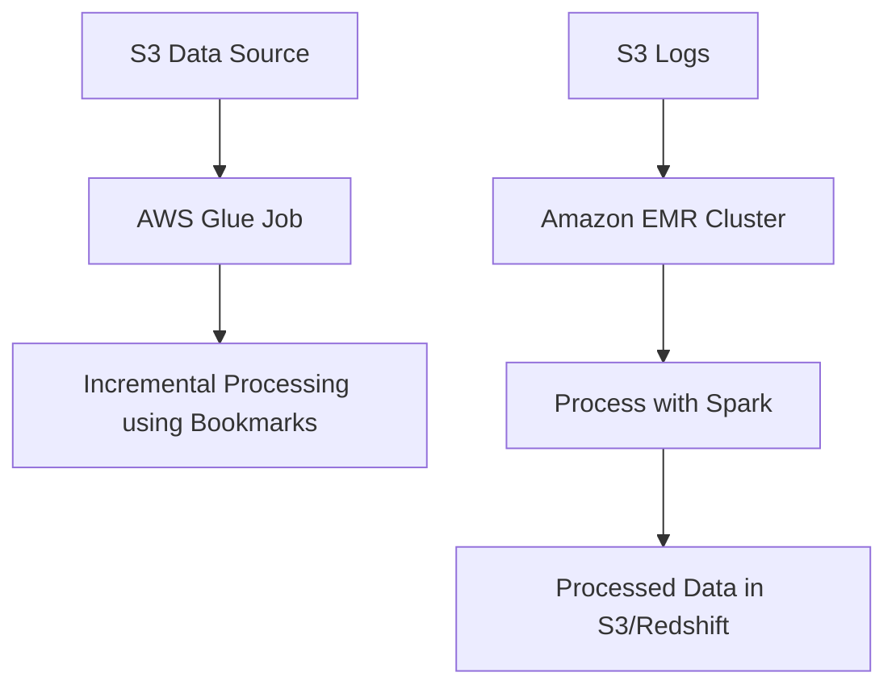
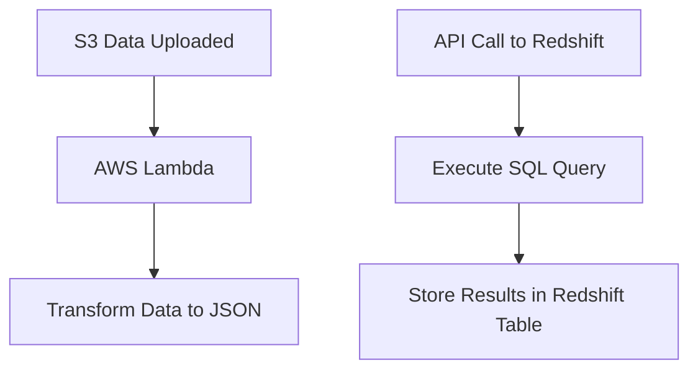
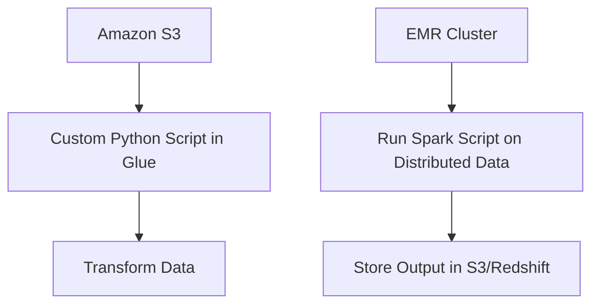
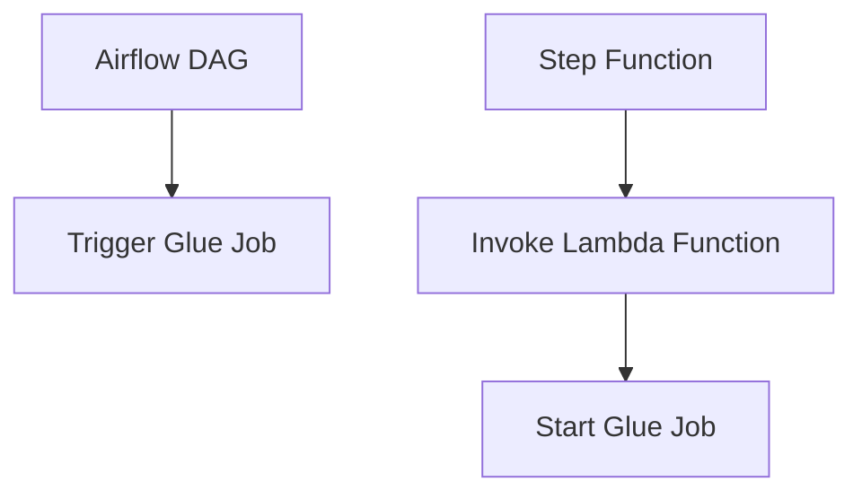
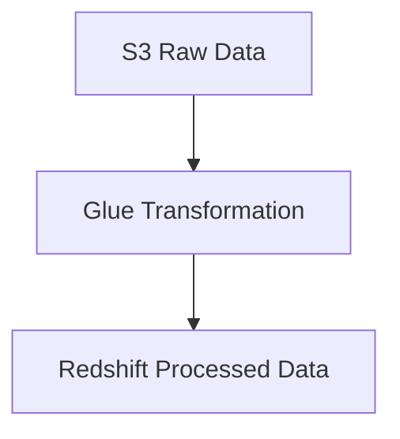

# 3.1: Automate data processing by using AWS services

## Knowledge of:

- How to maintain and troubleshoot data processing for repeatable business outcomes
- API calls for data processing
- Which services accept scripting (for example, Amazon EMR, Amazon Redshift, AWS Glue)

---

### **1. How to Maintain and Troubleshoot Data Processing for Repeatable Business Outcomes**

### **Primary Functions:**

Maintaining and troubleshooting data processing workflows involves ensuring that data pipelines are reliable, efficient, and capable of producing consistent business outcomes. AWS services like **AWS Glue**, **Amazon EMR**, and **Amazon Redshift** are widely used for data processing and ETL (Extract, Transform, Load) tasks. Common responsibilities include:

- **Monitoring Pipelines**: Using services like **Amazon CloudWatch**, **AWS Glue Job Bookmarks**, and **AWS Step Functions** to track the health of ETL jobs.
- **Error Handling**: Handling failures and data anomalies with retries, data validation, and backup processes.
- **Automation**: Scheduling jobs with **Amazon EventBridge** or **AWS Glue Workflows** to ensure data is processed on time and with the same logic.

### **Patterns (When to Use):**

- Use **AWS Glue Job Bookmarks** to ensure data is processed incrementally, without reprocessing the entire dataset on subsequent job runs.
    - **Example**: For a daily ETL job that processes new data in an S3 bucket, Glue bookmarks will only process the files that arrived after the previous run.
- Use **Amazon EMR** for processing large datasets that require distributed computing frameworks like **Apache Hadoop** or **Apache Spark**.
    - **Example**: A company running a data pipeline that transforms terabytes of web logs using Spark.

### **Antipatterns (When Not to Use):**

- Avoid running ETL processes without implementing robust monitoring. Without monitoring, pipeline failures may go unnoticed, leading to inconsistent business outcomes.
- Avoid using **Amazon EMR** for small-scale data processing. For simple ETL tasks, **AWS Glue** or **AWS Lambda** may be more cost-effective.

### **Benefits of Managed vs. Serverless Services:**

- **Managed (Amazon EMR, Amazon Redshift)**:
    - **Scalability**: EMR and Redshift are highly scalable, but they require cluster management and provisioning, which can add complexity.
    - **Cost**: Managed clusters like EMR or Redshift require provisioning costs, especially for large-scale data, though Reserved Instances can reduce costs.
- **Serverless (AWS Glue, AWS Lambda)**:
    - **Simplicity**: Glue and Lambda are serverless and do not require cluster management, making them easier to manage and scale automatically based on workload.
    - **Cost**: Serverless solutions offer pay-per-use pricing, which is typically more cost-efficient for sporadic workloads or small data processing tasks.

### **Mermaid Diagram: Data Processing with AWS Glue and Amazon EMR**



### **AWS Documentation Links:**

- [AWS Glue Bookmarks](https://docs.aws.amazon.com/glue/latest/dg/monitor-continuations.html)
- [Amazon EMR Documentation](https://docs.aws.amazon.com/emr/index.html)
- [AWS Redshift Documentation](https://docs.aws.amazon.com/redshift/index.html)

### **Use Case Scenarios:**

- Maintaining a daily ETL pipeline in **AWS Glue** that processes data incrementally from **S3** into **Amazon Redshift** for analytical reporting.
- Using **Amazon EMR** for processing and transforming massive datasets (e.g., web logs) with Spark for machine learning models or analytical workloads.

### **Common Pitfalls or Challenges:**

- **Challenge**: ETL jobs may fail due to data schema changes or resource constraints.
    - **Solution**: Set up robust error handling in Glue and EMR, and use **CloudWatch Alarms** to alert when jobs fail or experience resource bottlenecks.

---

### **2. API Calls for Data Processing**

### **Primary Functions:**

Many AWS services provide APIs that can be called to trigger data processing tasks or manage workflows programmatically. These APIs allow engineers to integrate AWS services into automated pipelines or trigger them based on external events.

Key AWS services for API-driven data processing:

- **AWS Lambda**: Executes code in response to events, such as **S3 object creation**, **DynamoDB table updates**, or **API Gateway requests**.
- **Amazon Redshift**: Provides an API for querying data and running SQL commands via the **Redshift Data API**.
- **AWS Glue**: Offers a **Python SDK** and **Boto3** integration to start and manage jobs, crawlers, and workflows programmatically.

### **Patterns (When to Use):**

- Use **AWS Lambda** for lightweight, event-driven data processing tasks, such as transforming or filtering S3 data when a new object is uploaded.
    - **Example**: A Lambda function automatically transforms incoming CSV data into JSON when new files are added to an S3 bucket.
- Use the **Redshift Data API** to execute queries programmatically without managing persistent connections to the Redshift cluster.
    - **Example**: A data pipeline that runs daily aggregation queries in Redshift via an API call from a **Step Function**.

### **Antipatterns (When Not to Use):**

- Avoid overusing Lambda for large data transformations. **AWS Glue** or **EMR** is better suited for ETL tasks involving large datasets or complex transformations.
- Avoid using direct **Redshift API calls** for frequent or real-time queries. Use **Redshift Query Editor** for ad-hoc querying and **Amazon Athena** for interactive queries on S3 data.

### **Benefits of Managed vs. Serverless Services:**

- **Managed (Amazon Redshift)**:
    - **Integration**: Redshift’s managed environment is integrated with the **Redshift Data API**, allowing users to run SQL queries without needing a database connection.
    - **Cost**: There is a cost associated with keeping the Redshift cluster running, but Reserved Instances or serverless Redshift versions can help reduce costs.
- **Serverless (AWS Lambda, Athena)**:
    - **Simplicity**: Lambda and Athena provide fully managed, serverless environments for running event-driven functions and SQL queries, without the need for provisioning resources.
    - **Cost**: Pay-per-execution pricing in Lambda or per-query pricing in Athena offers low-cost, highly scalable options for data processing.

### **Mermaid Diagram: API-Driven Data Processing with Lambda and Redshift**



### **AWS Documentation Links:**

- [AWS Lambda Documentation](https://docs.aws.amazon.com/lambda/index.html)
- [Amazon Redshift Data API](https://docs.aws.amazon.com/redshift/latest/mgmt/data-api.html)

### **Use Case Scenarios:**

- Using **Lambda** to automatically transform and load data into **Amazon Redshift** when a new object is added to **S3**.
- Running batch queries in **Redshift** using API calls from **AWS Step Functions**, integrated with ETL workflows.

### **Common Pitfalls or Challenges:**

- **Challenge**: Lambda has a limited execution time (up to 15 minutes) and can time out for long-running tasks.
    - **Solution**: Use **AWS Glue** or **EMR** for heavy ETL workloads, and reserve Lambda for lightweight or event-driven tasks.

---

### **3. Which Services Accept Scripting (for example, Amazon EMR, Amazon Redshift, AWS Glue)**

### **Primary Functions:**

Several AWS data processing services allow users to execute custom scripts for complex transformations, data processing, and analysis. The main services include:

- **Amazon EMR**: Supports custom scripts in **Apache Spark**, **Hadoop**, **Presto**, and **Hive** for processing large-scale data.
- **AWS Glue**: Allows you to write **Python** and **Scala** scripts for ETL processes using Glue’s managed Apache Spark environment.
- **Amazon Redshift**: Supports custom **SQL** queries for complex data transformations and **Stored Procedures** to manage transaction logic.

### **Patterns (When to Use):**

- Use **Amazon EMR** for large-scale, distributed data processing that requires custom scripting with **Spark** or **Hadoop**.
    - **Example**: A company processes clickstream data from its website using Spark scripts on an EMR cluster.
- Use **AWS Glue** when you need a managed service for serverless ETL that allows custom scripts in **Python** for transforming and cleaning data.
    - **Example**: Write custom Glue scripts to transform and cleanse incoming sales data before loading it into **Amazon Redshift**.

### **Antipatterns (When Not to Use):**

- Avoid using **EMR** for simple ETL tasks that could be handled with Glue or Lambda. EMR clusters can be more complex to manage and expensive for smaller tasks.
- Avoid running heavy, resource-intensive scripts in **

Lambda**. Instead, use Glue or EMR for larger transformations.

### **Benefits of Managed vs. Serverless Services:**

- **Managed (EMR, Redshift)**:
    - **Flexibility**: Allows you to execute custom scripts and manage complex distributed workloads, but requires you to manage cluster resources.
    - **Cost**: EMR clusters are provisioned resources that incur costs even when idle unless configured for auto-scaling or spot instances.
- **Serverless (Glue)**:
    - **Simplicity**: Glue automatically scales based on your script’s workload and offers managed Apache Spark for ETL tasks, making it easier to deploy and manage.
    - **Cost**: Glue is a pay-per-use service, charging based on the duration of your ETL jobs.

### **Mermaid Diagram: Scripting in AWS Glue and EMR**



### **AWS Documentation Links:**

- [AWS Glue ETL Scripts](https://docs.aws.amazon.com/glue/latest/dg/aws-glue-programming-etl.html)
- [Amazon EMR Documentation](https://docs.aws.amazon.com/emr/index.html)

### **Use Case Scenarios:**

- **Amazon EMR**: Running large-scale data analytics jobs using custom **Spark** scripts for transforming, filtering, and aggregating data in distributed datasets.
- **AWS Glue**: Writing Python or Scala ETL scripts to process raw data in **S3**, clean it, and load it into **Amazon Redshift** or another target.

### **Common Pitfalls or Challenges:**

- **Challenge**: Managing resources in **EMR** can become complex as clusters grow in size or use multiple instance types.
    - **Solution**: Use **EMR Auto Scaling** or manage the cluster lifecycle efficiently using **EMR on Spot Instances** to reduce costs.
- **Challenge**: Glue script debugging can be difficult due to the distributed nature of Spark jobs.
    - **Solution**: Use **AWS Glue Development Endpoints** for interactive development and testing of ETL scripts.

---

## Skills in:

- Orchestrating data pipelines (for example, Amazon MWAA, Step Functions)
- Troubleshooting Amazon managed workflows
- Calling SDKs to access Amazon features from code
- Using the features of AWS services to process data (for example, Amazon EMR, Amazon Redshift, AWS Glue)
- Consuming and maintaining data APIs
- Preparing data transformation (for example, AWS Glue DataBrew)
- Querying data (for example, Amazon Athena)
- Using Lambda to automate data processing
- Managing events and schedulers (for example, EventBridge)

---

### **1. Orchestrating Data Pipelines (Amazon MWAA, Step Functions)**

### **Detailed Steps/Exercises:**

### **Exercise 1: Orchestrating Data Pipelines with Amazon Managed Workflows for Apache Airflow (MWAA)**

1. **Set Up MWAA Environment**:
    - In the **AWS Management Console**, navigate to **Amazon MWAA** and create a new environment.
    - Specify the **S3** bucket where your Airflow DAGs will be stored.
    - Define an **IAM Role** with access to **S3**, **Glue**, and other services involved in the workflow.
2. **Upload a DAG to S3**:
    - Create a simple **Apache Airflow DAG** that orchestrates a Glue job.
    - Example DAG code:
    
    ```python
    from airflow import DAG
    from airflow.operators.python_operator import PythonOperator
    from datetime import datetime
    import boto3
    
    def trigger_glue_job():
        glue = boto3.client('glue')
        response = glue.start_job_run(JobName='my-glue-job')
        print(response)
    
    default_args = {'start_date': datetime(2023, 1, 1)}
    dag = DAG('trigger_glue_pipeline', default_args=default_args, schedule_interval='@daily')
    
    trigger_glue_task = PythonOperator(task_id='trigger_glue', python_callable=trigger_glue_job, dag=dag)
    
    ```
    
3. **Monitor DAG Execution**:
    - Upload the DAG to the **S3** bucket linked to MWAA.
    - In the **Airflow Web UI**, trigger the DAG manually or allow it to run based on the scheduled interval.

### **Exercise 2: Orchestrating Data Pipelines with AWS Step Functions**

1. **Create a Step Functions Workflow**:
    - In the **AWS Step Functions Console**, create a new state machine.
    - Define steps to orchestrate multiple services, like **AWS Lambda**, **Glue**, and **S3**.
2. **Define Workflow JSON**:
    - Example JSON definition for a Step Functions workflow:
    
    ```json
    {
      "StartAt": "Invoke Lambda",
      "States": {
        "Invoke Lambda": {
          "Type": "Task",
          "Resource": "arn:aws:lambda:region:account-id:function:myLambdaFunction",
          "Next": "Start Glue Job"
        },
        "Start Glue Job": {
          "Type": "Task",
          "Resource": "arn:aws:states:::glue:startJobRun.sync",
          "Parameters": {
            "JobName": "my-glue-job"
          },
          "End": true
        }
      }
    }
    
    ```
    
3. **Test the Workflow**:
    - Trigger the workflow and monitor each step using the **Step Functions Console**.

### **Mermaid Diagram: Orchestrating a Data Pipeline with MWAA and Step Functions**



### **AWS Documentation Links:**

- [Amazon MWAA Documentation](https://docs.aws.amazon.com/mwaa/index.html)
- [AWS Step Functions Documentation](https://docs.aws.amazon.com/step-functions/index.html)

### **Use Case Scenarios:**

- **MWAA**: Orchestrating complex, long-running workflows where DAGs (Directed Acyclic Graphs) are used to manage dependencies and schedule jobs.
- **Step Functions**: Managing serverless workflows to chain multiple AWS services (Lambda, Glue, S3) for orchestrating ETL tasks.

### **Common Pitfalls or Challenges:**

- **Challenge**: MWAA DAGs may fail due to permission issues.
    - **Solution**: Ensure that the correct IAM roles are assigned to the MWAA environment and that DAGs have proper permissions to access AWS resources.

---

### **2. Troubleshooting Amazon Managed Workflows**

### **Detailed Steps/Exercises:**

### **Exercise 3: Troubleshooting Amazon MWAA**

1. **Enable Logging in MWAA**:
    - In the **Amazon MWAA Console**, configure **CloudWatch Logs** for DAG processing, task execution, and web server logs.
2. **Monitor DAG Failures**:
    - Use **CloudWatch Logs** to identify issues in the DAG execution, such as missing dependencies or misconfigured Python scripts.
3. **Retry Failed Tasks**:
    - Configure automatic retries for tasks in the DAG definition:
    
    ```python
    trigger_glue_task = PythonOperator(
        task_id='trigger_glue',
        python_callable=trigger_glue_job,
        retries=3,
        dag=dag
    )
    
    ```
    

### **AWS Documentation Links:**

- [Troubleshooting MWAA](https://docs.aws.amazon.com/mwaa/latest/userguide/troubleshooting.html)

### **Use Case Scenarios:**

- Troubleshooting DAG failures in **MWAA** to ensure that ETL workflows execute correctly.

### **Common Pitfalls or Challenges:**

- **Challenge**: Debugging long-running workflows can be difficult if logs are not enabled.
    - **Solution**: Enable detailed logging in CloudWatch to capture execution details for easier troubleshooting.

---

### **3. Calling SDKs to Access Amazon Features from Code**

### **Detailed Steps/Exercises:**

### **Exercise 4: Calling AWS Glue from Python Using Boto3 SDK**

1. **Install Boto3**:
    - Install the **Boto3** SDK in your Python environment:
    
    ```bash
    pip install boto3
    
    ```
    
2. **Trigger a Glue Job**:
    - Use Boto3 to start an AWS Glue job programmatically:
    
    ```python
    import boto3
    
    glue = boto3.client('glue')
    response = glue.start_job_run(JobName='my-glue-job')
    print(response)
    
    ```
    
3. **Monitor Job Status**:
    - Check the job’s status to confirm completion:
    
    ```python
    status = glue.get_job_run(JobName='my-glue-job', RunId=response['JobRunId'])
    print(status['JobRun']['JobRunState'])
    
    ```
    

### **AWS Documentation Links:**

- [Boto3 Documentation](https://boto3.amazonaws.com/v1/documentation/api/latest/index.html)

### **Use Case Scenarios:**

- Programmatically managing AWS Glue jobs from Python applications or other environments using the **Boto3 SDK**.

### **Common Pitfalls or Challenges:**

- **Challenge**: Misconfigured IAM credentials may result in authorization failures when calling AWS APIs.
    - **Solution**: Ensure the correct AWS credentials are set up with sufficient permissions for the Glue service.

---

### **4. Using AWS Services to Process Data (Amazon EMR, Amazon Redshift, AWS Glue)**

### **Detailed Steps/Exercises:**

### **Exercise 5: Data Processing with AWS Glue**

1. **Create a Glue Job**:
    - In the **AWS Glue Console**, create an ETL job that reads data from **S3**, transforms it, and writes it to **Amazon Redshift**.
    - Define the source and target data stores.
2. **Write Transformation Logic**:
    - Write transformation code in **Python** (PySpark) or **Scala**. Example:
    
    ```python
    import sys
    from pyspark.context import SparkContext
    from awsglue.context import GlueContext
    
    glueContext = GlueContext(SparkContext.getOrCreate())
    input_data = glueContext.create_dynamic_frame.from_catalog(database="my_db", table_name="my_table")
    transformed_data = input_data.drop_fields(['unnecessary_field'])
    glueContext.write_dynamic_frame.from_options(frame=transformed_data, connection_type="redshift", connection_options={"dbtable": "target_table", "database": "redshift_db"})
    
    ```
    
3. **Execute the Job**:
    - Run the job and monitor its status in the **Glue Console**.

### **Mermaid Diagram: Data Processing with AWS Glue**



### **AWS Documentation Links:**

- [AWS Glue Documentation](https://docs.aws.amazon.com/glue/index.html)

### **Use Case Scenarios:**

- Using AWS Glue for processing raw data from **S3** and loading transformed data into **Amazon Redshift** for analytics.

### **Common Pitfalls or Challenges:**

- **Challenge**: Large datasets can cause Glue jobs to fail due to memory limitations.
    - **Solution**: Scale up Glue job capacity (DPUs) or break large datasets into smaller batches.

---

### **5. Consuming and Maintaining Data APIs**

### **Detailed Steps/Exercises:**

### **Exercise 6: Consuming Data APIs with AWS API Gateway**

1. **Create an API in API Gateway**:
    - In the **API Gateway Console**, create a new REST API and define an endpoint that triggers a Lambda function to process data.
2. **Define Lambda Function**:
    - Write a **Lambda** function that consumes the data from the

API and processes it (e.g., inserts into DynamoDB).

```python
import json
import boto3

def lambda_handler(event, context):
    dynamodb = boto3.resource('dynamodb')
    table = dynamodb.Table('my_table')
    table.put_item(Item={'id': event['id'], 'data': event['data']})
    return {'statusCode': 200, 'body': json.dumps('Data processed successfully')}

```

1. **Test the API**:
    - Use **Postman** or another API client to send a request to the API Gateway, triggering the Lambda function.

### **AWS Documentation Links:**

- [Amazon API Gateway Documentation](https://docs.aws.amazon.com/apigateway/index.html)

### **Use Case Scenarios:**

- Creating APIs to consume real-time data, process it with **AWS Lambda**, and store it in DynamoDB.

### **Common Pitfalls or Challenges:**

- **Challenge**: API throttling limits may affect high-traffic environments.
    - **Solution**: Use API Gateway **throttling settings** or **AWS WAF** to prevent overloads.

---

### **6. Querying Data with Amazon Athena**

### **Detailed Steps/Exercises:**

### **Exercise 7: Querying S3 Data Using Athena**

1. **Create a Table in Athena**:
    - In the **Athena Console**, run a query to create a table pointing to data in S3:
    
    ```sql
    CREATE EXTERNAL TABLE my_data (
      id STRING,
      value INT
    ) LOCATION 's3://my-bucket/my-data/'
    FORMAT AS PARQUET;
    
    ```
    
2. **Query Data**:
    - Run a query to retrieve results:
    
    ```sql
    SELECT * FROM my_data WHERE value > 100;
    
    ```
    

### **AWS Documentation Links:**

- [Amazon Athena Documentation](https://docs.aws.amazon.com/athena/index.html)

### **Use Case Scenarios:**

- Querying structured or semi-structured data in **S3** without moving it to a database.

### **Common Pitfalls or Challenges:**

- **Challenge**: Poorly formatted data can cause Athena queries to fail.
    - **Solution**: Ensure that data in S3 follows a consistent format (e.g., **Parquet** or **ORC**) and is properly partitioned for efficient querying.

---

### **7. Automating Data Processing with AWS Lambda**

### **Detailed Steps/Exercises:**

### **Exercise 8: Automating Data Processing with Lambda and S3**

1. **Create a Lambda Function**:
    - Write a Lambda function to process S3 data:
    
    ```python
    import json
    import boto3
    
    def lambda_handler(event, context):
        s3 = boto3.client('s3')
        bucket = event['Records'][0]['s3']['bucket']['name']
        key = event['Records'][0]['s3']['object']['key']
        response = s3.get_object(Bucket=bucket, Key=key)
        print(response['Body'].read())
        return {'statusCode': 200, 'body': json.dumps('Data processed')}
    
    ```
    
2. **Set Up S3 Event Trigger**:
    - In the **S3 Console**, configure an event notification to trigger the Lambda function when new objects are uploaded.
3. **Test the Automation**:
    - Upload a file to S3 and verify that Lambda processes the file.

### **AWS Documentation Links:**

- [AWS Lambda Documentation](https://docs.aws.amazon.com/lambda/index.html)

### **Use Case Scenarios:**

- Automating the processing of incoming data in **S3** using **Lambda** for real-time ETL pipelines.

### **Common Pitfalls or Challenges:**

- **Challenge**: Lambda has a payload size limit (6MB for synchronous requests).
    - **Solution**: For larger files, use **S3** event triggers in combination with **Glue** or **EMR** for large-scale processing.

---

### **8. Managing Events and Schedulers with Amazon EventBridge**

### **Detailed Steps/Exercises:**

### **Exercise 9: Scheduling a Daily Job with EventBridge**

1. **Create a Rule in EventBridge**:
    - In the **EventBridge Console**, create a rule to trigger an event at a specific time (e.g., daily at midnight).
2. **Define Target (Lambda)**:
    - Set a **Lambda** function as the target for the scheduled rule.
3. **Monitor Job Execution**:
    - Verify that the Lambda function is triggered daily as scheduled by checking **CloudWatch Logs**.

### **AWS Documentation Links:**

- [Amazon EventBridge Documentation](https://docs.aws.amazon.com/eventbridge/index.html)

### **Use Case Scenarios:**

- Automating daily jobs, such as triggering ETL pipelines or generating reports, using **EventBridge**.

### **Common Pitfalls or Challenges:**

- **Challenge**: Time zone discrepancies may cause scheduling issues.
    - **Solution**: Ensure that the correct time zone and cron expressions are used when setting up EventBridge rules.

---