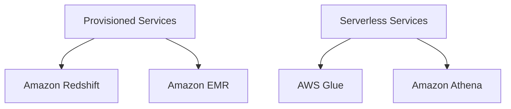
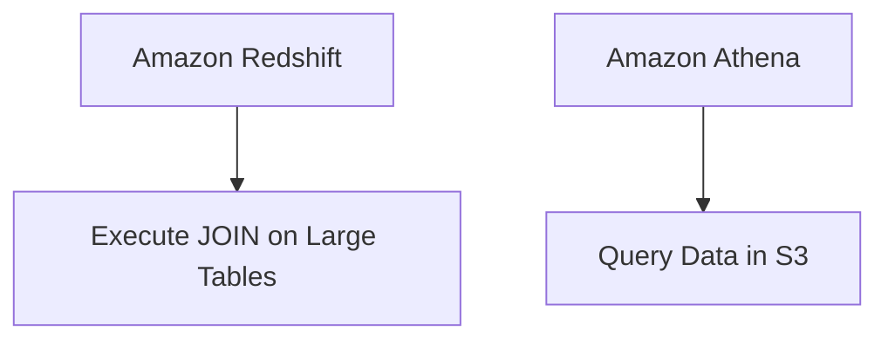
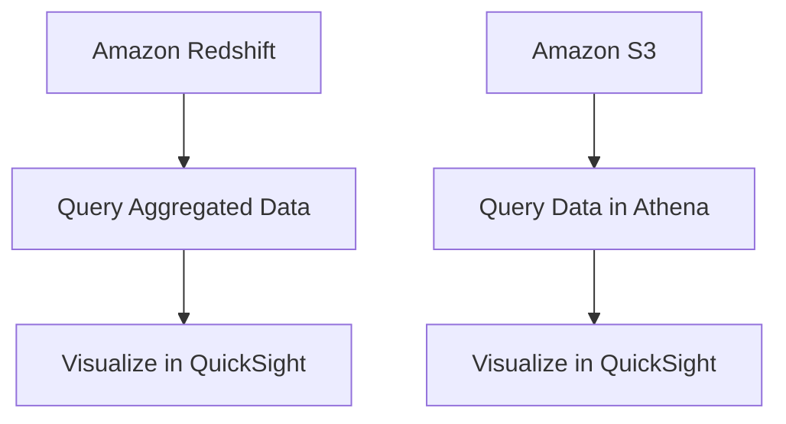
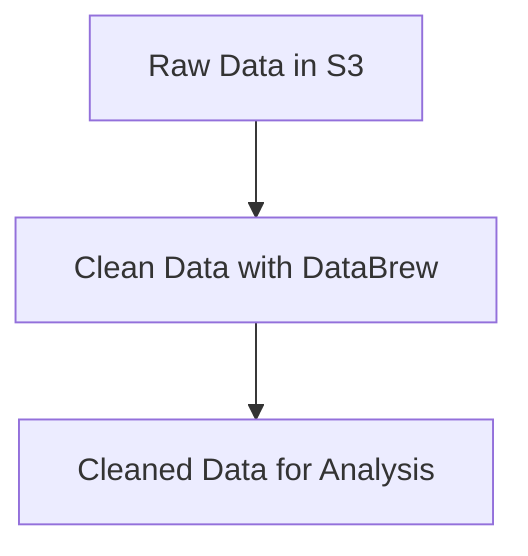
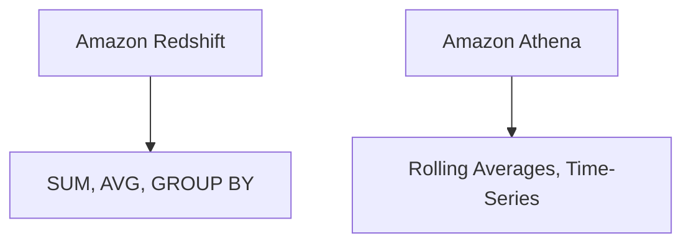
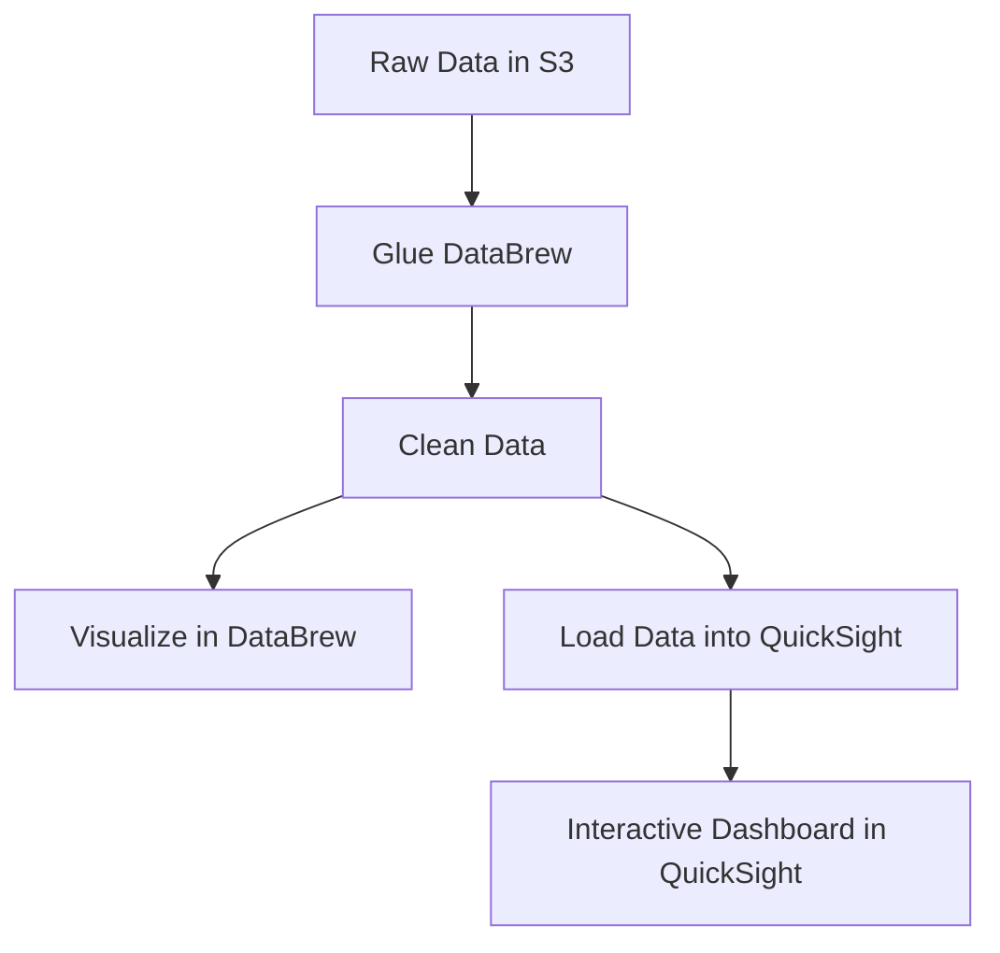
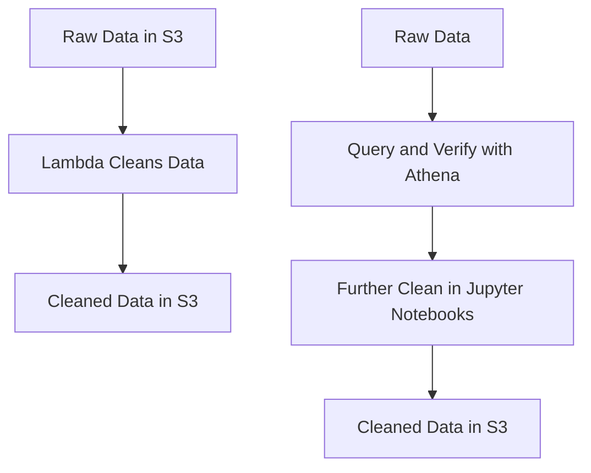
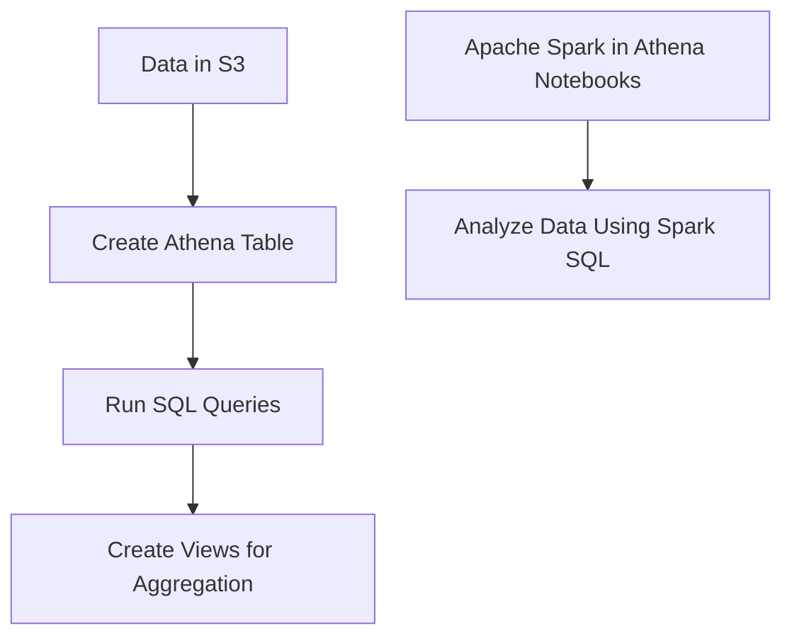

# 3.2: Analyze data by using AWS services

## Knowledge of:

- Tradeoffs between provisioned services and serverless services
- SQL queries (for example, SELECT statements with multiple qualifiers or JOIN clauses)
- How to visualize data for analysis
- When and how to apply cleansing techniques
- Data aggregation, rolling average, grouping, and pivoting

---

### **1. Tradeoffs Between Provisioned Services and Serverless Services**

### **Primary Functions:**

AWS offers both **provisioned** and **serverless** services for data management. The primary difference lies in how resources are allocated and managed.

- **Provisioned Services**: You explicitly provision resources like compute instances, storage, or IOPS, which are billed based on usage or reserved capacity.
    - Example services: **Amazon RDS**, **Amazon Redshift**, **Amazon EMR**.
- **Serverless Services**: Resources are automatically allocated based on demand, with no need for capacity planning, and are billed based on execution time, storage, or request count.
    - Example services: **AWS Lambda**, **Amazon Athena**, **AWS Glue**.

### **Patterns (When to Use):**

- **Provisioned Services**:
    - Use **Amazon Redshift** for consistent, high-performance queries on large-scale relational data where you need fine control over compute and storage resources.
    - Use **Amazon EMR** when running big data frameworks like **Apache Spark** or **Hadoop** for scalable batch processing.
- **Serverless Services**:
    - Use **AWS Glue** for serverless ETL tasks when you need to process data without managing infrastructure.
    - Use **Amazon Athena** for on-demand querying of data stored in **Amazon S3** without managing servers.

### **Antipatterns (When Not to Use):**

- **Provisioned Services**: Avoid using **Amazon EMR** for small-scale or intermittent workloads, as the cost and complexity of managing the cluster outweigh the benefits.
- **Serverless Services**: Avoid using **Athena** for frequent, high-concurrency queries on structured data. Instead, use **Redshift** for more optimized performance in these cases.

### **Benefits of Managed vs. Serverless Services:**

- **Managed (Provisioned)**:
    - **Scalability**: High control over scaling, with the ability to provision and reserve capacity as needed.
    - **Cost**: Higher costs if resources are over-provisioned but potentially cost-effective for large, consistent workloads with reserved instances.
- **Serverless**:
    - **Simplicity**: No need for resource provisioning or management; AWS handles scaling automatically.
    - **Cost**: Pay-per-use pricing makes it cost-effective for intermittent or unpredictable workloads, but costs can increase with frequent, high-volume use.

### **Mermaid Diagram: Tradeoffs Between Provisioned and Serverless Services**



### **AWS Documentation Links:**

- [Amazon Redshift Documentation](https://docs.aws.amazon.com/redshift/index.html)
- [AWS Glue Documentation](https://docs.aws.amazon.com/glue/index.html)
- [Amazon Athena Documentation](https://docs.aws.amazon.com/athena/index.html)
- [Amazon EMR Documentation](https://docs.aws.amazon.com/emr/index.html)

---

### **2. SQL Queries (e.g., SELECT Statements with Multiple Qualifiers or JOIN Clauses)**

### **Primary Functions:**

SQL (Structured Query Language) is essential for querying relational databases and performing complex data manipulations. Common SQL features used in AWS services like **Amazon Redshift** and **Amazon RDS** include:

- **SELECT Statements**: Retrieve specific data from a database table.
- **JOIN Clauses**: Combine rows from two or more tables based on related columns.
- **GROUP BY**: Aggregate data into groups.
- **ORDER BY**: Sort the result set by one or more columns.

### **Patterns (When to Use):**

- Use **JOIN** statements to merge data from multiple tables, such as combining customer information with order details.
    
    ```sql
    SELECT customers.name, orders.total
    FROM customers
    JOIN orders ON customers.id = orders.customer_id;
    
    ```
    
- Use **GROUP BY** for data aggregation, such as summing sales by region.
    
    ```sql
    SELECT region, SUM(sales)
    FROM sales_data
    GROUP BY region;
    
    ```
    

### **Antipatterns (When Not to Use):**

- Avoid using **JOIN** queries with very large tables in **Athena** or **Redshift Spectrum** without indexing or partitioning, as they can be inefficient. In these cases, pre-join and store the results in **Redshift** for faster querying.
- Avoid unnecessary **GROUP BY** operations when simple filters or aggregate functions can be used.

### **Benefits of Managed vs. Serverless Services:**

- **Managed (Amazon Redshift)**:
    - **Performance**: Redshift is optimized for large-scale SQL queries and can handle complex JOINs and aggregations efficiently.
    - **Cost**: Redshift requires upfront capacity planning but offers Reserved Instances for cost savings.
- **Serverless (Athena)**:
    - **Simplicity**: Athena offers serverless SQL querying of data in **S3** without needing to manage databases.
    - **Cost**: Pay-per-query model makes it cost-effective for sporadic use but potentially costly for frequent queries.

### **Mermaid Diagram: SQL Querying in Redshift vs Athena**



### **AWS Documentation Links:**

- [Amazon Redshift SQL Queries](https://docs.aws.amazon.com/redshift/latest/dg/c_sql_commands.html)
- [Amazon Athena SQL Reference](https://docs.aws.amazon.com/athena/latest/ug/select.html)

---

### **3. How to Visualize Data for Analysis**

### **Primary Functions:**

Data visualization helps turn raw data into insights by displaying data graphically. AWS services that enable visualization include:

- **Amazon QuickSight**: A fully managed business intelligence service that lets you create visualizations, dashboards, and reports.
- **Amazon Athena**: Can query data and be integrated with **QuickSight** for visualization.
- **Amazon Redshift**: Often used as a data warehouse from which data can be queried and visualized in **QuickSight** or other BI tools.

### **Patterns (When to Use):**

- Use **Amazon QuickSight** for building interactive dashboards that integrate with data from **Athena**, **Redshift**, or **RDS**.
    - Example: Visualizing sales data trends in **QuickSight** by querying aggregated data from **Redshift**.
- Use **Athena** to query semi-structured data in **S3** and connect it to **QuickSight** for real-time visual analysis.

### **Antipatterns (When Not to Use):**

- Avoid using **QuickSight** for high-complexity visualizations that require intricate data transformations before visualization. Instead, preprocess data using **AWS Glue** or **Redshift**.
- Avoid querying large datasets in **Athena** without appropriate data partitioning, as this can slow down data loading in visualizations.

### **Benefits of Managed vs. Serverless Services:**

- **Managed (Redshift + QuickSight)**:
    - **Control**: Redshift offers fine-grained control over how data is aggregated and transformed before visualization in QuickSight.
    - **Cost**: Redshift requires upfront provisioning, but QuickSight offers a pay-per-session pricing model.
- **Serverless (Athena + QuickSight)**:
    - **Simplicity**: Athena queries data directly from **S3**, with no need for a managed database. This integrates smoothly with QuickSight for lightweight, serverless visualization.
    - **Cost**: Athena + QuickSight provides a pay-per-query and pay-per-session model, making it cost-effective for small, infrequent workloads.

### **Mermaid Diagram: Visualizing Data with QuickSight and Redshift**



### **AWS Documentation Links:**

- [Amazon QuickSight Documentation](https://docs.aws.amazon.com/quicksight/index.html)
- [Amazon Athena Documentation](https://docs.aws.amazon.com/athena/index.html)

---

### **4. When and How to Apply Cleansing Techniques**

### **Primary Functions:**

Data cleansing involves correcting or removing inaccurate, incomplete, or irrelevant data from a dataset. Cleansing is crucial for ensuring data quality before analysis. AWS provides tools for automating data cleansing processes:

- **AWS Glue DataBrew**: A visual data preparation tool that allows you to clean and normalize data with no code.
- **AWS Glue**: For automated, code-driven data cleansing in large-scale ETL jobs.

### **Patterns (When to Use):**

- Use **AWS Glue DataBrew** for cleaning data visually, such as removing null values, formatting dates, or standardizing text fields.
    - Example: Cleaning a customer dataset by normalizing phone numbers and removing duplicates using **DataBrew**.
- Use **AWS Glue** for large-scale ETL jobs that require programmatic data cleansing across structured or

semi-structured data sources like **S3** or **DynamoDB**.

### **Antipatterns (When Not to Use):**

- Avoid manual data cleansing for large datasets where automated tools like **Glue** can be applied to streamline the process.
- Avoid using **DataBrew** for complex, large-scale data transformations. Instead, use **Glue** for more sophisticated ETL tasks.

### **Benefits of Managed vs. Serverless Services:**

- **Managed (Glue)**:
    - **Scalability**: Glue provides managed ETL with the ability to process large-scale datasets programmatically.
    - **Cost**: Glue charges based on data processing units (DPUs) used for the ETL job, which can become costly for large datasets.
- **Serverless (DataBrew)**:
    - **Simplicity**: DataBrew is serverless and provides a visual interface for non-technical users to perform data cleaning tasks.
    - **Cost**: DataBrew offers pay-as-you-go pricing based on the number of data processing steps and the size of the dataset.

### **Mermaid Diagram: Data Cleansing with Glue DataBrew**



### **AWS Documentation Links:**

- [AWS Glue DataBrew Documentation](https://docs.aws.amazon.com/databrew/index.html)
- [AWS Glue Documentation](https://docs.aws.amazon.com/glue/index.html)

---

### **5. Data Aggregation, Rolling Average, Grouping, and Pivoting**

### **Primary Functions:**

Data aggregation, rolling averages, grouping, and pivoting are essential operations for summarizing and analyzing data. AWS services like **Amazon Redshift**, **Athena**, and **Glue** can perform these operations:

- **Data Aggregation**: Summing or averaging data over groups.
- **Rolling Average**: Calculating the moving average of a data point over a defined window.
- **Grouping**: Organizing data into groups based on a common attribute.
- **Pivoting**: Reshaping data from a long to a wide format.

### **Patterns (When to Use):**

- Use **Amazon Redshift** for high-performance data aggregation and grouping queries, such as calculating total sales by region.
    
    ```sql
    SELECT region, SUM(sales) AS total_sales
    FROM sales_data
    GROUP BY region;
    
    ```
    
- Use **Athena** for calculating rolling averages on time-series data stored in **S3**:
    
    ```sql
    SELECT date, AVG(sales) OVER (ORDER BY date ROWS BETWEEN 3 PRECEDING AND CURRENT ROW) AS rolling_avg
    FROM sales_data;
    
    ```
    

### **Antipatterns (When Not to Use):**

- Avoid using **Athena** for large datasets without partitioning, as this will slow down query performance. Use **Redshift** for large-scale aggregations instead.
- Avoid using **pivoting** directly in Athena when dealing with large, complex datasets, as it may lead to performance issues. Instead, consider pre-processing the data in **AWS Glue**.

### **Benefits of Managed vs. Serverless Services:**

- **Managed (Redshift)**:
    - **Performance**: Optimized for complex SQL queries, aggregation, and pivoting of structured data at scale.
    - **Cost**: Higher costs for large clusters but better performance for frequent, complex queries.
- **Serverless (Athena)**:
    - **Simplicity**: Serverless querying of data in **S3** makes it easy to run aggregations on demand.
    - **Cost**: Pay-per-query pricing, making it ideal for infrequent aggregations but potentially costly for large, frequent queries.

### **Mermaid Diagram: Data Aggregation in Redshift vs Athena**



### **AWS Documentation Links:**

- [Amazon Redshift SQL Functions](https://docs.aws.amazon.com/redshift/latest/dg/c_SQL_functions.html)
- [Amazon Athena SQL Reference](https://docs.aws.amazon.com/athena/latest/ug/select.html)

---

## Skills in:

- Visualizing data by using AWS services and tools (for example, AWS Glue DataBrew, Amazon QuickSight)
- Verifying and cleaning data (for example, Lambda, Athena, QuickSight, Jupyter Notebooks, Amazon SageMaker Data Wrangler)
- Using Athena to query data or to create views
- Using Athena notebooks that use Apache Spark to explore data

---

### **1. Visualizing Data by Using AWS Services and Tools**

### **Skills Covered:**

- Visualizing data using **AWS Glue DataBrew** and **Amazon QuickSight**.

### **Detailed Steps/Exercises:**

### **Exercise 1: Visualizing Data with AWS Glue DataBrew**

1. **Create a Glue DataBrew Project**:
    - In the **AWS Glue Console**, navigate to **DataBrew** and create a new project.
    - Select the dataset (stored in **S3**) you want to visualize.
2. **Create DataBrew Recipes for Data Transformation**:
    - Add a new recipe to the project to clean or transform the dataset. Example transformations could include removing null values, converting data types, or normalizing fields.
    - Use the **visual interface** to apply transformations, such as filtering rows or changing column types.
3. **Visualize Data**:
    - After cleaning the data, explore it using the built-in visualization tools in **DataBrew** (histograms, scatter plots, etc.) to understand data distribution.
4. **Run a Job to Apply the Recipe**:
    - Once the transformation steps are ready, create a job to apply the recipe and write the cleaned data back to **S3**.

### **Exercise 2: Visualizing Data with Amazon QuickSight**

1. **Create a QuickSight Account**:
    - In the **AWS QuickSight Console**, sign up for QuickSight and choose **Standard** or **Enterprise** edition.
2. **Connect to Data Sources**:
    - Connect QuickSight to data stored in **S3**, **Redshift**, or **Athena**. If your data is in S3, ensure it’s properly formatted (e.g., **CSV**, **Parquet**).
3. **Build Visualizations**:
    - Use **QuickSight’s Analysis Tool** to create visualizations, such as bar charts, pie charts, and line graphs. Drag and drop fields to customize charts.
    - Example: Create a line chart showing sales over time or a pie chart visualizing sales by region.
4. **Create a Dashboard**:
    - After creating your visualizations, assemble them into an interactive dashboard that can be shared with others.

### **Mermaid Diagram: Data Visualization with DataBrew and QuickSight**



### **AWS Documentation Links:**

- [AWS Glue DataBrew Documentation](https://docs.aws.amazon.com/databrew/index.html)
- [Amazon QuickSight Documentation](https://docs.aws.amazon.com/quicksight/index.html)

### **Use Case Scenarios:**

- **DataBrew**: Use DataBrew to visually transform and clean datasets, then visualize patterns in the data before loading it into a data warehouse or analytical tool.
- **QuickSight**: Use QuickSight for creating business intelligence dashboards that provide insights from data in **S3**, **Redshift**, or **Athena**.

### **Common Pitfalls or Challenges:**

- **Challenge**: Poorly formatted datasets in **S3** can lead to visualization issues in QuickSight or DataBrew.
    - **Solution**: Ensure that the data in **S3** is in a structured format (e.g., **CSV**, **Parquet**), and consider using **AWS Glue** to clean and format data before loading it into visualization tools.

---

### **2. Verifying and Cleaning Data**

### **Skills Covered:**

- Verifying and cleaning data using **Lambda**, **Athena**, **QuickSight**, **Jupyter Notebooks**, and **Amazon SageMaker Data Wrangler**.

### **Detailed Steps/Exercises:**

### **Exercise 3: Cleaning Data with AWS Lambda**

1. **Create a Lambda Function for Data Cleaning**:
    - Write a **Lambda** function that cleans raw data stored in **S3**. This could involve removing invalid records, correcting data formats, or normalizing fields.
    - Example Python code:
    
    ```python
    import json
    import boto3
    
    def lambda_handler(event, context):
        s3 = boto3.client('s3')
        bucket = event['Records'][0]['s3']['bucket']['name']
        key = event['Records'][0]['s3']['object']['key']
        response = s3.get_object(Bucket=bucket, Key=key)
        data = response['Body'].read().decode('utf-8')
    
        # Perform data cleaning (example: remove empty rows)
        cleaned_data = [line for line in data.splitlines() if line]
    
        # Save cleaned data back to S3
        s3.put_object(Bucket=bucket, Key='cleaned/' + key, Body='\\n'.join(cleaned_data))
        return {'statusCode': 200, 'body': json.dumps('Data cleaned successfully')}
    
    ```
    
2. **Set Up an S3 Event Trigger**:
    - In the **S3 Console**, configure an event notification to trigger the Lambda function whenever new raw data is uploaded to the S3 bucket.
3. **Test the Function**:
    - Upload a raw dataset to the **S3 bucket** and verify that Lambda processes and cleans the data, saving the result in a different folder within the same bucket.

### **Exercise 4: Cleaning and Verifying Data with Athena and Jupyter Notebooks**

1. **Query Data with Athena**:
    - In the **AWS Athena Console**, create a table to query raw data stored in **S3**:
    
    ```sql
    CREATE EXTERNAL TABLE sales_data (
        id STRING,
        date STRING,
        amount DOUBLE,
        region STRING
    ) ROW FORMAT DELIMITED FIELDS TERMINATED BY ',' LOCATION 's3://my-bucket/sales_data/';
    
    ```
    
2. **Verify Data by Running SQL Queries**:
    - Use SQL queries to detect issues in the data, such as missing fields or invalid data formats:
    
    ```sql
    SELECT * FROM sales_data WHERE amount IS NULL;
    
    ```
    
3. **Clean Data in Jupyter Notebooks**:
    - Load the dataset in a **Jupyter Notebook** (e.g., using **Amazon SageMaker**) and use Python’s **Pandas** library to clean it:
    
    ```python
    import pandas as pd
    
    # Load dataset
    data = pd.read_csv('s3://my-bucket/sales_data.csv')
    
    # Clean data (remove rows with missing amounts)
    cleaned_data = data.dropna(subset=['amount'])
    
    # Save cleaned data back to S3
    cleaned_data.to_csv('s3://my-bucket/cleaned_sales_data.csv', index=False)
    
    ```
    

### **Mermaid Diagram: Data Cleaning with Lambda, Athena, and Jupyter Notebooks**



### **AWS Documentation Links:**

- [AWS Lambda Documentation](https://docs.aws.amazon.com/lambda/index.html)
- [Amazon Athena Documentation](https://docs.aws.amazon.com/athena/index.html)
- [Amazon SageMaker Data Wrangler](https://docs.aws.amazon.com/sagemaker/latest/dg/data-wrangler.html)

### **Use Case Scenarios:**

- **Lambda**: Automate data cleaning when new data arrives in **S3**, ensuring that the raw data is quickly processed and cleaned without manual intervention.
- **Athena and Jupyter Notebooks**: Verify data quality by querying large datasets stored in **S3** and clean the data interactively using **Pandas** within **SageMaker Notebooks**.

### **Common Pitfalls or Challenges:**

- **Challenge**: Lambda functions may timeout when cleaning large datasets.
    - **Solution**: Break the dataset into smaller batches or offload the cleaning process to a larger-scale service like **AWS Glue** or **EMR**.

---

### **3. Using Athena to Query Data or Create Views**

### **Skills Covered:**

- Using **Athena** to query data in **S3** and create SQL views.

### **Detailed Steps/Exercises:**

### **Exercise 5: Querying Data with Athena**

1. **Create an Athena Table**:
    - In the **Athena Console**, create a table pointing to data stored in **S3**:
    
    ```sql
    CREATE EXTERNAL TABLE IF NOT EXISTS customer_data (
        customer_id STRING,
        name STRING,
        age INT,
        region STRING
    ) ROW FORMAT DELIMITED FIELDS TERMINATED BY ',' LOCATION 's3://my-bucket/customer_data/';
    
    ```
    
2. **Run SQL Queries**:
    - Use Athena to query the data:
    
    ```sql
    SELECT region, COUNT(*) AS customer_count
    
    ```
    

FROM customer_data
GROUP BY region;

```

3. **Create a View**:
- Create a view in Athena to simplify future queries:
```sql
CREATE VIEW regional_customers AS
SELECT region, COUNT(*) AS customer_count
FROM customer_data
GROUP BY region;

```

1. **Query the View**:
    - Query the view to retrieve the aggregated results:
    
    ```sql
    SELECT * FROM regional_customers;
    
    ```
    

### **Exercise 6: Using Athena Notebooks with Apache Spark**

1. **Create an Athena Notebook**:
    - In the **Athena Console**, enable **Apache Spark Notebooks** and create a new notebook.
2. **Load Data into the Notebook**:
    - Use Spark to read data from **S3** into a **DataFrame**:
    
    ```python
    val df = spark.read.format("csv").option("header", "true").load("s3://my-bucket/customer_data.csv")
    df.show()
    
    ```
    
3. **Analyze Data Using Spark**:
    - Perform data transformations using Spark SQL in the notebook:
    
    ```python
    df.createOrReplaceTempView("customers")
    spark.sql("SELECT region, COUNT(*) FROM customers GROUP BY region").show()
    
    ```
    

### **Mermaid Diagram: Querying and Creating Views in Athena**



### **AWS Documentation Links:**

- [Amazon Athena SQL Reference](https://docs.aws.amazon.com/athena/latest/ug/select.html)
- [Amazon Athena Notebooks](https://docs.aws.amazon.com/athena/latest/ug/notebooks.html)

### **Use Case Scenarios:**

- **Athena**: Query large datasets stored in **S3** without needing to provision a database, and create views to simplify common queries.
- **Athena Notebooks**: Use Apache Spark within **Athena Notebooks** for exploratory data analysis and interactive data exploration.

### **Common Pitfalls or Challenges:**

- **Challenge**: Athena queries on large, unpartitioned datasets can be slow and expensive.
    - **Solution**: Partition data by frequently queried fields (e.g., date, region) and store it in a compressed format (e.g., **Parquet**).

---

### **4. Using Lambda to Automate Data Processing**

### **Skills Covered:**

- Automating data processing with **AWS Lambda**.

### **Detailed Steps/Exercises:**

### **Exercise 7: Automating Data Transformation with Lambda**

1. **Create a Lambda Function**:
    - Write a **Lambda** function to transform incoming data from **S3** (e.g., convert **CSV** to **JSON** or **Parquet**):
    
    ```python
    import json
    import boto3
    import csv
    
    def lambda_handler(event, context):
        s3 = boto3.client('s3')
        bucket = event['Records'][0]['s3']['bucket']['name']
        key = event['Records'][0]['s3']['object']['key']
        response = s3.get_object(Bucket=bucket, Key=key)
        csv_data = response['Body'].read().decode('utf-8').splitlines()
    
        # Convert CSV to JSON
        reader = csv.DictReader(csv_data)
        json_data = json.dumps([row for row in reader])
    
        # Save transformed JSON data back to S3
        s3.put_object(Bucket=bucket, Key='transformed/' + key.replace('.csv', '.json'), Body=json_data)
        return {'statusCode': 200, 'body': json.dumps('Data transformed successfully')}
    
    ```
    
2. **Set Up Event Notifications**:
    - In the **S3 Console**, set up an event notification to trigger the Lambda function whenever a new file is uploaded to a specific folder.
3. **Test the Automation**:
    - Upload a CSV file to the designated **S3** bucket, and verify that the Lambda function processes the file and stores the JSON version in a different folder.

### **AWS Documentation Links:**

- [AWS Lambda Documentation](https://docs.aws.amazon.com/lambda/index.html)

### **Use Case Scenarios:**

- **Lambda**: Automate data transformation processes (e.g., CSV to JSON) whenever new data is uploaded to **S3**, enabling real-time data processing pipelines.

### **Common Pitfalls or Challenges:**

- **Challenge**: Lambda’s execution time limit (15 minutes) can be a bottleneck for large datasets.
    - **Solution**: Use **AWS Glue** for larger ETL jobs or split data into smaller chunks that can be processed by Lambda within the time limit.

---