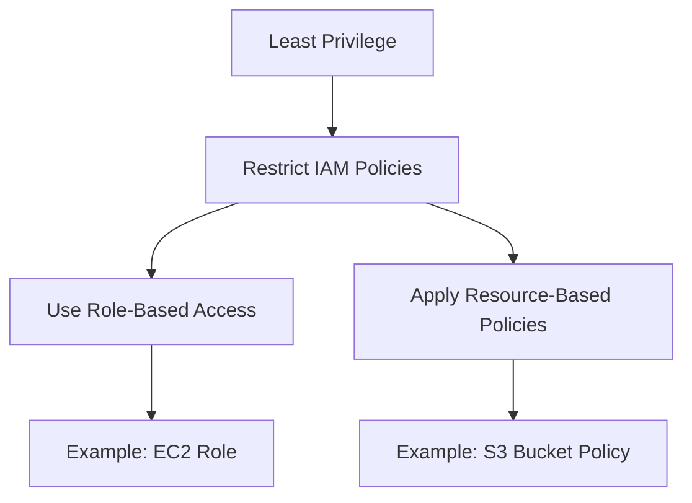
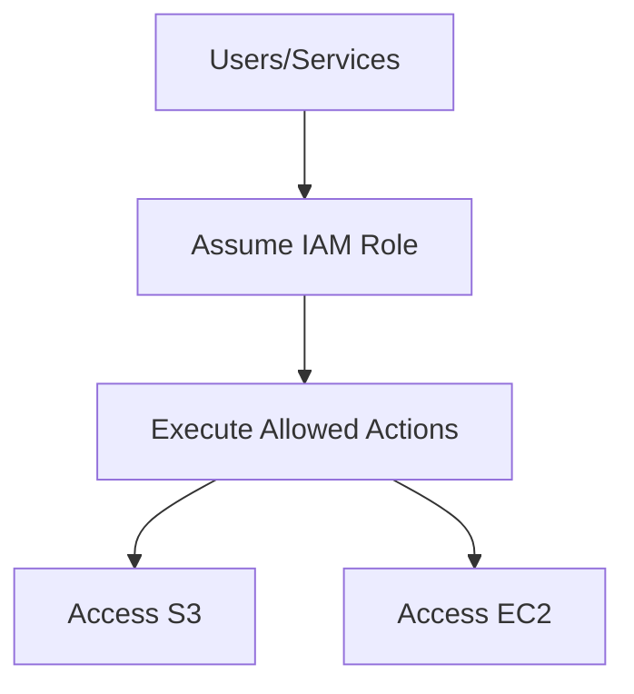
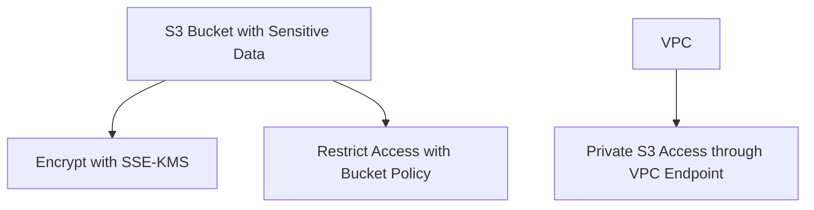
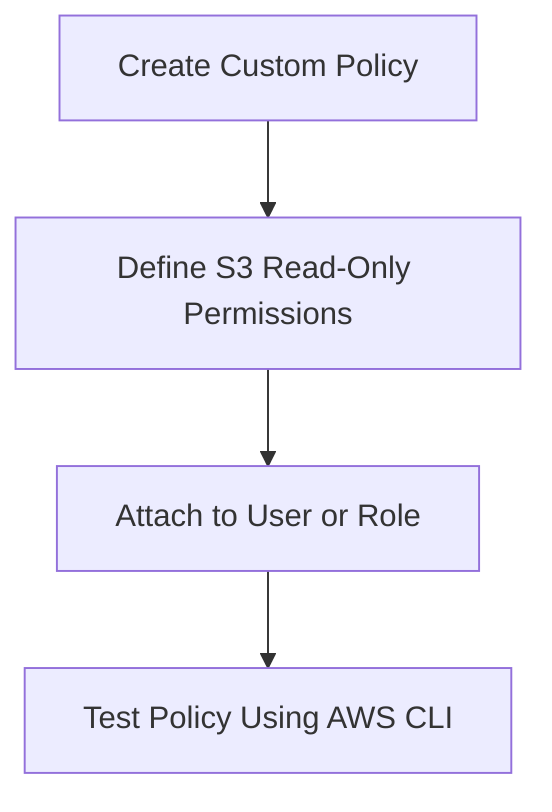
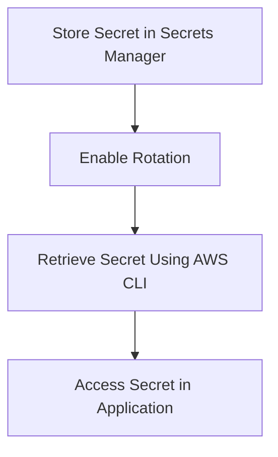
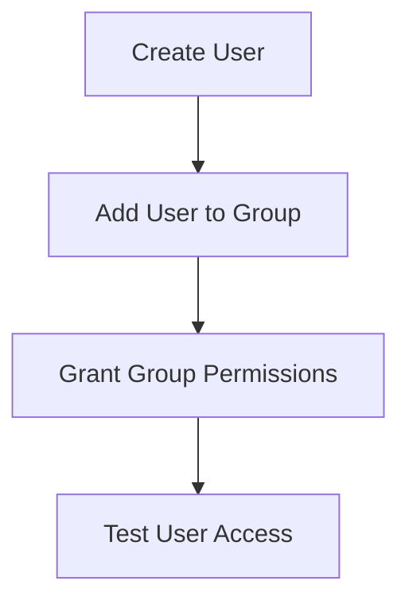
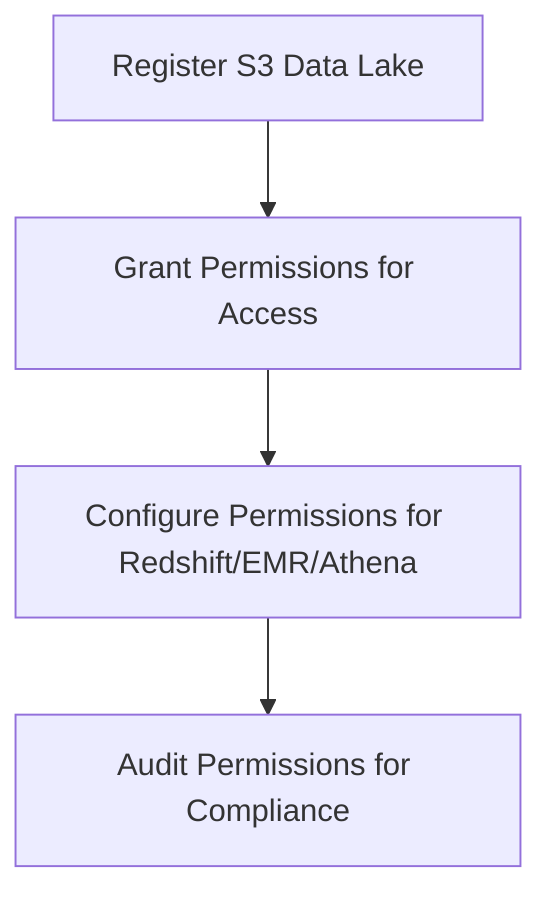

# 4.2: Apply authorization mechanisms

## Knowledge of:

- Authorization methods (role-based, policy-based, tag-based, and attributebased)
- Principle of least privilege as it applies to AWS security
- Role-based access control and expected access patterns
- Methods to protect data from unauthorized access across services

---

### **1. Authorization Methods (Role-Based, Policy-Based, Tag-Based, and Attribute-Based)**

### **Primary Functions:**

Authorization in AWS controls access to resources and services. AWS offers multiple methods to implement fine-grained access control:

- **Role-Based Authorization**: Users or services assume roles to access AWS resources. Roles are associated with **IAM policies** that define permissions.
    - Example: **EC2 instances** can assume a role to access **S3** without hard-coded credentials.
- **Policy-Based Authorization**: Policies define permissions for users, roles, or groups. Policies can be **AWS managed**, **customer managed**, or **inline**.
    - Example: An **IAM policy** that allows an EC2 instance to read from a specific **S3 bucket**.
- **Tag-Based Authorization**: AWS resources can be tagged, and IAM policies can control access to resources based on those tags.
    - Example: Only allowing access to resources with the tag `Environment: Production`.
- **Attribute-Based Access Control (ABAC)**: A method of using user attributes and tags on resources to control access.
    - Example: Granting access to S3 buckets if the user’s department attribute matches the bucket’s department tag.

### **Patterns (When to Use):**

- Use **Role-Based Authorization** when a service (like **EC2**, **Lambda**, or **API Gateway**) needs temporary permissions to access other AWS services.
    - Example: Attach a role to an EC2 instance to grant it read access to a specific S3 bucket without using long-term credentials.
- Use **Policy-Based Authorization** for fine-grained access control, ensuring that users or roles have only the necessary permissions.
    - Example: Define an IAM policy to allow read/write access to a DynamoDB table for certain users.
- Use **Tag-Based Authorization** to control access based on metadata tags, particularly useful in large organizations where resource categorization (e.g., environment, department) is essential for access control.
    - Example: Allow only users in the “DevOps” group to modify resources tagged with `Environment: Development`.
- Use **Attribute-Based Access Control (ABAC)** to scale authorization policies dynamically as the number of resources and users grows.
    - Example: Automatically grant access to all S3 buckets tagged with the user’s department tag.

### **Antipatterns (When Not to Use):**

- Avoid using **Role-Based Authorization** for users who require direct access to AWS resources. For users, **policy-based access** through **IAM users** or **groups** is more appropriate.
- Avoid over-reliance on **AWS Managed Policies** for sensitive data. These policies may be too broad. Use **customer managed policies** for more granular control.
- Avoid using **Tag-Based Authorization** for systems with inconsistent tagging practices. Ensure tags are applied uniformly across resources.

### **Benefits of Managed vs. Serverless Services:**

- **Managed (IAM, Managed Policies)**:
    - **Security**: AWS-managed services such as IAM roles and managed policies offer built-in security best practices.
    - **Simplicity**: Managed policies reduce administrative overhead but may be less flexible for fine-grained control.
- **Serverless (ABAC, Tag-Based Authorization)**:
    - **Flexibility**: Tag-based and attribute-based access controls allow dynamic, scalable access policies as environments grow.
    - **Cost**: Tag-based authorization requires more meticulous resource management, but there’s no added cost to using this method over policy-based access.

### **Mermaid Diagram: Authorization Methods Overview**

```mermaid
graph TD;
    A[Authorization Methods] --> B[Role-Based Authorization];
    A --> C[Policy-Based Authorization];
    A --> D[Tag-Based Authorization];
    A --> E[Attribute-Based Access Control (ABAC)];
    B --> F[IAM Roles];
    C --> G[IAM Policies];
    D --> H[Resource Tags];
    E --> I[User Attributes];

```

### **AWS Documentation Links:**

- [IAM Role-Based Access](https://docs.aws.amazon.com/IAM/latest/UserGuide/id_roles.html)
- [IAM Policies](https://docs.aws.amazon.com/IAM/latest/UserGuide/access_policies.html)
- [Tag-Based Access Control](https://docs.aws.amazon.com/IAM/latest/UserGuide/access_tags.html)
- [ABAC for AWS](https://docs.aws.amazon.com/IAM/latest/UserGuide/introduction_attribute-based-access-control.html)

---

### **2. Principle of Least Privilege as it Applies to AWS Security**

### **Primary Functions:**

The **Principle of Least Privilege (PoLP)** ensures that users, roles, and services have only the permissions necessary to perform their required tasks, minimizing exposure to potential security risks.

- **IAM Policies** and **roles** are the primary means to enforce least privilege in AWS.
- AWS recommends using **service control policies (SCPs)** in **AWS Organizations** to restrict permissions across accounts.
- AWS **resource-based policies** further refine access control by limiting access at the resource level (e.g., S3 bucket policies).

### **Patterns (When to Use):**

- Use **least privilege** when defining policies for **IAM users, groups, and roles**. Always start with minimal permissions and incrementally add permissions based on user needs.
    - Example: Start by granting **read-only** access to S3 and add write permissions only when necessary.
- Use **least privilege** in **cross-account roles** to allow external services or accounts access to specific resources only as needed.
    - Example: Allow a role in one AWS account to write to a specific S3 bucket in another account.

### **Antipatterns (When Not to Use):**

- Avoid using broad AWS policies like `AdministratorAccess` unless absolutely necessary. Overly broad policies increase the attack surface and can lead to unintended security risks.
- Avoid assigning **root user** access for daily administrative tasks. Use **IAM roles** and restrict access with policies.

### **Benefits of Managed vs. Serverless Services:**

- **Managed Services**:
    - **Best Practices**: Managed services like **AWS Organizations** enforce least privilege through SCPs.
    - **Overhead**: Managed services automatically handle permissions and scaling, but it may be less flexible than custom policies.
- **Serverless**:
    - **Flexibility**: Serverless services like **Lambda** benefit greatly from least privilege as they can run with highly restrictive, task-specific roles.
    - **Cost**: No additional cost to applying least privilege, but it significantly improves security in serverless architectures.

### **Mermaid Diagram: Principle of Least Privilege in AWS**



### **AWS Documentation Links:**

- [AWS IAM Best Practices](https://docs.aws.amazon.com/IAM/latest/UserGuide/best-practices.html)
- [Principle of Least Privilege](https://aws.amazon.com/identity/principle-of-least-privilege/)

---

### **3. Role-Based Access Control (RBAC) and Expected Access Patterns**

### **Primary Functions:**

**Role-Based Access Control (RBAC)** allows users or services to assume roles that define their access permissions. This is essential in environments where permissions are dynamically assigned to users, services, or applications based on their role.

- **IAM Roles**: Used for services or users to assume temporary credentials.
    - Example: An **EC2 instance** assumes a role to access **DynamoDB**.
- **IAM Policies**: Define what actions a role can perform on which resources.
    - Example: A **read-only** policy for an S3 bucket attached to a role.

### **Patterns (When to Use):**

- Use **RBAC** when different users or services need different levels of access to AWS resources based on their roles.
    - Example: Attach a policy to a role that allows **developers** to manage EC2 instances but limits access to S3.
- Use **RBAC** in multi-account AWS environments by defining cross-account roles, granting specific services or users in one account access to resources in another account.

### **Antipatterns (When Not to Use):**

- Avoid assigning permissions directly to individual IAM users. Instead, group users into **IAM roles** or **groups** for easier management and to follow least privilege.
- Avoid using the same role across multiple services if they require different permissions. Create separate roles with specific policies for each service.

### **Benefits of Managed vs. Serverless Services:**

- **Managed (IAM, Organizations)**:
    - **Security**: Managed IAM roles help maintain least privilege and are integrated with AWS services.
    - **Ease of Management**: Managed RBAC with AWS Organizations allows easier cross-account access control.
- **Serverless (Lambda, API Gateway)**:
    - **Flexibility**: Role-based access in serverless environments, such as Lambda, enables services to assume roles with specific, temporary permissions.
    - **Cost**: Roles reduce the need for hard-coded credentials, improving security without additional costs.

### **Mermaid Diagram: Role-Based Access Control in AWS**



### **AWS Documentation Links:**

- [Role-Based Access Control (RBAC) in AWS](https://docs.aws.amazon.com/IAM/latest/UserGuide/introduction_access-management.html)
- [Cross-Account Roles](https://docs.aws.amazon.com/IAM/latest/UserGuide/tutorial_cross-account-with-roles.html)

---

### **4. Methods to Protect Data from Unauthorized Access Across Services**

### **Primary Functions:**

AWS provides multiple methods to protect data from unauthorized access, ensuring that sensitive data is secure both in transit and at rest.

- **Encryption**: AWS offers encryption for data at rest and in transit.
    - Example: **S3 Server-Side Encryption (SSE-S3)** encrypts objects stored in S3 using AES-256.
- **Access Control Policies**: Use **IAM Policies**, **S3 Bucket Policies**, **KMS Key Policies**, and **Resource Policies** to restrict access to resources.
- **VPC Endpoints**: Use **VPC Endpoints** and **AWS PrivateLink** to access AWS services privately within your VPC without using the public internet.
- **Multi-Factor Authentication (MFA)**: Enforce MFA for sensitive operations like modifying security groups or accessing the AWS Management Console.

### **Patterns (When to Use):**

- Use **encryption** (e.g., S3 server-side encryption or **KMS**) to ensure data at rest is protected.
    - Example: Enable **SSE-KMS** on an S3 bucket containing sensitive customer data.
- Use **IAM policies** and **resource-based policies** (e.g., S3 bucket policies) to restrict access based on user roles, resource tags, or attributes.
- Use **VPC Endpoints** to privately access S3 or DynamoDB from within your VPC without traversing the internet, improving security for internal applications.

### **Antipatterns (When Not to Use):**

- Avoid storing sensitive data in **unencrypted S3 buckets** or **EBS volumes**. Always enable encryption for data at rest.
- Avoid using **public access** for S3 buckets that contain sensitive or regulated data. Use bucket policies and restrict access through IAM.

### **Benefits of Managed vs. Serverless Services:**

- **Managed Services**:
    - **Simplicity**: AWS-managed encryption and key management using **KMS** simplifies security without needing manual encryption management.
    - **Cost**: Managed encryption services come with additional costs, but they are essential for data security.
- **Serverless (PrivateLink, VPC Endpoints)**:
    - **Flexibility**: PrivateLink and VPC Endpoints allow you to securely access AWS services without public exposure, making serverless services like Lambda secure in isolated VPCs.
    - **Cost**: Costs for data transfer through VPC Endpoints may apply, but they significantly improve data security.

### **Mermaid Diagram: Protecting Data from Unauthorized Access**



### **AWS Documentation Links:**

- [AWS KMS](https://docs.aws.amazon.com/kms/index.html)
- [S3 Bucket Policies](https://docs.aws.amazon.com/AmazonS3/latest/userguide/example-bucket-policies.html)
- [VPC Endpoints](https://docs.aws.amazon.com/vpc/latest/userguide/vpc-endpoints.html)

---

## Skills in:

- Creating custom IAM policies when a managed policy does not meet the needs
- Storing application and database credentials (for example, Secrets Manager, AWS Systems Manager Parameter Store)
- Providing database users, groups, and roles access and authority in adatabase (for example, for Amazon Redshift)
- Managing permissions through Lake Formation (for Amazon Redshift, Amazon EMR, Athena, and Amazon S3)

---

### **1. Creating Custom IAM Policies**

### **Detailed Steps/Exercises:**

### **Exercise 1: Creating a Custom IAM Policy**

1. **Access the IAM Console**:
    - Go to the **IAM Console** and click on **Policies** > **Create Policy**.
2. **Define Permissions**:
    - Use the **Visual Editor** to create permissions or switch to the **JSON tab** for more granular control.
    - Example: Create a policy that grants **read-only** access to a specific S3 bucket:
    
    ```json
    {
        "Version": "2012-10-17",
        "Statement": [
            {
                "Effect": "Allow",
                "Action": "s3:GetObject",
                "Resource": "arn:aws:s3:::my-bucket/*"
            }
        ]
    }
    
    ```
    
3. **Review and Name the Policy**:
    - After defining the permissions, click **Review Policy**, name it (e.g., `S3ReadOnlyPolicy`), and then create the policy.
4. **Attach the Policy**:
    - Attach the custom policy to an **IAM user**, **group**, or **role**. Go to the respective user, group, or role and click **Attach Policies**.
5. **Test the Policy**:
    - Ensure the policy works as expected by logging in as the IAM user or assuming the role and verifying access to the specified S3 bucket using the CLI:
    
    ```bash
    aws s3 ls s3://my-bucket/
    
    ```
    

### **Mermaid Diagram: IAM Policy Creation Workflow**



### **AWS Documentation Links:**

- [Creating IAM Policies](https://docs.aws.amazon.com/IAM/latest/UserGuide/access_policies_create.html)
- [IAM Policy Structure](https://docs.aws.amazon.com/IAM/latest/UserGuide/access_policies.html)

### **Use Case Scenarios:**

- **Custom Data Access**: Use custom IAM policies when predefined AWS Managed Policies do not meet specific access requirements (e.g., limiting access to certain resources).
- **Granular Permissions**: Create granular policies for **least privilege** by specifying exact actions and resources that users or services can access.

### **Common Pitfalls or Challenges:**

- **Challenge**: Overly permissive policies can lead to security risks.
    - **Solution**: Always apply the **principle of least privilege** by restricting permissions to the minimum required for a task.

---

### **2. Storing Application and Database Credentials (Secrets Manager, Parameter Store)**

### **Detailed Steps/Exercises:**

### **Exercise 2: Storing Credentials in AWS Secrets Manager**

1. **Create a Secret in AWS Secrets Manager**:
    - Go to the **Secrets Manager Console**, click **Store a new secret**.
    - Select **Credentials for RDS database** and enter the database credentials (username and password).
2. **Configure Secret Rotation**:
    - Enable **automatic rotation** for the secret by choosing the database and defining a rotation interval (e.g., every 30 days).
    - You can also specify an AWS Lambda function for custom rotation logic if needed.
3. **Access the Secret Programmatically**:
    - Use the AWS CLI to retrieve the secret value:
    
    ```bash
    aws secretsmanager get-secret-value --secret-id my-db-secret
    
    ```
    
4. **Use the Secret in an Application**:
    - Modify your application to retrieve the secret at runtime using the **AWS SDK**:
    
    ```python
    import boto3
    from botocore.exceptions import ClientError
    
    def get_secret():
        client = boto3.client('secretsmanager')
        try:
            secret_value = client.get_secret_value(SecretId='my-db-secret')
            return secret_value['SecretString']
        except ClientError as e:
            raise Exception("Error retrieving secret")
    
    ```
    

### **Mermaid Diagram: Storing and Accessing Secrets in Secrets Manager**



### **AWS Documentation Links:**

- [AWS Secrets Manager](https://docs.aws.amazon.com/secretsmanager/latest/userguide/intro.html)
- [Secrets Manager Rotation](https://docs.aws.amazon.com/secretsmanager/latest/userguide/rotating-secrets.html)

### **Use Case Scenarios:**

- **Credential Security**: Use Secrets Manager to store and rotate sensitive credentials for applications or databases, such as RDS or external services.
- **Application Security**: Avoid hard-coding credentials by dynamically retrieving them from Secrets Manager during runtime.

### **Common Pitfalls or Challenges:**

- **Challenge**: Failing to rotate credentials regularly can lead to security risks.
    - **Solution**: Enable automatic rotation in Secrets Manager to ensure credentials are rotated periodically.

---

### **3. Providing Database Users, Groups, and Roles Access and Authority in a Database (Amazon Redshift)**

### **Detailed Steps/Exercises:**

### **Exercise 3: Managing Users and Roles in Amazon Redshift**

1. **Create a New User in Amazon Redshift**:
    - Connect to your Redshift cluster using a SQL client or the **Query Editor** in the AWS Console.
    - Create a new user:
    
    ```sql
    CREATE USER db_user PASSWORD 'StrongPassword123';
    
    ```
    
2. **Create a Group and Assign Users**:
    - Create a new group:
    
    ```sql
    CREATE GROUP analytics_group;
    
    ```
    
    - Add the user to the group:
    
    ```sql
    ALTER GROUP analytics_group ADD USER db_user;
    
    ```
    
3. **Grant Permissions to the Group**:
    - Grant read and write permissions on a table to the group:
    
    ```sql
    GRANT SELECT, INSERT ON TABLE sales_data TO GROUP analytics_group;
    
    ```
    
4. **Test the User’s Permissions**:
    - Log in as the user and run queries to test access:
    
    ```sql
    SET SESSION AUTHORIZATION 'db_user';
    SELECT * FROM sales_data;
    
    ```
    

### **Mermaid Diagram: Managing Redshift Users and Groups**



### **AWS Documentation Links:**

- [Amazon Redshift User Management](https://docs.aws.amazon.com/redshift/latest/dg/r_CREATE_USER.html)
- [Managing Database Permissions](https://docs.aws.amazon.com/redshift/latest/dg/c_redshift-sql.html)

### **Use Case Scenarios:**

- **Database Access Control**: Manage user roles and permissions in Amazon Redshift to control access to tables and resources, ensuring that users only have the necessary level of access.
- **Data Governance**: Use groups to manage permissions for teams or departments that need similar access patterns.

### **Common Pitfalls or Challenges:**

- **Challenge**: Misconfiguring user permissions may lead to unauthorized access.
    - **Solution**: Regularly audit database user roles and permissions to ensure adherence to security policies.

---

### **4. Managing Permissions Through Lake Formation (Amazon Redshift, Amazon EMR, Athena, S3)**

### **Detailed Steps/Exercises:**

### **Exercise 4: Managing Permissions with AWS Lake Formation**

1. **Register an S3 Data Lake in Lake Formation**:
    - In the **Lake Formation Console**, go to **Data Catalog** > **Register location**.
    - Register the S3 bucket that contains your data lake.
2. **Grant Lake Formation Permissions**:
    - Grant permissions to users or roles to access specific data in the data lake:
    
    ```bash
    aws lakeformation grant-permissions \\
    --principal DataLakePrincipalIdentifier="arn:aws:iam::account-id:role/lake-role" \\
    --permissions "SELECT" \\
    --resource 'Database={"Name":"my-database"}'
    
    ```
    
3. **Configure Cross-Service Permissions**:
    - Use Lake Formation to manage permissions for services like **Redshift Spectrum**, **EMR**, and **Athena** to access S3 data.
    - Example: Allow **Athena** to query S3:
    
    ```bash
    aws lakeformation grant-permissions \\
    --principal DataLakePrincipalIdentifier="arn:aws:iam::account-id:role/athena-role" \\
    --permissions "SELECT" \\
    --resource 'Table={"DatabaseName":"my-database", "Name":"my-table"}'
    
    ```
    
4. **Audit Permissions**:
    - Regularly review and audit the permissions granted through Lake Formation to ensure that only authorized users and services have access to the data.

### **Mermaid Diagram: Managing Data Access with Lake Formation**



### **AWS Documentation Links:**

- [AWS Lake Formation Documentation]([https://docs](https://docs/)

.aws.amazon.com/lake-formation/latest/dg/what-is-lake-formation.html)

- [Lake Formation Permissions](https://docs.aws.amazon.com/lake-formation/latest/dg/granting-dlf-permissions.html)

### **Use Case Scenarios:**

- **Data Lakes**: Use Lake Formation to manage and centralize access to data lakes in S3, ensuring fine-grained control over who can access which datasets.
- **Multi-Service Access**: Use Lake Formation to control cross-service access (e.g., Athena, Redshift, EMR) to data stored in S3.

### **Common Pitfalls or Challenges:**

- **Challenge**: Misconfiguring permissions across services can result in unauthorized data access.
    - **Solution**: Regularly audit permissions and use IAM roles with least privilege to ensure that access is controlled properly.

---