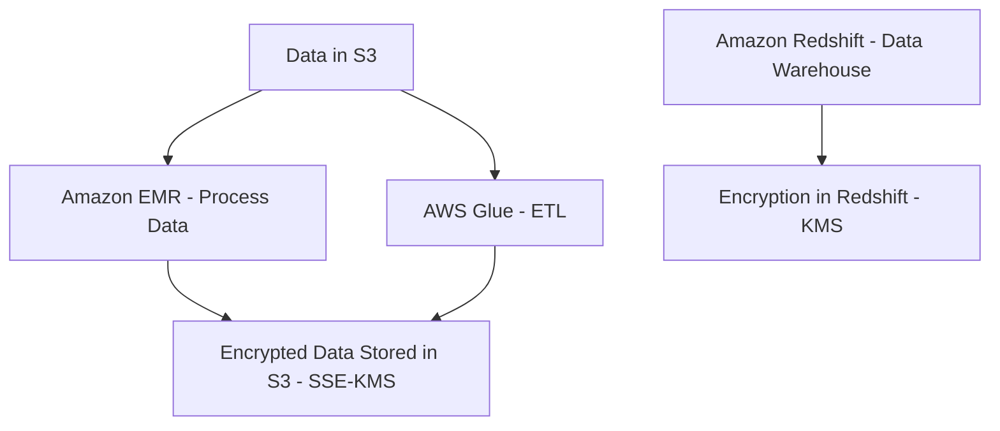
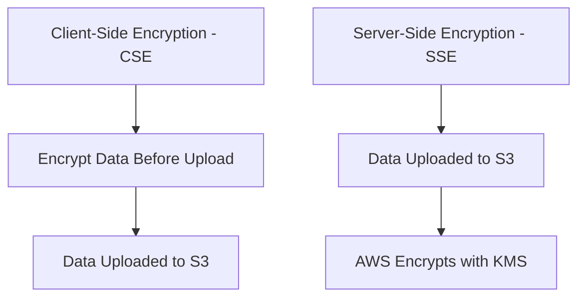
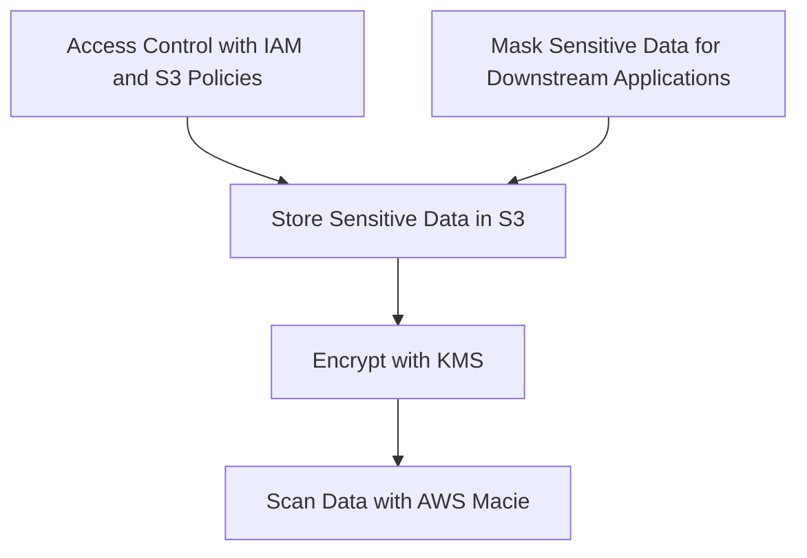
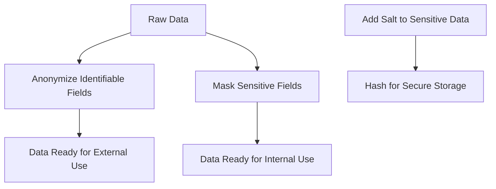
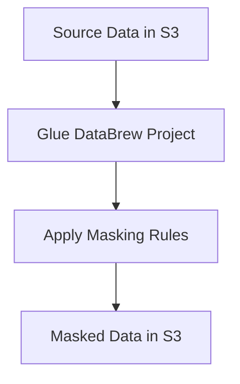
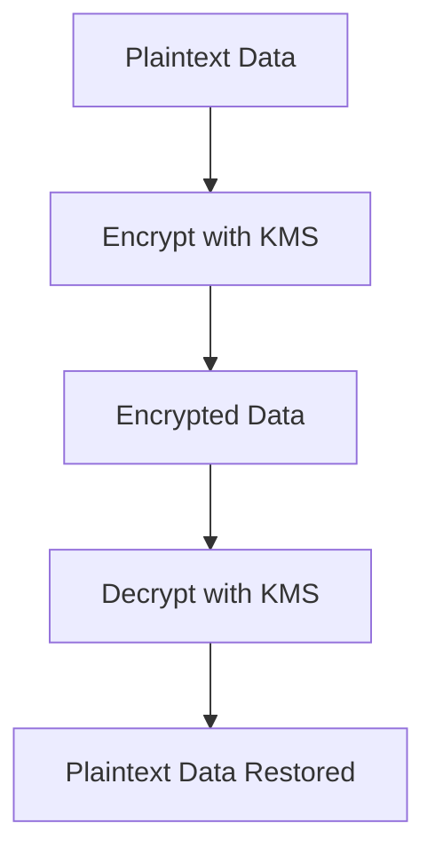
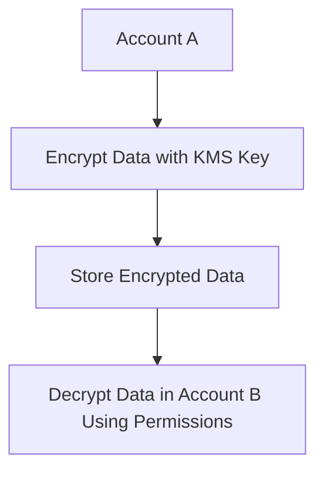
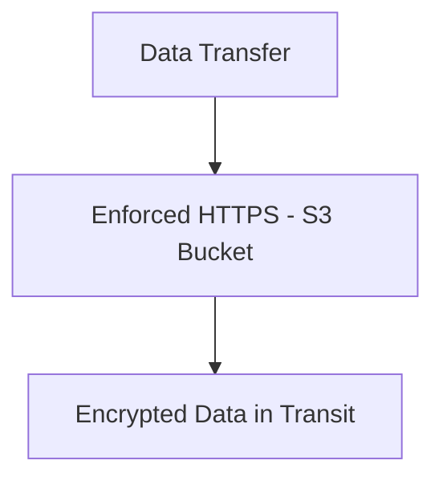

# 4.3: Ensure data encryption and masking

## Knowledge of:

- Data encryption options available in AWS analytics services (for example, Amazon Redshift, Amazon EMR, AWS Glue)
- Differences between client-side encryption and server-side encryption
- Protection of sensitive data
- Data anonymization, masking, and key salting

---

### **1. Data Encryption Options Available in AWS Analytics Services (Amazon Redshift, Amazon EMR, AWS Glue)**

### **Primary Functions:**

Encryption is essential to protect data at rest and in transit. AWS provides several encryption options across its analytics services:

- **Amazon Redshift**:
    - **Encryption at Rest**: Redshift uses **AWS Key Management Service (KMS)** or **AWS CloudHSM** to encrypt data stored in its clusters.
    - **Encryption in Transit**: Redshift supports SSL to encrypt data transmitted between clients and the database.
- **Amazon EMR**:
    - **Encryption at Rest**: EMR supports **SSE-S3**, **EBS encryption**, and **EMR File System (EMRFS) encryption** for data at rest.
    - **Encryption in Transit**: EMR uses **TLS/SSL** to secure data as it moves between nodes or to external services.
- **AWS Glue**:
    - **Encryption at Rest**: Glue jobs can write encrypted data to **S3** using **SSE-S3** or **SSE-KMS**.
    - **Encryption in Transit**: Glue supports encryption using **TLS/SSL** for communication between services.

### **Patterns (When to Use):**

- Use **Amazon Redshift encryption** when managing large-scale analytical data warehouses containing sensitive business or customer data.
    - Example: Enable **KMS encryption** for an Amazon Redshift cluster that stores personally identifiable information (PII).
- Use **Amazon EMR encryption** when processing large datasets using distributed frameworks like **Apache Spark** or **Hadoop** to ensure both data at rest (in S3 or HDFS) and data in transit are encrypted.
    - Example: Enable **SSE-S3** for an EMR cluster that processes financial transactions.
- Use **AWS Glue encryption** when performing ETL tasks to move sensitive data between data sources, ensuring that data remains encrypted both in transit and at rest.
    - Example: Write encrypted data to S3 after a Glue ETL job using **SSE-KMS**.

### **Antipatterns (When Not to Use):**

- Avoid disabling encryption in production environments that process sensitive data. Lack of encryption can lead to data breaches and non-compliance with regulations such as **GDPR** or **HIPAA**.
- Avoid using **default KMS keys** (AWS-managed) for critical data without proper key management policies. Use **customer-managed keys** (CMKs) for more control and auditing.

### **Benefits of Managed vs. Serverless Services:**

- **Managed Services (Redshift, EMR)**:
    - **Scalability**: Managed services like **Redshift** and **EMR** handle encryption automatically at scale, simplifying key management for large datasets.
    - **Complexity**: These services abstract much of the underlying encryption management, making them easier to implement.
- **Serverless Services (AWS Glue)**:
    - **Flexibility**: **Glue** offers serverless ETL with encryption at rest and in transit, ideal for dynamic data pipelines.
    - **Cost**: Glue's pay-per-use model allows for flexible data processing with encryption without provisioning resources.

### **Mermaid Diagram: Data Encryption in AWS Analytics Services**



### **AWS Documentation Links:**

- [Amazon Redshift Encryption](https://docs.aws.amazon.com/redshift/latest/mgmt/working-with-db-encryption.html)
- [Amazon EMR Security](https://docs.aws.amazon.com/emr/latest/ManagementGuide/emr-data-encryption.html)
- [AWS Glue Encryption](https://docs.aws.amazon.com/glue/latest/dg/glue-security-encryption.html)

---

### **2. Differences Between Client-Side Encryption and Server-Side Encryption**

### **Primary Functions:**

- **Client-Side Encryption (CSE)**: The data is encrypted by the client before it is sent to AWS services like S3. The encryption keys are managed and stored by the client.
    - Example: Using the **AWS Encryption SDK** to encrypt data on the client side before uploading to S3.
- **Server-Side Encryption (SSE)**: AWS handles the encryption of data as it is stored in services like S3, Redshift, or RDS. AWS manages the keys using **KMS**, **S3-Managed Keys (SSE-S3)**, or **Customer-Provided Keys (SSE-C)**.
    - Example: Enabling **SSE-KMS** for an S3 bucket, where AWS manages the encryption and key rotation.

### **Patterns (When to Use):**

- Use **Client-Side Encryption** when you need to control and manage encryption keys outside of AWS, or when regulatory requirements demand full client-side key management.
    - Example: Encrypting highly sensitive documents on-premises before uploading them to S3.
- Use **Server-Side Encryption** when you prefer AWS to manage encryption at scale, simplifying key management while ensuring that your data remains encrypted at rest.
    - Example: Automatically enabling **SSE-KMS** on all objects stored in an S3 bucket.

### **Antipatterns (When Not to Use):**

- Avoid using **Client-Side Encryption** if your applications or systems do not have the resources to securely manage encryption keys. Relying on server-side encryption is often more practical and secure.
- Avoid disabling **Server-Side Encryption** for sensitive data in services like S3 or Redshift. Unencrypted data in cloud storage can be a significant security risk.

### **Benefits of Managed vs. Serverless Services:**

- **Managed (SSE-KMS, SSE-S3)**:
    - **Scalability**: AWS manages key rotation, encryption, and decryption for services like S3, Redshift, and RDS, allowing these services to scale seamlessly.
    - **Cost**: Managed encryption reduces operational overhead but incurs KMS-related costs for key management.
- **Client-Side Encryption (CSE)**:
    - **Control**: CSE offers full control over encryption keys and algorithms, ideal for highly sensitive data or regulatory compliance.
    - **Complexity**: Managing your own keys introduces complexity, especially at scale, and increases the risk of key mismanagement.

### **Mermaid Diagram: Client-Side vs. Server-Side Encryption**



### **AWS Documentation Links:**

- [Client-Side Encryption Using AWS Encryption SDK](https://docs.aws.amazon.com/encryption-sdk/latest/developer-guide/introduction.html)
- [S3 Server-Side Encryption](https://docs.aws.amazon.com/AmazonS3/latest/userguide/UsingServerSideEncryption.html)

---

### **3. Protection of Sensitive Data**

### **Primary Functions:**

AWS provides multiple mechanisms to protect sensitive data, such as personally identifiable information (PII), financial data, or health records:

- **Encryption**: Encrypt sensitive data at rest and in transit using **KMS**, **SSL/TLS**, or **CloudHSM**.
- **Access Control**: Use **IAM roles**, **policies**, and **resource-based policies** (like **S3 bucket policies**) to restrict access to sensitive data.
- **Data Masking**: Redact or mask sensitive parts of the data before sharing it with downstream systems.
- **AWS Macie**: An automated security service that helps identify sensitive data stored in S3 using machine learning and provides recommendations for protecting it.

### **Patterns (When to Use):**

- Use **KMS-based encryption** to protect sensitive data stored in S3, Redshift, or other services. Ensure that data is encrypted both at rest and in transit.
    - Example: Encrypt customer PII data using **SSE-KMS** in S3.
- Use **AWS Macie** to scan S3 buckets for sensitive data and monitor access patterns for potential security risks.
    - Example: Enable **Macie** to monitor and classify financial records stored in S3.

### **Antipatterns (When Not to Use):**

- Avoid using public access settings for S3 buckets that store sensitive data. Ensure that **bucket policies** and **ACLs** restrict access to only authorized users.
- Avoid storing sensitive data in AWS services without encryption, as this can lead to data breaches and non-compliance with regulations.

### **Benefits of Managed vs. Serverless Services:**

- **Managed Services (KMS, Macie)**:
    - **Security**: AWS-managed services like **KMS** and **Macie** offer robust, scalable solutions for managing encryption keys and monitoring sensitive data.
    - **Cost**: Managed services incur additional costs but offer significant security benefits.
- *Serverless (

IAM Policies, Resource Policies)**:

- **Flexibility**: Use IAM policies and resource-based policies in serverless environments to protect data dynamically.
- **Cost**: Serverless policies have minimal cost overhead but require proper implementation to ensure that sensitive data is protected.

### **Mermaid Diagram: Protecting Sensitive Data**



### **AWS Documentation Links:**

- [AWS Macie Documentation](https://docs.aws.amazon.com/macie/latest/userguide/what-is-macie.html)
- [AWS Key Management Service (KMS)](https://docs.aws.amazon.com/kms/index.html)

---

### **4. Data Anonymization, Masking, and Key Salting**

### **Primary Functions:**

Data anonymization and masking techniques are critical for protecting sensitive data while still allowing analysis:

- **Data Anonymization**: Permanently removes identifiable information from datasets, ensuring that the data cannot be linked back to an individual.
    - Example: Remove **names** or **social security numbers** from a dataset but retain **general demographic information** for analysis.
- **Data Masking**: Masks specific parts of sensitive data, allowing the dataset to be used for testing or analysis without revealing sensitive information.
    - Example: Mask the middle digits of credit card numbers: `1234-XXXX-XXXX-5678`.
- **Key Salting**: Adds a random string (salt) to the data before hashing to make it more resistant to brute-force attacks.
    - Example: Salt passwords before hashing them to store securely in databases.

### **Patterns (When to Use):**

- Use **data anonymization** when sharing datasets with external teams, ensuring no personal data can be traced back to individuals.
    - Example: Anonymize healthcare data before sharing it with third-party researchers.
- Use **data masking** to obscure sensitive data in environments where the data is needed for testing but must not expose real information.
    - Example: Mask employee names or account numbers in a development or staging environment.
- Use **key salting** when storing sensitive data such as passwords in databases. The salt ensures that even if two users have the same password, their hashed values will differ.

### **Antipatterns (When Not to Use):**

- Avoid partial anonymization if full anonymization is required by regulation. Incomplete anonymization can leave data vulnerable to re-identification.
- Avoid using simple masking techniques (e.g., replacing characters with asterisks) for data that requires strong protection like passwords or PII.

### **Benefits of Managed vs. Serverless Services:**

- **Managed Services (AWS Macie, Lambda)**:
    - **Scalability**: Managed services like **Macie** or using Lambda functions for masking/anonymization can handle large datasets at scale.
    - **Security**: AWS-managed services provide compliance with regulatory standards for anonymization and masking.
- **Serverless (Custom Anonymization/Masking)**:
    - **Flexibility**: Custom serverless functions (using Lambda) can anonymize or mask data dynamically based on your requirements.
    - **Cost**: Serverless solutions are pay-as-you-go and can be more cost-effective for lightweight data anonymization or masking tasks.

### **Mermaid Diagram: Data Masking and Anonymization Workflow**



### **AWS Documentation Links:**

- [Data Masking in AWS](https://aws.amazon.com/blogs/industries/anonymize-and-share-data-securely-with-data-masking/)
- [Data Encryption and Anonymization](https://aws.amazon.com/big-data/datalakes-and-analytics/data-encryption/)

---

## Skills in:

- Applying data masking and anonymization according to compliance laws or
company policies
- Using encryption keys to encrypt or decrypt data (for example, AWS Key
Management Service [AWS KMS])
- Configuring encryption across AWS account boundaries
- Enabling encryption in transit for data.

---

### **1. Applying Data Masking and Anonymization According to Compliance Laws or Company Policies**

### **Detailed Steps/Exercises:**

### **Exercise 1: Data Masking with AWS Glue DataBrew**

1. **Create a DataBrew Project**:
    - In the **AWS Glue Console**, navigate to **AWS Glue DataBrew** and create a new project.
    - Select the dataset (e.g., S3 or RDS data) that you want to mask or anonymize.
2. **Define Data Masking Transformations**:
    - In the **DataBrew project**, define data transformations to mask sensitive fields.
    - Example: Mask credit card numbers by replacing the middle digits with `X`:
    
    ```python
    MaskPatternTransform: "1234-XXXX-XXXX-5678"
    
    ```
    
3. **Apply the Masking Transformation**:
    - Apply the masking transformation to sensitive fields and preview the data in DataBrew.
    - You can mask fields like **names**, **SSNs**, **credit card numbers**, and **email addresses**.
4. **Generate a Cleaned Dataset**:
    - After applying the masking, generate a cleaned dataset and save it to **Amazon S3** or export it for further processing.

### **Mermaid Diagram: Data Masking with AWS Glue DataBrew**



### **AWS Documentation Links:**

- [AWS Glue DataBrew Documentation](https://docs.aws.amazon.com/databrew/index.html)
- [Data Masking Techniques in AWS](https://aws.amazon.com/blogs/industries/anonymize-and-share-data-securely-with-data-masking/)

### **Use Case Scenarios:**

- **Compliance**: Use data masking to comply with regulations such as **GDPR** or **HIPAA**, ensuring that sensitive data is protected when shared with external teams.
- **Test Data**: Mask production data before using it in non-production environments like development or testing.

### **Common Pitfalls or Challenges:**

- **Challenge**: Ensuring consistent masking across datasets to avoid re-identification.
    - **Solution**: Apply uniform masking techniques and anonymization processes throughout the data pipeline.

---

### **2. Using Encryption Keys to Encrypt or Decrypt Data (AWS KMS)**

### **Detailed Steps/Exercises:**

### **Exercise 2: Encrypting and Decrypting Data with AWS KMS**

1. **Create a KMS Key**:
    - In the **AWS KMS Console**, click **Create Key** and choose the key type (e.g., **Symmetric** for general encryption/decryption tasks).
    - Configure **key usage permissions** to control which IAM roles or users can use this key.
2. **Encrypt Data Using AWS CLI**:
    - Use the following AWS CLI command to encrypt a file using your KMS key:
    
    ```bash
    aws kms encrypt \\
    --key-id <your-key-id> \\
    --plaintext fileb://my-data-file.txt \\
    --output text \\
    --query CiphertextBlob > encrypted-file.txt
    
    ```
    
3. **Decrypt Data Using AWS CLI**:
    - To decrypt the encrypted file, use this command:
    
    ```bash
    aws kms decrypt \\
    --ciphertext-blob fileb://encrypted-file.txt \\
    --output text \\
    --query Plaintext | base64 --decode > decrypted-file.txt
    
    ```
    
4. **Manage Key Rotation**:
    - Enable **automatic key rotation** in the KMS console to ensure that encryption keys are rotated periodically, maintaining strong security practices.

### **Mermaid Diagram: Data Encryption and Decryption with AWS KMS**



### **AWS Documentation Links:**

- [AWS Key Management Service (KMS)](https://docs.aws.amazon.com/kms/index.html)
- [Encrypting Data Using AWS KMS](https://docs.aws.amazon.com/kms/latest/developerguide/encrypt-data.html)

### **Use Case Scenarios:**

- **Data Security**: Encrypt sensitive files or database backups before storing them in S3 or other storage services.
- **Data Transfer**: Encrypt data before transferring it between AWS accounts or regions to ensure confidentiality.

### **Common Pitfalls or Challenges:**

- **Challenge**: Mismanaging KMS permissions can lead to unauthorized access to encryption keys.
    - **Solution**: Use strict IAM policies to control access to KMS keys, ensuring only authorized users and roles have permissions.

---

### **3. Configuring Encryption Across AWS Account Boundaries**

### **Detailed Steps/Exercises:**

### **Exercise 3: Cross-Account KMS Key Usage**

1. **Create a KMS Key in the Source Account**:
    - In **Account A**, create a **KMS key** and grant permissions to **Account B** by adding the following policy to the key:
    
    ```json
    {
        "Sid": "AllowCrossAccount",
        "Effect": "Allow",
        "Principal": { "AWS": "arn:aws:iam::<account-b-id>:root" },
        "Action": "kms:Decrypt",
        "Resource": "*"
    }
    
    ```
    
2. **Encrypt Data in Account A**:
    - Use **Account A** to encrypt the data using the KMS key:
    
    ```bash
    aws kms encrypt \\
    --key-id <account-a-key-id> \\
    --plaintext fileb://my-data.txt \\
    --output text \\
    --query CiphertextBlob > encrypted-file.txt
    
    ```
    
3. **Decrypt Data in Account B**:
    - In **Account B**, use the granted permissions to decrypt the file:
    
    ```bash
    aws kms decrypt \\
    --ciphertext-blob fileb://encrypted-file.txt \\
    --output text \\
    --query Plaintext | base64 --decode > decrypted-file.txt
    
    ```
    

### **Mermaid Diagram: Cross-Account Encryption Using AWS KMS**



### **AWS Documentation Links:**

- [Cross-Account Permissions in AWS KMS](https://docs.aws.amazon.com/kms/latest/developerguide/key-policy-modifying.html#key-policy-modifying-cross-account)

### **Use Case Scenarios:**

- **Data Sharing**: Encrypt data in one AWS account (e.g., production) and allow another AWS account (e.g., a partner or testing account) to decrypt the data securely.
- **Multi-Account Architectures**: Implement encryption across multiple AWS accounts in a large organization while maintaining strict control over encryption keys.

### **Common Pitfalls or Challenges:**

- **Challenge**: Improperly configured cross-account KMS permissions can result in access issues.
    - **Solution**: Use clear and specific key policies that define which roles or users in another AWS account can use the KMS key.

---

### **4. Enabling Encryption in Transit for Data**

### **Detailed Steps/Exercises:**

### **Exercise 4: Enabling Encryption in Transit Using S3 and SSL/TLS**

1. **Enable HTTPS for S3 Bucket**:
    - Ensure that any data transfer to or from your S3 bucket uses HTTPS (TLS) by enforcing this in the bucket policy:
    
    ```json
    {
        "Version": "2012-10-17",
        "Statement": [
            {
                "Effect": "Deny",
                "Principal": "*",
                "Action": "s3:*",
                "Resource": "arn:aws:s3:::my-bucket/*",
                "Condition": {
                    "Bool": { "aws:SecureTransport": "false" }
                }
            }
        ]
    }
    
    ```
    
2. **Verify Encryption in Transit**:
    - When accessing your S3 bucket, ensure you're using the HTTPS endpoint:
    
    ```bash
    aws s3 cp s3://my-bucket/my-data.txt ./my-data.txt --endpoint-url <https://s3.amazonaws.com>
    
    ```
    
3. **Enable TLS for Other AWS Services**:
    - Enable **TLS** encryption for other services like **Amazon RDS**, **Redshift**, or **EMR** by configuring SSL certificates during connection setup.

### **Mermaid Diagram: Encryption in Transit with S3 and SSL/TLS**



### **AWS Documentation Links:**

- [AWS S3 Bucket Policies](https://docs.aws.amazon.com/AmazonS3/latest/userguide/example-bucket-policies.html)
- [AWS RDS Encryption in Transit](https://docs.aws.amazon.com/AmazonRDS/latest/UserGuide/UsingWithRDS.SSL.html)

### **Use Case Scenarios:**

- **Data Transfers**

: Encrypt all data transfers to and from S3 using SSL/TLS to protect data in transit.

- **Compliance**: Ensure that your AWS architecture complies with data privacy laws like **GDPR** by enforcing encryption in transit across services.

### **Common Pitfalls or Challenges:**

- **Challenge**: Failing to enforce encryption in transit for all services can leave data vulnerable to interception.
    - **Solution**: Apply bucket policies or service configurations to require HTTPS for all data transfers.

---