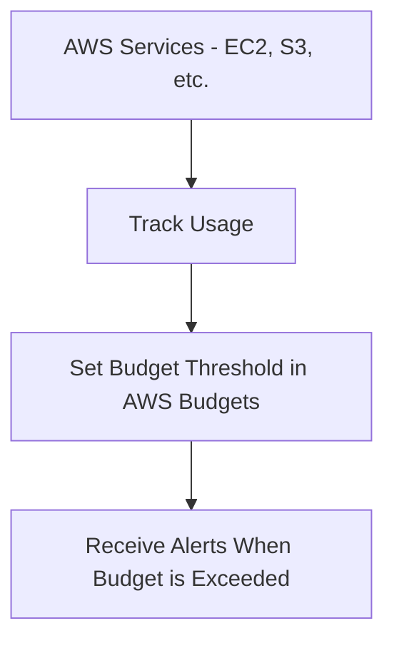
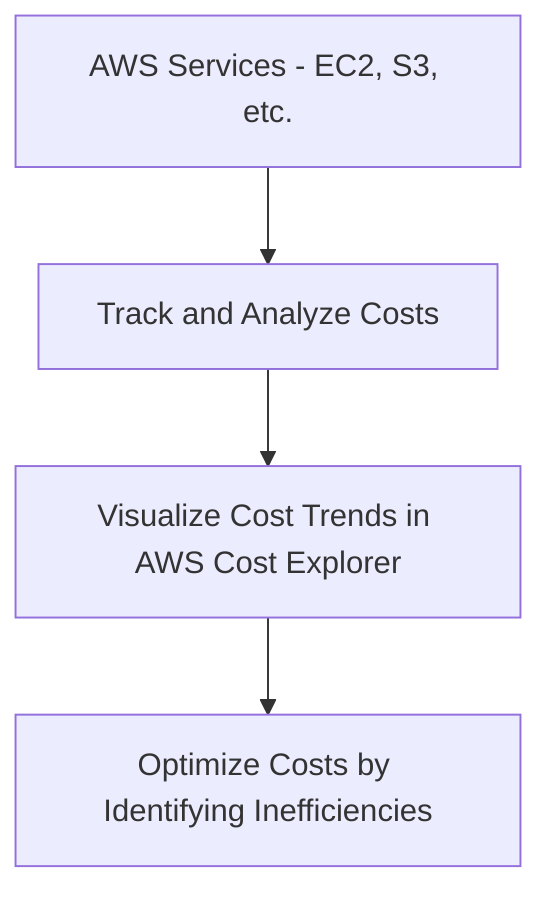

# Cloud Financial Management

### **1. AWS Budgets**

### **Primary Functions:**

- **AWS Budgets** allows you to set **custom cost and usage budgets** and receive alerts when you exceed your defined thresholds. You can also track your Reserved Instance (RI) or Savings Plans utilization.

### **When to Use:**

- Use AWS Budgets to **monitor and control costs** by setting specific thresholds for service usage, such as setting a budget to ensure your EC2 or S3 usage stays within your expected monthly spend.

### **Antipatterns:**

- Avoid using AWS Budgets as a real-time cost tracking tool. It is not suitable for **real-time cost insights**—use **Cost Explorer** for more detailed, real-time analysis.

### **Mermaid Diagram: AWS Budgets Monitoring Workflow**

### **AWS Documentation Link:**

- [AWS Budgets](https://docs.aws.amazon.com/cost-management/latest/userguide/budgets-managing-costs.html)

---

### **2. AWS Cost Explorer**

### **Primary Functions:**

- **AWS Cost Explorer** helps you **visualize and analyze** your AWS costs and usage over time. It provides insights into cost trends, resource usage, and ways to optimize your spend.

### **When to Use:**

- Use Cost Explorer to **analyze cost patterns** and **optimize your AWS spending** by identifying underused resources (like EC2 instances or RDS databases) and investigating cost spikes.

### **Antipatterns:**

- Avoid using Cost Explorer as a budgeting tool; it's more suited for **analysis** than setting proactive alerts (use **AWS Budgets** for that purpose).

### **Mermaid Diagram: AWS Cost Explorer Workflow**

### **AWS Documentation Link:**

- [AWS Cost Explorer](https://docs.aws.amazon.com/cost-management/latest/userguide/ce-what-is.html)

---