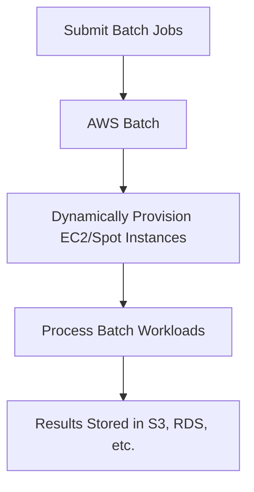
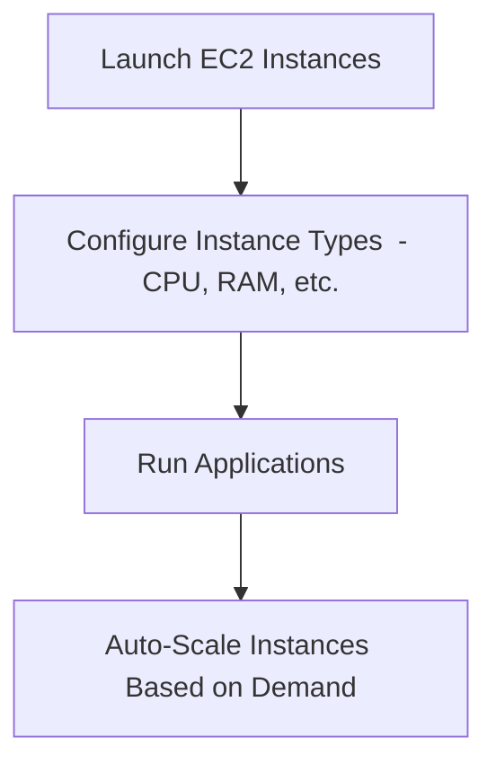
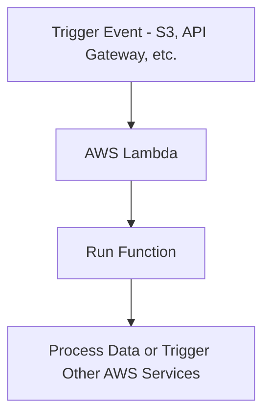
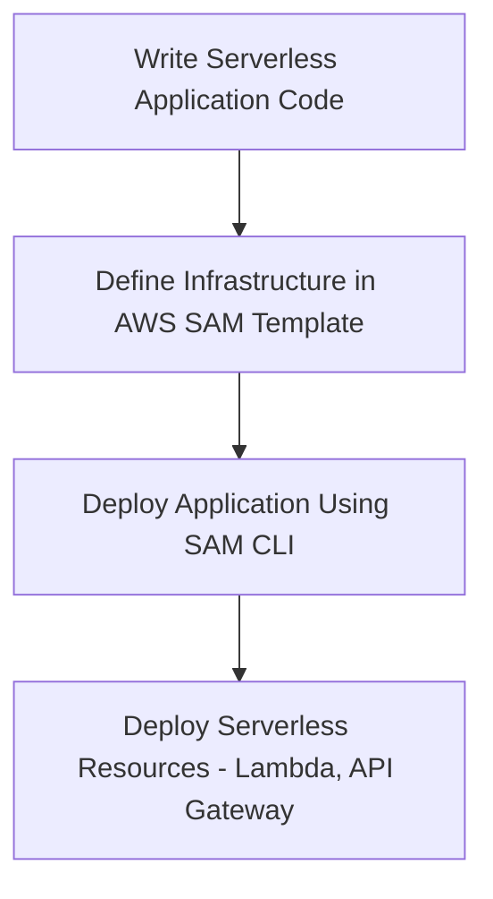

# Compute

### **1. AWS Batch**

### **Primary Functions:**

- **AWS Batch** enables the execution of **batch processing workloads** on the AWS Cloud. It dynamically provisions the optimal compute resources (EC2 instances or Spot instances) based on the type and volume of batch jobs.

### **When to Use:**

- Use AWS Batch to process **large-scale, parallelizable workloads** such as genomics analysis, video processing, or financial risk modeling that do not require real-time processing.

### **Antipatterns:**

- Avoid using AWS Batch for **real-time, low-latency tasks** that require immediate response. For real-time workloads, consider using **AWS Lambda** or **Amazon EC2**.

### **Mermaid Diagram: AWS Batch Workflow**

### **AWS Documentation Link:**

- [AWS Batch](https://docs.aws.amazon.com/batch/latest/userguide/what-is-batch.html)

---

### **2. Amazon EC2**

### **Primary Functions:**

- **Amazon EC2 (Elastic Compute Cloud)** provides **resizable compute capacity** in the cloud, allowing you to run virtual servers, known as instances, with different CPU, memory, and storage configurations.

### **When to Use:**

- Use EC2 when you need **customizable virtual machines** with fine-grained control over the compute environment, including OS-level access, security groups, and auto-scaling capabilities.
    - Ideal for hosting **web servers**, **databases**, and running **long-running applications**.

### **Antipatterns:**

- Avoid using EC2 for **short-lived, event-driven tasks** that can be more efficiently handled by **AWS Lambda**.
- EC2 can be expensive if not properly managed or if instances run underutilized for extended periods.

### **Mermaid Diagram: Amazon EC2 Workflow**

### **AWS Documentation Link:**

- [Amazon EC2](https://docs.aws.amazon.com/AWSEC2/latest/UserGuide/concepts.html)

---

### **3. AWS Lambda**

### **Primary Functions:**

- **AWS Lambda** is a **serverless compute service** that runs code in response to events and automatically manages the underlying compute resources. You only pay for the compute time you consume.

### **When to Use:**

- Use Lambda for **event-driven architectures**, such as processing files uploaded to S3, running data transformation tasks, or responding to changes in a DynamoDB table.
    - Ideal for **short-lived functions** that do not require manual provisioning of servers.

### **Antipatterns:**

- Avoid using Lambda for **long-running tasks** that exceed the 15-minute timeout. Use **EC2** or **AWS Batch** for longer processing times.

### **Mermaid Diagram: AWS Lambda Workflow**

### **AWS Documentation Link:**

- [AWS Lambda](https://docs.aws.amazon.com/lambda/latest/dg/welcome.html)

---

### **4. AWS Serverless Application Model (AWS SAM)**

### **Primary Functions:**

- **AWS SAM** is an open-source framework that helps you **build, test, and deploy serverless applications** on AWS. It simplifies the deployment of Lambda functions, API Gateway, DynamoDB tables, and other AWS resources.

### **When to Use:**

- Use AWS SAM to **accelerate the development** of serverless applications, particularly when deploying applications involving multiple services such as **Lambda**, **API Gateway**, and **Step Functions**.
    - It’s ideal for **infrastructure as code (IaC)** scenarios and automating serverless deployments.

### **Antipatterns:**

- Avoid using AWS SAM for non-serverless architectures. It is specifically designed to manage and deploy serverless resources.

### **Mermaid Diagram: AWS SAM Workflow**

### **AWS Documentation Link:**

- [AWS SAM](https://docs.aws.amazon.com/serverless-application-model/latest/developerguide/what-is-sam.html)

---