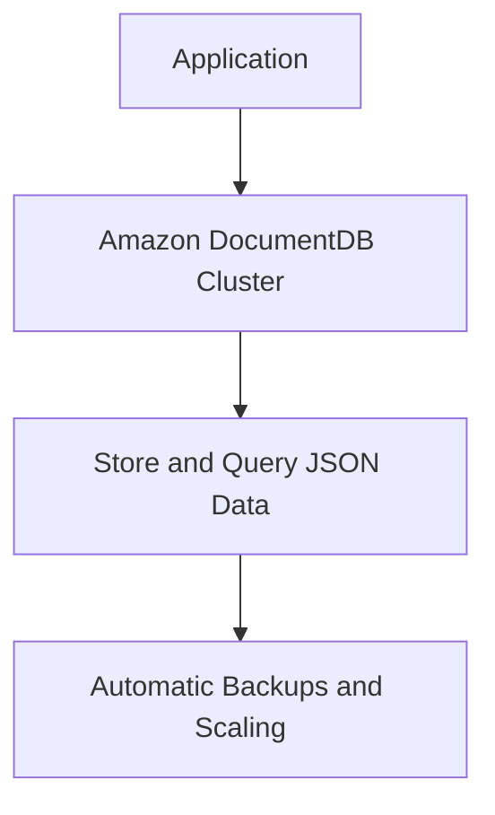
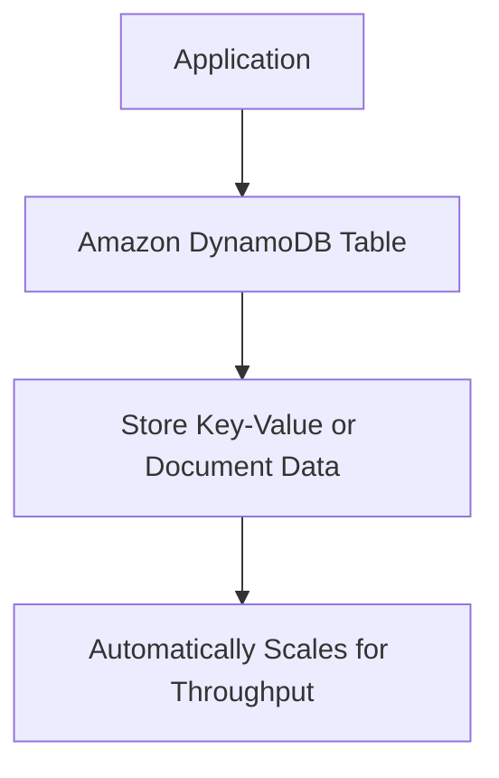
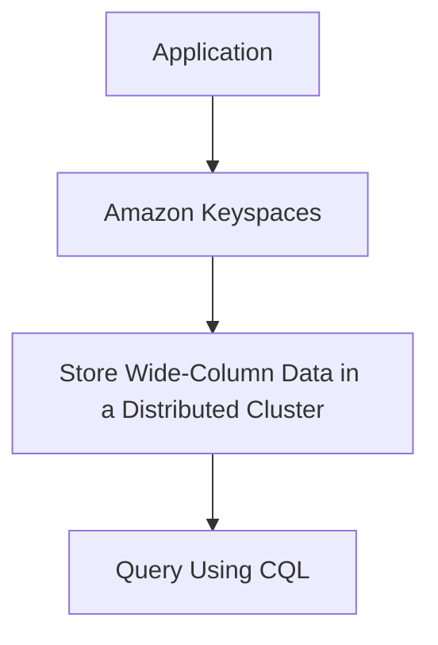
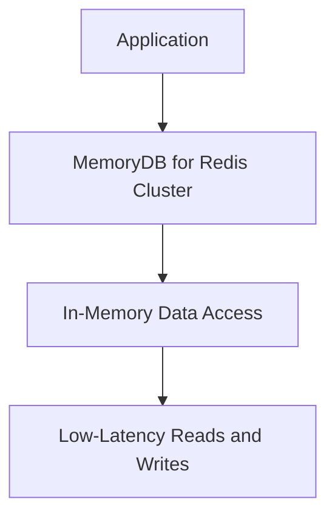
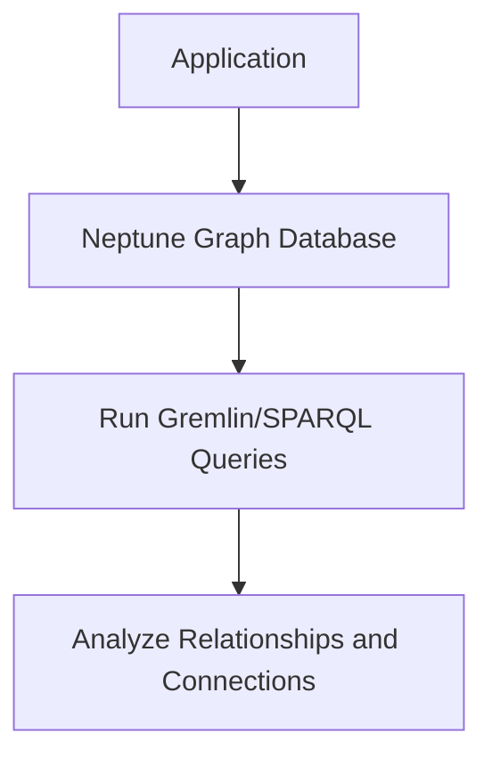
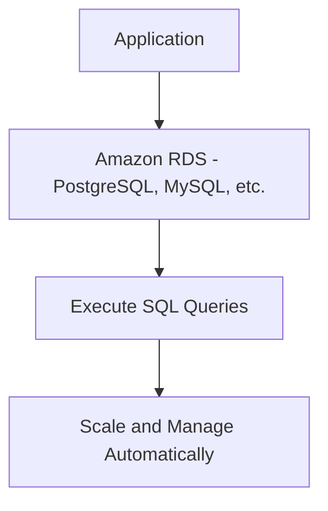
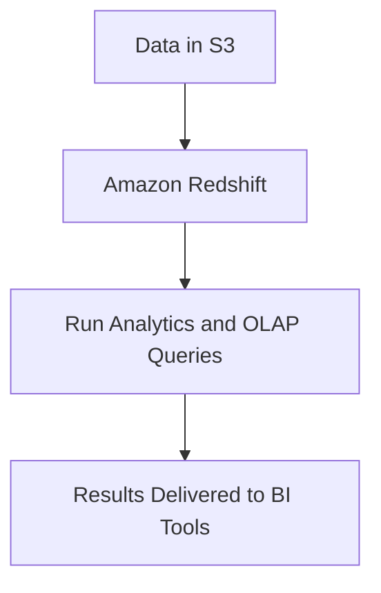

# Databases

### **1. Amazon DocumentDB (with MongoDB compatibility)**

### **Primary Functions:**

- **Amazon DocumentDB** is a fully managed, scalable, and highly available **NoSQL document database** that is **compatible with MongoDB**. It stores data in **JSON-like** documents, making it well-suited for document-oriented applications.

### **When to Use:**

- Use DocumentDB for **document-based applications** where data is represented in JSON, such as **content management systems** (CMS), **catalogs**, and **profile management**.
- Ideal for applications originally built on **MongoDB** that need managed services for scaling, backup, and security.

### **Antipatterns:**

- Avoid using DocumentDB for **relational** workloads that require **ACID transactions** across multiple tables. Consider using **Amazon RDS** for relational data.
- Avoid using DocumentDB if you need **low-latency reads** from multiple geographic regions. In such cases, **Amazon DynamoDB** or **global tables** may be more suitable.

### **Mermaid Diagram: Amazon DocumentDB Workflow**

### **AWS Documentation Link:**

- [Amazon DocumentDB](https://docs.aws.amazon.com/documentdb/latest/developerguide/what-is.html)

---

### **2. Amazon DynamoDB**

### **Primary Functions:**

- **Amazon DynamoDB** is a fully managed, serverless **NoSQL key-value and document database**. It provides **millisecond response times** and **automatic scaling**, making it ideal for high-throughput, low-latency workloads.

### **When to Use:**

- Use DynamoDB for **high-traffic, real-time applications** such as **gaming leaderboards**, **IoT data storage**, or **e-commerce**.
- Use **DynamoDB Streams** to capture real-time data changes for analytics or event-driven architectures.
- DynamoDB also supports **transactions** for ensuring **ACID** properties across multiple operations.

### **Antipatterns:**

- Avoid using DynamoDB for **complex query patterns** or **full-text search**. For advanced querying, **Amazon RDS** or **Amazon OpenSearch Service** may be more appropriate.
- Avoid using DynamoDB for workloads that require **strong consistency** across regions. Use **Amazon Aurora** with cross-region replication if strong consistency across regions is necessary.

### **Mermaid Diagram: Amazon DynamoDB Workflow**

### **AWS Documentation Link:**

- [Amazon DynamoDB](https://docs.aws.amazon.com/amazondynamodb/latest/developerguide/Introduction.html)

---

### **3. Amazon Keyspaces (for Apache Cassandra)**

### **Primary Functions:**

- **Amazon Keyspaces** is a fully managed service for **Apache Cassandra**. It enables you to run Cassandra workloads on AWS with **zero administration**, offering **CQL (Cassandra Query Language)** compatibility.

### **When to Use:**

- Use Amazon Keyspaces when migrating **Apache Cassandra** workloads to AWS or building new Cassandra-compatible applications that require horizontal scalability and high availability.
- Ideal for applications needing **large-scale, time-series data storage** or other distributed NoSQL workloads.

### **Antipatterns:**

- Avoid using Keyspaces if you need **relational data models** with **complex joins** or **transactions**. Instead, use **Amazon RDS** or **Amazon Aurora**.
- Avoid using Keyspaces for applications that require **consistent, low-latency writes** across multiple regions.

### **Mermaid Diagram: Amazon Keyspaces Workflow**

### **AWS Documentation Link:**

- [Amazon Keyspaces](https://docs.aws.amazon.com/keyspaces/latest/devguide/what-is-keyspaces.html)

---

### **4. Amazon MemoryDB for Redis**

### **Primary Functions:**

- **Amazon MemoryDB for Redis** is a fully managed, **in-memory database** compatible with **Redis**, offering **durability**, **multi-AZ** availability, and **sub-millisecond latency** for applications that require fast access to data.

### **When to Use:**

- Use MemoryDB for **real-time applications** like **leaderboards**, **session stores**, or **real-time analytics** that require low-latency data access.
- Ideal for **caching**, **real-time data processing**, and applications that need **eventual consistency** with durability.

### **Antipatterns:**

- Avoid using MemoryDB for Redis for **long-term, persistent storage**. It's optimized for in-memory workloads rather than high-durability, long-term storage.
- Avoid using MemoryDB for complex query processing or analytics where **SQL-based querying** is necessary. Consider **Amazon RDS** or **Amazon Redshift** for those use cases.

### **Mermaid Diagram: Amazon MemoryDB Workflow**

### **AWS Documentation Link:**

- [Amazon MemoryDB for Redis](https://docs.aws.amazon.com/memorydb/latest/devguide/what-is-memorydb.html)

---

### **5. Amazon Neptune**

### **Primary Functions:**

- **Amazon Neptune** is a fully managed **graph database service** that supports both **property graph** and **RDF graph models**, enabling you to run highly connected data workloads at scale.

### **When to Use:**

- Use Neptune when your application requires **complex relationships** and highly connected data, such as **social networks**, **fraud detection**, **recommendation engines**, and **knowledge graphs**.
- Neptune supports **Gremlin** and **SPARQL** queries for querying graph data efficiently.

### **Antipatterns:**

- Avoid using Neptune for traditional **relational data** that requires SQL-based querying or **key-value** data patterns. Use **Amazon RDS** or **DynamoDB** for those workloads.
- Avoid using Neptune if your application needs strong relational joins or frequent aggregate queries, as graph databases are optimized for relationships, not joins.

### **Mermaid Diagram: Amazon Neptune Workflow**

### **AWS Documentation Link:**

- [Amazon Neptune](https://docs.aws.amazon.com/neptune/latest/userguide/intro.html)

---

### **6. Amazon RDS (Relational Database Service)**

### **Primary Functions:**

- **Amazon RDS** is a managed relational database service that supports multiple database engines, including **MySQL**, **PostgreSQL**, **MariaDB**, **Oracle**, and **SQL Server**. It automates tasks such as backups, patching, and scaling.

### **When to Use:**

- Use RDS for traditional **relational database workloads**, such as **ERP systems**, **CRM platforms**, and **financial applications** that require **ACID compliance**, **SQL querying**, and **transactional integrity**.
- Ideal for use cases requiring **managed relational databases** without the need for infrastructure management.

### **Antipatterns:**

- Avoid using RDS for **NoSQL** or **document-based** workloads. Instead, consider **Amazon DynamoDB** or **DocumentDB**.
- Avoid using RDS for **large-scale analytics** and data warehousing. Use **Amazon Redshift** for large-scale analytics.

### **Mermaid Diagram: Amazon RDS Workflow**

### **AWS Documentation Link:**

- [Amazon RDS](https://docs.aws.amazon.com/AmazonRDS/latest/UserGuide/Welcome.html)

---

### **7. Amazon Redshift**

### **Primary Functions:**

- **Amazon Redshift** is a fully managed, **petabyte-scale data warehouse** designed for **OLAP** (Online Analytical Processing) and large-scale analytics on structured data.
- Redshift offers fast query performance using **columnar storage**, **massively parallel processing (MPP)**, and **compression**.

### **When to Use:**

- Use Redshift for large-scale **data analytics** and **business intelligence (BI)** workloads, such as running complex SQL queries across petabytes of data.
- Ideal for **data warehousing**, **reporting**, and use cases requiring fast queries on large datasets stored in **S3**

using **Redshift Spectrum**.

### **Antipatterns:**

- Avoid using Redshift for **transactional workloads** requiring frequent updates and inserts. Use **RDS** or **DynamoDB** for transactional systems.
- Avoid using Redshift for small-scale datasets that do not require complex analytics. It may be overkill for simple querying.

### **Mermaid Diagram: Amazon Redshift Workflow**

### **AWS Documentation Link:**

- [Amazon Redshift](https://docs.aws.amazon.com/redshift/latest/mgmt/welcome.html)

---