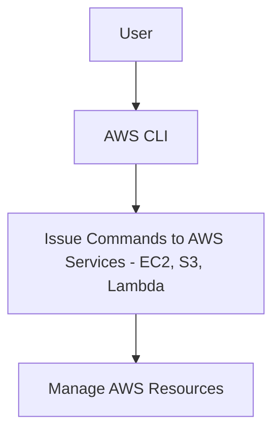
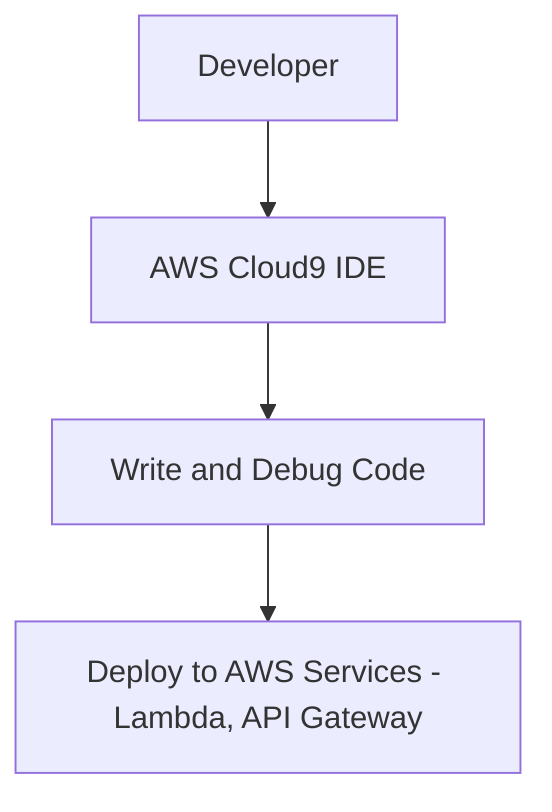
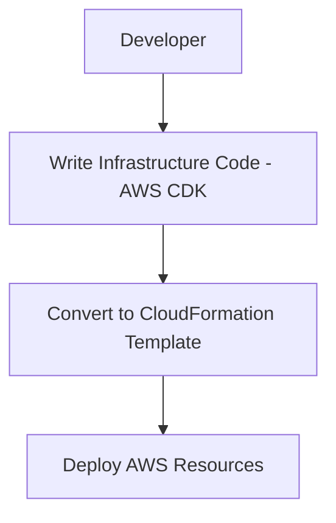
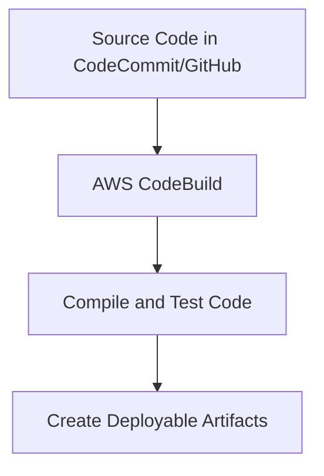
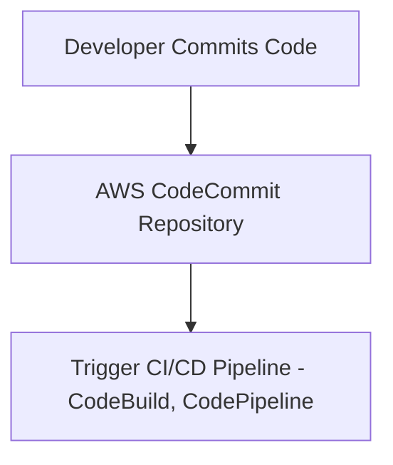
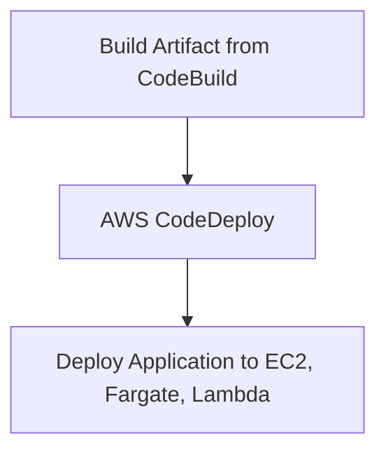
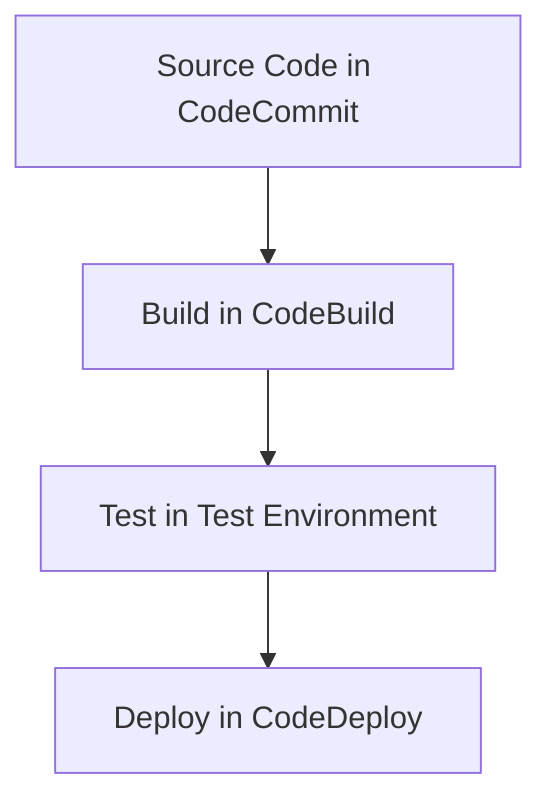

# Developer Tools

### **1. AWS CLI (Command Line Interface)**

### **Primary Functions:**

- **AWS CLI** is a command-line tool that allows you to interact with AWS services via commands. It provides a way to automate tasks, manage AWS resources, and run scripts.
- You can manage services like **S3**, **EC2**, **Lambda**, **IAM**, and many more directly from your terminal.

### **When to Use:**

- Use AWS CLI for **automation** tasks such as scripting infrastructure deployments, managing resources, or collecting log data.
- Ideal for **administrative tasks**, batch jobs, or integrating with CI/CD pipelines where interacting with AWS services is needed programmatically.

### **Antipatterns:**

- Avoid using the CLI for tasks that require complex orchestration or are better handled by **infrastructure as code** tools (e.g., AWS CDK or CloudFormation).
- Avoid using CLI for tasks that need to be highly repeatable with a graphical interface, as it's more suited for programmatic interactions.

### **Mermaid Diagram: AWS CLI Interaction**

### **AWS Documentation Link:**

- [AWS CLI Documentation](https://docs.aws.amazon.com/cli/latest/userguide/cli-configure-quickstart.html)

---

### **2. AWS Cloud9**

### **Primary Functions:**

- **AWS Cloud9** is a cloud-based integrated development environment (IDE) that allows you to write, run, and debug code with just a browser. It includes a code editor, terminal, and debugger.
- Cloud9 integrates with AWS services, enabling users to run **serverless applications**, manage infrastructure, and interact with AWS resources directly from the IDE.

### **When to Use:**

- Use Cloud9 when developing **cloud-based applications** that require direct integration with AWS services (e.g., Lambda functions, API Gateway).
- Ideal for distributed teams who need a collaborative development environment with shared access to coding projects.

### **Antipatterns:**

- Avoid using Cloud9 for **high-performance, resource-heavy development tasks** that require local resources (e.g., large compiles, GPU-intensive workloads).

### **Mermaid Diagram: AWS Cloud9 Development Workflow**

### **AWS Documentation Link:**

- [AWS Cloud9](https://docs.aws.amazon.com/cloud9/latest/user-guide/what-is-cloud9.html)

---

### **3. AWS Cloud Development Kit (AWS CDK)**

### **Primary Functions:**

- **AWS CDK** is an **infrastructure as code (IaC)** framework that allows developers to define cloud infrastructure using familiar programming languages like **Python**, **JavaScript**, **TypeScript**, **Java**, and **C#**.
- It generates **CloudFormation** templates from code and simplifies the deployment and management of AWS resources.

### **When to Use:**

- Use AWS CDK when you need to **automate infrastructure deployment** and prefer using a **programming language** over writing YAML/JSON templates.
- Ideal for developers familiar with coding who want to define **infrastructure in code** alongside application logic.

### **Antipatterns:**

- Avoid using CDK if your team is more comfortable with **declarative infrastructure management** (e.g., using CloudFormation templates directly).
- Avoid using CDK for environments that require strict separation between infrastructure and application code.

### **Mermaid Diagram: AWS CDK Workflow**

### **AWS Documentation Link:**

- [AWS CDK](https://docs.aws.amazon.com/cdk/latest/guide/home.html)

---

### **4. AWS CodeBuild**

### **Primary Functions:**

- **AWS CodeBuild** is a fully managed **build service** that compiles source code, runs tests, and produces deployable artifacts. It is often part of a CI/CD pipeline.
- It supports a wide range of programming languages and build environments, including custom build environments using Docker images.

### **When to Use:**

- Use CodeBuild to automate the **build and testing** of your applications as part of a CI/CD pipeline. It integrates with services like **CodeCommit**, **CodePipeline**, and **GitHub**.
- Ideal for **continuous integration** workflows, where frequent code commits need to be tested and packaged.

### **Antipatterns:**

- Avoid using CodeBuild for **manual testing or deployment**. It is intended for **automated build processes**.
- Avoid using CodeBuild for managing long-running tasks or workflows not related to code compilation and testing.

### **Mermaid Diagram: AWS CodeBuild Workflow**

### **AWS Documentation Link:**

- [AWS CodeBuild](https://docs.aws.amazon.com/codebuild/latest/userguide/welcome.html)

---

### **5. AWS CodeCommit**

### **Primary Functions:**

- **AWS CodeCommit** is a fully managed source control service that hosts **Git repositories**. It allows teams to collaborate on code in a secure and scalable environment.
- It integrates with other AWS services like **CodeBuild**, **CodePipeline**, and **IAM** for managing access and automation.

### **When to Use:**

- Use CodeCommit when you need **Git-based version control** for your source code and want it fully integrated into AWS. It is ideal for organizations already using AWS services and looking for a **secure, scalable repository**.

### **Antipatterns:**

- Avoid using CodeCommit if your team prefers to use external source control systems such as **GitHub** or **Bitbucket**, especially if integrated workflows and third-party tools are already in place.

### **Mermaid Diagram: AWS CodeCommit Workflow**

### **AWS Documentation Link:**

- [AWS CodeCommit](https://docs.aws.amazon.com/codecommit/latest/userguide/welcome.html)

---

### **6. AWS CodeDeploy**

### **Primary Functions:**

- **AWS CodeDeploy** automates the deployment of applications to various compute services, including **Amazon EC2**, **Fargate**, **Lambda**, and **on-premises servers**.
- It supports **blue/green deployments**, **rolling updates**, and **canary releases** to reduce downtime and deployment risks.

### **When to Use:**

- Use CodeDeploy when you want to automate the **deployment process** and need features like **blue/green deployment** or **automatic rollback**.
- Ideal for continuous deployment workflows, where you need to **automate application updates** across multiple environments.

### **Antipatterns:**

- Avoid using CodeDeploy for **manually intensive deployment processes** or environments where you don’t need automated deployments.

### **Mermaid Diagram: AWS CodeDeploy Workflow**

### **AWS Documentation Link:**

- [AWS CodeDeploy](https://docs.aws.amazon.com/codedeploy/latest/userguide/welcome.html)

---

### **7. AWS CodePipeline**

### **Primary Functions:**

- **AWS CodePipeline** is a fully managed CI/CD service that automates the build, test, and deploy phases of your application. It integrates with services like **CodeCommit**, **GitHub**, **CodeBuild**, **CodeDeploy**, and **Lambda**.
- CodePipeline enables **continuous delivery** by defining stages in a pipeline, such as source, build, test, and deployment stages.

### **When to Use:**

- Use CodePipeline to automate your entire **CI/CD pipeline**, from code commit to production deployment, ensuring that code changes are tested and deployed efficiently.
- Ideal for DevOps teams that need **end-to-end automation** for their software delivery pipeline.

### **Antipatterns:**

- Avoid using CodePipeline for small, single-step deployments. For simpler workflows, **CodeDeploy** or **AWS Lambda** deployment might be sufficient.
- Avoid using CodePipeline without proper integration of tests and stages—this service is intended for **multi-step automated processes**.

### **Mermaid Diagram: AWS CodePipeline Workflow**

### **AWS Documentation Link:**

- [AWS CodePipeline](https://docs.aws.amazon.com/codepipeline/latest/userguide/welcome.html)

---