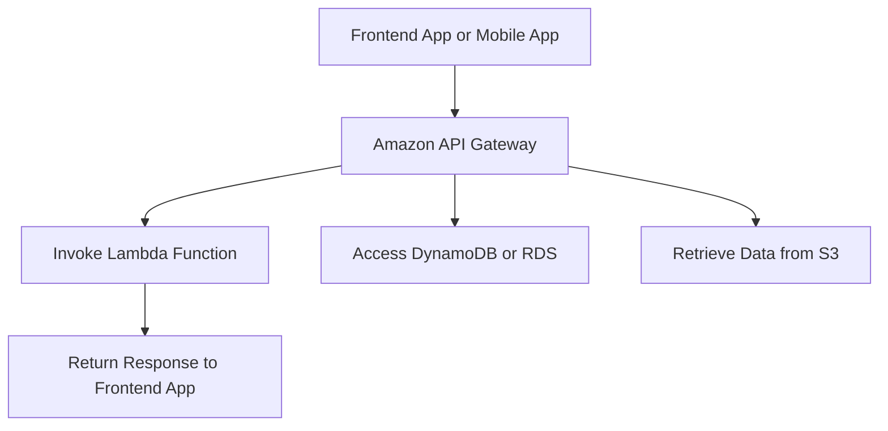

# Frontend Web and Mobile

### **Amazon API Gateway**

### **Primary Functions:**

- **Amazon API Gateway** is a fully managed service for creating and managing **RESTful APIs**, **WebSocket APIs**, and **HTTP APIs**. It acts as a **gateway** for applications to interact with backend services such as **AWS Lambda**, **Amazon EC2**, **Amazon S3**, **Amazon DynamoDB**, and **Amazon RDS**.
- API Gateway handles tasks such as **traffic management**, **authorization**, **rate limiting**, **CORS**, and **monitoring** for APIs.

### **When to Use:**

- Use Amazon API Gateway to expose backend services to the internet securely and efficiently, particularly when integrating with **serverless backends** like **AWS Lambda**.
- Ideal for building **mobile apps**, **web applications**, or any client-server architecture that requires API communication.
- Use for **event-driven architectures**, where front-end applications need to trigger **Lambda functions** or other AWS services via API calls.

### **Antipatterns:**

- Avoid using API Gateway for **streaming workloads** that require continuous connections with low latency. Instead, consider using **Amazon Kinesis** or **AWS AppSync** for real-time data synchronization.
- Avoid using API Gateway for applications that don’t require fine-grained control over API requests, as it adds complexity and cost when unnecessary.

### **Mermaid Diagram: Amazon API Gateway Integration Workflow**

### **AWS Documentation Link:**

- [Amazon API Gateway](https://docs.aws.amazon.com/apigateway/latest/developerguide/welcome.html)

---

### **Key Features and Benefits of Amazon API Gateway**

1. **Security**: API Gateway allows you to control access using **AWS IAM roles**, **Cognito User Pools**, **Lambda authorizers**, or **API keys**. You can enforce security policies at different stages, ensuring your APIs are only accessible to authorized users.
2. **Throttling and Rate Limiting**: API Gateway supports setting limits on the number of requests per second (RPS) to protect your backend systems from being overwhelmed by traffic spikes.
3. **CORS Support**: API Gateway provides built-in support for **Cross-Origin Resource Sharing (CORS)**, allowing client-side applications in web browsers to communicate with APIs hosted on different domains.
4. **Monitoring and Analytics**: API Gateway integrates with **Amazon CloudWatch** to provide detailed metrics and logs about API performance, errors, and usage.
5. **Caching**: API Gateway supports **response caching**, reducing the number of API requests hitting your backend systems and improving API performance for frequently accessed data.

---

### **Common Use Cases for Amazon API Gateway**

1. **Serverless Application Backends**:
    - Combine **API Gateway** with **AWS Lambda** to create fully serverless application backends. API Gateway handles the request routing, while Lambda processes the business logic and returns the result.
2. **Mobile and Web APIs**:
    - Use API Gateway to create RESTful APIs for mobile and web applications, allowing apps to interact with AWS services such as **DynamoDB**, **S3**, and **RDS** to retrieve or manipulate data.
3. **Microservices Architectures**:
    - API Gateway can be used as a front door to your **microservices** running in **Amazon ECS**, **EKS**, or **EC2**. This allows for a single, secure entry point to your backend services.
4. **Third-Party API Integration**:
    - Use API Gateway to integrate and expose third-party APIs or on-premises services by using **VPC Link** or other connectivity solutions, enabling external services to securely access internal systems.

---

### **Common Pitfalls or Challenges**

1. **Latency Concerns**:
    - API Gateway may introduce additional latency compared to directly invoking backend services. To mitigate this, consider using **caching** and properly tuning rate limits.
2. **Costs**:
    - If not properly managed, using API Gateway with high traffic can result in **unexpected costs**. Using **throttling**, **API key rate limits**, and enabling **caching** where appropriate can reduce costs.
3. **Payload Size Limits**:
    - API Gateway enforces limits on the size of request and response payloads (6 MB for REST APIs and 128 KB for WebSocket APIs). Exceeding these limits can cause errors, so it's important to consider data compression or splitting large requests into smaller chunks.

---