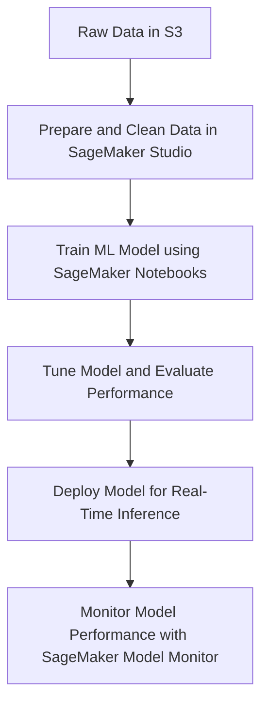

# Machine Learning

### **Amazon SageMaker**

### **Primary Functions:**

- **Amazon SageMaker** is a fully managed service that covers the entire machine learning (ML) lifecycle, from **data preparation**, **model training**, and **tuning**, to **deployment** and **monitoring** of machine learning models.
- It integrates well with other AWS services like **S3** (for data storage), **AWS Lambda** (for real-time inference), and **Amazon Redshift** (for data querying).
- SageMaker provides key features like **SageMaker Studio**, **AutoML**, **model hosting**, and **notebooks** for experimentation.

### **Key Components**:

1. **SageMaker Studio**: An integrated development environment (IDE) for building, training, and deploying ML models.
2. **SageMaker Notebooks**: Managed Jupyter notebooks for data exploration and experimentation.
3. **SageMaker Autopilot**: Automated machine learning (AutoML) that trains and tunes the best model for your data.
4. **SageMaker Ground Truth**: A tool for labeling data at scale using built-in workflows.
5. **SageMaker Model Monitor**: Continuously monitors deployed models for concept drift and performance degradation.

### **When to Use:**

- Use Amazon SageMaker to **train and deploy machine learning models** without managing underlying infrastructure. It simplifies building models by providing integrated tools for **data preparation**, **training**, **evaluation**, and **deployment**.
- SageMaker is ideal for teams that need to **quickly experiment** with machine learning and deploy models into **production environments** while handling versioning and scalability.

### **Antipatterns:**

- Avoid using SageMaker for simple data transformations that don’t involve machine learning (consider **AWS Glue** for ETL tasks).
- Avoid using SageMaker when only traditional SQL-based queries are needed for analytics; consider **Amazon Redshift** or **Athena** for such workloads.

### **Mermaid Diagram: Amazon SageMaker Workflow**

---

### **Key Features and Benefits of Amazon SageMaker**

1. **End-to-End ML Workflow**: SageMaker covers the entire machine learning workflow, from **data preparation** to **model monitoring** after deployment. It removes the complexity of setting up infrastructure for model training and scaling.
2. **Fully Managed**: SageMaker is a **fully managed service**, meaning users don't have to worry about provisioning compute instances for model training or hosting. This allows developers to focus on the **model** and **data** rather than on infrastructure.
3. **AutoML with SageMaker Autopilot**: **SageMaker Autopilot** simplifies model development by automatically selecting algorithms, training, and tuning the model based on your dataset. It’s a good option for users who may not have in-depth ML expertise.
4. **Data Labeling with Ground Truth**: **SageMaker Ground Truth** helps create highly accurate labeled datasets using built-in workflows, human labeling tasks, and machine learning models to automate parts of the process.
5. **Integration with AWS Services**: SageMaker integrates with **Amazon S3** for data storage, **Lambda** for serverless inference, and **Amazon Athena** or **Redshift** for data querying. This makes it a key component in any **data pipeline** or **AI-driven application** on AWS.

---

### **Common Use Cases for Amazon SageMaker**

1. **Real-Time Predictions**:
    - With **SageMaker Hosting Services**, you can deploy models as endpoints to serve real-time inference to applications like **fraud detection**, **personalization engines**, and **real-time recommendations**.
2. **Batch Predictions**:
    - For applications where predictions don’t need to be served in real-time, such as generating predictions on a large dataset stored in **S3**, you can use **SageMaker Batch Transform** to process the data and store the results back in S3.
3. **Data Labeling**:
    - Use **SageMaker Ground Truth** for creating high-quality, labeled training datasets. It uses **machine learning-assisted labeling** to reduce manual work and improve the accuracy of the labeled data.
4. **Model Retraining and Monitoring**:
    - SageMaker helps **retrain models** automatically using **SageMaker Pipelines**, a fully managed service that automates the workflow for model building, deployment, and monitoring. It also supports model drift detection with **Model Monitor**.

---

### **Common Pitfalls or Challenges**

1. **Cost Management**:
    - Training large ML models can be resource-intensive. To manage costs, it’s important to **optimize instance types** and **set up billing alerts** when running SageMaker jobs.
2. **Data Preparation**:
    - Data preparation and feature engineering can become complex. Leveraging tools like **SageMaker Data Wrangler** or integrating with **AWS Glue** can streamline this process.
3. **Model Performance**:
    - Poorly tuned models can result in suboptimal performance. **SageMaker Hyperparameter Tuning** can automatically adjust model parameters to achieve the best results.
4. **Scaling Challenges**:
    - Managing **inference scaling** during peak usage periods requires proper scaling policies. SageMaker provides **Auto Scaling** for real-time endpoints, but these need to be configured based on expected traffic.

---

### **AWS Documentation Links**

- [Amazon SageMaker Overview](https://aws.amazon.com/sagemaker/)
- [SageMaker Documentation](https://docs.aws.amazon.com/sagemaker/latest/dg/whatis.html)
- [SageMaker Autopilot](https://docs.aws.amazon.com/sagemaker/latest/dg/autopilot-automate-model-development.html)
- [SageMaker Model Monitor](https://docs.aws.amazon.com/sagemaker/latest/dg/model-monitor.html)

---