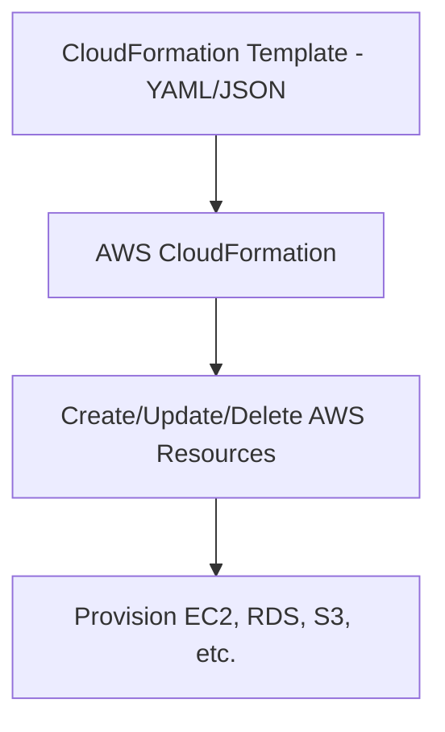
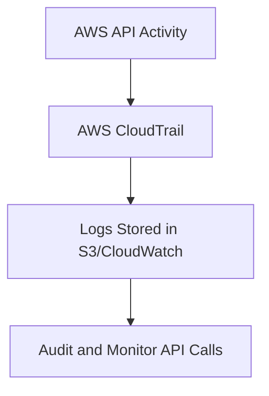
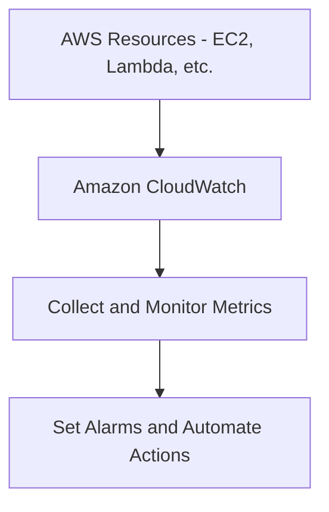
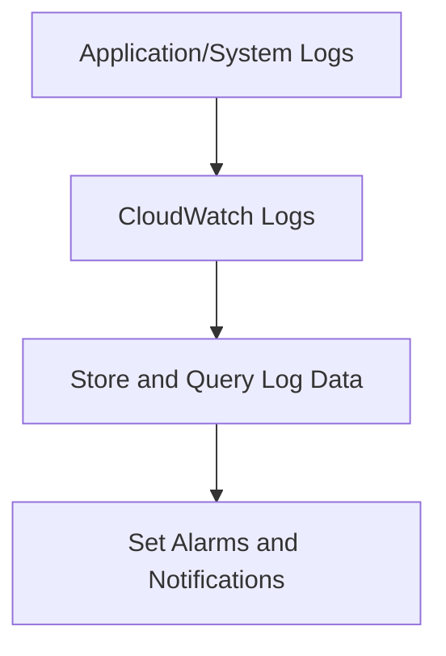
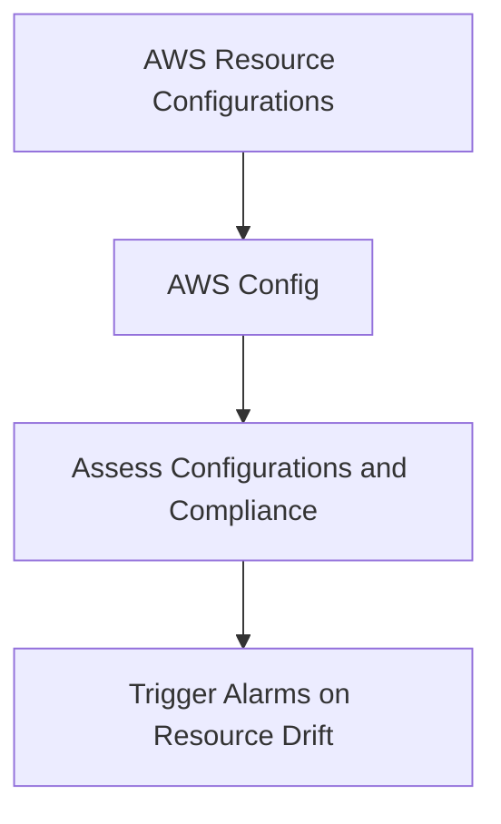
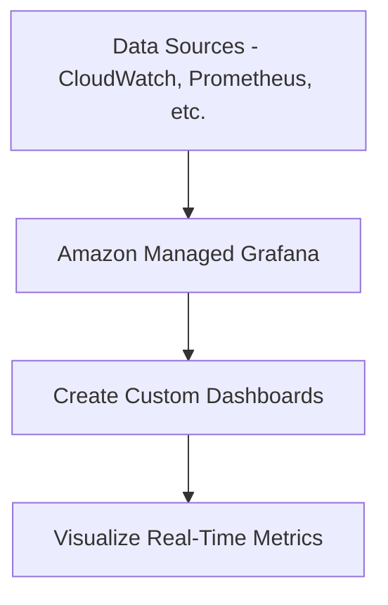
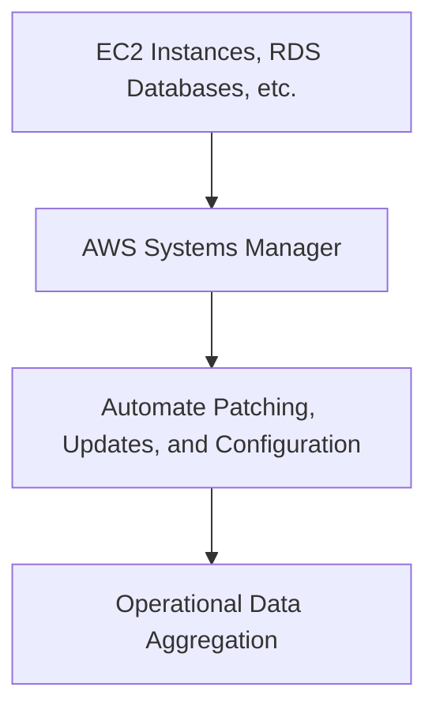
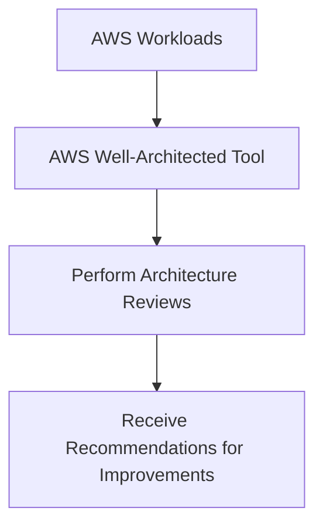

# Management and Governance

### **1. AWS CloudFormation**

### **Primary Functions:**

- **AWS CloudFormation** is an **Infrastructure as Code (IaC)** service that allows you to **model, provision, and manage AWS resources** through templates. CloudFormation automates resource provisioning based on predefined templates in **JSON** or **YAML**.
- It supports **stack creation, updates, and deletion**, ensuring consistent and repeatable infrastructure deployment.

### **When to Use:**

- Use CloudFormation to **automate infrastructure deployments**, manage dependencies between services, and ensure consistency across environments (e.g., dev, staging, and production).
- Ideal for managing complex multi-service architectures, such as setting up **VPCs**, **EC2 instances**, **RDS databases**, and more.

### **Antipatterns:**

- Avoid using CloudFormation for **simple, one-off resource provisioning** where manual intervention might be quicker and more efficient (e.g., a single S3 bucket for testing).
- Avoid using CloudFormation if your team prefers a **code-driven approach**, as **AWS CDK** offers more flexibility for developers.

### **Mermaid Diagram: AWS CloudFormation Workflow**

### **AWS Documentation Link:**

- [AWS CloudFormation](https://docs.aws.amazon.com/AWSCloudFormation/latest/UserGuide/Welcome.html)

---

### **2. AWS CloudTrail**

### **Primary Functions:**

- **AWS CloudTrail** provides **auditing and monitoring** of all API calls and actions made across AWS services. It helps with **governance, compliance, and operational auditing** by logging actions taken by users, roles, or services.
- CloudTrail logs **API calls**, **IAM actions**, **S3 bucket access**, and other activities, and it stores logs in **S3** or sends them to **CloudWatch Logs**.

### **When to Use:**

- Use CloudTrail for tracking **API usage**, **security auditing**, and **compliance reporting** across all AWS services. It's crucial for **security incident investigations** and tracking changes to your environment.

### **Antipatterns:**

- Avoid using CloudTrail as a **real-time monitoring tool**; it is better suited for **audit trails** and **historical event tracking**. For real-time monitoring, use **CloudWatch Alarms**.
- Avoid relying on CloudTrail for **detailed application logs**—use **CloudWatch Logs** for those scenarios.

### **Mermaid Diagram: AWS CloudTrail Workflow**

### **AWS Documentation Link:**

- [AWS CloudTrail](https://docs.aws.amazon.com/awscloudtrail/latest/userguide/cloudtrail-user-guide.html)

---

### **3. Amazon CloudWatch**

### **Primary Functions:**

- **Amazon CloudWatch** is a monitoring service for **collecting metrics, logs, and event data** from AWS services and custom applications. It enables you to set **alarms**, **visualize performance metrics**, and **trigger automated actions** based on metric thresholds.
- CloudWatch is essential for tracking the health and performance of **AWS resources** like EC2, RDS, Lambda, and more.

### **When to Use:**

- Use CloudWatch to monitor the **operational health** of AWS resources, visualize metrics (e.g., CPU usage, disk I/O), and set up **automated responses** when thresholds are breached (e.g., auto-scaling or notifying DevOps).
- Ideal for monitoring **serverless applications**, **containerized workloads**, and **custom metrics**.

### **Antipatterns:**

- Avoid using CloudWatch for **full-featured log management**—it's best for basic logs. For complex log searching and analysis, consider **Amazon OpenSearch Service**.

### **Mermaid Diagram: Amazon CloudWatch Workflow**

### **AWS Documentation Link:**

- [Amazon CloudWatch](https://docs.aws.amazon.com/AmazonCloudWatch/latest/monitoring/WhatIsCloudWatch.html)

---

### **4. Amazon CloudWatch Logs**

### **Primary Functions:**

- **Amazon CloudWatch Logs** allows you to monitor, store, and access **log files** from **AWS services**, **applications**, and **custom resources**. It provides insights into system behavior by aggregating logs in **CloudWatch** and allowing you to run **queries** and set **alarms** on log data.

### **When to Use:**

- Use CloudWatch Logs for **application logs**, **system logs**, and **custom logs** to troubleshoot, analyze, and monitor log data across services. It integrates seamlessly with **CloudWatch Metrics** and **Alarms**.

### **Antipatterns:**

- Avoid using CloudWatch Logs for **extensive log retention and analysis** beyond a certain period or when needing complex search capabilities—consider **Amazon OpenSearch Service** for advanced use cases.

### **Mermaid Diagram: CloudWatch Logs Workflow**

### **AWS Documentation Link:**

- [Amazon CloudWatch Logs](https://docs.aws.amazon.com/AmazonCloudWatch/latest/logs/WhatIsCloudWatchLogs.html)

---

### **5. AWS Config**

### **Primary Functions:**

- **AWS Config** is a service that enables you to **assess, audit, and evaluate the configuration** of AWS resources over time. It continuously monitors configurations and compares them against desired states, notifying users of changes.
- AWS Config provides a detailed history of configuration changes and compliance status for resources like **EC2**, **RDS**, **IAM roles**, and more.

### **When to Use:**

- Use AWS Config to track and ensure that your AWS resources comply with specific configurations and policies. It is ideal for **compliance audits**, **security governance**, and **resource drift detection**.

### **Antipatterns:**

- Avoid using AWS Config for **operational monitoring** of metrics like performance or uptime. It's designed for configuration monitoring, not real-time operational health checks (use **CloudWatch** for that).

### **Mermaid Diagram: AWS Config Workflow**

### **AWS Documentation Link:**

- [AWS Config](https://docs.aws.amazon.com/config/latest/developerguide/WhatIsConfig.html)

---

### **6. Amazon Managed Grafana**

### **Primary Functions:**

- **Amazon Managed Grafana** is a fully managed service for **visualizing operational data** across multiple data sources, including **CloudWatch**, **Prometheus**, **Elasticsearch**, and more. It offers powerful dashboards for real-time analytics and insights.

### **When to Use:**

- Use Grafana to build **real-time, interactive dashboards** for monitoring AWS resources, IoT systems, or application performance using data from CloudWatch or other sources.
- Ideal for teams that need **custom visualizations** or **integrations** with multiple monitoring systems in a unified dashboard.

### **Antipatterns:**

- Avoid using Grafana if you only need simple visualizations from AWS services—**CloudWatch Dashboards** might be sufficient for those use cases.

### **Mermaid Diagram: Managed Grafana Workflow**

### **AWS Documentation Link:**

- [Amazon Managed Grafana](https://docs.aws.amazon.com/grafana/latest/userguide/what-is-Amazon-Managed-Grafana.html)

---

### **7. AWS Systems Manager**

### **Primary Functions:**

- **AWS Systems Manager** is a service that provides a unified interface to **view operational data** from multiple AWS services and automate operational tasks such as **patch management**, **run commands**, and **resource inventory**.
- Systems Manager integrates with **CloudWatch**, **AWS Config**, and other AWS services for managing and automating infrastructure tasks.

### **When to Use:**

- Use Systems Manager for **automating operational tasks** like **instance patching**, **runbook automation**, **resource management**, and **application configuration** across AWS environments.
- Ideal for managing large fleets of EC2 instances, automating operational tasks, and maintaining compliance through automation.

### *Antipatterns:

- *
- Avoid using Systems Manager for **real-time monitoring** and **alerting**, as it is primarily used for automation and operational tasks. Use **CloudWatch** for real-time metrics and alerts.

### **Mermaid Diagram: AWS Systems Manager Workflow**

### **AWS Documentation Link:**

- [AWS Systems Manager](https://docs.aws.amazon.com/systems-manager/latest/userguide/what-is-systems-manager.html)

---

### **8. AWS Well-Architected Tool**

### **Primary Functions:**

- The **AWS Well-Architected Tool** helps you **review and improve the architecture** of your AWS-based workloads by following best practices outlined in the **AWS Well-Architected Framework**. It provides insights into your workloads' **reliability**, **performance**, **security**, **cost optimization**, and **operational excellence**.

### **When to Use:**

- Use the Well-Architected Tool to **evaluate and optimize your architecture** based on the AWS Well-Architected Framework. It’s especially useful when preparing for architecture reviews or cloud infrastructure optimization.

### **Antipatterns:**

- Avoid using the Well-Architected Tool for **real-time monitoring or operational management**. It’s primarily designed for **architecture assessments** and **best-practice reviews**.

### **Mermaid Diagram: Well-Architected Tool Workflow**

### **AWS Documentation Link:**

- [AWS Well-Architected Tool](https://docs.aws.amazon.com/wellarchitected/latest/userguide/intro.html)

---