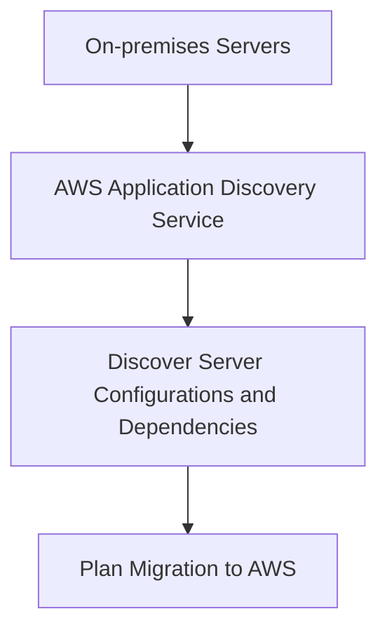
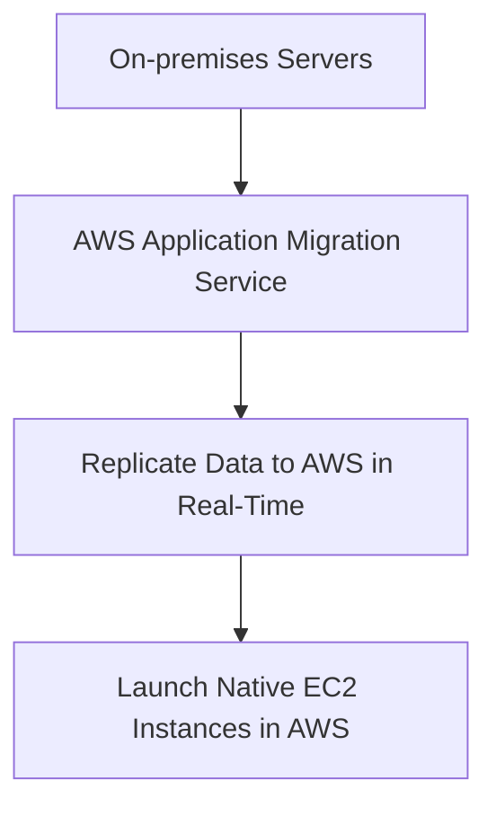
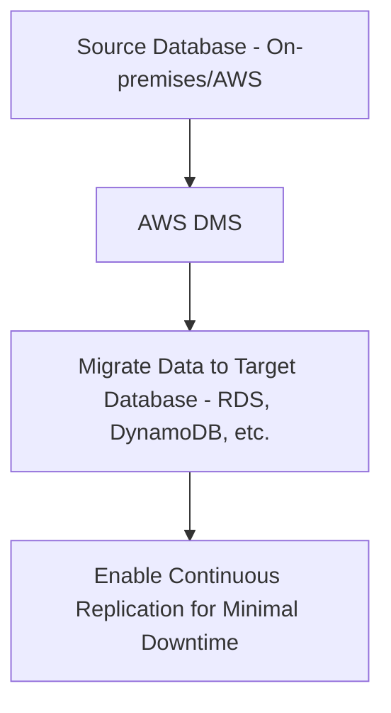
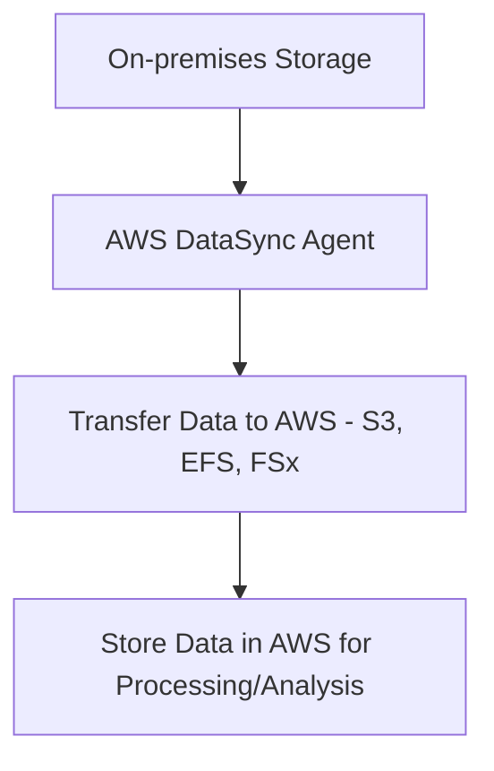
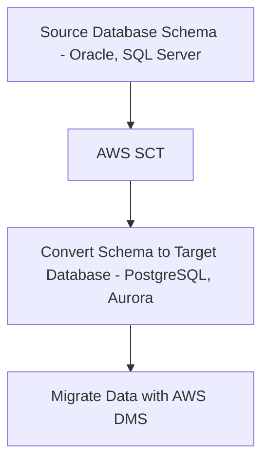
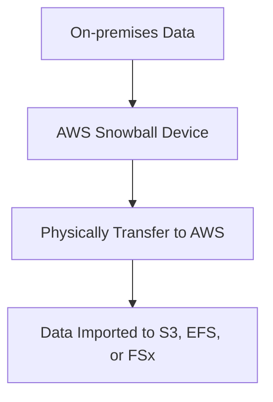
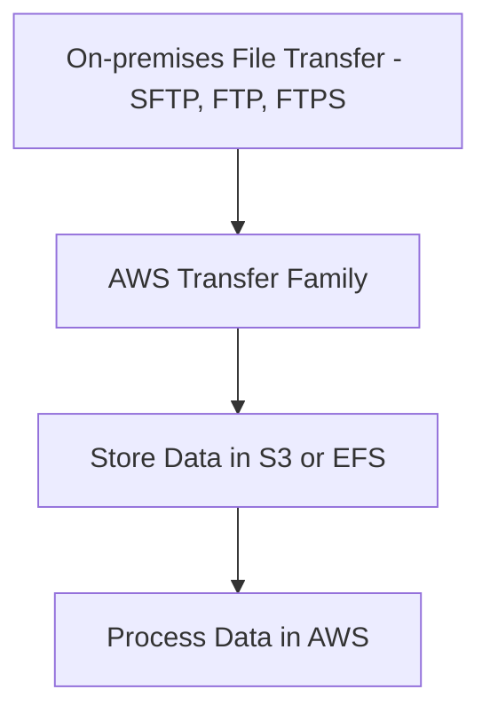

# Migration and Transfer

### **1. AWS Application Discovery Service**

### **Primary Functions:**

- **AWS Application Discovery Service** helps enterprises **plan application migrations** to AWS by discovering and collecting **information about on-premises data centers**. It identifies server configurations, dependencies, and performance data to facilitate **migration planning**.
- It provides detailed insights into **resource usage** and **application dependencies**, which are critical for migrating complex environments.

### **When to Use:**

- Use AWS Application Discovery Service for **migrating on-premises applications** to AWS, especially for **complex, multi-tier applications** where dependency mapping and resource analysis are required.

### **Antipatterns:**

- Avoid using this service for **small-scale migrations** where resource discovery and dependency mapping are not critical.
- It is not suitable for **real-time migration tasks**—use **AWS Application Migration Service** for the actual migration.

### **Mermaid Diagram: Application Discovery Workflow**

### **AWS Documentation Link:**

- [AWS Application Discovery Service](https://docs.aws.amazon.com/application-discovery/latest/userguide/what-is-appdiscovery.html)

---

### **2. AWS Application Migration Service (AWS MGN)**

### **Primary Functions:**

- **AWS Application Migration Service (MGN)** simplifies the migration of **on-premises servers** to AWS by converting servers to **native AWS instances**. It continuously replicates data from the source servers to AWS, minimizing downtime during the migration process.
- MGN automates **lift-and-shift migrations**, providing a cost-effective way to migrate applications without requiring changes to the source environment.

### **When to Use:**

- Use AWS MGN when performing **lift-and-shift migrations** of on-premises servers or VMs to AWS. It is ideal for reducing **downtime** and **risk** during migrations by offering near real-time replication.

### **Antipatterns:**

- Avoid using AWS MGN for **modernization** or **re-architecting** applications during migration. For those scenarios, consider services like **AWS Elastic Beanstalk** or **AWS Lambda** for re-architected cloud-native applications.

### **Mermaid Diagram: AWS MGN Workflow**

### **AWS Documentation Link:**

- [AWS Application Migration Service](https://docs.aws.amazon.com/mgn/latest/ug/what-is-application-migration-service.html)

---

### **3. AWS Database Migration Service (AWS DMS)**

### **Primary Functions:**

- **AWS Database Migration Service (DMS)** helps you **migrate databases** to AWS with minimal downtime. It supports migrations between **homogeneous** (e.g., Oracle to Oracle) and **heterogeneous** (e.g., MySQL to Amazon Aurora) database systems.
- DMS supports **ongoing replication**, which allows databases to remain operational during migration.

### **When to Use:**

- Use DMS for migrating **production databases** to AWS with minimal downtime. It is also ideal for **cross-region replication** and for moving databases between **on-premises and AWS** or between **AWS regions**.
- DMS supports **schema transformation** with the **AWS Schema Conversion Tool (SCT)**, making it suitable for **heterogeneous migrations**.

### **Antipatterns:**

- Avoid using DMS if you need to **re-architect the database**. It is best suited for **like-to-like migrations** with minimal disruption.
- Avoid using DMS for **large-scale data transformation** tasks; instead, use **AWS Glue** or **AWS Lambda** for complex transformations.

### **Mermaid Diagram: AWS DMS Workflow**

### **AWS Documentation Link:**

- [AWS Database Migration Service](https://docs.aws.amazon.com/dms/latest/userguide/Welcome.html)

---

### **4. AWS DataSync**

### **Primary Functions:**

- **AWS DataSync** is a fully managed service that simplifies and automates the transfer of **large datasets** between **on-premises storage** and **AWS**. It supports transferring data to **S3**, **EFS**, **FSx**, and more.
- DataSync enables **secure, high-speed data transfers** with built-in data integrity checks and encryption.

### **When to Use:**

- Use AWS DataSync when migrating **large volumes of data** from **on-premises storage** to AWS, or when **synchronizing** data between AWS services and on-prem environments.
- Ideal for moving **file-based data** from **NAS systems**, **HDFS clusters**, or **local storage** to **S3** or **Amazon FSx**.

### **Antipatterns:**

- Avoid using DataSync for **ongoing, near-real-time data synchronization** where latency is critical. For such cases, consider **AWS Transfer Family** or **Amazon Kinesis**.

### **Mermaid Diagram: AWS DataSync Workflow**

### **AWS Documentation Link:**

- [AWS DataSync](https://docs.aws.amazon.com/datasync/latest/userguide/what-is-datasync.html)

---

### **5. AWS Schema Conversion Tool (AWS SCT)**

### **Primary Functions:**

- **AWS Schema Conversion Tool (SCT)** helps convert database schemas from **one database engine to another** (e.g., Oracle to Aurora or MySQL). It simplifies the process of migrating between heterogeneous databases by automatically converting **schema objects**, **views**, **stored procedures**, and more.
- SCT generates a report that details schema conversion results, including any manual changes needed.

### **When to Use:**

- Use AWS SCT when migrating databases that require **schema transformation**, particularly for **heterogeneous migrations** (e.g., Oracle to PostgreSQL) where schema incompatibilities need to be resolved.

### **Antipatterns:**

- Avoid using AWS SCT for **simple homogeneous migrations** (e.g., MySQL to RDS MySQL), as **AWS DMS** alone can handle those without needing schema conversion.

### **Mermaid Diagram: AWS SCT Workflow**

### **AWS Documentation Link:**

- [AWS Schema Conversion Tool](https://docs.aws.amazon.com/SchemaConversionTool/latest/userguide/Welcome.html)

---

### **6. AWS Snow Family**

### **Primary Functions:**

- The **AWS Snow Family** consists of physical devices such as **AWS Snowcone**, **AWS Snowball**, and **AWS Snowmobile** for securely transferring **large amounts of data** between on-premises environments and AWS.
- **Snowball** and **Snowmobile** are ideal for transferring **petabytes to exabytes** of data, while **Snowcone** is a smaller, portable device for edge computing and smaller data transfer needs.

### **When to Use:**

- Use the Snow Family for **offline data transfer** when network-based transfer (e.g., DataSync) is impractical or too slow, particularly for **very large datasets**.
- Ideal for **data migrations** where network bandwidth is limited or for **edge computing** use cases that require data processing in remote locations.

### **Antipatterns:**

- Avoid using Snow Family for **small-scale data transfers** where network-based services like **DataSync** or **AWS Transfer Family** would be faster and more cost-effective.

### **Mermaid Diagram: AWS Snow Family Workflow**

### **AWS Documentation Link:**

- [AWS Snow Family](https://docs.aws.amazon.com/snowball/latest/ug/what-is.html)

---

### **7. AWS Transfer Family**

### **Primary Functions:**

- **AWS Transfer Family** supports managed file transfers to AWS services like **S3** and **EFS** using traditional protocols such as **SFTP**, **FTPS**, and **FTP**. It allows organizations to migrate data securely to AWS without disrupting existing workflows.
- It integrates natively with

**IAM**, **CloudWatch**, and **VPC**, providing control and visibility over file transfer operations.

### **When to Use:**

- Use AWS Transfer Family for **secure file transfers** to AWS using **standard file transfer protocols**. It’s ideal for organizations that need to migrate **legacy systems** to AWS but still rely on protocols like **SFTP** or **FTPS**.

### **Antipatterns:**

- Avoid using AWS Transfer Family for **real-time streaming data transfers** or **complex data synchronization workflows**—consider using **AWS DataSync** or **Kinesis** for those cases.

### **Mermaid Diagram: AWS Transfer Family Workflow**

### **AWS Documentation Link:**

- [AWS Transfer Family](https://docs.aws.amazon.com/transfer/latest/userguide/what-is-aws-transfer.html)

---