# 1.1: Perform Data Ingestion

## **Knowledge of:**

1. Throughput and Latency Characteristics for AWS Services that Ingest Data
2. Data Ingestion Patterns
3. Streaming Data Ingestion
4. Batch Data Ingestion
5. Replayability of Data Ingestion Pipelines
6. Stateful and Stateless Data Transactions

---

### **1. Throughput and Latency Characteristics for AWS Services that Ingest Data**

### **Primary Functions:**

- **Throughput:** The amount of data processed by a service in a specific time, usually measured in MB/s or GB/s.
- **Latency:** The delay between data arrival and when it’s processed or available for use.

### **Patterns (When to Use):**

- **Amazon Kinesis Data Streams:**
    - **Use for real-time data processing** when you need low-latency (milliseconds) ingestion and continuous processing.
    - **Scalable through shards:** Each shard processes a defined throughput, and you can add more shards as needed to handle higher volumes.
    - [Kinesis Docs](https://docs.aws.amazon.com/streams/latest/dev/introduction.html)
- **Amazon S3:**
    - **Use for batch data storage** where throughput is high, but real-time processing is not required. S3 can store vast amounts of data but does not process it in real time.
    - [S3 Docs](https://docs.aws.amazon.com/s3/index.html)

### **Antipatterns (When Not to Use):**

- **Avoid Kinesis** if your data doesn’t need to be processed immediately, as it may increase costs unnecessarily.
- **Avoid S3** for low-latency needs, as S3 is not optimized for real-time data ingestion.

### **Benefits of Managed vs. Serverless:**

- **Managed Services (Kinesis):** Provides full control over shards and scaling, but requires manual shard management.
- **Serverless (S3):** No need to manage the infrastructure. Automatically scales to store any amount of data without manual intervention.

### **Mermaid Diagram: Throughput and Latency Comparison**

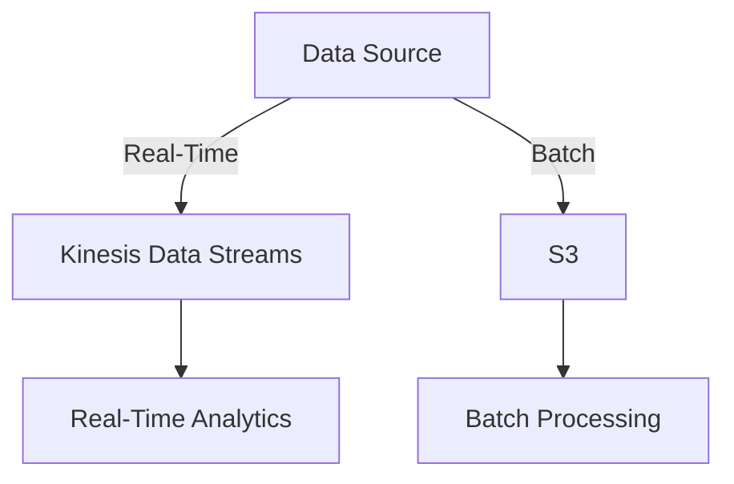

---

### **2. Data Ingestion Patterns (Frequency and Data History)**

### **Primary Functions:**

- **Frequency of Ingestion:** Refers to how often data is ingested, whether in real-time (continuous ingestion) or at scheduled intervals (batch ingestion).
- **Data History:** Determines how much historical data you keep and for how long. Some applications need immediate data (short history), while others require retaining large amounts of data for long-term analysis.

### **Patterns (When to Use):**

- **Real-Time Ingestion:**
    
    Use when you need to process data as soon as it arrives.
    
    - **Kinesis or MSK (Kafka):** For applications like social media analysis or IoT data processing where continuous streaming is critical.
    - [MSK Docs](https://docs.aws.amazon.com/msk/index.html)
- **Batch Ingestion:**
    
    Use when real-time processing is unnecessary, and data can be processed periodically.
    
    - **S3 and Glue:** Ideal for storing large volumes of data, like logs or transaction records, which are processed at regular intervals (daily or hourly).
    - [Glue Docs](https://docs.aws.amazon.com/glue/index.html)

### **Antipatterns (When Not to Use):**

- **Avoid real-time ingestion** if the data is not time-sensitive, as real-time solutions are often more expensive.
- **Avoid batch ingestion** if your system requires immediate reaction to data (like fraud detection or anomaly detection systems).

### **Benefits of Managed vs. Serverless:**

- **Managed Services (Kinesis, MSK):** Provide fine control over throughput and partitioning (shards in Kinesis, partitions in Kafka), but require more management.
- **Serverless (Lambda, S3):** Automatically scales with data size and traffic but doesn't provide the same low-latency control as managed services.

### **Mermaid Diagram: Data Ingestion Patterns**

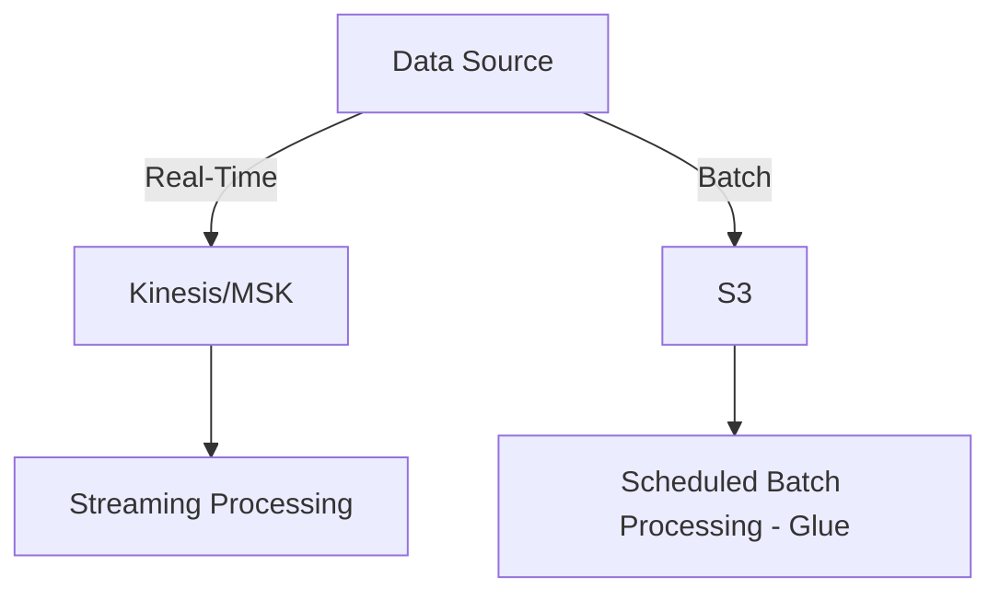

---

### **3. Streaming Data Ingestion**

### **Primary Functions:**

- **Real-Time Data Processing:** Ingest and process data continuously as it is generated. This allows immediate analysis and action based on the data.

### **Patterns (When to Use):**

- **Use Kinesis Data Streams or MSK for continuous, low-latency data processing:**
Ideal for real-time analytics, video stream processing, or financial transaction monitoring.
    - **Example:** Use **Kinesis** to monitor website clicks in real-time to trigger dynamic content changes.
    - **Example:** Use **MSK** for complex event streaming architectures across distributed microservices.
    - [Kinesis Docs](https://docs.aws.amazon.com/streams/latest/dev/introduction.html)
    - [MSK Docs](https://docs.aws.amazon.com/msk/index.html)

### **Antipatterns (When Not to Use):**

- **Avoid using streaming services** for batch or infrequent data. In such cases, the complexity and costs of maintaining streaming pipelines are unnecessary.

### **Benefits of Managed vs. Serverless:**

- **Managed (MSK, Kinesis):** Full control over partitions (Kafka) and shards (Kinesis), better for applications needing guaranteed delivery or complex processing.
- **Serverless (Kinesis Firehose):** Automatically scales to handle different data rates, without managing infrastructure. However, it lacks the same level of control over data flow and latency.
    - [Kinesis Firehose Docs](https://docs.aws.amazon.com/firehose/index.html)

### **Mermaid Diagram: Streaming Data Ingestion**

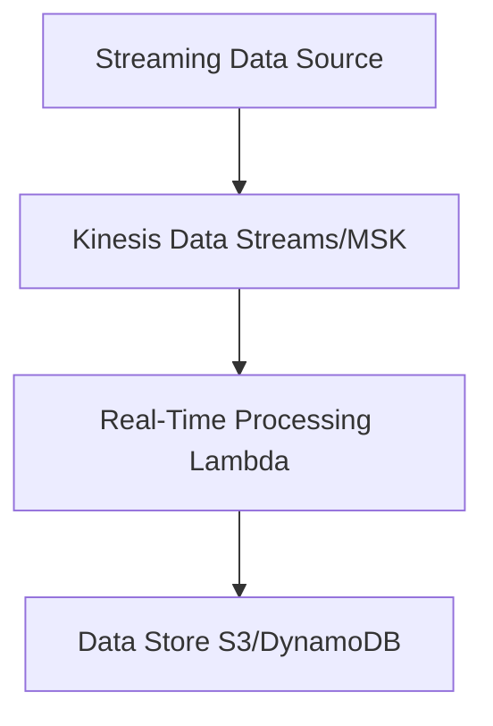

---

### **4. Batch Data Ingestion (Scheduled and Event-Driven)**

### **Primary Functions:**

- **Scheduled Batch Processing:** Ingest and process data at predefined intervals (e.g., hourly, daily).
- **Event-Driven Processing:** Ingest data based on certain triggers, such as a file upload or an API event.

### **Patterns (When to Use):**

- **Use AWS Glue and Lambda for scheduled or event-driven batch processing:**
    - **Scheduled Batch Ingestion:** AWS Glue automates the movement and transformation of data on a schedule (e.g., nightly processing of sales data).
    - **Event-Driven Ingestion:** AWS Lambda triggers actions based on events (e.g., when a file is uploaded to S3, Lambda processes it).
    - [Glue Docs](https://docs.aws.amazon.com/glue/index.html)
    - [Lambda Docs](https://docs.aws.amazon.com/lambda/latest/dg/welcome.html)

### **Antipatterns (When Not to Use):**

- **Avoid batch ingestion** for real-time applications. If your system needs immediate reaction to data, batch processing introduces unnecessary delays.

### **Benefits of Managed vs. Serverless:**

- **Managed (Glue):** Provides a managed ETL service with fine-tuned controls for batch processing but requires setting up infrastructure for scheduling and job tracking.
- **Serverless (Lambda):** Automatically scales based on event triggers (e.g., file uploads to S3) without needing to manage resources or schedules.

### **Mermaid Diagram: Batch Data Ingestion**

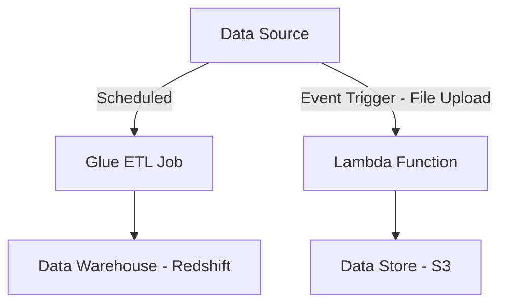

---

### **5. Replayability of Data Ingestion Pipelines**

### **Primary Functions:**

- **Replayability:** The ability to reprocess or replay previously ingested data in the pipeline. This is crucial for error correction, analytics re-runs, or application logic changes.

### **Patterns (When to Use):**

- **Use Kinesis for time-bound replayability:**
    
    Kinesis allows you to replay data within a 24-hour (default) to 7-day retention window.
    
    - **Example:** Replaying missed log events after fixing a downstream processing issue.
    - [Kinesis Replay Docs](https://docs.aws.amazon.com/streams/latest/dev/kinesis-extended-retention.html)
- **Use S3 for indefinite replayability:**
    
    Storing raw data in S3 enables replaying data at any time, even months or years later.
    
    - **Example:** Reprocessing raw transaction data stored in S3 after introducing new business logic.

### **Antipatterns (When Not to Use):**

- **Avoid relying on short-term retention windows** (like Kinesis) for critical long-term data that may need to be reprocessed much later.

### **Benefits of Managed vs. Serverless:**

- **Managed (Kinesis):** Provides automatic data retention and replay for a fixed duration.
- **Serverless (S3):** Offers indefinite data storage and replay capability, making it ideal for long-term data storage and replayability.

### **Mermaid Diagram: Replayability**

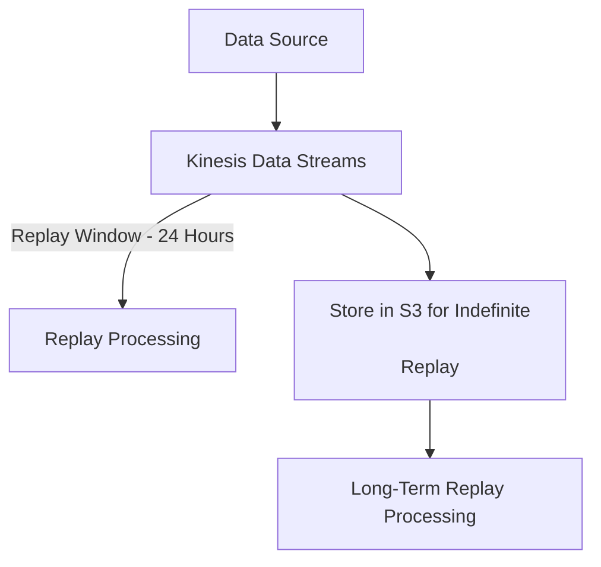

---

### **6. Stateful and Stateless Data Transactions**

### **Primary Functions:**

- **Stateful Transactions:** Systems that remember past interactions or data between requests. Suitable for scenarios where continuity and consistency are required across multiple requests (e.g., shopping carts).
- **Stateless Transactions:** Each transaction or request is independent, with no memory of past interactions. This simplifies scaling and is ideal for event-driven applications.

### **Patterns (When to Use):**

- **Stateful Transactions:**
    
    Use when you need to maintain context or session information across multiple events.
    
    - **Example:** DynamoDB Streams for tracking the state of orders in an e-commerce system.
    - [DynamoDB Streams Docs](https://docs.aws.amazon.com/amazondynamodb/latest/developerguide/Streams.html)
- **Stateless Transactions:**
    
    Use for independent, event-driven applications where each request is processed separately.
    
    - **Example:** AWS Lambda for processing S3 file uploads, where each event is independent of the others.
    - [Lambda Docs](https://docs.aws.amazon.com/lambda/latest/dg/welcome.html)

### **Antipatterns (When Not to Use):**

- **Avoid using stateless services** like Lambda for tasks that require session continuity or multi-step transactions.

### **Benefits of Managed vs. Serverless:**

- **Managed (DynamoDB Streams):** Provides state tracking and transaction consistency across distributed systems, but requires more setup.
- **Serverless (Lambda):** Highly scalable, stateless compute that works well for independent, event-driven tasks.

### **Mermaid Diagram: Stateful vs. Stateless Transactions**

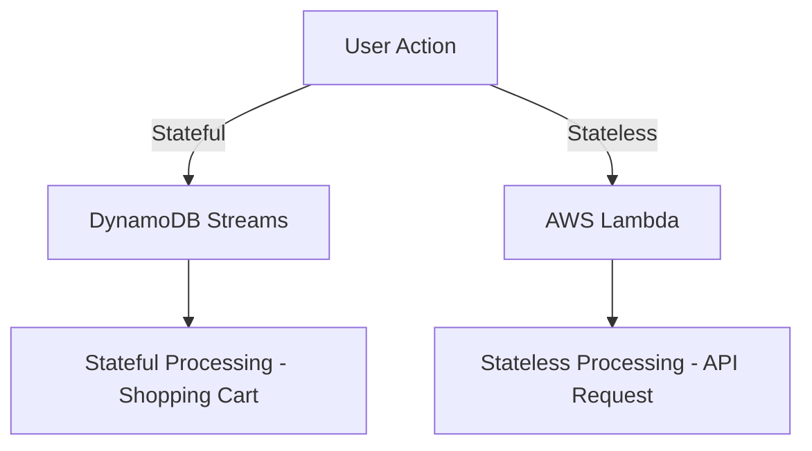

---

## Skills in:

- Reading data from streaming sources (for example, Amazon Kinesis, Amazon Managed Streaming for Apache Kafka [Amazon MSK], Amazon DynamoDB Streams, AWS Database Migration Service [AWS DMS], AWS Glue, Amazon Redshift)
- Reading data from batch sources (for example, Amazon S3, AWS Glue,
Amazon EMR, AWS DMS, Amazon Redshift, AWS Lambda, Amazon
AppFlow)
- Implementing appropriate configuration options for batch ingestion
- Consuming data APIs
- Setting up schedulers by using Amazon EventBridge, Apache Airflow, or
time-based schedules for jobs and crawlers
- Setting up event triggers (for example, Amazon S3 Event Notifications,
EventBridge)
- Calling a Lambda function from Amazon Kinesis
- Creating allowlists for IP addresses to allow connections to data sources
- Implementing throttling and overcoming rate limits (for example,
DynamoDB, Amazon RDS, Kinesis)
- Managing fan-in and fan-out for streaming data distribution

---

### **1. Reading Data from Streaming Sources**

### **Goal:**

Learn how to ingest and read real-time streaming data from sources like **Amazon Kinesis Data Streams**, **Amazon Managed Streaming for Apache Kafka (MSK)**, **DynamoDB Streams**, and more.

### **Exercise 1: Reading Data from Amazon Kinesis Data Streams**

### **Step 1: Create a Kinesis Data Stream**

1. Go to the **Kinesis** service in the AWS Management Console.
2. Click **Create data stream**.
3. Name your stream (e.g., `MyDataStream`) and select the number of **shards** (each shard can handle 1 MB of incoming data per second and 1000 PUT records per second).
4. Click **Create data stream**.

### **Step 2: Ingest Data into Kinesis**

You can use the AWS CLI to send data into Kinesis.

1. Install and configure the **AWS CLI**.
2. Run the following command to put records into the stream:

```bash
aws kinesis put-record \\
    --stream-name MyDataStream \\
    --partition-key 123 \\
    --data "Hello, World!"

```

### **Step 3: Create a Lambda Function to Process the Data**

1. Navigate to **Lambda** in the AWS Console.
2. Click **Create function** > **Author from scratch**.
3. Name your function (e.g., `KinesisProcessor`) and choose an appropriate runtime (e.g., Python).
4. In the function code editor, use the following code to process data from Kinesis:

```python
import json

def lambda_handler(event, context):
    for record in event['Records']:
        data = record['kinesis']['data']
        decoded_data = json.loads(data)
        print(f"Received data: {decoded_data}")
    return {
        'statusCode': 200,
        'body': json.dumps('Data processed')
    }

```

1. Under **Trigger**, add **Kinesis** as the event source and choose your stream (`MyDataStream`).
2. Save the function.

### **Step 4: Test the End-to-End Data Flow**

1. Use the **put-record** CLI command to send more data into the Kinesis stream.
2. Navigate to **CloudWatch Logs** to see the output of your Lambda function, which should show the processed data.

### **Mermaid Diagram: Kinesis Stream and Lambda Integration**

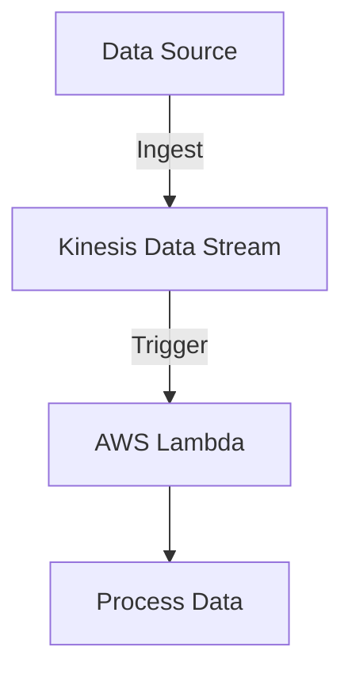

---

### **2. Reading Data from Batch Sources**

### **Exercise 2: Reading Data from Amazon S3 (Batch Processing)**

### **Step 1: Upload Data to S3**

1. Go to **Amazon S3** in the AWS Console.
2. Create a new bucket (e.g., `my-data-bucket`).
3. Upload a CSV file or JSON file with sample data (e.g., `data.json`).

### **Step 2: Create a Lambda Function to Read from S3**

1. Navigate to **Lambda** in the AWS Console and create a function (e.g., `S3DataProcessor`).
2. Add the following code to read the contents of an S3 file:

```python
import json
import boto3

s3 = boto3.client('s3')

def lambda_handler(event, context):
    bucket = event['Records'][0]['s3']['bucket']['name']
    key = event['Records'][0]['s3']['object']['key']

    response = s3.get_object(Bucket=bucket, Key=key)
    data = response['Body'].read().decode('utf-8')
    print(f"Data from S3: {data}")

    return {
        'statusCode': 200,
        'body': json.dumps('Data processed')
    }

```

### **Step 3: Add S3 as a Trigger for Lambda**

1. Under the Lambda function's **Triggers**, add **S3** as the source.
2. Select the bucket (`my-data-bucket`) and configure the event type (e.g., "All object create events").

### **Step 4: Test the Setup**

1. Upload a new file to the S3 bucket and check **CloudWatch Logs** to verify that the Lambda function read and processed the data.

### **Mermaid Diagram: S3 to Lambda Integration**

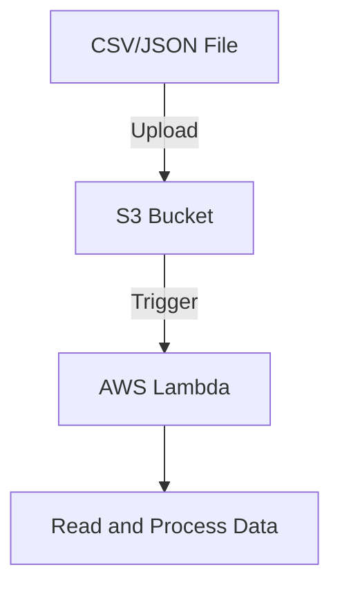

---

### **3. Implementing Appropriate Configuration Options for Batch Ingestion**

### **Exercise 3: Configuring Batch Ingestion Using AWS Glue**

### **Step 1: Create an AWS Glue Crawler**

1. Go to **AWS Glue** in the AWS Console.
2. Create a new **crawler** to scan your S3 bucket for data (e.g., the same bucket from the previous exercise).
3. Define the crawler's data source as the **S3 bucket** (`my-data-bucket`).
4. Set the crawler to run on a schedule (e.g., daily or hourly).

### **Step 2: Create an AWS Glue Job**

1. Create a **Glue Job** to transform the data from S3.
2. Use the **Glue Studio** to map your input (e.g., CSV) to a new data format (e.g., Parquet).
3. Define the output as a new S3 bucket.

### **Step 3: Test the Glue Job**

1. Run the Glue job and monitor the output S3 bucket to see the transformed data.

### **Mermaid Diagram: AWS Glue Batch Ingestion**

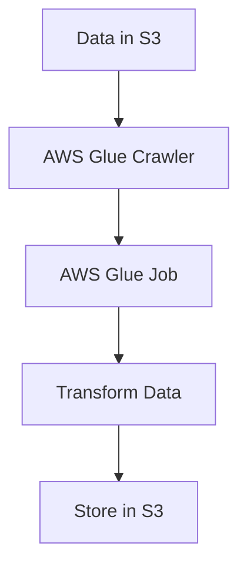

---

### **4. Consuming Data APIs**

### **Exercise 4: Creating and Consuming a REST API Using Amazon API Gateway**

### **Step 1: Create a REST API**

1. Go to **Amazon API Gateway** in the AWS Console.
2. Click **Create API** and choose **REST API**.
3. Define a new resource (e.g., `/data`) and add a **GET** method.

### **Step 2: Integrate API Gateway with Lambda**

1. Under the **GET** method, integrate it with a **Lambda function** that returns data (e.g., returning data from S3 or DynamoDB).
2. Use the following Lambda code to return mock data:

```python
def lambda_handler(event, context):
    return {
        'statusCode': 200,
        'body': json.dumps({"message": "Data from API!"})
    }

```

### **Step 3: Deploy the API**

1. Deploy the API to a stage (e.g., `dev`).
2. Use the provided API URL to send requests and see the data returned by Lambda.

### **Mermaid Diagram: API Gateway with Lambda**

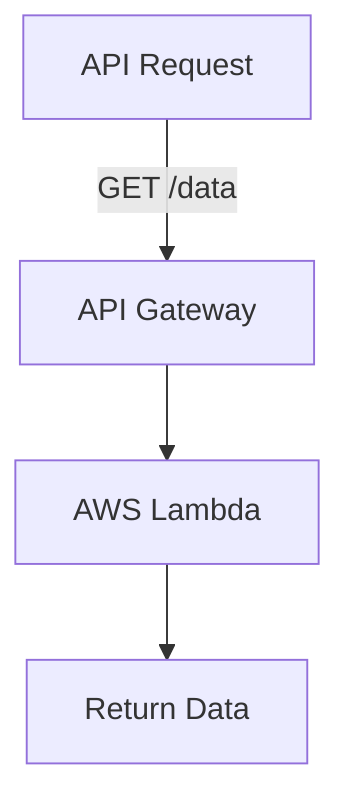

---

### **5. Setting up Schedulers Using Amazon EventBridge**

### **Exercise 5: Scheduling a Lambda Function with EventBridge**

### **Step 1: Create a Lambda Function**

1. Create a Lambda function that performs a task (e.g., reading data from S3).
2. The same function from **Exercise 2** can be used here.

### **Step 2: Create an EventBridge Rule**

1. Go to **Amazon EventBridge** in the AWS Console.
2. Create a rule to trigger every hour.
3. Set the target as the Lambda function you created.

### **Mermaid Diagram: EventBridge Scheduler**

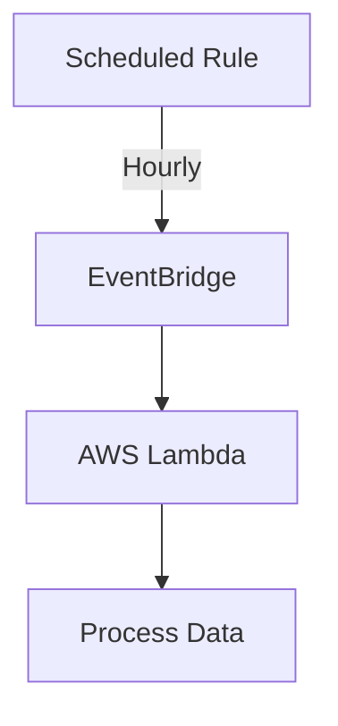

---

### **6. Setting up Event Triggers (S3 Event Notifications)**

### **Exercise 6: Triggering a Lambda Function on S3 Object Upload**

This is already covered in **Exercise 2**, where the Lambda function is triggered when new data is uploaded to S3.

---

### **7. Calling a Lambda Function from Amazon Kinesis**

This was covered in **Exercise 1**, where Lambda is set to trigger from a Kinesis stream.

---

### **8. Creating Allowlists for IP Addresses**

### **Exercise 7: Restrict Access to an S3 Bucket Using VPC Endpoint**

### **Step 1: Create a VPC Endpoint for S3**

1. Go to **VPC** in the AWS Console.
2. Under **Endpoints**, create a new endpoint for S3.

### **Step 2: Restrict Access to the S3 Bucket**

1. Go to **S3**, navigate to the bucket, and set the bucket policy to only allow access from the VPC Endpoint.
2. Example policy:

```json
{
  "Version": "2012-10-17",
  "Statement": [
    {
      "Effect": "Deny",
      "Principal": "*",

      "Action": "s3:*",
      "Resource": "arn:aws:s3:::my-data-bucket/*",
      "Condition": {
        "StringNotEquals": {
          "aws:sourceVpce": "vpce-xxxxxxxxxxxxxx"
        }
      }
    }
  ]
}

```

### **Mermaid Diagram: VPC Endpoint with S3**

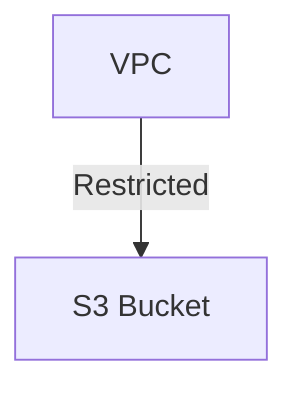

---

### **9. Implementing Throttling and Overcoming Rate Limits**

### **Exercise 8: Implementing Auto-Scaling in DynamoDB**

### **Step 1: Create a DynamoDB Table**

1. Create a DynamoDB table and enable **Auto Scaling**.
2. Define the read/write capacity to automatically scale based on traffic.

### **Step 2: Test the Setup**

1. Use the **AWS CLI** to insert multiple records into DynamoDB and monitor how the table scales.

```bash
aws dynamodb put-item --table-name MyTable --item '{"ID": {"S": "123"}, "Name": {"S": "Sample"}}'

```

---

### **10. Managing Fan-In and Fan-Out for Streaming Data Distribution**

### **Exercise 9: Using Kinesis Fan-Out**

### **Step 1: Create Multiple Lambda Functions for Fan-Out**

1. Create two Lambda functions to process different aspects of the data from Kinesis.
2. Both functions can be set as consumers of the same Kinesis stream (Fan-Out).

### **Mermaid Diagram: Fan-Out with Kinesis**

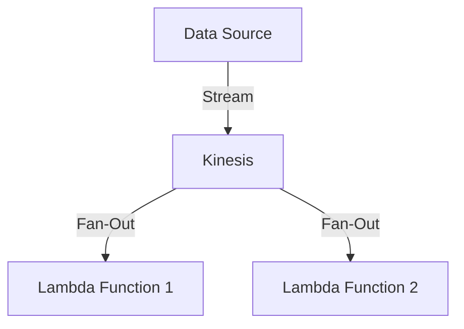