# 3.3: Maintain and monitor data pipelines

## Knowledge of:

- How to log application data
- Best practices for performance tuning
- How to log access to AWS services
- Amazon Macie, AWS CloudTrail, and Amazon CloudWatch

---

### **1. How to Log Application Data**

### **Primary Functions:**

Logging application data is critical for understanding how an application performs, identifying errors, and auditing transactions. AWS services that help log application data include:

- **Amazon CloudWatch Logs**: A fully managed service that captures log data from AWS resources, applications, and services.
- **Amazon S3**: Often used to store large volumes of log files from various applications.
- **AWS Lambda**: Can be used to process and transform log data before storing it in S3 or other storage services.

### **Patterns (When to Use):**

- Use **CloudWatch Logs** to capture and aggregate logs from **EC2**, **Lambda**, and other AWS services. This allows for real-time monitoring and alerts based on log patterns.
    - **Example**: Monitor a microservices architecture running on **ECS** and log application errors or warnings in **CloudWatch Logs** for analysis.
- Use **S3** to store large volumes of application logs, such as web server logs or access logs, for long-term storage and auditing.

### **Antipatterns (When Not to Use):**

- Avoid storing high-velocity, high-frequency logs directly in S3 for real-time analysis, as querying and searching through large logs in S3 is inefficient. Instead, use **CloudWatch Logs** or **Amazon OpenSearch** for this purpose.
- Avoid logging too much verbose data in **CloudWatch**, as it can lead to high costs due to storage and retrieval fees.

### **Benefits of Managed vs. Serverless Services:**

- **Managed (CloudWatch Logs)**:
    - **Scalability**: Automatically scales with the size of logs being ingested. You can define log groups for organization and retention.
    - **Cost**: Costs are based on the volume of data ingested and stored, which can become expensive for large logs. Retention settings can help manage costs.
- **Serverless (Lambda + S3)**:
    - **Simplicity**: Serverless logging pipelines, such as Lambda functions forwarding logs to **S3** or **CloudWatch**, can reduce infrastructure management.
    - **Cost**: Pay-per-use model for Lambda and S3 storage costs makes this cost-effective for low-traffic or intermittent workloads.

### **Mermaid Diagram: Logging Application Data with CloudWatch and S3**

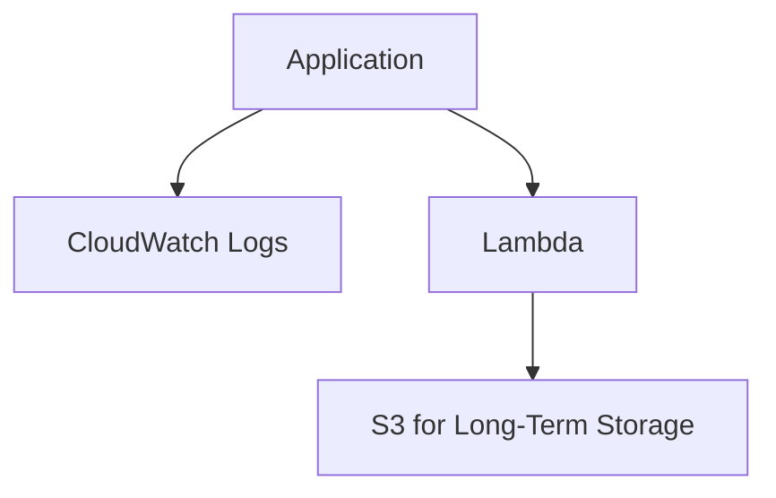

### **AWS Documentation Links:**

- [Amazon CloudWatch Logs](https://docs.aws.amazon.com/AmazonCloudWatch/latest/logs/WhatIsCloudWatchLogs.html)
- [Amazon S3](https://docs.aws.amazon.com/s3/index.html)
- [AWS Lambda](https://docs.aws.amazon.com/lambda/index.html)

---

### **2. Best Practices for Performance Tuning**

### **Primary Functions:**

Performance tuning is about optimizing the performance of applications and databases, reducing latency, improving throughput, and minimizing resource costs. AWS offers several tools to achieve this:

- **Amazon RDS Performance Insights**: Provides real-time metrics to help identify performance bottlenecks in **RDS** databases.
- **Amazon CloudWatch**: Monitors CPU, memory, disk usage, and network performance for EC2 instances, RDS, Lambda, and other services.
- **Amazon Redshift Advisor**: Offers performance recommendations for optimizing **Redshift** clusters, including query optimization and table distribution settings.

### **Patterns (When to Use):**

- Use **RDS Performance Insights** to analyze query performance and identify long-running queries or excessive locking that may slow down database operations.
    - **Example**: Tune an **RDS MySQL** database by identifying queries that consume the most CPU time and indexing them for faster execution.
- Use **CloudWatch** to monitor real-time metrics on EC2 instances or **Lambda** functions, setting up alarms to alert when performance thresholds are crossed (e.g., high CPU or memory usage).
- Use **Amazon Redshift Advisor** to optimize the design of a **Redshift** cluster, focusing on table distribution keys and sort keys to improve query performance.

### **Antipatterns (When Not to Use):**

- Avoid over-provisioning resources in anticipation of high traffic. Instead, rely on **auto-scaling** services like **DynamoDB auto-scaling** or **EC2 Auto Scaling** to adjust based on actual demand.
- Avoid relying solely on **manual performance tuning** without using **CloudWatch** or **Performance Insights** for monitoring, as this can lead to inefficiencies and unnoticed bottlenecks.

### **Benefits of Managed vs. Serverless Services:**

- **Managed (RDS, Redshift)**:
    - **Performance**: Managed databases like **RDS** and **Redshift** provide automatic tuning options, such as **Performance Insights** and **Advisor**, to help optimize performance.
    - **Cost**: These managed services come with higher costs compared to serverless options but offer better control and performance for large, steady workloads.
- **Serverless (Lambda, DynamoDB)**:
    - **Simplicity**: Serverless services like **Lambda** automatically scale based on workload and require minimal tuning.
    - **Cost**: Pay-per-execution pricing makes serverless services more cost-effective for intermittent or unpredictable workloads.

### **Mermaid Diagram: Performance Tuning with CloudWatch and RDS Insights**

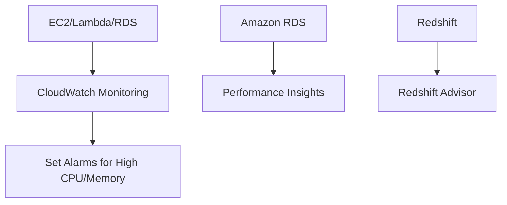

### **AWS Documentation Links:**

- [Amazon RDS Performance Insights](https://docs.aws.amazon.com/AmazonRDS/latest/UserGuide/USER_PerfInsights.html)
- [Amazon CloudWatch](https://docs.aws.amazon.com/cloudwatch/index.html)
- [Amazon Redshift Advisor](https://docs.aws.amazon.com/redshift/latest/dg/c-operations-advisor.html)

---

### **3. How to Log Access to AWS Services**

### **Primary Functions:**

Logging access to AWS services is crucial for maintaining security and ensuring compliance. AWS provides several services that capture access logs and API activity:

- **AWS CloudTrail**: Records all API calls made within an AWS account, including identity, time of the call, and actions taken.
- **Amazon S3 Access Logs**: Tracks requests made to **S3** buckets, including who accessed the bucket, when, and what actions were performed.
- **Amazon VPC Flow Logs**: Captures IP traffic going to and from network interfaces within a **VPC**.

### **Patterns (When to Use):**

- Use **CloudTrail** to log all API activity across your AWS account, including IAM user actions, **EC2** instance management, and **S3** access.
    - **Example**: Set up **CloudTrail** to log access to **S3 buckets**, **EC2** instances, and **RDS** databases to monitor for unauthorized or suspicious activity.
- Use **S3 Access Logs** to track who is accessing critical **S3** buckets that store sensitive data, enabling auditing for compliance purposes.
- Use **VPC Flow Logs** to monitor network traffic, helping identify unusual patterns that may indicate unauthorized access or data exfiltration.

### **Antipatterns (When Not to Use):**

- Avoid using **CloudTrail** for high-frequency, low-value logging (e.g., frequent polling APIs), as it can lead to large amounts of unnecessary log data. Use **VPC Flow Logs** for network-level logging and **S3 Access Logs** for bucket-specific logging instead.
- Avoid disabling **CloudTrail** logging for IAM activities, as this can hinder your ability to detect and respond to security breaches.

### **Benefits of Managed vs. Serverless Services:**

- **Managed (CloudTrail, S3 Access Logs)**:
    - **Scalability**: Both **CloudTrail** and **S3 Access Logs** automatically scale based on the volume of access logs generated.
    - **Cost**: Costs are associated with log storage, particularly for high-frequency services like **S3**. Use log retention policies to control costs.
- **Serverless (CloudTrail + Lambda)**:
    - **Flexibility**: Combine **CloudTrail** with **Lambda** to automatically trigger actions based on specific events, such as unauthorized access.
    - **Cost**: Lambda’s pay-per-execution model allows you to build automated alerting or remediation for suspicious API activity at a low cost.

### **Mermaid Diagram: Logging Access to AWS Services with CloudTrail and S3**

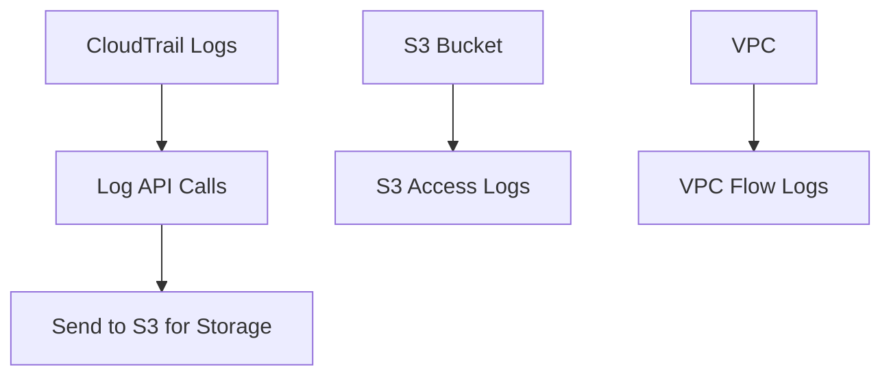

### **AWS Documentation Links:**

- [AWS CloudTrail](https://docs.aws.amazon.com/awscloudtrail/latest/userguide/cloudtrail-user-guide.html)
- [Amazon S

3 Access Logs]([https://docs.aws.amazon.com/AmazonS3/latest/user-guide/server-access-logging.html](https://docs.aws.amazon.com/AmazonS3/latest/user-guide/server-access-logging.html))

- [Amazon VPC Flow Logs](https://docs.aws.amazon.com/vpc/latest/userguide/flow-logs.html)

---

### **4. Amazon Macie, AWS CloudTrail, and Amazon CloudWatch**

### **Primary Functions:**

These AWS services are integral for ensuring security, compliance, and monitoring across AWS environments:

- **Amazon Macie**: A fully managed data security service that uses machine learning to discover, classify, and protect sensitive data (e.g., PII) stored in **S3**.
- **AWS CloudTrail**: Logs all API activity in your AWS account, providing visibility into actions taken by users and services.
- **Amazon CloudWatch**: A monitoring service that collects operational data from AWS services and applications, allowing users to set up alarms, dashboards, and logs.

### **Patterns (When to Use):**

- Use **Amazon Macie** to identify and monitor sensitive data stored in **S3**, such as personal identifiable information (PII), and ensure that this data is properly protected.
    - **Example**: Run regular Macie scans to discover sensitive customer data in **S3** and set up alerts if unsecured data is found.
- Use **CloudTrail** to audit user and service activity across your AWS account, ensuring compliance and detecting unusual access patterns.
- Use **CloudWatch** to monitor performance metrics for services like **EC2**, **RDS**, and **Lambda** and set up alarms for unusual resource usage.

### **Antipatterns (When Not to Use):**

- Avoid relying solely on **CloudWatch Logs** for security audits; use **CloudTrail** for tracking API-level access and actions taken by users and services.
- Avoid storing large volumes of sensitive data in **S3** without running **Macie** to ensure that sensitive information is appropriately protected.

### **Benefits of Managed vs. Serverless Services:**

- **Managed (Macie, CloudWatch)**:
    - **Automation**: Macie provides automated scanning for sensitive data, while CloudWatch offers managed metrics collection and alerting.
    - **Cost**: CloudWatch’s costs can increase with high-frequency metrics collection and log retention. Macie charges based on the number of objects scanned in S3.
- **Serverless (CloudTrail + Lambda)**:
    - **Flexibility**: Combine **CloudTrail** with **Lambda** to build serverless security workflows, such as automatically responding to unauthorized access.
    - **Cost**: CloudTrail’s pay-per-use model allows for cost-effective auditing without needing to manage infrastructure.

### **Mermaid Diagram: Macie, CloudTrail, and CloudWatch for Monitoring and Security**

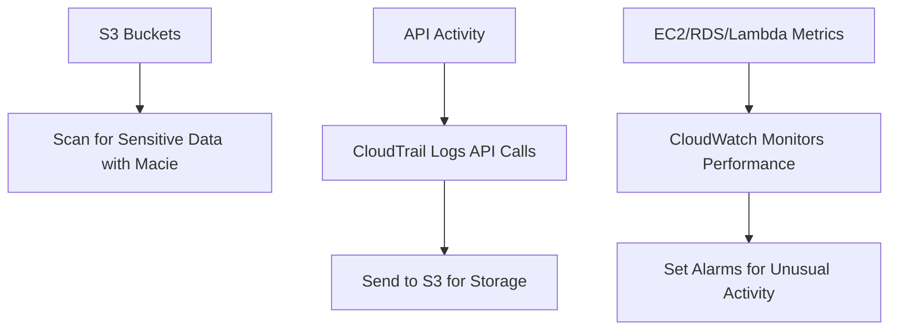

### **AWS Documentation Links:**

- [Amazon Macie Documentation](https://docs.aws.amazon.com/macie/index.html)
- [AWS CloudTrail Documentation](https://docs.aws.amazon.com/awscloudtrail/latest/userguide/cloudtrail-user-guide.html)
- [Amazon CloudWatch Documentation](https://docs.aws.amazon.com/cloudwatch/index.html)

---

## Skills in:

- Extracting logs for audits
- Deploying logging and monitoring solutions to facilitate auditing and traceability
- Using notifications during monitoring to send alerts
- Troubleshooting performance issues
- Using CloudTrail to track API calls
- Troubleshooting and maintaining pipelines (for example, AWS Glue, Amazon EMR)
- Using Amazon CloudWatch Logs to log application data (with a focus on configuration and automation)
- Analyzing logs with AWS services (for example, Athena, Amazon EMR, Amazon OpenSearch Service, CloudWatch Logs Insights, big data application logs)

---

### **1. Extracting Logs for Audits**

### **Detailed Steps/Exercises:**

### **Exercise 1: Extracting Logs from CloudWatch for Auditing**

1. **Create a Log Group in CloudWatch**:
    - In the **AWS CloudWatch Console**, create a log group to organize your logs by application or service.
    - Example: Create a log group called `/aws/application-audit-logs`.
2. **Set Up Logging for an Application (Lambda Example)**:
    - Enable logging for an AWS Lambda function to send logs to CloudWatch:
    
    ```python
    import logging
    logger = logging.getLogger()
    logger.setLevel(logging.INFO)
    
    def lambda_handler(event, context):
        logger.info(f"Event data: {event}")
        return "Logged successfully"
    
    ```
    
3. **Extract Logs for Auditing**:
    - In the **CloudWatch Logs** section, navigate to your log group.
    - Use the **Search** feature to filter logs based on date, severity level, or specific keywords.
    - Download the log data for auditing purposes.
4. **Automate Log Exports to S3**:
    - Use the AWS CLI to export logs from CloudWatch to **Amazon S3**:
    
    ```bash
    aws logs create-export-task \\
        --log-group-name "/aws/application-audit-logs" \\
        --from 1625140800000 \\
        --to 1625227200000 \\
        --destination "s3://my-log-archive-bucket" \\
        --destination-prefix "audit-logs/"
    
    ```
    

### **Mermaid Diagram: Extracting Logs from CloudWatch for Auditing**

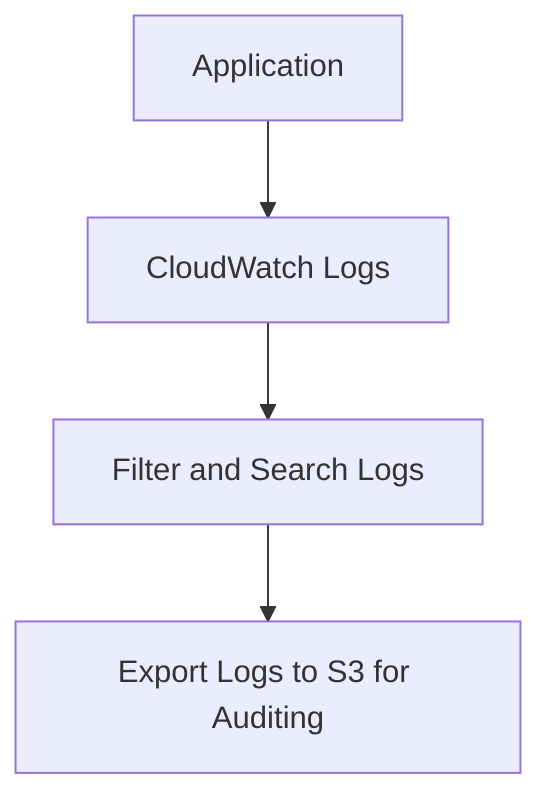

### **AWS Documentation Links:**

- [CloudWatch Logs](https://docs.aws.amazon.com/AmazonCloudWatch/latest/logs/WhatIsCloudWatchLogs.html)
- [Export CloudWatch Logs to S3](https://docs.aws.amazon.com/AmazonCloudWatch/latest/logs/S3ExportTasks.html)

### **Use Case Scenarios:**

- **Audit Logs**: Extract logs for periodic auditing to ensure security and compliance in systems that store or process sensitive data.
- **Compliance**: Use these logs to generate audit reports for compliance purposes, such as GDPR or HIPAA.

### **Common Pitfalls or Challenges:**

- **Challenge**: Log volumes may increase rapidly, leading to high storage costs.
    - **Solution**: Set up log retention policies to automatically delete logs after a certain period, reducing storage costs.

---

### **2. Deploying Logging and Monitoring Solutions for Auditing and Traceability**

### **Detailed Steps/Exercises:**

### **Exercise 2: Deploying a Logging and Monitoring Solution with CloudWatch and CloudTrail**

1. **Enable AWS CloudTrail**:
    - In the **CloudTrail Console**, enable a trail for all AWS API activity. This will log API actions across your AWS account.
    - Store logs in an **S3** bucket for long-term storage and auditing:
    
    ```bash
    aws cloudtrail create-trail --name "AuditTrail" --s3-bucket-name "my-cloudtrail-logs"
    
    ```
    
2. **Enable Logging for Application Resources**:
    - Enable CloudWatch Logs for resources like **Lambda**, **EC2**, or **ECS** by attaching the necessary permissions and configuration.
    - Example: Enable CloudWatch logging in an ECS task definition.
3. **Create Dashboards and Alarms**:
    - In **CloudWatch**, create dashboards to visualize resource performance (CPU, memory, network traffic).
    - Set up alarms to notify administrators when resource utilization exceeds thresholds.
4. **Set Up Centralized Logging**:
    - Configure **AWS Lambda** to centralize logs from multiple services (e.g., S3, CloudTrail) and send consolidated logs to **Amazon OpenSearch Service** or a custom **S3** bucket for auditing.

### **Mermaid Diagram: Centralized Logging with CloudWatch and CloudTrail**

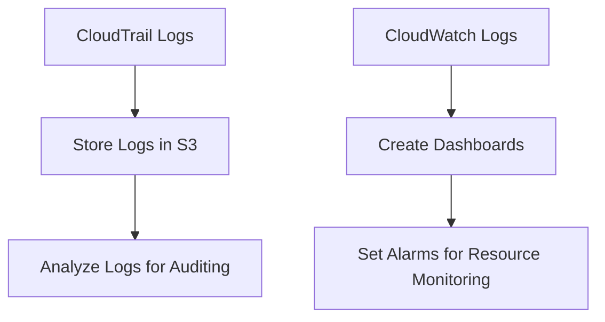

### **AWS Documentation Links:**

- [AWS CloudTrail](https://docs.aws.amazon.com/awscloudtrail/latest/userguide/cloudtrail-user-guide.html)
- [Amazon CloudWatch](https://docs.aws.amazon.com/cloudwatch/index.html)
- [CloudWatch Alarms](https://docs.aws.amazon.com/AmazonCloudWatch/latest/monitoring/AlarmThatSendsEmail.html)

### **Use Case Scenarios:**

- **Traceability**: Centralize logging across multiple services to improve traceability and auditing for applications handling sensitive transactions.
- **Security Audits**: Monitor API calls and resource utilization to detect suspicious activity or unauthorized access.

### **Common Pitfalls or Challenges:**

- **Challenge**: Configuring permissions incorrectly can prevent logs from being collected.
    - **Solution**: Ensure that appropriate IAM roles and permissions are set to allow services to send logs to CloudWatch and CloudTrail.

---

### **3. Using Notifications During Monitoring to Send Alerts**

### **Detailed Steps/Exercises:**

### **Exercise 3: Using CloudWatch Alarms with Amazon SNS for Notifications**

1. **Create an SNS Topic**:
    - In the **Amazon SNS Console**, create a new topic to send notifications.
    - Subscribe email addresses or SMS numbers to the topic:
    
    ```bash
    aws sns create-topic --name "ResourceAlerts"
    aws sns subscribe --topic-arn arn:aws:sns:region:account-id:ResourceAlerts --protocol email --notification-endpoint user@example.com
    
    ```
    
2. **Create a CloudWatch Alarm**:
    - Set up a CloudWatch alarm to monitor CPU usage for an **EC2** instance:
    
    ```bash
    aws cloudwatch put-metric-alarm \\
        --alarm-name "HighCPUUsage" \\
        --metric-name "CPUUtilization" \\
        --namespace "AWS/EC2" \\
        --statistic "Average" \\
        --period 300 \\
        --threshold 80 \\
        --comparison-operator "GreaterThanThreshold" \\
        --dimensions "Name=InstanceId,Value=i-1234567890abcdef0" \\
        --evaluation-periods 1 \\
        --alarm-actions arn:aws:sns:region:account-id:ResourceAlerts
    
    ```
    
3. **Test the Alarm**:
    - Simulate high CPU usage or manually trigger the alarm by adjusting the threshold. Verify that the **SNS** notification is sent to the subscribed endpoints.

### **Mermaid Diagram: Using SNS for CloudWatch Alarms**

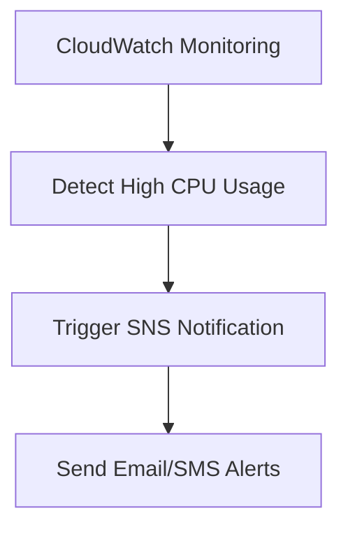

### **AWS Documentation Links:**

- [Amazon CloudWatch Alarms](https://docs.aws.amazon.com/AmazonCloudWatch/latest/monitoring/AlarmThatSendsEmail.html)
- [Amazon SNS](https://docs.aws.amazon.com/sns/index.html)

### **Use Case Scenarios:**

- **Resource Monitoring**: Use CloudWatch Alarms with SNS to automatically alert administrators when resource utilization exceeds predefined thresholds (e.g., CPU, memory, disk space).

### **Common Pitfalls or Challenges:**

- **Challenge**: Missing or delayed notifications due to incorrect SNS configurations.
    - **Solution**: Ensure that all subscribers are confirmed and have permissions to receive notifications.

---

### **4. Troubleshooting Performance Issues**

### **Detailed Steps/Exercises:**

### **Exercise 4: Troubleshooting Performance with CloudWatch and RDS Performance Insights**

1. **Monitor EC2 Metrics with CloudWatch**:
    - Go to the **CloudWatch Console** and monitor metrics such as **CPUUtilization**, **NetworkIn**, and **DiskWriteOps** for your EC2 instances.
    - Identify any resource bottlenecks, such as high CPU usage or network congestion.
2. **Analyze RDS Performance with Performance Insights**:
    - In the **Amazon RDS Console**, enable **Performance Insights** for your RDS database.
    - Identify slow queries or resource-intensive operations. Use the **Top SQL** tab to see which queries are consuming the most CPU or causing lock contention.
3. **Set Up CloudWatch Alarms for Performance Monitoring**:
    - Set up alarms for high CPU usage or query latency using CloudWatch.
    - Configure alarms to trigger notifications via **SNS** when thresholds are crossed.

### **Mermaid Diagram: Troubleshooting Performance with CloudWatch and RDS**

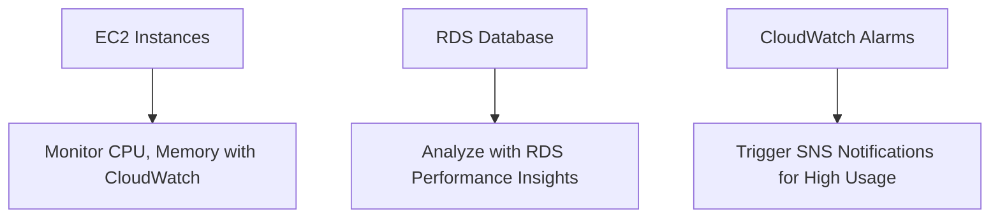

### **AWS Documentation Links:**

- [Amazon CloudWatch](https://docs.aws.amazon.com/cloudwatch/index.html)
- [R

DS Performance Insights]([https://docs.aws.amazon.com/AmazonRDS/latest/UserGuide/USER_PerfInsights.html](https://docs.aws.amazon.com/AmazonRDS/latest/UserGuide/USER_PerfInsights.html))

### **Use Case Scenarios:**

- **Database Troubleshooting**: Use **RDS Performance Insights** to troubleshoot slow database performance by identifying long-running queries or CPU bottlenecks.

### **Common Pitfalls or Challenges:**

- **Challenge**: Incorrectly configured metrics or lack of proper alarms may lead to unnoticed performance issues.
    - **Solution**: Regularly audit CloudWatch configurations and set up relevant metrics and alarms for key performance indicators.

---

### **5. Using CloudTrail to Track API Calls**

### **Detailed Steps/Exercises:**

### **Exercise 5: Tracking API Calls with AWS CloudTrail**

1. **Enable CloudTrail**:
    - In the **CloudTrail Console**, create a new trail to capture all API activity in your AWS account. Store the logs in an **S3** bucket.
    
    ```bash
    aws cloudtrail create-trail --name "MyTrail" --s3-bucket-name "my-cloudtrail-bucket"
    
    ```
    
2. **Track Specific API Activity**:
    - Use CloudTrail to monitor specific API actions, such as creating EC2 instances or modifying IAM roles. Use **CloudTrail Insights** to detect unusual activity.
3. **Analyze CloudTrail Logs**:
    - Go to the **CloudTrail Console** and filter logs by user, service, or action. Export the logs to **Athena** for further analysis:
    
    ```bash
    aws s3 sync s3://my-cloudtrail-bucket athena/ --exclude "*" --include "*.json"
    
    ```
    
4. **Set Up Alarms for Critical API Activity**:
    - Use **CloudWatch** to create alarms for critical API actions, such as deleting resources or changing permissions, and set up **SNS** notifications for alerts.

### **Mermaid Diagram: Tracking API Calls with CloudTrail and CloudWatch**

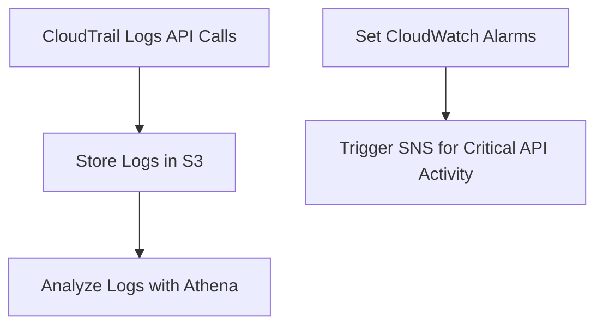

### **AWS Documentation Links:**

- [AWS CloudTrail](https://docs.aws.amazon.com/awscloudtrail/latest/userguide/cloudtrail-user-guide.html)
- [Amazon Athena](https://docs.aws.amazon.com/athena/index.html)

### **Use Case Scenarios:**

- **Security Audits**: Use **CloudTrail** to track and audit all API calls made in your AWS environment, ensuring that any unauthorized access or suspicious activity is identified.

### **Common Pitfalls or Challenges:**

- **Challenge**: Large volumes of API logs can become difficult to manage.
    - **Solution**: Use **CloudTrail Insights** or export logs to **Athena** for efficient querying and analysis.

---

### **6. Troubleshooting and Maintaining Pipelines (AWS Glue, Amazon EMR)**

### **Detailed Steps/Exercises:**

### **Exercise 6: Troubleshooting an AWS Glue ETL Pipeline**

1. **Enable Glue Job Logs**:
    - In the **AWS Glue Console**, enable job bookmarks and logging for the Glue ETL job to track its execution and troubleshoot any issues.
2. **Monitor Job Execution**:
    - Go to **CloudWatch Logs** and view the logs for the Glue job. Look for any errors or failures related to data extraction, transformation, or loading.
3. **Handle Job Failures**:
    - Set up a retry policy for Glue jobs to automatically retry the ETL process in case of intermittent failures.
    - Example of a retry policy in **AWS Glue**:
    
    ```python
    glueContext.forEachBatch(dynamicFrame, batch_function, batch_size=1000, retry_options={"maxRetries": 3})
    
    ```
    
4. **Troubleshoot EMR Cluster Failures**:
    - In the **Amazon EMR Console**, use the **Step Execution** logs to identify errors in Hadoop or Spark jobs. Review logs in **CloudWatch** or the **S3** bucket where EMR stores log data.

### **Mermaid Diagram: Troubleshooting Glue and EMR Pipelines**

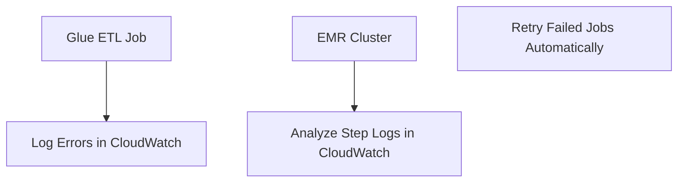

### **AWS Documentation Links:**

- [AWS Glue Logging](https://docs.aws.amazon.com/glue/latest/dg/aws-glue-logging.html)
- [Amazon EMR Logs](https://docs.aws.amazon.com/emr/latest/ManagementGuide/emr-troubleshoot-logs.html)

### **Use Case Scenarios:**

- **ETL Troubleshooting**: Use CloudWatch Logs to troubleshoot failed Glue jobs or EMR clusters, ensuring that data pipelines run smoothly and efficiently.

### **Common Pitfalls or Challenges:**

- **Challenge**: Intermittent pipeline failures may go unnoticed without proper logging and retry mechanisms.
    - **Solution**: Set up retries for Glue and EMR jobs, and ensure that logs are thoroughly monitored in **CloudWatch**.

---

### **7. Using Amazon CloudWatch Logs to Log Application Data**

### **Detailed Steps/Exercises:**

### **Exercise 7: Configuring and Automating Application Logging with CloudWatch**

1. **Set Up CloudWatch Logs for Lambda**:
    - In your **Lambda** function, enable logging to **CloudWatch Logs** using Python’s logging module:
    
    ```python
    import logging
    logger = logging.getLogger()
    logger.setLevel(logging.INFO)
    
    ```
    
2. **Automate Log Collection**:
    - Use the AWS CLI to create log groups and configure automatic log retention for your application logs:
    
    ```bash
    aws logs create-log-group --log-group-name "/aws/lambda/my-function-logs"
    aws logs put-retention-policy --log-group-name "/aws/lambda/my-function-logs" --retention-in-days 30
    
    ```
    
3. **Set Up CloudWatch Insights for Log Analysis**:
    - Use **CloudWatch Logs Insights** to analyze the logs, filtering for errors or specific keywords:
    
    ```bash
    fields @timestamp, @message
    | filter @message like /ERROR/
    | sort @timestamp desc
    | limit 20
    
    ```
    

### **Mermaid Diagram: Logging Application Data with CloudWatch Logs**

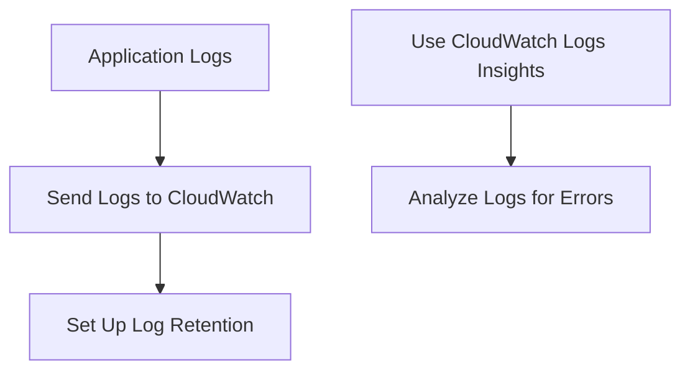

### **AWS Documentation Links:**

- [Amazon CloudWatch Logs](https://docs.aws.amazon.com/AmazonCloudWatch/latest/logs/WhatIsCloudWatchLogs.html)
- [CloudWatch Logs Insights](https://docs.aws.amazon.com/AmazonCloudWatch/latest/logs/AnalyzingLogData.html)

### **Use Case Scenarios:**

- **Log Automation**: Use CloudWatch Logs to automatically capture and analyze application logs in real time, improving observability for applications running in **Lambda**, **ECS**, or **EC2**.

### **Common Pitfalls or Challenges:**

- **Challenge**: Large log volumes may increase CloudWatch storage costs.
    - **Solution**: Implement log retention policies to automatically delete logs after a certain period.

---

### **8. Analyzing Logs with AWS Services (Athena, EMR, OpenSearch, CloudWatch Logs Insights)**

### **Detailed Steps/Exercises:**

### **Exercise 8: Analyzing Logs with Athena**

1. **Create an Athena Table for Log Analysis**:
    - Create an Athena table pointing to an **S3** bucket where logs are stored:
    
    ```sql
    CREATE EXTERNAL TABLE IF NOT EXISTS cloudwatch_logs (
        request_id STRING,
        timestamp STRING,
        log_message STRING
    ) ROW FORMAT DELIMITED FIELDS TERMINATED BY ',' LOCATION 's3://my-cloudwatch-logs/';
    
    ```
    
2. **Run SQL Queries to Analyze Logs**:
    - Query the logs in **Athena** to find error messages or performance metrics:
    
    ```sql
    SELECT log_message, COUNT(*) AS occurrence
    FROM cloudwatch_logs
    WHERE log_message LIKE '%ERROR%'
    GROUP BY log_message;
    
    ```
    

### **Exercise 9: Using Amazon OpenSearch to Search Logs**

1. **Send Logs to OpenSearch**:
    - Use **Kinesis Firehose** to stream logs from **CloudWatch** to **Amazon OpenSearch** for full-text search and analysis.
2. **Query and Visualize Logs in OpenSearch**:
    - In the **OpenSearch Console**, use **Kibana** to visualize log trends and create dashboards for real-time log analysis.

### **Mermaid Diagram: Analyzing Logs with Athena and OpenSearch**

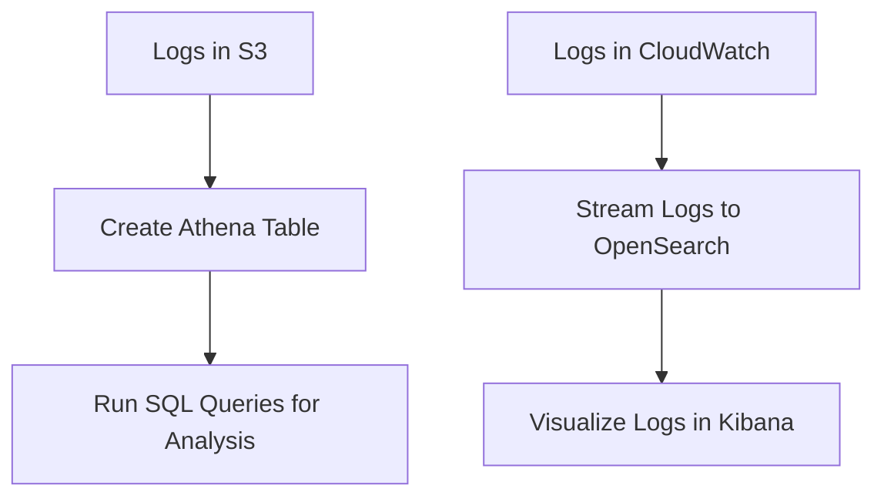

### **AWS Documentation Links:**

- [Amazon Athena](https://docs.aws.amazon.com/athena/index.html)
- [Amazon OpenSearch](https://docs.aws.amazon.com/opensearch-service/latest/developerguide/what-is.html)

### **Use Case Scenarios:**

- **Log Analysis**: Use Athena or OpenSearch to analyze large volumes of logs for troubleshooting and performance optimization.

### **Common Pitfalls or Challenges:**

- **Challenge**: Querying unoptimized or unpartitioned logs in Athena can be slow

.

- **Solution**: Use optimized log formats like **Parquet** and partition the logs for faster querying.

---