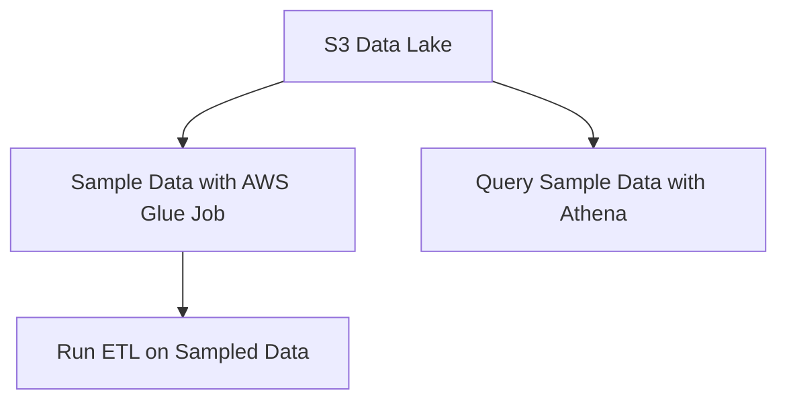
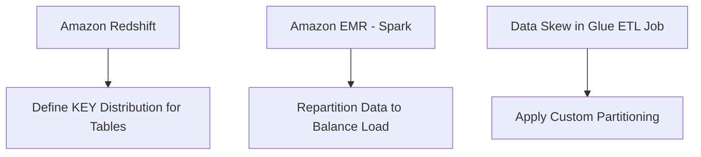
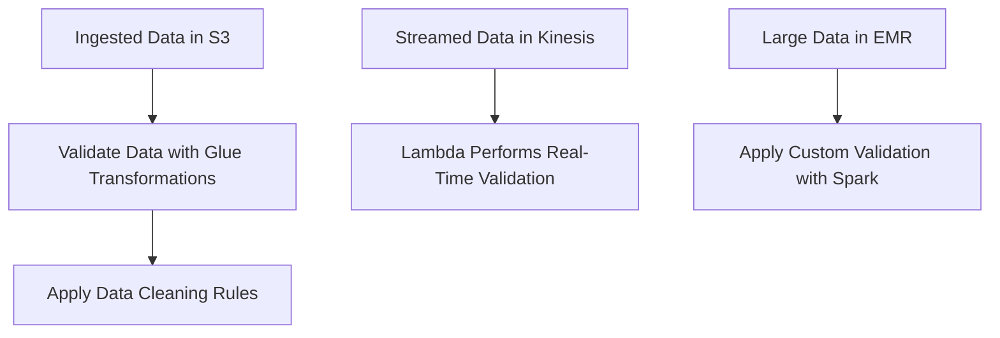
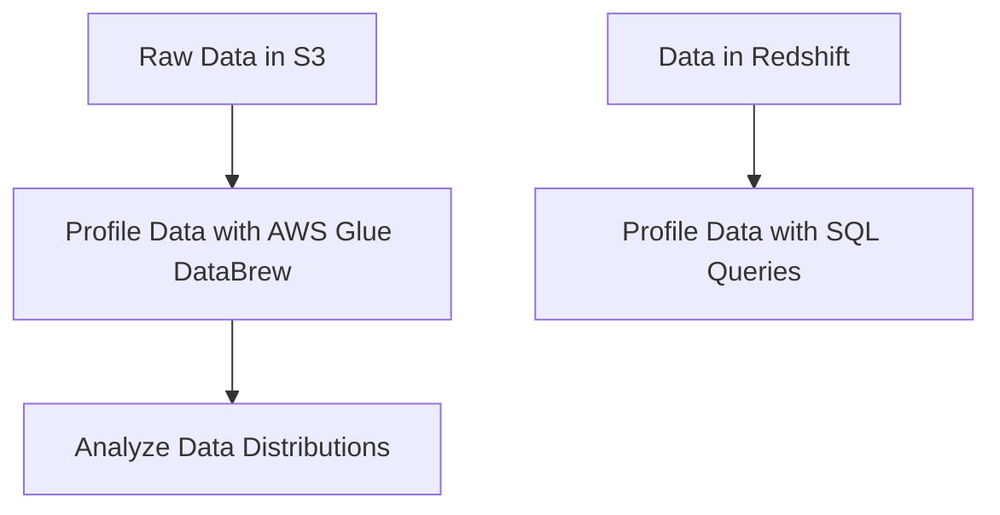
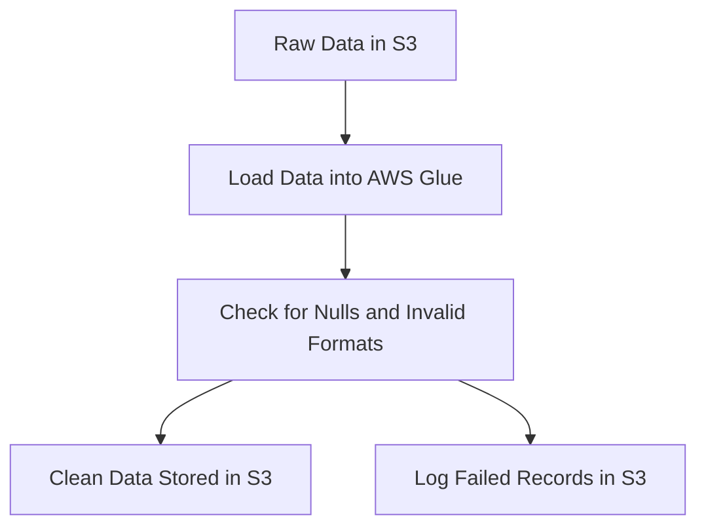
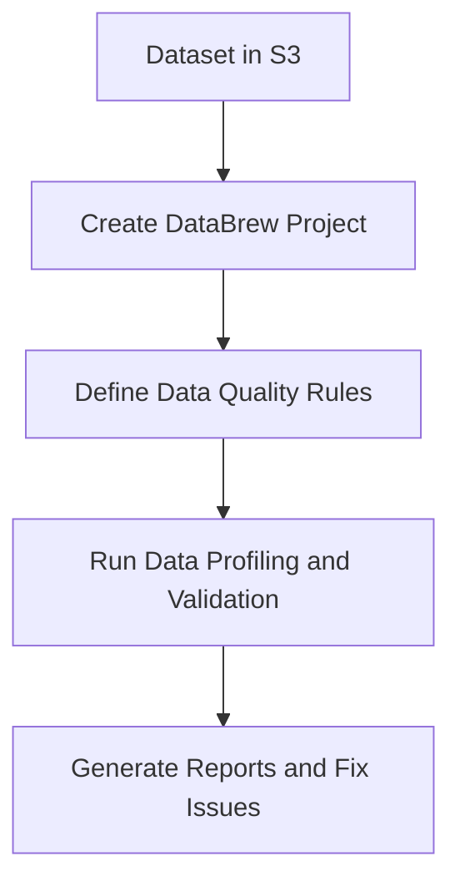
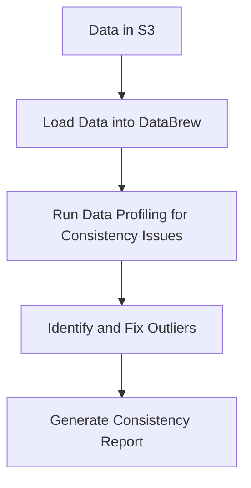
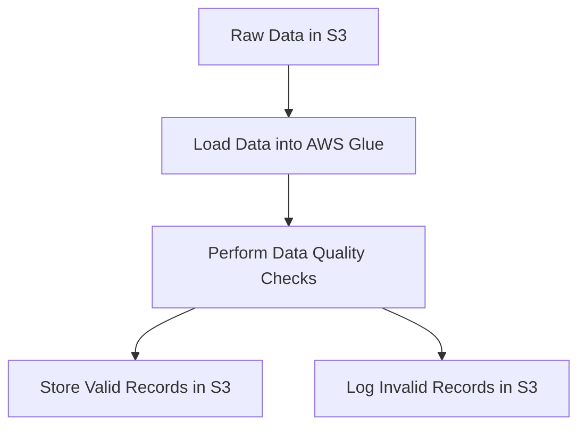
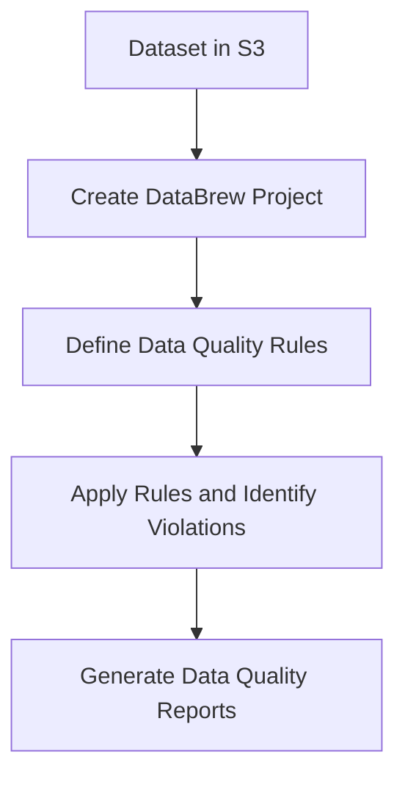
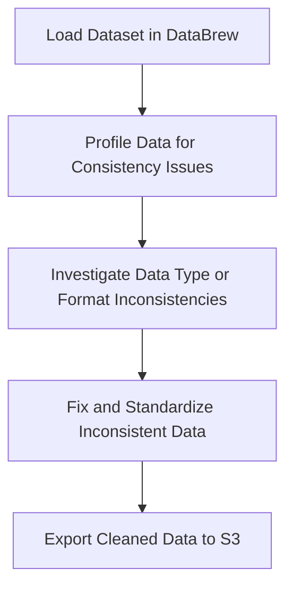

# 3.4: Ensure data quality

## Knowledge of:

- Data sampling techniques
- How to implement data skew mechanisms
- Data validation (data completeness, consistency, accuracy, and integrity)
- Data profiling

---

### **1. Data Sampling Techniques**

### **Primary Functions:**

Data sampling involves selecting a representative subset of data from a larger dataset. This is crucial for analyzing data, running tests, and optimizing processing without using the full dataset. AWS services that can help implement data sampling techniques include:

- **AWS Glue**: Glue jobs can be configured to read a subset of data during an ETL process, reducing processing time for testing.
- **Amazon Athena**: You can run SQL queries to sample data directly from **S3** by limiting the number of rows returned.
- **Amazon Redshift**: Redshift allows you to use SQL queries like `TABLESAMPLE` to retrieve a random subset of rows from a table.

### **Patterns (When to Use):**

- Use data sampling when working with large datasets that would take too long to process entirely during ETL jobs or analytics. This is ideal for **development, testing**, or **performance tuning**.
    - **Example**: Use **AWS Glue** to run a sampling job on a large data lake stored in **S3** before applying transformations.
- Use **Amazon Redshift’s** `TABLESAMPLE` feature for ad-hoc analytics or to test queries on a subset of large tables.
    
    ```sql
    SELECT * FROM orders TABLESAMPLE SYSTEM (1);
    
    ```
    

### **Antipatterns (When Not to Use):**

- Avoid using random sampling when accurate results are required across the entire dataset. For example, calculating **financial reports** based on sample data can lead to inaccurate results.
- Do not use sampling for small datasets where analyzing the entire dataset is efficient and feasible.

### **Benefits of Managed vs. Serverless Services:**

- **Managed (Amazon Redshift)**:
    - **Performance**: Redshift offers high performance for running analytics on large datasets, including using the `TABLESAMPLE` function for sampling.
    - **Cost**: Redshift clusters incur costs based on reserved or on-demand instances, which can become expensive if not optimized.
- **Serverless (Athena, Glue)**:
    - **Simplicity**: Serverless options like **Athena** and **Glue** allow on-demand data sampling without managing infrastructure.
    - **Cost**: Pay-per-query or pay-per-job pricing makes serverless services more cost-effective for ad-hoc or intermittent workloads.

### **Mermaid Diagram: Data Sampling with AWS Glue and Athena**



### **AWS Documentation Links:**

- [AWS Glue Documentation](https://docs.aws.amazon.com/glue/index.html)
- [Amazon Athena Documentation](https://docs.aws.amazon.com/athena/index.html)
- [Amazon Redshift Documentation](https://docs.aws.amazon.com/redshift/index.html)

---

### **2. How to Implement Data Skew Mechanisms**

### **Primary Functions:**

Data skew refers to the uneven distribution of data across nodes in a distributed system, leading to performance bottlenecks. In AWS, this is often managed using **data partitioning**, **distribution styles**, or custom **hashing techniques**.

- **Amazon Redshift**: Allows you to define table **distribution styles** to optimize the distribution of data across nodes.
- **Amazon EMR (Hadoop/Spark)**: Data can be repartitioned in **Spark** to handle skewed data.
- **AWS Glue**: Glue ETL jobs can be configured to balance workloads by splitting large partitions or using custom partitioning schemes.

### **Patterns (When to Use):**

- Use **Amazon Redshift’s** **KEY distribution style** when a table has a high correlation between rows that are frequently joined with another table. This helps minimize data movement between nodes.
    
    ```sql
    CREATE TABLE sales
    (
        sale_id INT,
        product_id INT,
        sale_date DATE
    )
    DISTSTYLE KEY
    DISTKEY (product_id);
    
    ```
    
- In **Apache Spark (EMR)**, use **repartition** or **skew join optimization** when processing large datasets with skewed data, ensuring that load is balanced across nodes.

### **Antipatterns (When Not to Use):**

- Avoid using a **KEY distribution style** in Redshift if the distribution key results in highly skewed data. This can cause some nodes to handle more data than others, leading to performance degradation.
- Avoid using **small partition sizes** in **AWS Glue** or **Spark** for large datasets. This can result in unnecessary overhead and inefficiencies.

### **Benefits of Managed vs. Serverless Services:**

- **Managed (Redshift, EMR)**:
    - **Control**: Managed services like **Redshift** and **EMR** provide more control over distribution and partitioning, allowing for custom configurations to handle skewed data.
    - **Cost**: These services typically come with higher costs for larger, consistent workloads, but offer fine-tuned performance optimization.
- **Serverless (Glue)**:
    - **Simplicity**: Glue offers an automated way to handle partitioning and workload balancing, but may have less fine-grained control compared to Redshift or EMR.
    - **Cost**: Glue’s pay-per-use pricing is generally more cost-effective for intermittent workloads.

### **Mermaid Diagram: Handling Data Skew with Redshift and EMR**



### **AWS Documentation Links:**

- [Amazon Redshift Distribution Styles](https://docs.aws.amazon.com/redshift/latest/dg/c_best-practices-best-dist-key.html)
- [Apache Spark on EMR](https://docs.aws.amazon.com/emr/latest/ReleaseGuide/emr-spark.html)
- [AWS Glue Partitions](https://docs.aws.amazon.com/glue/latest/dg/aws-glue-programming-partitions.html)

---

### **3. Data Validation (Data Completeness, Consistency, Accuracy, and Integrity)**

### **Primary Functions:**

Data validation ensures that data is complete, consistent, accurate, and maintains integrity before it is processed, stored, or used in analysis. AWS provides tools for validating data during ETL processes and data ingestion.

- **AWS Glue**: Provides built-in transformations to validate data, such as removing null values or enforcing data type consistency.
- **Amazon EMR (Apache Spark)**: Allows you to build custom validation logic using **PySpark** or **Scala** for complex datasets.
- **AWS Lambda**: Can be used to perform lightweight validation on streaming or batch data before writing to storage.

### **Patterns (When to Use):**

- Use **AWS Glue** to validate and clean data during the ETL process. Common tasks include removing duplicate records, handling null values, or validating data types.
    - **Example**: Use a Glue **dynamic frame** to remove null values:
    
    ```python
    dynamic_frame = dynamic_frame.drop_nulls(["column_name"])
    
    ```
    
- Use **Lambda** for real-time validation in streaming applications (e.g., ingesting data from **Kinesis** or **DynamoDB Streams**) to ensure data completeness and accuracy.
- Use **Apache Spark (EMR)** for complex data validation rules across large datasets. This is useful for batch processing where you need to apply multiple validation steps.

### **Antipatterns (When Not to Use):**

- Avoid performing complex validation in **Lambda** for very large datasets, as this can lead to execution timeouts or limited scalability.
- Avoid skipping data validation when ingesting data from multiple sources. Without validation, incomplete or inconsistent data may enter the data lake, leading to downstream errors.

### **Benefits of Managed vs. Serverless Services:**

- **Managed (EMR)**:
    - **Flexibility**: Managed clusters like **EMR** provide flexibility to build custom validation frameworks for large-scale datasets.
    - **Cost**: EMR’s managed infrastructure offers scalability, but it may become expensive for small, simple validation tasks.
- **Serverless (Glue, Lambda)**:
    - **Simplicity**: Serverless options like **AWS Glue** and **Lambda** allow easy setup for data validation without managing infrastructure.
    - **Cost**: Pay-per-use models in Glue and Lambda make them more cost-effective for low-frequency or lightweight validation tasks.

### **Mermaid Diagram: Data Validation with AWS Glue and Lambda**



### **AWS Documentation Links:**

- [AWS Glue Data Cleaning](https://docs.aws.amazon.com/glue/latest/dg/aws-glue-programming-etl-cleaning.html)
- [Amazon EMR Data Validation]([https://docs.aws.amazon.com/emr/latest/ManagementGuide/emr-spark-data-frames](https://docs.aws.amazon.com/emr/latest/ManagementGuide/emr-spark-data-frames)

.html)

- [AWS Lambda Documentation](https://docs.aws.amazon.com/lambda/index.html)

---

### **4. Data Profiling**

### **Primary Functions:**

Data profiling involves analyzing data to better understand its structure, quality, and content. This is critical for identifying anomalies, outliers, missing values, and other data quality issues.

- **AWS Glue DataBrew**: Provides a no-code interface for data profiling, allowing you to explore data distributions, null values, and outliers.
- **AWS Glue**: Glue ETL jobs can include data profiling steps by using built-in transformations to summarize data properties.
- **Amazon Redshift**: Can be used for manual data profiling through SQL queries to explore distributions, aggregates, and statistics.

### **Patterns (When to Use):**

- Use **AWS Glue DataBrew** for visual data profiling, such as generating histograms, understanding distributions, or identifying missing values in datasets.
    - **Example**: Profile a dataset stored in **S3** using DataBrew to detect missing values and outliers.
- Use **Redshift** or **Athena** to run SQL queries that profile data distributions:
    
    ```sql
    SELECT COUNT(*), MIN(sales), MAX(sales), AVG(sales)
    FROM sales_data;
    
    ```
    
- Use **Glue** for automated profiling in ETL pipelines where you want to generate summaries or aggregate data during transformations.

### **Antipatterns (When Not to Use):**

- Avoid manually profiling large datasets when automated tools like **DataBrew** can quickly identify patterns and anomalies.
- Avoid profiling data directly in production environments without creating backups or ensuring performance impact is minimal.

### **Benefits of Managed vs. Serverless Services:**

- **Managed (Redshift, Glue)**:
    - **Scalability**: Managed services like **Redshift** and **Glue** can handle large datasets and provide detailed insights into data properties through SQL queries or built-in transformations.
    - **Cost**: Managed services can be costly for large datasets, but offer high performance for complex profiling tasks.
- **Serverless (DataBrew, Athena)**:
    - **Simplicity**: Serverless solutions like **DataBrew** and **Athena** allow you to perform data profiling without managing infrastructure.
    - **Cost**: Pay-per-use pricing makes these services cost-effective for intermittent or ad-hoc profiling tasks.

### **Mermaid Diagram: Data Profiling with DataBrew and Redshift**



### **AWS Documentation Links:**

- [AWS Glue DataBrew](https://docs.aws.amazon.com/databrew/index.html)
- [Amazon Redshift Data Profiling](https://docs.aws.amazon.com/redshift/latest/dg/r_QUERY_and_TABLE_SVCS.html)
- [AWS Glue Profiling](https://docs.aws.amazon.com/glue/latest/dg/aws-glue-programming-etl-cleaning.html)

---

## Skills in:

- Running data quality checks while processing the data (for example, checking for empty fields)
- Defining data quality rules (for example, AWS Glue DataBrew)
- Investigating data consistency (for example, AWS Glue DataBrew)

---

### **1. Running Data Quality Checks While Processing the Data**

### **Detailed Steps/Exercises:**

### **Exercise 1: Running Data Quality Checks with AWS Glue**

1. **Create a Glue Job**:
    - In the **AWS Glue Console**, create a new Glue job.
    - Specify your input data source, such as data stored in **Amazon S3** or **Amazon RDS**.
    - Define an **IAM role** that grants Glue the necessary permissions to access your data sources.
2. **Define a DynamicFrame**:
    - Within your Glue job script, create a **DynamicFrame** to represent your dataset:
    
    ```python
    dynamic_frame = glueContext.create_dynamic_frame.from_catalog(database="my_database", table_name="my_table")
    
    ```
    
3. **Run Data Quality Checks**:
    - Perform data quality checks by checking for null values or empty fields within the DynamicFrame. Use Glue’s built-in transformation functions for validation:
    
    ```python
    # Drop records with empty fields
    cleaned_frame = dynamic_frame.drop_nulls(['column_name'])
    
    # Check for specific data quality issues, e.g., invalid email formats
    filtered_frame = dynamic_frame.filter(lambda x: x["email"].contains("@"))
    
    ```
    
4. **Log Data Quality Issues**:
    - Create a **logging mechanism** to record rows that do not meet the quality criteria. These records can be saved to **S3** for further investigation.
    
    ```python
    failed_records = dynamic_frame.filter(lambda x: not x["email"].contains("@"))
    failed_records.toDF().write().format("json").save("s3://my-bucket/failed-records/")
    
    ```
    
5. **Run and Monitor the Job**:
    - Execute the Glue job, and monitor it in the **Glue Console** or **CloudWatch** for performance and job logs.

### **Mermaid Diagram: Data Quality Checks in AWS Glue**



### **AWS Documentation Links:**

- [AWS Glue Documentation](https://docs.aws.amazon.com/glue/index.html)
- [AWS Glue Transformations](https://docs.aws.amazon.com/glue/latest/dg/aws-glue-programming-etl-dynamicframes.html)

### **Use Case Scenarios:**

- **Data Ingestion Pipelines**: Run data quality checks to ensure that invalid or incomplete data does not make its way into downstream data warehouses like **Amazon Redshift** or **Athena**.
- **ETL Processes**: Before performing transformations in an ETL pipeline, validate the integrity of the data, ensuring that it meets required quality standards.

### **Common Pitfalls or Challenges:**

- **Challenge**: Large datasets may slow down Glue jobs if comprehensive data quality checks are performed.
    - **Solution**: Use partitioning or sampling techniques to check the data in batches or segments, ensuring faster execution.

---

### **2. Defining Data Quality Rules (AWS Glue DataBrew)**

### **Detailed Steps/Exercises:**

### **Exercise 2: Defining Data Quality Rules in AWS Glue DataBrew**

1. **Create a New DataBrew Project**:
    - In the **AWS Glue Console**, navigate to **AWS Glue DataBrew**.
    - Create a new project and select the dataset to work with (from **S3**, **Redshift**, etc.).
2. **Define Data Quality Rules**:
    - Use **DataBrew**’s rule-based interface to define specific data quality rules.
    - Example rules:
        - Ensure that the **email** field contains an "@" symbol.
        - Check that **price** fields are non-negative.
        - Validate that **date** fields follow a consistent format (`YYYY-MM-DD`).
    - DataBrew will provide suggestions for common rules, but you can also define custom rules:
    
    ```bash
    Rule: Email must contain "@"
    Rule: Price must be >= 0
    
    ```
    
3. **Run Data Profiling**:
    - Profile your data using DataBrew’s **data profiling** feature to understand the structure and quality of the dataset. This will generate insights such as null values, outliers, and data types.
4. **Fix Data Quality Issues**:
    - Based on the profiling results, apply transformations directly in **DataBrew** to fix common issues (e.g., filling missing values, removing invalid rows).
5. **Create Data Quality Reports**:
    - After running the data quality checks, generate **reports** in DataBrew to summarize the issues found and actions taken to fix them. The report can be exported to **S3**.

### **Mermaid Diagram: Defining Data Quality Rules in DataBrew**



### **AWS Documentation Links:**

- [AWS Glue DataBrew Documentation](https://docs.aws.amazon.com/databrew/index.html)
- [DataBrew Data Quality Rules](https://docs.aws.amazon.com/databrew/latest/dg/profile-rules.html)

### **Use Case Scenarios:**

- **Business Intelligence**: Ensure that datasets used in **QuickSight** dashboards or **Athena** queries meet high-quality standards, ensuring that reports are accurate and trustworthy.
- **ETL Workflows**: Define data quality rules in DataBrew as part of the data preparation stage, ensuring that only clean, validated data enters data lakes or warehouses.

### **Common Pitfalls or Challenges:**

- **Challenge**: Defining too many complex rules can slow down the profiling process.
    - **Solution**: Start with basic rules and gradually add more complex validation rules based on the quality results from profiling.

---

### **3. Investigating Data Consistency (AWS Glue DataBrew)**

### **Detailed Steps/Exercises:**

### **Exercise 3: Investigating Data Consistency with AWS Glue DataBrew**

1. **Set Up DataBrew Project for Consistency Checks**:
    - In the **AWS Glue Console**, create a new DataBrew project. Import your dataset from **S3** or another data source.
    - Select the data source you want to investigate for consistency, such as sales data, user profiles, or transaction records.
2. **Profile Data for Consistency Issues**:
    - Use DataBrew’s **data profiling** feature to run an initial analysis of the dataset.
    - Check for consistency issues such as:
        - **Date consistency**: Ensure that all date fields follow the same format.
        - **Data type consistency**: Ensure that a column expected to hold numbers contains only numeric values.
3. **Investigate Outliers and Missing Data**:
    - Use DataBrew’s profiling results to find **outliers** or inconsistent values that deviate from expected norms.
    - Example: Check if all products have a non-negative price value or whether user IDs are unique across the dataset.
4. **Resolve Consistency Issues**:
    - Apply built-in **transformations** to resolve consistency issues:
        - Convert dates to a standard format (`YYYY-MM-DD`).
        - Replace outliers with default values or remove invalid rows.
5. **Generate Data Consistency Reports**:
    - After fixing inconsistencies, generate a **report** to document the corrections and provide an overview of the remaining consistency issues (if any).
    - Save the report in **S3** for audit or further investigation.

### **Mermaid Diagram: Investigating Data Consistency in DataBrew**



### **AWS Documentation Links:**

- [AWS Glue DataBrew](https://docs.aws.amazon.com/databrew/index.html)
- [AWS Glue Data Profiling](https://docs.aws.amazon.com/databrew/latest/dg/profile-data.html)

### **Use Case Scenarios:**

- **Financial Data**: Investigate and enforce consistency across financial transactions, ensuring that data conforms to business rules (e.g., all prices are positive, transaction dates are valid).
- **Data Integration**: Ensure that data ingested from multiple sources (e.g., customer records, sales data) is consistent in format and structure before loading into data warehouses.

### **Common Pitfalls or Challenges:**

- **Challenge**: Profiling very large datasets for consistency can lead to slow performance.
    - **Solution**: Use partitioning or sampling to investigate consistency across smaller, more manageable data segments.

---

## Skills in:

- Running data quality checks while processing the data (for example, checking for empty fields)
- Defining data quality rules (for example, AWS Glue DataBrew)
- Investigating data consistency (for example, AWS Glue DataBrew)

---

### **1. Running Data Quality Checks While Processing the Data**

### **Detailed Steps/Exercises:**

### **Exercise 1: Running Data Quality Checks with AWS Glue**

1. **Create a Glue Job**:
    - In the **AWS Glue Console**, navigate to **Jobs** and create a new Glue job.
    - Choose your data source (e.g., from **S3**, **RDS**, or **DynamoDB**).
    - Assign an **IAM role** with permissions to access your data sources and destinations.
2. **Create a DynamicFrame from the Source Data**:
    - Write a Glue script in **Python** or **Scala** to create a **DynamicFrame**. A **DynamicFrame** is an abstraction in AWS Glue used for ETL operations:
    
    ```python
    dynamic_frame = glueContext.create_dynamic_frame.from_catalog(database="my_database", table_name="my_table")
    
    ```
    
3. **Perform Data Quality Checks**:
    - Use Glue transformations to check for missing, empty, or invalid values in key fields.
    - Example: Removing rows with null values in the `email` field:
    
    ```python
    cleaned_frame = dynamic_frame.drop_nulls(["email"])
    
    ```
    
    - Example: Filtering out invalid email formats using a simple regular expression:
    
    ```python
    from awsglue.transforms import Filter
    
    valid_emails = Filter.apply(frame=dynamic_frame, f=lambda x: "@" in x["email"])
    
    ```
    
4. **Log or Save Invalid Records**:
    - For auditing, save records that do not meet the quality criteria to an S3 bucket for review:
    
    ```python
    invalid_records = dynamic_frame.filter(lambda x: "@" not in x["email"])
    invalid_records.toDF().write().format("json").save("s3://mybucket/invalid-records/")
    
    ```
    
5. **Run the Glue Job**:
    - Configure the **job triggers** and run the job. You can schedule it or use it as part of an **event-driven pipeline**.

### **Mermaid Diagram: Data Quality Checks with AWS Glue**



### **AWS Documentation Links:**

- [AWS Glue Documentation](https://docs.aws.amazon.com/glue/index.html)
- [AWS Glue DynamicFrames](https://docs.aws.amazon.com/glue/latest/dg/aws-glue-programming-etl-dynamicframes.html)

### **Use Case Scenarios:**

- **Data Pipelines**: This is essential in data pipelines that feed into downstream systems like **Amazon Redshift** or **Athena**. Ensuring that only valid and clean data flows into these systems helps maintain data integrity.
- **ETL Processes**: Run data quality checks during ETL processes to ensure that the extracted and transformed data meets quality standards before loading it into a data warehouse.

### **Common Pitfalls or Challenges:**

- **Challenge**: Slow Glue jobs when running on very large datasets.
    - **Solution**: Partition the data for parallel processing and use distributed Glue jobs to handle large datasets efficiently.

---

### **2. Defining Data Quality Rules Using AWS Glue DataBrew**

### **Detailed Steps/Exercises:**

### **Exercise 2: Defining and Applying Data Quality Rules in AWS Glue DataBrew**

1. **Create a New DataBrew Project**:
    - In the **AWS Glue Console**, navigate to **AWS Glue DataBrew**.
    - Create a new DataBrew project and choose the data source (e.g., data stored in **S3** or a **Redshift** table).
2. **Profile the Data**:
    - Use **Data Profiling** in DataBrew to generate metrics like missing values, outliers, and data distributions.
    - This gives a preliminary overview of the dataset’s quality and structure.
3. **Define Data Quality Rules**:
    - In the **Rules** section, define data quality rules based on your dataset requirements. Common rules might include:
        - Ensuring email fields contain "@".
        - Checking if numeric fields are greater than zero.
        - Verifying date formats (e.g., `YYYY-MM-DD`).
    - Example: Setting a rule for valid emails:
    
    ```bash
    Rule: Column "email" must contain "@"
    
    ```
    
4. **Apply Data Quality Rules**:
    - Once defined, apply the data quality rules to the dataset. DataBrew will highlight records that violate these rules.
5. **Fix Data Quality Issues**:
    - Use **transformations** to fix issues automatically. For example:
        - Replace null values with defaults.
        - Reformat date fields or correct invalid email addresses.
6. **Generate Data Quality Reports**:
    - Generate **reports** that summarize the data quality checks and display the results of the rule applications. Save these reports to **S3** for further analysis.

### **Mermaid Diagram: Data Quality Rules with AWS Glue DataBrew**



### **AWS Documentation Links:**

- [AWS Glue DataBrew](https://docs.aws.amazon.com/databrew/index.html)
- [Data Profiling in DataBrew](https://docs.aws.amazon.com/databrew/latest/dg/profile-data.html)

### **Use Case Scenarios:**

- **Business Data Validation**: Ensuring that sales or customer data loaded into **Amazon Redshift** adheres to business rules (e.g., all prices must be non-negative).
- **Data Preparation**: During the preparation stage of data pipelines, define and enforce rules to ensure that data loaded into analysis tools (like **Amazon QuickSight**) is clean and reliable.

### **Common Pitfalls or Challenges:**

- **Challenge**: Complex datasets with numerous quality rules can make profiling and validation slow.
    - **Solution**: Start with critical rules and gradually expand the set of rules. Partition large datasets to speed up profiling.

---

### **3. Investigating Data Consistency with AWS Glue DataBrew**

### **Detailed Steps/Exercises:**

### **Exercise 3: Investigating Data Consistency Using AWS Glue DataBrew**

1. **Create a DataBrew Project**:
    - In **AWS Glue DataBrew**, create a new project and load a dataset from **S3**, **RDS**, or **Redshift**.
2. **Run Data Profiling for Consistency**:
    - Run the **Data Profiling** feature in DataBrew to analyze key consistency issues, such as:
        - **Data type consistency**: Ensuring numeric fields contain only numbers.
        - **Date format consistency**: Ensuring all date fields follow a common format (e.g., `YYYY-MM-DD`).
        - **Uniqueness**: Ensuring primary keys like `user_id` or `transaction_id` are unique.
3. **Investigate Inconsistencies**:
    - The profiling report will highlight inconsistencies such as:
        - Mismatches in data types.
        - Null values in non-nullable fields.
        - Outliers that deviate significantly from normal values.
    - For example, you might find that some `price` values are negative when they should be positive.
4. **Fix Consistency Issues**:
    - Use **DataBrew transformations** to standardize inconsistent values:
        - Convert all dates to a consistent format.
        - Remove rows with duplicate or null `user_id` values.
        - Replace or remove outliers in numeric fields.
    - Example transformation for fixing date formats:
    
    ```bash
    Transformation: Convert column "date" to format "YYYY-MM-DD"
    
    ```
    
5. **Export the Cleaned Data**:
    - After resolving consistency issues, export the cleaned data back to **S3** or load it into a data warehouse (e.g., **Redshift**) for further processing.

### **Mermaid Diagram: Data Consistency Investigation with AWS Glue DataBrew**



### **AWS Documentation Links:**

- [AWS Glue DataBrew Documentation](https://docs.aws.amazon.com/databrew/index.html)
- [DataBrew Data Profiling](https://docs.aws.amazon.com/databrew/latest/dg/profile-data.html)

### **Use Case Scenarios:**

- **Financial Data Processing**: Investigate the consistency of financial records before loading them into a **Redshift** data warehouse to ensure all amounts are positive, and transaction dates are valid.
- **Customer Data Integration**: Investigate the consistency of customer records from

multiple sources to ensure that all records follow the same structure and formats before performing downstream analysis.

### **Common Pitfalls or Challenges:**

- **Challenge**: Large, inconsistent datasets may take a long time to profile and clean.
    - **Solution**: Use DataBrew’s sampling feature to profile smaller data subsets before applying changes to the full dataset.

---

### Summary of Key Skills for Data Quality and Consistency

This section provides practical exercises and detailed guidance for performing **data quality checks**, **defining data quality rules**, and **investigating data consistency** using AWS Glue and Glue DataBrew. Each skill is essential for building robust, high-quality data pipelines that ensure data is clean, consistent, and ready for downstream use in analytics or machine learning tasks. By following the exercises and diagrams, you can practice these tasks in real-world scenarios and understand how to resolve common challenges that may arise when handling large datasets.