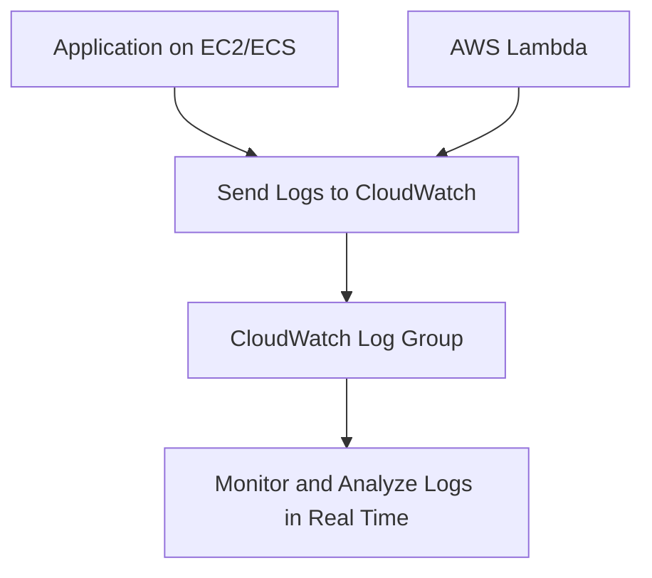
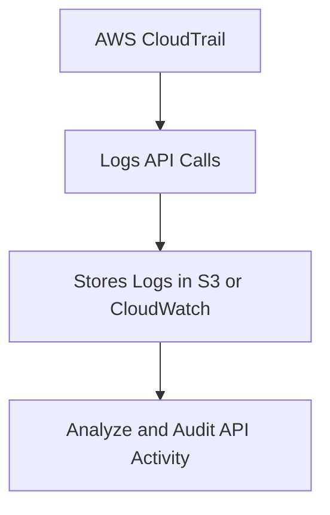
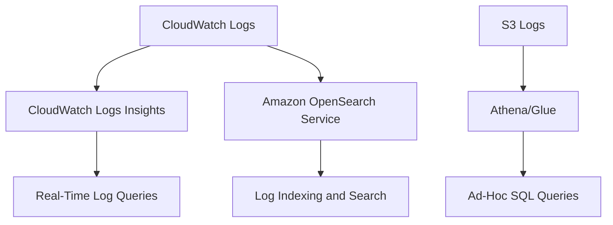
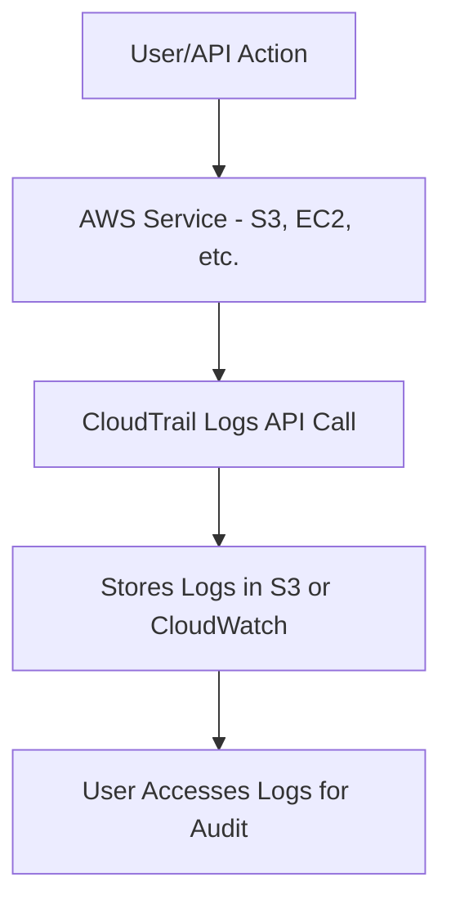
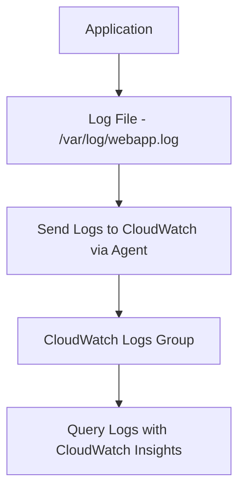
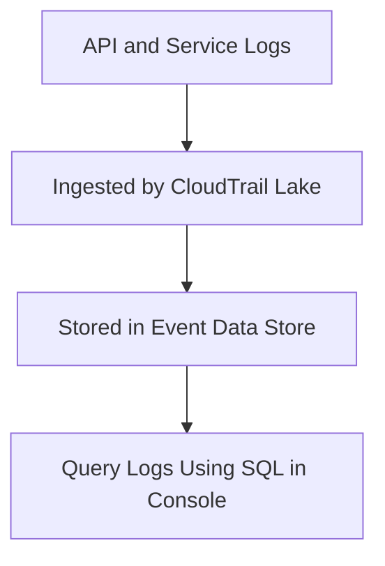
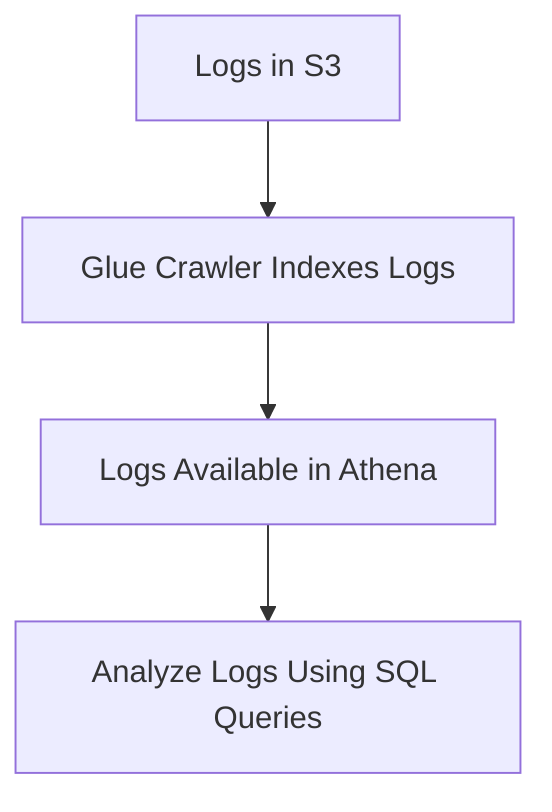
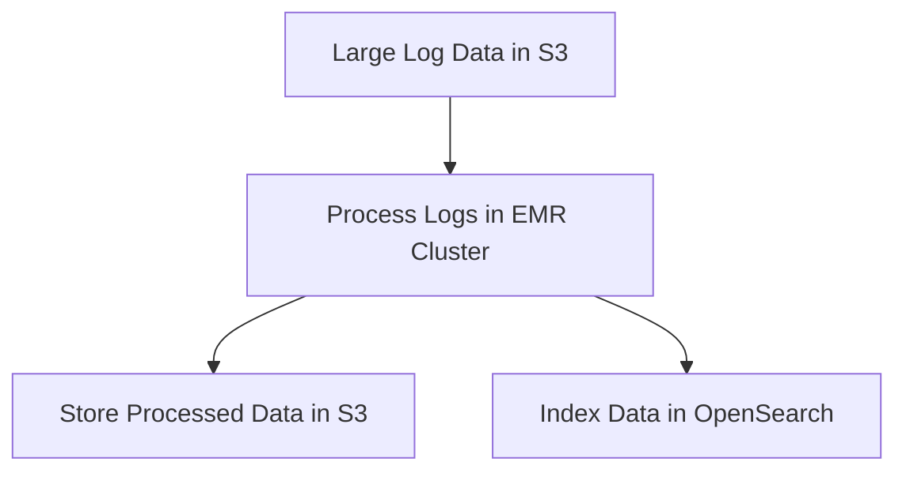

# 4.4: Prepare logs for audit

## Knowledge of:

- How to log application data
- How to log access to AWS services
- Centralized AWS logs

---

### **1. How to Log Application Data**

### **Primary Functions:**

Logging application data helps capture runtime information, errors, and performance metrics. AWS offers several services for logging application data:

- **Amazon CloudWatch Logs**: Centralized logging service that collects, monitors, and stores logs from AWS services and custom applications.
- **AWS Lambda**: Automatically logs invocation details, errors, and performance metrics to **CloudWatch Logs**.
- **Amazon Elastic Container Service (ECS)**: Logs container-level data, including application logs, which can be sent to **CloudWatch** or **Amazon OpenSearch Service**.

### **Patterns (When to Use):**

- Use **CloudWatch Logs** to capture logs from Lambda functions, EC2 instances, and ECS tasks. You can configure log groups for each application and use log streams to view logs in real time.
    - Example: Set up **CloudWatch Logs** to capture error messages from a web application running on EC2.
- Use **AWS Lambda** if your application is serverless and you need automatic logging without additional setup. Lambda automatically sends logs to CloudWatch without requiring manual configuration.
    - Example: Monitor Lambda invocations and errors via CloudWatch Logs without writing custom logging logic.
- Use **ECS Task Logging** when running containerized applications to send logs from individual containers to CloudWatch or another logging destination like Amazon S3 or OpenSearch.

### **Antipatterns (When Not to Use):**

- Avoid sending logs directly to **S3** unless you have a specific use case for analyzing historical logs in bulk. **CloudWatch** is more suited for real-time log monitoring and alerting.
- Avoid using custom log storage solutions for AWS applications when **CloudWatch Logs** offers built-in features with scaling and retention capabilities.

### **Benefits of Managed vs. Serverless Services:**

- **Managed Services (CloudWatch)**:
    - **Scalability**: CloudWatch Logs automatically scales with your logging needs and provides robust retention and archival options.
    - **Cost**: Managed services like CloudWatch are priced based on ingestion, storage, and retrieval of logs, but reduce operational overhead.
- **Serverless (Lambda)**:
    - **Simplicity**: Lambda’s serverless logging automatically integrates with CloudWatch, simplifying setup and reducing the need to manage infrastructure.
    - **Cost**: Serverless logging only incurs costs for the storage of logs and Lambda invocations, which can be more cost-effective for small workloads.

### **Mermaid Diagram: Application Logging Using AWS CloudWatch**



### **AWS Documentation Links:**

- [Amazon CloudWatch Logs Documentation](https://docs.aws.amazon.com/AmazonCloudWatch/latest/logs/WhatIsCloudWatchLogs.html)
- [Lambda Logging in CloudWatch](https://docs.aws.amazon.com/lambda/latest/dg/monitoring-cloudwatchlogs.html)

---

### **2. How to Log Access to AWS Services**

### **Primary Functions:**

Logging access to AWS services helps monitor and audit actions taken within your AWS account. AWS provides a few key services for logging access:

- **AWS CloudTrail**: Records all API calls made to AWS services, including actions made via the **AWS Management Console**, **AWS CLI**, and **SDKs**. Logs are stored in **CloudTrail Event History** or can be sent to **S3** for long-term retention.
- **Amazon S3 Access Logs**: Tracks access requests to S3 buckets, including information about who accessed the bucket, what actions they performed, and when.
- **Amazon VPC Flow Logs**: Captures information about IP traffic to and from network interfaces in your VPC.

### **Patterns (When to Use):**

- Use **AWS CloudTrail** to capture and monitor all API calls in your AWS environment, ensuring that you have a record of every action taken within your account.
    - Example: Use CloudTrail to track who created or deleted an S3 bucket, and set up alerts for unusual activity.
- Use **S3 Access Logs** to track detailed information about requests made to your S3 buckets. This is particularly useful for auditing and security purposes.
    - Example: Enable access logs on an S3 bucket that stores sensitive customer data to track access patterns.
- Use **VPC Flow Logs** to monitor network traffic within your VPC and detect suspicious activity or troubleshoot network connectivity issues.
    - Example: Enable VPC Flow Logs to capture traffic data for your EC2 instances, helping identify potential security breaches.

### **Antipatterns (When Not to Use):**

- Avoid relying solely on **CloudTrail Event History** for long-term retention, as this only retains logs for 90 days. For long-term storage, forward CloudTrail logs to **S3**.
- Avoid using **S3 Access Logs** if you only need high-level access monitoring. **CloudTrail** can provide sufficient access logging for most scenarios.

### **Benefits of Managed vs. Serverless Services:**

- **Managed Services (CloudTrail, VPC Flow Logs)**:
    - **Security**: CloudTrail provides a secure, managed service for logging AWS API activity across accounts and services, with options for multi-region setups.
    - **Cost**: Managed services like CloudTrail and VPC Flow Logs have costs associated with storing and analyzing logs, but offer low operational overhead.
- **Serverless (Lambda + CloudWatch)**:
    - **Flexibility**: Combine Lambda with CloudWatch Logs to create custom access logs and alerts for specific AWS services or resources, particularly useful in complex multi-account setups.
    - **Cost**: Serverless logging is typically cost-effective, as you only pay for what you use, making it ideal for dynamic or short-term access logging.

### **Mermaid Diagram: Logging AWS Service Access with CloudTrail**



### **AWS Documentation Links:**

- [AWS CloudTrail Documentation](https://docs.aws.amazon.com/awscloudtrail/latest/userguide/cloudtrail-user-guide.html)
- [Amazon S3 Server Access Logging](https://docs.aws.amazon.com/AmazonS3/latest/userguide/ServerLogs.html)
- [VPC Flow Logs](https://docs.aws.amazon.com/vpc/latest/userguide/flow-logs.html)

---

### **3. Centralized AWS Logs**

### **Primary Functions:**

Centralized logging aggregates logs from various AWS services, applications, and network components into a single place for monitoring, analysis, and troubleshooting. AWS provides multiple services for centralized logging:

- **AWS CloudWatch Logs Insights**: Allows you to search, analyze, and visualize logs from **CloudWatch** log groups using a powerful query language.
- **Amazon OpenSearch Service**: Previously known as **Elasticsearch**, it provides centralized log indexing, searching, and analytics capabilities.
- **AWS Glue and Athena**: Use these services to query and analyze logs stored in **S3** with SQL-based queries.

### **Patterns (When to Use):**

- Use **CloudWatch Logs Insights** when you need to search and analyze logs across multiple AWS services and applications in real time.
    - Example: Search for specific error messages across all Lambda functions in a region using a CloudWatch Logs Insights query.
- Use **Amazon OpenSearch Service** when you need to centralize logs from multiple AWS services and external sources for deep search and analysis capabilities.
    - Example: Index logs from CloudWatch, VPC Flow Logs, and EC2 instances into OpenSearch for real-time search and alerting.
- Use **Athena** for ad-hoc analysis of logs stored in **S3**. With **AWS Glue**, you can catalog the logs and run SQL queries against them.
    - Example: Query CloudTrail logs stored in S3 using Athena to identify which IAM user performed specific actions.

### **Antipatterns (When Not to Use):**

- Avoid using **CloudWatch Logs Insights** for large-scale, long-term log storage and analysis. For complex queries and large log datasets, consider using **Amazon OpenSearch Service**.
- Avoid storing logs indefinitely in **S3** without leveraging **Athena** or **Glue** for querying and analysis. Without indexing, S3 logs can be hard to search efficiently.

### **Benefits of Managed vs. Serverless Services:**

- **Managed (CloudWatch Logs Insights, OpenSearch)**:
    - **Scalability**: OpenSearch and CloudWatch Logs Insights offer high scalability, allowing you to centralize and search across logs from many AWS services.
    - **Cost**: Managed services come with pricing based on data ingestion, storage, and queries but reduce operational complexity and offer powerful querying capabilities.
- **Serverless (Athena, Glue)**:
    - **Flexibility**: Athena and Glue allow serverless log analysis with SQL queries, making it easy to run ad-hoc queries without managing infrastructure.
    - **Cost**: Pay-per-query pricing in Athena makes it cost-effective for occasional or low-frequency log analysis.

### *Mermaid Diagram: Centralized Logging with AWS

Services**



### **AWS Documentation Links:**

- [CloudWatch Logs Insights](https://docs.aws.amazon.com/AmazonCloudWatch/latest/logs/AnalyzingLogData.html)
- [Amazon OpenSearch Service](https://docs.aws.amazon.com/opensearch-service/latest/developerguide/what-is.html)
- [Querying CloudTrail Logs with Athena](https://aws.amazon.com/blogs/mt/query-cloudtrail-logs-in-amazon-s3-using-athena/)

---

## Skills in:

- Using CloudTrail to track API calls
- Using CloudWatch Logs to store application logs
- Using AWS CloudTrail Lake for centralized logging queries
- Analyzing logs by using AWS services (for example, Athena, CloudWatch Logs Insights, Amazon OpenSearch Service)
- Integrating various AWS services to perform logging (for example, Amazon EMR in cases of large volumes of log data)

---

### **1. Using CloudTrail to Track API Calls**

### **Detailed Steps/Exercises:**

### **Exercise 1: Enabling CloudTrail to Track API Calls**

1. **Create a CloudTrail**:
    - In the **AWS Management Console**, navigate to **CloudTrail** and click **Create Trail**.
    - Give the trail a name (e.g., `API_Tracking_Trail`).
2. **Configure the Trail**:
    - Enable **Multi-Region** and **Data Events** to track API calls across all AWS regions and services.
    - Choose an **S3 bucket** to store the CloudTrail logs. If you don’t have an existing bucket, create one by clicking **Create a new S3 bucket**.
3. **Enable Log Insights**:
    - In the CloudTrail settings, enable **CloudTrail Insights** to capture unusual activities and patterns, such as spikes in API calls or errors.
4. **Review and Create the Trail**:
    - Review the settings and click **Create Trail** to enable API call tracking for all AWS services in your account.
5. **Access CloudTrail Logs**:
    - Once the trail is enabled, navigate to **Event History** to view recent API call activity. You can filter the events by **Event Name**, **Resource Type**, or **AWS Service**.

### **Mermaid Diagram: CloudTrail API Tracking Workflow**



### **AWS Documentation Links:**

- [AWS CloudTrail Documentation](https://docs.aws.amazon.com/awscloudtrail/latest/userguide/cloudtrail-user-guide.html)

### **Use Case Scenarios:**

- **Security Auditing**: Use CloudTrail to monitor and audit API calls made within your AWS environment to track changes or detect unauthorized actions.
- **Compliance**: CloudTrail ensures compliance by recording all API-level activities across AWS services, making it a key tool for regulatory auditing.

### **Common Pitfalls or Challenges:**

- **Challenge**: CloudTrail logs can grow rapidly in size, leading to high storage costs.
    - **Solution**: Use **S3 lifecycle policies** to archive or delete older logs after a certain retention period.

---

### **2. Using CloudWatch Logs to Store Application Logs**

### **Detailed Steps/Exercises:**

### **Exercise 2: Storing and Accessing Logs in CloudWatch**

1. **Set Up Log Groups and Streams**:
    - In the **AWS Management Console**, navigate to **CloudWatch** > **Logs** > **Create Log Group**.
    - Create a log group (e.g., `ApplicationLogs_Group`) to store your application’s logs.
2. **Send Logs from an Application**:
    - For an EC2 instance running a web application, install the **CloudWatch Logs agent** to send logs to CloudWatch:
    
    ```bash
    sudo yum install -y awslogs
    sudo service awslogs start
    
    ```
    
    - Update the CloudWatch Logs configuration file (`/etc/awslogs/awslogs.conf`) to point to your log group:
    
    ```
    [/var/log/webapp.log]
    log_group_name = ApplicationLogs_Group
    log_stream_name = {instance_id}
    file = /var/log/webapp.log
    
    ```
    
3. **Access and Query Logs**:
    - Go to **CloudWatch Logs** > **Log Groups** and select `ApplicationLogs_Group` to view log streams.
    - You can run **CloudWatch Logs Insights** queries to analyze the logs:
    
    ```bash
    fields @timestamp, @message
    | filter @message like /ERROR/
    | sort @timestamp desc
    | limit 20
    
    ```
    

### **Mermaid Diagram: Storing Application Logs in CloudWatch**



### **AWS Documentation Links:**

- [Amazon CloudWatch Logs Documentation](https://docs.aws.amazon.com/AmazonCloudWatch/latest/logs/WhatIsCloudWatchLogs.html)
- [Setting up CloudWatch Logs Agent](https://docs.aws.amazon.com/AmazonCloudWatch/latest/logs/QuickStartEC2Instance.html)

### **Use Case Scenarios:**

- **Application Monitoring**: Use CloudWatch Logs to monitor application performance, error rates, and debugging information by centralizing logs from EC2, Lambda, or ECS applications.
- **Log Retention**: Use CloudWatch for long-term log storage and set retention policies to keep logs for regulatory purposes or performance monitoring.

### **Common Pitfalls or Challenges:**

- **Challenge**: Log retention settings may lead to unnecessary storage costs.
    - **Solution**: Set a **log retention policy** for each log group based on how long the logs are needed (e.g., 30 days, 90 days).

---

### **3. Using AWS CloudTrail Lake for Centralized Logging Queries**

### **Detailed Steps/Exercises:**

### **Exercise 3: Querying Logs in AWS CloudTrail Lake**

1. **Enable CloudTrail Lake**:
    - Go to the **CloudTrail Console** and select **Lake** from the left-hand menu.
    - Click **Create Event Data Store** and configure the data store (e.g., name it `Centralized_EventStore`). Enable **multi-region** and **multi-account** log ingestion if needed.
2. **Ingest Logs into CloudTrail Lake**:
    - Choose the event types you want to ingest (e.g., **management events**, **data events**).
    - Set up **retention** and **storage** options, such as storing logs for 1 year or more.
3. **Query Logs Using SQL**:
    - Go to **CloudTrail Lake** > **Event Data Stores** > **Query**.
    - Run SQL-based queries on the event logs, such as retrieving all **S3 bucket deletion events**:
    
    ```sql
    SELECT eventName, eventSource, eventTime, userIdentity.userName
    FROM $EDS_ID
    WHERE eventName = 'DeleteBucket'
    LIMIT 100
    
    ```
    

### **Mermaid Diagram: Centralized Logging with CloudTrail Lake**



### **AWS Documentation Links:**

- [AWS CloudTrail Lake](https://docs.aws.amazon.com/awscloudtrail/latest/userguide/query-cloudtrail-lake.html)

### **Use Case Scenarios:**

- **Centralized Querying**: CloudTrail Lake is ideal for querying management and data events across multiple AWS accounts and regions, offering an audit trail for regulatory compliance.
- **Security Forensics**: Use CloudTrail Lake to perform in-depth analysis of API call history for detecting suspicious activities or breaches.

### **Common Pitfalls or Challenges:**

- **Challenge**: Queries in CloudTrail Lake can take longer to return results depending on the volume of data.
    - **Solution**: Use targeted SQL queries with specific filters (e.g., time ranges, event types) to reduce query response time.

---

### **4. Analyzing Logs by Using AWS Services (Athena, CloudWatch Logs Insights, Amazon OpenSearch Service)**

### **Detailed Steps/Exercises:**

### **Exercise 4: Analyzing Logs Using Athena**

1. **Set Up Log Storage in S3**:
    - Ensure that **CloudTrail logs** or **application logs** are being stored in an **S3 bucket**. For example, create an S3 bucket (`s3://my-logs-bucket`).
2. **Create a Glue Catalog for Logs**:
    - In the **AWS Glue Console**, go to **Databases** > **Create a Database**. Name it `log_database`.
    - Create a **Glue Crawler** to index the log data stored in the S3 bucket and add it to the Glue Catalog.
3. **Query Logs Using Athena**:
    - Open the **Athena Console** and choose the **log_database**.
    - Run a SQL query to analyze the logs, such as filtering **CloudTrail logs** for failed access attempts:
    
    ```sql
    SELECT eventName, eventSource, userIdentity.userName, errorCode
    FROM cloudtrail_logs
    WHERE errorCode IS NOT NULL
    LIMIT 100;
    
    ```
    

### **Mermaid Diagram: Log Analysis with Athena**



### **AWS Documentation Links:**

- [Analyzing AWS Logs with Athena](https://aws.amazon.com/blogs/security/how-to-analyze-aws-cloudtrail-logs-using-amazon-athena/)

### **Use Case Scenarios:**

- **Ad-Hoc Log Analysis**: Use Athena for quick analysis of logs stored in S3, especially for large log datasets that require SQL-based querying.
- **Security and Compliance**: Use Athena to audit security logs, such as analyzing access logs to detect unauthorized actions.

### **Common Pitfalls or Challenges:**

- **Challenge**: Glue crawlers may not accurately infer the schema of complex log files.
    - **Solution**: Manually adjust the schema in the Glue Catalog or define custom classifications for logs.

---

### **5. Integrating Various AWS Services to Perform Logging (Amazon EMR for Large Volumes of Log Data)**

### **Detailed Steps/Exercises:**

### **Exercise 5: Logging with Amazon EMR for Large Data Volumes**

1. **Launch an EMR Cluster**:
    - In the **AWS Management Console**, go to **EMR** and create a new cluster.
    - Configure the cluster to use **Spark** or **Hadoop** for processing large volumes of log data stored in S3.
2. **Ingest and Process Logs in EMR**:
    - Use **Amazon S3** as the source of the log data. For example, set the input location to `s3://my-large-logs/`.
    - Process the logs using **Spark** to perform transformations or filter the logs for analysis:
    
    ```python
    from pyspark.sql import SparkSession
    
    spark = SparkSession.builder.appName("LogAnalysis").getOrCreate()
    logs_df = spark.read.json("s3://my-large-logs/")
    errors_df = logs_df.filter(logs_df["level"] == "ERROR")
    errors_df.show()
    
    ```
    
3. **Store Results in S3 or OpenSearch**:
    - After processing, store the cleaned or filtered logs back in **S3** or index them in **Amazon OpenSearch** for search and visualization.

### **Mermaid Diagram: Logging and Processing Large Volumes of Data with EMR**



### **AWS Documentation Links:**

- [Amazon EMR Documentation](https://docs.aws.amazon.com/emr/latest/ManagementGuide/emr-what-is-emr.html)

### **Use Case Scenarios:**

- **Large-Scale Log Processing**: Use EMR to process and transform large log datasets (e.g., terabytes of data from clickstream logs or CloudTrail logs).
- **Log Analytics**: Leverage EMR to clean, filter, and analyze logs in near real-time before indexing them in OpenSearch for quick search capabilities.

### **Common Pitfalls or Challenges:**

- **Challenge**: Running large EMR clusters can be expensive if not optimized for log processing tasks.
    - **Solution**: Use spot instances or transient clusters for cost savings and ensure that the cluster configuration matches the workload requirements.

---