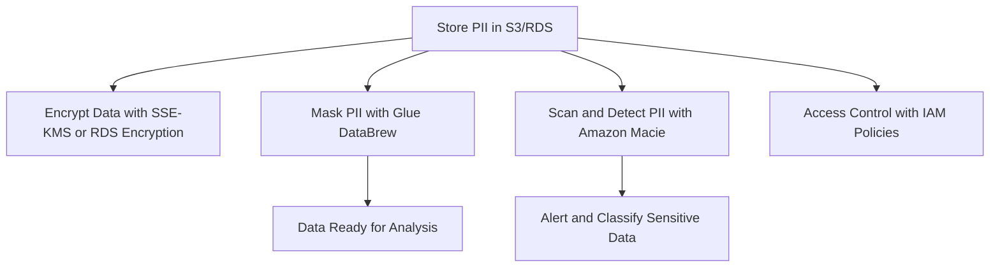
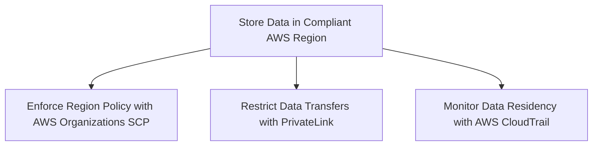
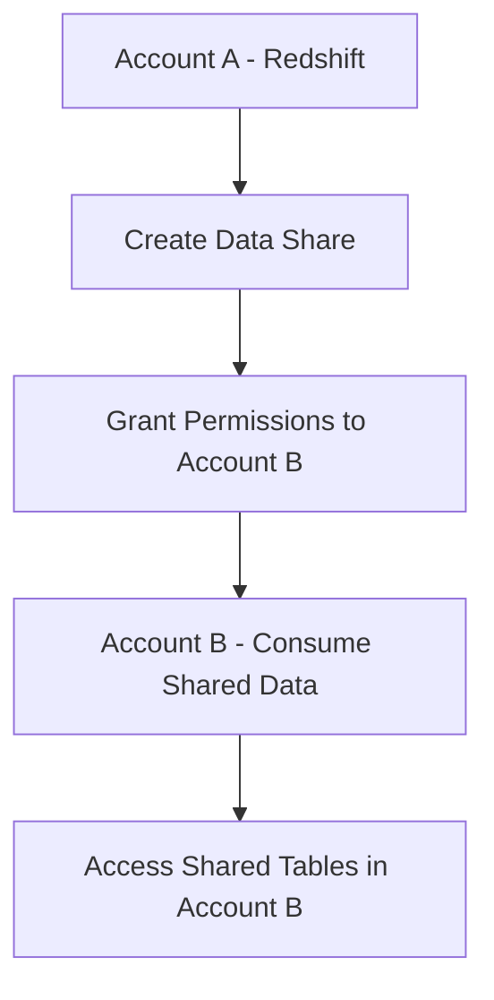
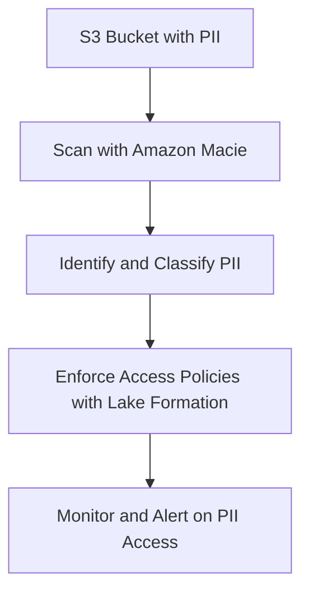
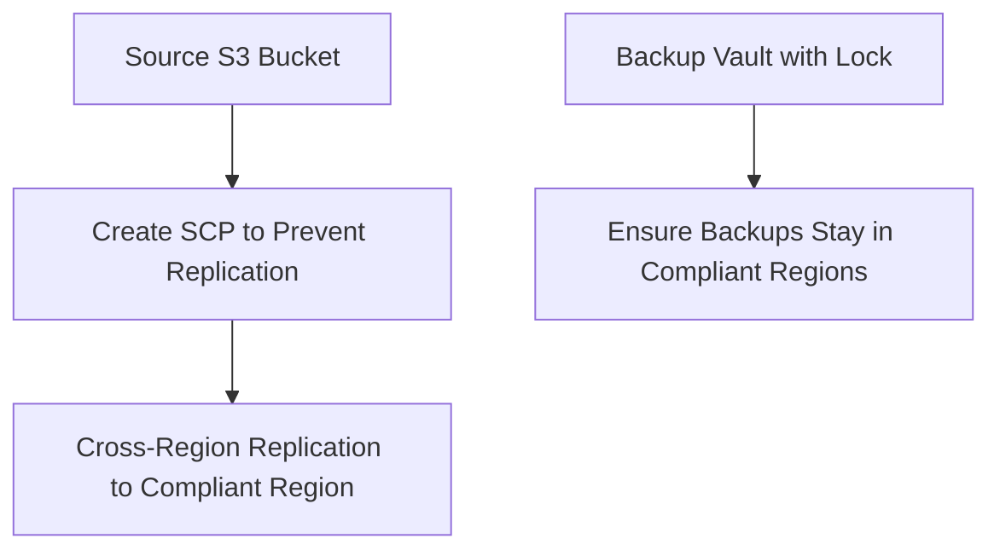
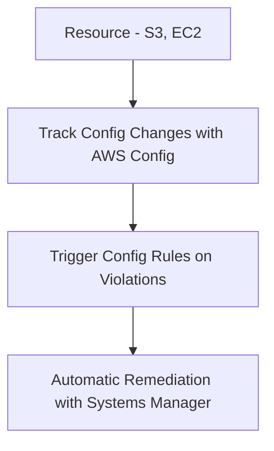

# 4.5: Understand data privacy and governance

## Knowledge of:

- How to protect personally identifiable information (PII)
- Data sovereignty

---

### **1. How to Protect Personally Identifiable Information (PII)**

### **Primary Functions:**

Protecting personally identifiable information (PII) is a critical component of data security, especially for organizations handling sensitive customer data. AWS offers several services and features to help safeguard PII:

- **Encryption**:
    - **At Rest**: AWS provides options to encrypt PII using **AWS Key Management Service (KMS)**, **S3 Server-Side Encryption (SSE)**, and **Amazon RDS encryption**.
    - **In Transit**: Use **TLS/SSL** to encrypt data as it moves between AWS services or to external endpoints.
- **Data Masking/Anonymization**:
    - **AWS Glue DataBrew**: Provides tools to mask or anonymize sensitive data fields in datasets.
    - **Amazon Macie**: A data security service that uses machine learning to automatically detect and protect sensitive PII in S3.
- **Access Control**:
    - **IAM Policies**: Control who can access PII using AWS Identity and Access Management (IAM) policies to enforce least privilege principles.
    - **Resource Policies**: Apply policies to specific AWS resources (e.g., S3 buckets) to limit access to PII.

### **Patterns (When to Use):**

- Use **encryption at rest** and **in transit** to protect PII in data stores like S3, DynamoDB, or RDS, ensuring compliance with data protection regulations like **GDPR** and **HIPAA**.
    - Example: Encrypt sensitive customer information stored in S3 using **SSE-KMS** and enforce TLS/SSL for all connections to the bucket.
- Use **Amazon Macie** to scan large amounts of S3 data for PII automatically, such as email addresses, phone numbers, or credit card numbers.
    - Example: Automatically classify and secure sensitive data stored in S3 using Macie’s real-time monitoring and alerts.
- Use **IAM Policies** to enforce the principle of least privilege by limiting which users or services have access to sensitive PII data.
    - Example: Create a policy that allows only authorized personnel to access a specific DynamoDB table that contains customer information.

### **Antipatterns (When Not to Use):**

- Avoid storing PII in AWS services without enabling encryption. Unencrypted PII data is vulnerable to breaches and may violate compliance regulations.
- Avoid using shared credentials or **overly broad IAM policies** (e.g., `AdministratorAccess`) to access resources containing PII, as this exposes sensitive data to unnecessary risk.

### **Benefits of Managed vs. Serverless Services:**

- **Managed Services (RDS, S3 Encryption)**:
    - **Scalability**: Managed encryption services like **RDS encryption** and **S3 server-side encryption** automatically handle key management and scaling.
    - **Cost**: Managed services come with costs for data encryption and key management but simplify operations and provide strong security guarantees.
- **Serverless (Lambda, Macie)**:
    - **Flexibility**: Serverless services like **Lambda** combined with Macie can automate the detection and protection of PII without manual intervention.
    - **Cost**: Pay-as-you-go pricing makes serverless options cost-effective for dynamic workloads but may result in higher costs if used with large datasets that require frequent scans.

### **Mermaid Diagram: Protecting PII in AWS**



### **AWS Documentation Links:**

- [AWS KMS for Encryption](https://docs.aws.amazon.com/kms/latest/developerguide/overview.html)
- [Amazon Macie Documentation](https://docs.aws.amazon.com/macie/latest/userguide/what-is-macie.html)
- [IAM Policies and PII Protection](https://docs.aws.amazon.com/IAM/latest/UserGuide/access_policies.html)

---

### **2. Data Sovereignty**

### **Primary Functions:**

**Data sovereignty** refers to the legal requirement that data must remain within the geographical boundaries of a particular country or region due to local regulations. AWS offers features to ensure that your data complies with these regulations by allowing you to specify and control where your data is stored and processed:

- **Data Residency**:
    - **AWS Regions**: AWS provides a global infrastructure with multiple regions to ensure that your data remains in specific geographic locations.
    - **S3 Data Residency**: S3 allows you to specify the region where your data is stored, ensuring compliance with data residency regulations.
- **Compliance**:
    - **AWS Organizations and SCPs (Service Control Policies)**: Use SCPs to enforce restrictions on which AWS regions data and resources can be used, ensuring that data is only stored or processed in compliant regions.
    - **Data Transfer and Compliance**: AWS offers services like **VPC Endpoints** and **AWS PrivateLink** to restrict data from traversing the public internet, keeping it within controlled AWS environments.

### **Patterns (When to Use):**

- Use **AWS Regions** to store data in the appropriate geographic region to comply with local laws governing data residency, such as the **European Union's GDPR** or **Australia’s Privacy Act**.
    - Example: Store and process data for European customers only within the **EU Central (Frankfurt)** region to comply with GDPR data residency requirements.
- Use **VPC Endpoints** or **PrivateLink** to ensure that data transferred between AWS services within a region stays within the AWS network and doesn’t traverse the public internet.
    - Example: Use **PrivateLink** to securely transfer PII data from an application running on EC2 to S3 without exposing the data to the public internet.
- Use **Service Control Policies (SCPs)** in **AWS Organizations** to enforce policies that restrict the usage of AWS services or regions that do not comply with specific data sovereignty rules.
    - Example: Create an SCP that denies the creation of resources in any region outside the US to comply with US data sovereignty laws.

### **Antipatterns (When Not to Use):**

- Avoid storing data in regions outside the required geographical location if data sovereignty laws dictate specific residency requirements. This could result in legal penalties and data privacy violations.
- Avoid using public endpoints for data transfers that contain sensitive information if compliance requires private and secure data transmission.

### **Benefits of Managed vs. Serverless Services:**

- **Managed Services (S3, RDS)**:
    - **Data Residency**: Managed services like **S3** and **RDS** allow you to specify data residency while automatically handling the operational overhead of scaling and security.
    - **Cost**: While managed services may incur higher storage and transfer costs for regional compliance, they provide built-in features to ensure data residency.
- **Serverless (Lambda, VPC Endpoints)**:
    - **Flexibility**: Serverless architectures with **Lambda** and **PrivateLink** ensure that data residency and sovereignty rules are followed dynamically, with minimal operational management.
    - **Cost**: Serverless services can offer cost savings by optimizing resources and reducing the need for dedicated infrastructure, but region-specific costs may still apply.

### **Mermaid Diagram: Ensuring Data Sovereignty in AWS**



### **AWS Documentation Links:**

- [AWS Data Residency](https://aws.amazon.com/compliance/data-residency/)
- [VPC Endpoints and PrivateLink](https://docs.aws.amazon.com/vpc/latest/privatelink/concepts.html)
- [AWS Organizations SCPs](https://docs.aws.amazon.com/organizations/latest/userguide/orgs_manage_policies_scp.html)

---

## Skills in:

- Granting permissions for data sharing (for example, data sharing for Amazon Redshift)
- Implementing PII identification (for example, Macie with Lake Formation)
- Implementing data privacy strategies to prevent backups or replications of data to disallowed AWS Regions
- Managing configuration changes that have occurred in an account (for example, AWS Config)

---

### **1. Granting Permissions for Data Sharing (Amazon Redshift)**

### **Detailed Steps/Exercises:**

### **Exercise 1: Granting Permissions for Redshift Data Sharing**

1. **Create a Redshift Cluster**:
    - In the **AWS Console**, create two **Amazon Redshift** clusters, one in **Account A** and another in **Account B**.
    - In **Account A**, create a cluster with a shared schema.
2. **Create a Database and Schema in Account A**:
    - Connect to the **Redshift** cluster in **Account A** using a SQL client or the **Redshift Query Editor**.
    - Create a database and a schema:
    
    ```sql
    CREATE DATABASE shared_db;
    CREATE SCHEMA shared_schema;
    
    ```
    
3. **Grant Permissions for Data Sharing**:
    - In **Account A**, allow **Account B** to access the shared database using the following SQL:
    
    ```sql
    GRANT USAGE ON SCHEMA shared_schema TO account_b;
    GRANT SELECT ON ALL TABLES IN SCHEMA shared_schema TO account_b;
    
    ```
    
4. **Create a Data Share in Account A**:
    - In **Account A**, create a data share:
    
    ```sql
    CREATE DATASHARE shared_data_share;
    ALTER DATASHARE shared_data_share ADD SCHEMA shared_schema;
    
    ```
    
5. **Associate the Data Share with Account B**:
    - Allow **Account B** to access the shared data by associating the data share:
    
    ```sql
    ALTER DATASHARE shared_data_share SET ACCOUNT account_b;
    
    ```
    
6. **Consume the Data Share in Account B**:
    - In **Account B**, consume the data share using the following SQL command:
    
    ```sql
    CREATE DATABASE shared_db_from_account_a FROM DATASHARE shared_data_share OF account_a;
    
    ```
    
7. **Query the Shared Data in Account B**:
    - Access and query the shared data in **Account B**:
    
    ```sql
    SELECT * FROM shared_db_from_account_a.shared_schema.table_name;
    
    ```
    

### **Mermaid Diagram: Redshift Data Sharing Workflow**



### **AWS Documentation Links:**

- [Amazon Redshift Data Sharing](https://docs.aws.amazon.com/redshift/latest/dg/datashare-overview.html)

### **Use Case Scenarios:**

- **Cross-account Data Sharing**: This is useful for sharing data across different departments or accounts, for example, between data engineering and data science teams, while maintaining strict access controls.

### **Common Pitfalls or Challenges:**

- **Challenge**: Misconfigured permissions may prevent the consuming account from accessing the shared data.
    - **Solution**: Ensure that proper grants (e.g., `USAGE`, `SELECT`) are given at the schema and table levels.

---

### **2. Implementing PII Identification (Amazon Macie with Lake Formation)**

### **Detailed Steps/Exercises:**

### **Exercise 2: Identifying PII Using Macie and Lake Formation**

1. **Set Up Macie**:
    - In the **AWS Console**, navigate to **Amazon Macie** and enable Macie for your account.
    - Configure **Macie** to scan specific **S3 buckets** that may contain sensitive data, such as customer PII.
2. **Configure Lake Formation**:
    - Enable **AWS Lake Formation** and register the **S3 bucket** that stores sensitive data as a data lake location.
    - Create a **Data Catalog** in **Lake Formation** for managing metadata and classification.
3. **Classify Sensitive Data**:
    - In **Macie**, create a **data discovery job** to scan the registered S3 bucket for sensitive information such as email addresses, credit card numbers, and names.
    - Run the Macie job and review the results to identify PII within the dataset.
4. **Restrict Access to PII Using Lake Formation**:
    - Create **Lake Formation policies** to restrict access to datasets containing PII:
    
    ```bash
    aws lakeformation grant-permissions \\
    --principal DataLakePrincipalIdentifier="arn:aws:iam::account-id:role/lake-formation-role" \\
    --permissions "SELECT" \\
    --resource 'Table={"DatabaseName":"my-database", "Name":"sensitive_table"}'
    
    ```
    
5. **Monitor Data Access**:
    - Use Macie to continuously monitor and alert on any potential violations or unauthorized access to PII data in the S3 bucket.

### **Mermaid Diagram: PII Identification with Macie and Lake Formation**



### **AWS Documentation Links:**

- [Amazon Macie](https://docs.aws.amazon.com/macie/latest/userguide/what-is-macie.html)
- [AWS Lake Formation](https://docs.aws.amazon.com/lake-formation/latest/dg/what-is-lake-formation.html)

### **Use Case Scenarios:**

- **Data Privacy**: Automating the identification of PII in large datasets, ensuring that sensitive information is properly protected, and enabling alerts when unauthorized access occurs.

### **Common Pitfalls or Challenges:**

- **Challenge**: High false positives or undetected PII during scans.
    - **Solution**: Fine-tune Macie’s classification rules and customize regular expressions for specific data patterns like internal IDs or custom PII types.

---

### **3. Implementing Data Privacy Strategies to Prevent Backups or Replications to Disallowed AWS Regions**

### **Detailed Steps/Exercises:**

### **Exercise 3: Preventing Data Replication to Disallowed Regions**

1. **Set Up Service Control Policies (SCPs)**:
    - In **AWS Organizations**, create a **Service Control Policy (SCP)** that restricts the creation of resources or the transfer of data to specific regions:
    
    ```json
    {
        "Version": "2012-10-17",
        "Statement": [
            {
                "Effect": "Deny",
                "Action": "s3:CreateBucket",
                "Resource": "*",
                "Condition": {
                    "StringNotEquals": {
                        "aws:RequestedRegion": [
                            "us-east-1",
                            "eu-west-1"
                        ]
                    }
                }
            }
        ]
    }
    
    ```
    
2. **Apply the SCP to Your Organizational Unit (OU)**:
    - Attach the SCP to the relevant **Organizational Unit (OU)** that contains accounts needing these restrictions.
3. **Configure S3 Cross-Region Replication with Allowed Regions Only**:
    - Set up **S3 Cross-Region Replication** but ensure that the destination bucket is in a compliant region, such as **us-east-1** or **eu-west-1**:
    
    ```json
    "Destination": {
        "Bucket": "arn:aws:s3:::destination-bucket",
        "StorageClass": "STANDARD",
        "Account": "123456789012"
    }
    
    ```
    
4. **Enforce Backup Policies with Backup Vault Lock**:
    - Use **AWS Backup** with **Vault Lock** to create immutable backup policies that prevent backups from being moved to disallowed regions.
    - Create a backup plan that specifies the vault region:
    
    ```json
    {
        "BackupVaultName": "my-backup-vault",
        "BackupVaultRegion": "us-east-1"
    }
    
    ```
    

### **Mermaid Diagram: Preventing Data Replication to Disallowed Regions**



### **AWS Documentation Links:**

- [Service Control Policies](https://docs.aws.amazon.com/organizations/latest/userguide/orgs_manage_policies_scp.html)
- [AWS S3 Cross-Region Replication](https://docs.aws.amazon.com/AmazonS3/latest/dev/crr.html)

### **Use Case Scenarios:**

- **Data Sovereignty Compliance**: Ensuring that backups and replicated data adhere to regulatory requirements by preventing data from being stored or replicated in disallowed regions.

### **Common Pitfalls or Challenges:**

- **Challenge**: Accidental misconfiguration of replication rules leading to non-compliance.
    - **Solution**: Regularly audit and review SCPs and backup policies to ensure compliance with data residency regulations.

---

### **4. Managing Configuration Changes that Occur in an Account (AWS Config)**

### **Detailed Steps/Exercises:**

### *Exercise 4

: Using AWS Config to Track Configuration Changes**

1. **Enable AWS Config**:
    - In the **AWS Management Console**, navigate to **AWS Config** and enable it for your account.
    - Specify the resources you want to track, such as S3 buckets, EC2 instances, and IAM roles.
2. **Create Config Rules**:
    - Create a Config rule to track changes to an S3 bucket’s public access settings:
    
    ```json
    {
        "ConfigRuleName": "s3-bucket-public-read-prohibited",
        "Scope": {
            "ComplianceResourceTypes": [
                "AWS::S3::Bucket"
            ]
        },
        "Source": {
            "Owner": "AWS",
            "SourceIdentifier": "S3_BUCKET_PUBLIC_READ_PROHIBITED"
        }
    }
    
    ```
    
3. **Monitor Configuration Changes**:
    - AWS Config will automatically detect and report any changes to your resources, such as modifications to the S3 bucket access policies or security groups.
4. **Set Up Automatic Remediation**:
    - Configure **AWS Systems Manager Automation** to automatically remediate non-compliant configurations, such as reverting an S3 bucket from public to private:
    
    ```json
    {
        "Name": "AWS-DisablePublicAccessForS3Bucket",
        "Parameters": {
            "BucketName": {
                "Type": "String",
                "Description": "Name of the S3 bucket to revert."
            }
        }
    }
    
    ```
    
5. **Review Configuration History**:
    - View the configuration history and compliance reports in the **AWS Config Console** to ensure that all resources comply with the rules you’ve defined.

### **Mermaid Diagram: Tracking Configuration Changes with AWS Config**



### **AWS Documentation Links:**

- [AWS Config](https://docs.aws.amazon.com/config/latest/developerguide/WhatIsConfig.html)
- [Config Rules](https://docs.aws.amazon.com/config/latest/developerguide/evaluate-config-rules.html)

### **Use Case Scenarios:**

- **Security Audits**: AWS Config is ideal for maintaining a history of configuration changes and ensuring compliance with security policies, such as preventing public access to S3 buckets.

### **Common Pitfalls or Challenges:**

- **Challenge**: Managing false positives in compliance checks.
    - **Solution**: Fine-tune Config rules to avoid overly broad compliance checks and focus on critical configuration changes.

---

### **Conclusion**

This section provides detailed steps and hands-on exercises for key skills required for the AWS Certified Data Engineer - Associate exam, including **granting permissions for data sharing**, **identifying PII with Macie**, **preventing data replication to disallowed regions**, and **tracking configuration changes using AWS Config**. By following the exercises and utilizing AWS services, you can implement secure and compliant data management practices in real-world AWS environments.