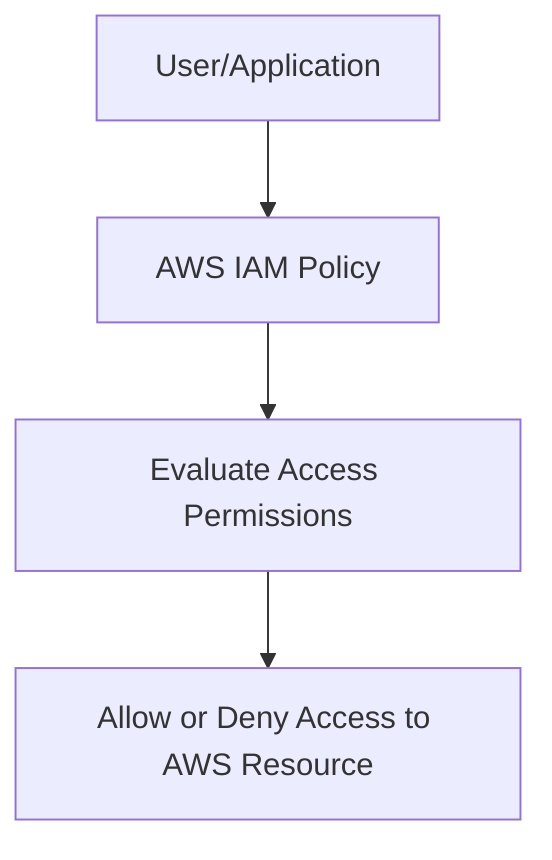
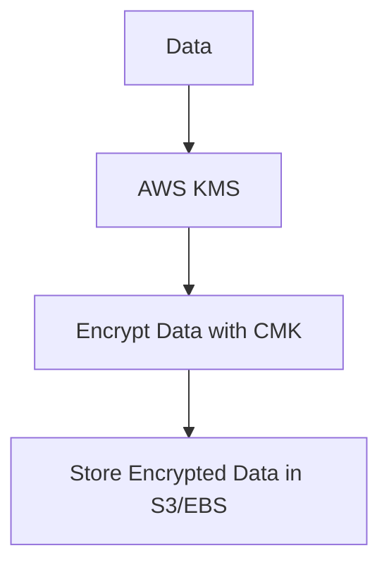
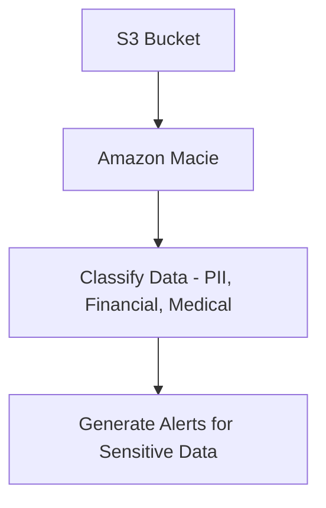
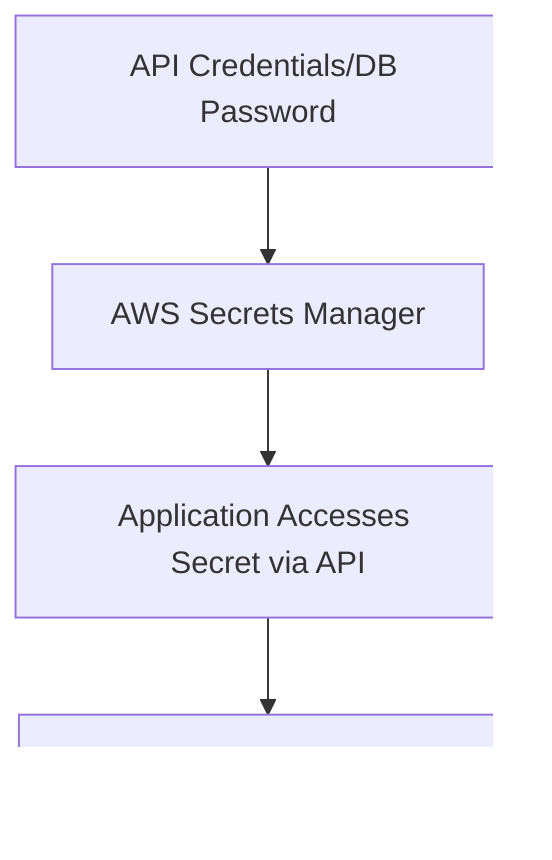
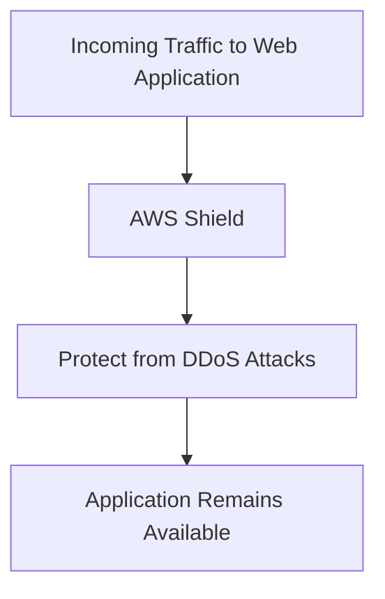
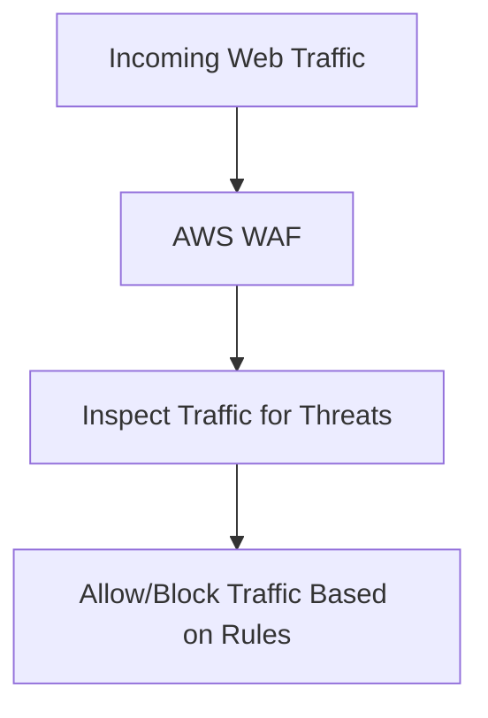

# Security, Identity, and Compliance

### **1. AWS Identity and Access Management (IAM)**

### **Primary Functions:**

- **AWS Identity and Access Management (IAM)** allows you to control **access to AWS services and resources** securely. It enables you to create and manage **IAM users**, **groups**, and **roles**, and define policies to grant or deny access to AWS services.
- IAM helps implement **least privilege access** by defining fine-grained permissions.

### **When to Use:**

- Use IAM to create **policies** that allow users, applications, or AWS services to access AWS resources securely.
- Ideal for controlling **who** can access resources, **what actions** they can perform, and **under what conditions** they can access AWS services.

### **Antipatterns:**

- Avoid using overly permissive policies like **`:*`**, which grants full access to all resources and actions. Always follow the **least privilege principle**.
- Avoid using **root user credentials** for day-to-day tasks. Instead, use IAM users or roles with appropriate permissions.

### **Mermaid Diagram: IAM Permissions Flow**

### **AWS Documentation Link:**

- [AWS Identity and Access Management (IAM)](https://docs.aws.amazon.com/IAM/latest/UserGuide/introduction.html)

---

### **2. AWS Key Management Service (AWS KMS)**

### **Primary Functions:**

- **AWS Key Management Service (KMS)** is a managed service that enables you to create, control, and manage **encryption keys** to secure your data. It integrates with other AWS services like **S3**, **EBS**, and **RDS** for data encryption.
- KMS supports **customer-managed keys (CMKs)** and **AWS-managed keys** for encrypting and decrypting data.

### **When to Use:**

- Use AWS KMS to **encrypt data** stored in AWS services, such as **S3 buckets**, **EBS volumes**, or **database snapshots**. It's ideal for ensuring **data confidentiality** and meeting compliance requirements for **encryption**.
- Use for managing keys across **multi-account environments** or when you need **auditable key usage** for compliance.

### **Antipatterns:**

- Avoid using KMS for **short-lived secrets** like API keys or passwords—use **AWS Secrets Manager** for that use case.
- Avoid using KMS without **rotating encryption keys** if your compliance requires regular key rotations.

### **Mermaid Diagram: AWS KMS Workflow**

### **AWS Documentation Link:**

- [AWS Key Management Service (KMS)](https://docs.aws.amazon.com/kms/latest/developerguide/overview.html)

---

### **3. Amazon Macie**

### **Primary Functions:**

- **Amazon Macie** is a fully managed data security and privacy service that uses **machine learning** to discover, classify, and protect **sensitive data** in **S3 buckets**. It helps identify personally identifiable information (PII) and other sensitive data types.
- Macie provides continuous **monitoring** and **alerting** for **data privacy risks** and **security vulnerabilities**.

### **When to Use:**

- Use Amazon Macie to monitor **S3 buckets** for **sensitive data**, such as **PII**, **financial data**, or **medical records**, and ensure compliance with regulations like **GDPR** or **HIPAA**.
- Ideal for companies with strict data **compliance and privacy requirements**.

### **Antipatterns:**

- Avoid using Macie for **non-S3 data stores**. It is focused on **S3 bucket** monitoring and classification.
- Avoid using Macie for **real-time threat detection**. Use **Amazon GuardDuty** or **AWS WAF** for real-time security threat detection.

### **Mermaid Diagram: Amazon Macie Workflow**

### **AWS Documentation Link:**

- [Amazon Macie](https://docs.aws.amazon.com/macie/latest/userguide/what-is-macie.html)

---

### **4. AWS Secrets Manager**

### **Primary Functions:**

- **AWS Secrets Manager** helps securely **store, manage, and retrieve secrets** such as **API keys**, **database credentials**, and **OAuth tokens**. It allows you to **rotate** secrets automatically and securely share them across AWS services.
- Secrets Manager integrates with AWS services like **Lambda**, **RDS**, and **DynamoDB** to securely retrieve secrets during execution.

### **When to Use:**

- Use AWS Secrets Manager to **manage sensitive credentials** like **database passwords** or **API tokens** and **automate secret rotation** for improved security.
- Ideal for applications requiring **secure access to sensitive data** without hard-coding secrets into the codebase.

### **Antipatterns:**

- Avoid using Secrets Manager for **encryption key management**. Use **AWS KMS** for encryption keys.
- Avoid storing **short-lived tokens** like session tokens in Secrets Manager. For short-lived credentials, use **IAM roles** or **AWS STS**.

### **Mermaid Diagram: AWS Secrets Manager Workflow**

### **AWS Documentation Link:**

- [AWS Secrets Manager](https://docs.aws.amazon.com/secretsmanager/latest/userguide/intro.html)

---

### **5. AWS Shield**

### **Primary Functions:**

- **AWS Shield** provides **DDoS protection** for applications running on AWS. It comes in two tiers: **AWS Shield Standard** (automatic DDoS protection included for all AWS customers) and **AWS Shield Advanced** (for more advanced and sophisticated attacks).
- Shield protects against **volumetric attacks**, **state-exhaustion attacks**, and **application-layer DDoS attacks**.

### **When to Use:**

- Use AWS Shield to protect **web applications** (hosted on **CloudFront**, **Elastic Load Balancing**, or **Route 53**) from **DDoS attacks**. AWS Shield Advanced offers **24/7 access to the DDoS response team** and more granular controls for mitigating large-scale attacks.

### **Antipatterns:**

- Avoid relying solely on **AWS Shield Standard** for **high-value or critical web applications**; consider upgrading to **AWS Shield Advanced** for enhanced protection and response capabilities.

### **Mermaid Diagram: AWS Shield Protection Flow**

### **AWS Documentation Link:**

- [AWS Shield](https://docs.aws.amazon.com/waf/latest/developerguide/ddos-aws-shield.html)

---

### **6. AWS WAF (Web Application Firewall)**

### **Primary Functions:**

- **AWS WAF** is a web application firewall that helps protect your web applications from **common exploits**, including **SQL injection**, **cross-site scripting (XSS)**, and other attacks by filtering and monitoring HTTP/HTTPS requests.
- WAF allows you to create custom **rules** that define how to filter incoming traffic and can be deployed on **CloudFront**, **Application Load Balancer (ALB)**, **API Gateway**, and **App Runner**.

### **When to Use:**

- Use AWS WAF to protect web applications against **common web exploits** and control **traffic filtering** based on user-defined rules. It is ideal for **API security**, **web security**, and **compliance** with security best practices.

### **Antipatterns:**

- Avoid using AWS WAF for **DDoS protection**—use **AWS Shield** for DDoS mitigation. WAF is best suited for **application-layer** security.
- Avoid using overly **broad WAF rules** that may block legitimate traffic. Carefully craft rules to balance security and availability.

### **Mermaid Diagram: AWS WAF Workflow**

### **AWS Documentation Link:**

- [AWS WAF](https://docs.aws.amazon.com/waf/latest/developerguide/waf-chapter.html)

---