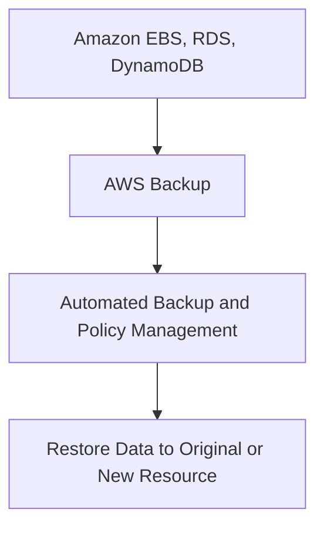
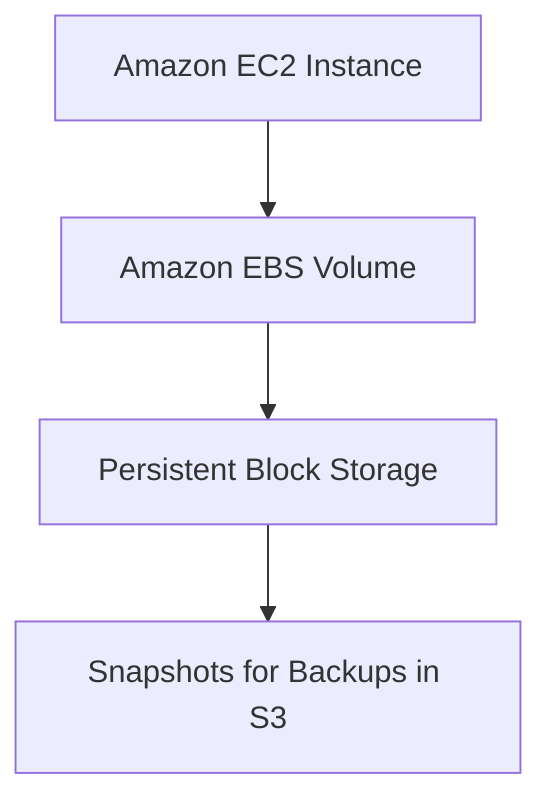
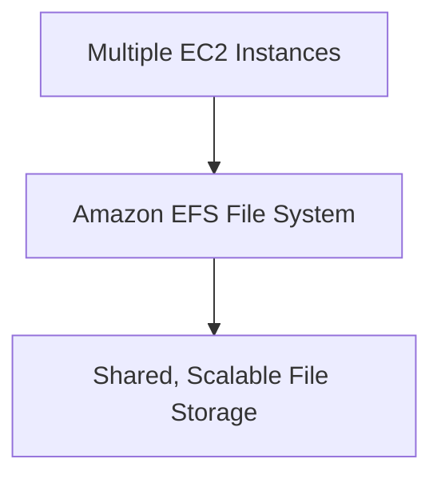
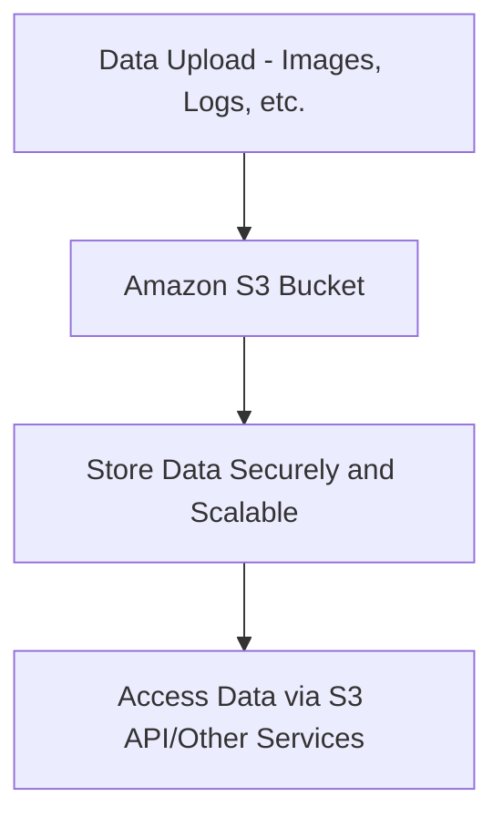
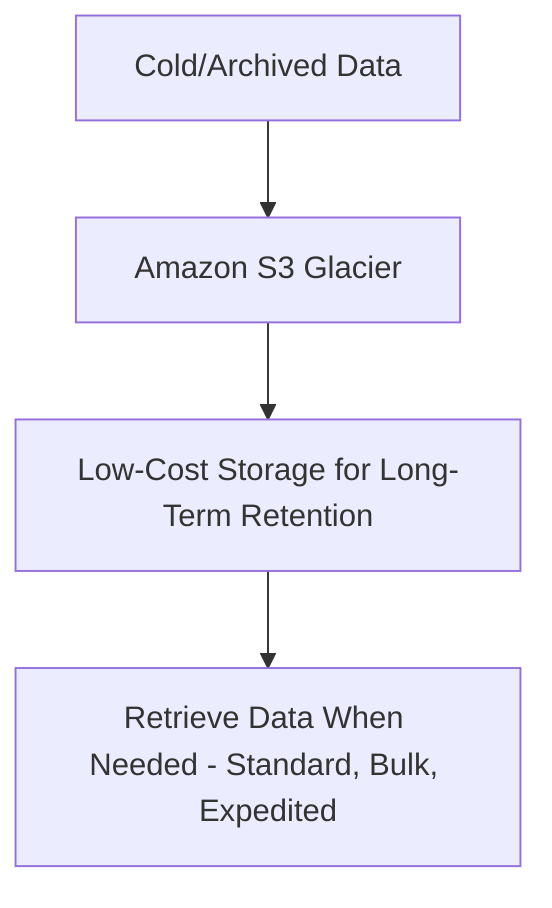

# Storage

### **1. AWS Backup**

### **Primary Functions:**

- **AWS Backup** is a fully managed service that automates the **backup and restoration** of AWS resources across multiple services. It allows you to **centralize and automate backup tasks**, ensuring **compliance** and **data recovery**.
- AWS Backup supports various AWS services like **EBS**, **RDS**, **DynamoDB**, **EFS**, and **S3**. It provides a consistent, policy-based way to manage backups across the cloud.

### **When to Use:**

- Use AWS Backup to **automate backups** for critical resources (e.g., **EC2 volumes**, **RDS databases**, **DynamoDB tables**) and ensure you can **restore** data quickly in case of failure.
- Ideal for meeting **compliance** and **regulatory requirements** for **data retention**, such as GDPR or HIPAA.

### **Antipatterns:**

- Avoid using AWS Backup for **ad-hoc data backups** that require custom or complex manual configurations. AWS Backup is designed for policy-based, automated backups.
- Avoid using AWS Backup for **cross-region replication** of backups. Use **services that support cross-region functionality** for that purpose.

### **Mermaid Diagram: AWS Backup Workflow**

### **AWS Documentation Link:**

- [AWS Backup](https://docs.aws.amazon.com/backup/latest/devguide/whatisbackup.html)

---

### **2. Amazon Elastic Block Store (Amazon EBS)**

### **Primary Functions:**

- **Amazon Elastic Block Store (EBS)** provides persistent **block storage** for use with Amazon **EC2 instances**. EBS volumes are highly available and can be attached to **EC2 instances** as durable storage.
- EBS supports **snapshot capabilities** for creating backups and offers different volume types optimized for **performance** (e.g., SSDs) or **cost-efficiency** (e.g., HDDs).

### **When to Use:**

- Use Amazon EBS when you need **block storage** for running databases (e.g., **RDS**, **NoSQL**), file systems, or **transaction-heavy workloads** that require low-latency, high-performance storage.
- Ideal for applications requiring **persistent data** that must survive instance termination or reboots.

### **Antipatterns:**

- Avoid using EBS for **object storage** or when applications require **distributed file systems**. Use **Amazon S3** or **Amazon EFS** for such use cases.
- Avoid using EBS for **long-term storage of infrequently accessed data**. For cold storage, use **Amazon S3 Glacier**.

### **Mermaid Diagram: Amazon EBS Workflow**

### **AWS Documentation Link:**

- [Amazon EBS](https://docs.aws.amazon.com/AWSEC2/latest/UserGuide/AmazonEBS.html)

---

### **3. Amazon Elastic File System (Amazon EFS)**

### **Primary Functions:**

- **Amazon Elastic File System (EFS)** is a fully managed, scalable **file storage service** designed for use with **EC2 instances** and **AWS Lambda**. EFS provides **NFS**based storage that can be accessed from multiple instances simultaneously.
- EFS automatically grows and shrinks as you add and remove files, making it suitable for **dynamic storage needs**.

### **When to Use:**

- Use Amazon EFS for **file-based workloads** that require **shared access** across multiple EC2 instances or containers (e.g., **web applications**, **content management systems**).
- Ideal for **distributed environments** requiring **high availability** and **shared file access**, such as **big data analytics**, **media processing**, or **DevOps environments**.

### **Antipatterns:**

- Avoid using EFS for **block storage** use cases like databases. Use **Amazon EBS** for transactional workloads that require low-latency, block-level access.
- Avoid using EFS for storing **cold data** or long-term archives. Use **S3** or **S3 Glacier** for these cases.

### **Mermaid Diagram: Amazon EFS Workflow**

### **AWS Documentation Link:**

- [Amazon EFS](https://docs.aws.amazon.com/efs/latest/ug/whatisefs.html)

---

### **4. Amazon S3 (Simple Storage Service)**

### **Primary Functions:**

- **Amazon S3** is an object storage service that provides **scalable** and **secure** data storage for any amount of data. It is ideal for storing **unstructured data** like **media files**, **backup data**, and **logs**.
- S3 supports multiple storage classes, including **S3 Standard**, **S3 Intelligent-Tiering**, and **S3 Glacier** for managing data lifecycle based on access frequency.

### **When to Use:**

- Use Amazon S3 for **storing static content** (e.g., media files, backups), **big data analytics**, or **hosting websites**. It's ideal for **data lakes** where data needs to be stored and analyzed at scale.
- S3 integrates with services like **Amazon Athena**, **Redshift Spectrum**, and **Glue** for **analytics and query** capabilities.

### **Antipatterns:**

- Avoid using S3 for **block storage** needs or **transaction-heavy workloads** like databases. Use **Amazon EBS** or **Amazon RDS** for databases.
- Avoid using S3 for **high-performance computing applications** that require low-latency access. Consider **EBS** or **EFS** for low-latency requirements.

### **Mermaid Diagram: Amazon S3 Workflow**

### **AWS Documentation Link:**

- [Amazon S3](https://docs.aws.amazon.com/s3/index.html)

---

### **5. Amazon S3 Glacier**

### **Primary Functions:**

- **Amazon S3 Glacier** is a secure, durable, and extremely low-cost **cloud storage** service designed for **data archiving** and **long-term backups**. It is ideal for infrequently accessed data and offers different retrieval options, including **Standard**, **Bulk**, and **Expedited** retrieval.
- S3 Glacier provides a **cost-effective solution** for storing **cold data** that doesn't need to be accessed regularly but must be retained for compliance or business purposes.

### **When to Use:**

- Use Amazon S3 Glacier for **long-term data retention** and **archival** of compliance-sensitive data (e.g., **financial records**, **medical records**, **legal documents**).
- Ideal for scenarios where **cost-efficiency** is a priority, and **access to data** can be deferred (minutes to hours).

### **Antipatterns:**

- Avoid using S3 Glacier for **frequently accessed data** or applications that need real-time access. Use **S3 Standard** or **Intelligent-Tiering** for frequently accessed data.
- Avoid using S3 Glacier for **transactional data** or **live databases**. Use **Amazon RDS** or **DynamoDB** for active database needs.

### **Mermaid Diagram: Amazon S3 Glacier Workflow**

### **AWS Documentation Link:**

- [Amazon S3 Glacier](https://docs.aws.amazon.com/amazonglacier/latest/dev/introduction.html)

---