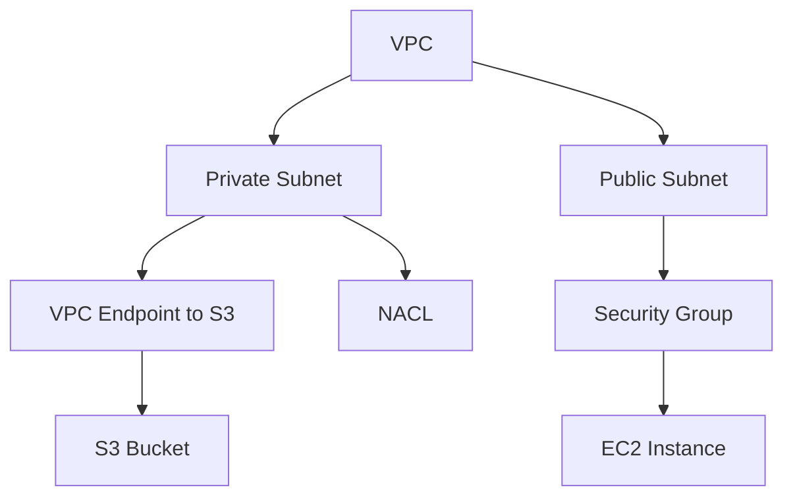
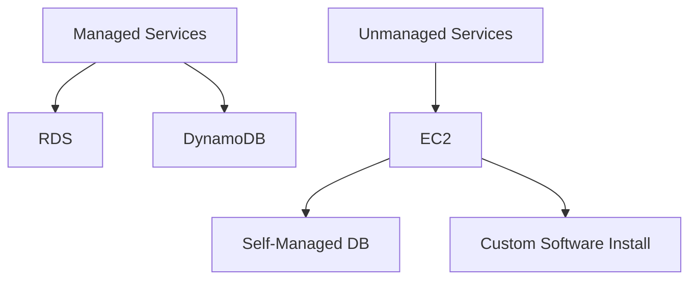
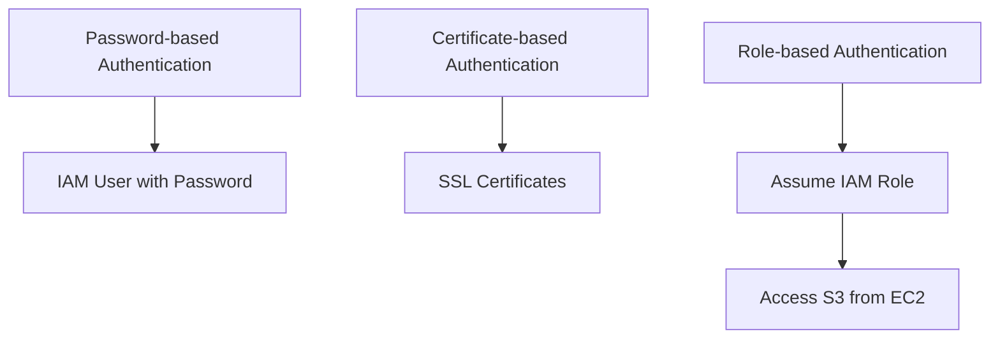
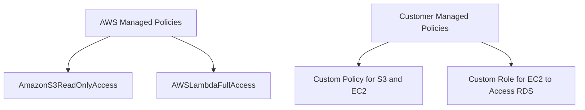
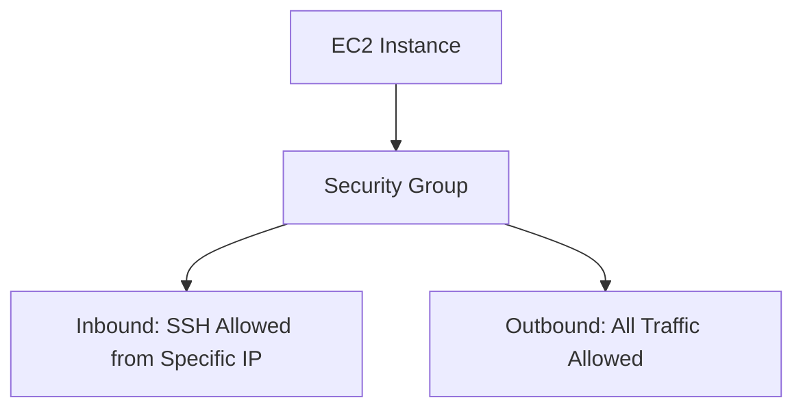
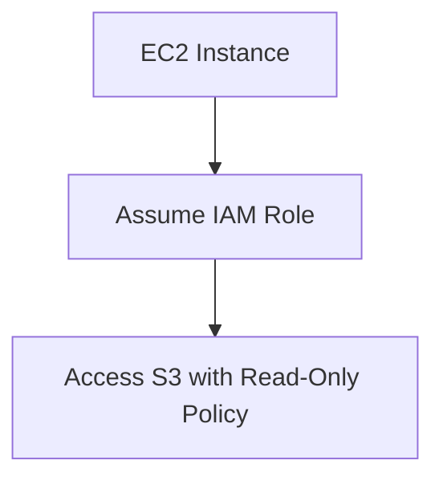
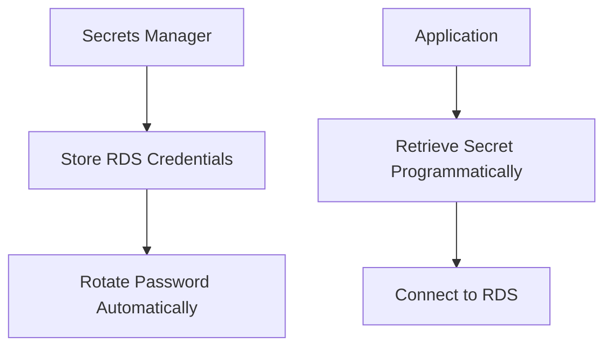
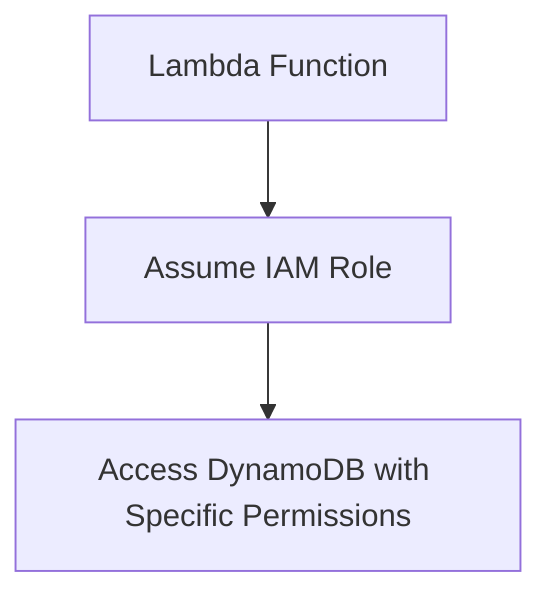
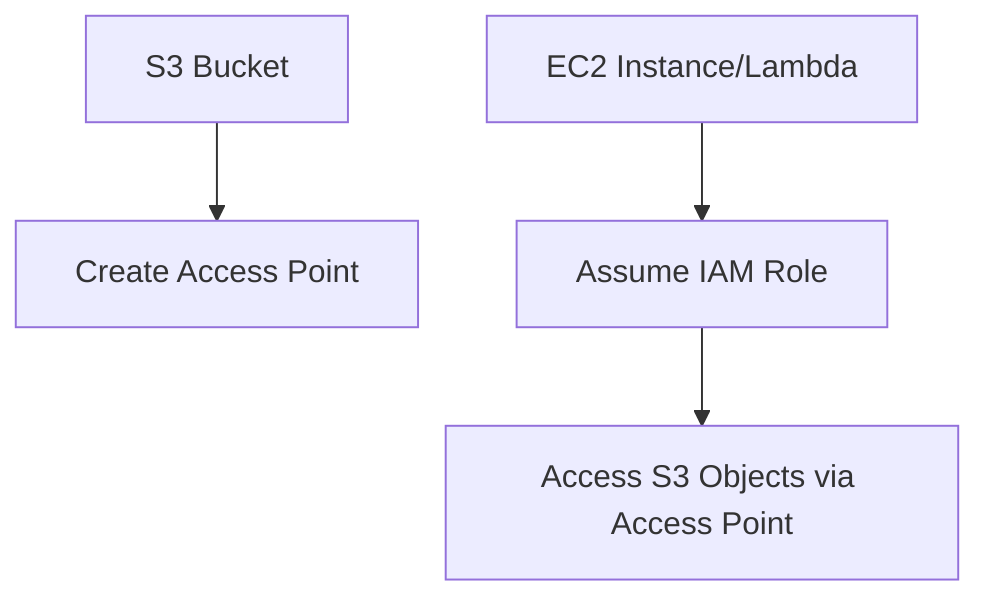

# 4.1: Apply authentication mechanisms

## Knowledge of:

- VPC security networking concepts
- Differences between managed services and unmanaged services
- Authentication methods (password-based, certificate-based, and role-based)
- Differences between AWS managed policies and customer managed policies

---

### **1. VPC Security Networking Concepts**

### **Primary Functions:**

A **Virtual Private Cloud (VPC)** in AWS is a virtual network in which you can launch AWS services. It provides control over networking components such as **subnets**, **route tables**, **internet gateways**, and **network access control lists (ACLs)**. Core VPC security features include:

- **Security Groups**: Virtual firewalls for controlling inbound and outbound traffic to instances.
- **Network Access Control Lists (NACLs)**: Stateless firewalls controlling traffic at the subnet level.
- **VPC Peering**: Connects multiple VPCs for internal communication.
- **VPC Endpoints**: Securely connect VPCs to AWS services without using the internet.

### **Patterns (When to Use):**

- Use **Security Groups** to manage instance-level access. Security groups are stateful, meaning they automatically allow responses to allowed inbound traffic.
    - Example: Use a security group to allow SSH access (port 22) to an **EC2** instance only from specific IP ranges.
- Use **NACLs** to enforce network-wide traffic filtering, especially when dealing with specific subnets across multiple applications.
    - Example: Use NACLs to restrict access to certain subnets, such as blocking all inbound traffic except for HTTPS (port 443).
- Use **VPC Endpoints** to connect to AWS services (like **S3**, **DynamoDB**) from within a VPC without routing traffic over the public internet, improving security.

### **Antipatterns (When Not to Use):**

- Avoid using **NACLs** as the primary security mechanism when security groups are more appropriate for instance-level control. NACLs are stateless, so both inbound and outbound rules need to be defined separately.
- Avoid using public IP addresses for resources that do not require public access. Use **private subnets** and **VPC Endpoints** to reduce exposure.

### **Benefits of Managed vs. Serverless Services:**

- **Managed (VPC)**:
    - **Control**: Managed VPC services provide full control over your networking, allowing customization of security settings at both the instance and subnet level.
    - **Cost**: VPC is a managed service, but there are costs for resources like NAT gateways and data transfer.
- **Serverless (AWS VPC Endpoints)**:
    - **Simplicity**: Using VPC endpoints is a serverless option to securely connect to AWS services like **S3** without managing the infrastructure.
    - **Cost**: VPC endpoints have usage-based costs but eliminate the need for complex internet gateways or NAT instances.

### **Mermaid Diagram: VPC Security Networking Overview**



### **AWS Documentation Links:**

- [Amazon VPC Documentation](https://docs.aws.amazon.com/vpc/index.html)
- [VPC Security Best Practices](https://docs.aws.amazon.com/vpc/latest/userguide/security-best-practices.html)

---

### **2. Differences Between Managed Services and Unmanaged Services**

### **Primary Functions:**

AWS offers both **managed** and **unmanaged** services. Managed services handle the operational aspects like scaling, patching, and backups, while unmanaged services require the user to manage these components manually.

- **Managed Services**: AWS takes care of infrastructure management tasks like patching, scaling, and monitoring.
    - Example: **Amazon RDS**, **DynamoDB**, and **Amazon EMR** are managed services.
- **Unmanaged Services**: Users are responsible for managing the infrastructure, including OS updates, scaling, and backups.
    - Example: **EC2** is an unmanaged service where users manage the OS, software, and configurations.

### **Patterns (When to Use):**

- Use **managed services** like **Amazon RDS** for databases when you need automatic backups, patching, and scaling without dealing with low-level maintenance.
    - Example: Use RDS for relational databases to avoid manual maintenance tasks like configuring replication and backups.
- Use **unmanaged services** like **EC2** when you need complete control over the environment, including choosing your operating system, installing specific software, and fine-tuning configurations.

### **Antipatterns (When Not to Use):**

- Avoid using **unmanaged services** (e.g., EC2 for databases) when managed alternatives like **RDS** can handle scaling, patching, and backups more effectively.
- Avoid using **managed services** when you need highly customized configurations or specific requirements that are not supported by the managed service.

### **Benefits of Managed vs. Serverless Services:**

- **Managed**:
    - **Pros**: Simplifies operations, reduces overhead, and allows for easy scaling and monitoring.
    - **Cons**: May have limitations on customization compared to unmanaged services.
- **Unmanaged**:
    - **Pros**: Full control over infrastructure and configurations.
    - **Cons**: Requires manual management of updates, scaling, backups, and security.

### **Mermaid Diagram: Managed vs. Unmanaged Services**



### **AWS Documentation Links:**

- [Amazon RDS Documentation](https://docs.aws.amazon.com/rds/index.html)
- [Amazon EC2 Documentation](https://docs.aws.amazon.com/ec2/index.html)

---

### **3. Authentication Methods (Password-based, Certificate-based, and Role-based)**

### **Primary Functions:**

AWS offers several authentication methods to securely access AWS services and manage infrastructure:

- **Password-based Authentication**: Users authenticate using usernames and passwords, typically through **IAM Users** or services like **Amazon Cognito**.
- **Certificate-based Authentication**: AWS supports X.509 certificates for establishing secure communication between services, such as **IoT** or **SSL/TLS** certificates for HTTPS traffic in **ELB** or **CloudFront**.
- **Role-based Authentication**: **IAM roles** allow services or users to assume temporary access to AWS resources without using hard-coded credentials.

### **Patterns (When to Use):**

- Use **password-based authentication** for **IAM users** logging into the AWS Management Console or accessing resources using the AWS CLI.
    - Example: Users accessing the AWS Console will authenticate using their **IAM username** and **password**.
- Use **certificate-based authentication** for securing communication between AWS services or external devices (e.g., securing IoT devices or SSL traffic for web apps).
    - Example: Use an **SSL certificate** with **Elastic Load Balancers (ELB)** to provide HTTPS access to a web application.
- Use **role-based authentication** with **IAM roles** to allow services (e.g., **EC2**, **Lambda**) to access other AWS services securely.
    - Example: Assign an **IAM role** to an EC2 instance to allow it to access **S3** without needing hard-coded credentials.

### **Antipatterns (When Not to Use):**

- Avoid hard-coding **IAM user credentials** in applications when **IAM roles** provide a more secure, temporary access method.
- Avoid relying solely on **password-based authentication** for services where more secure authentication mechanisms like **roles** or **certificates** can be used.

### **Benefits of Managed vs. Serverless Services:**

- **Managed (IAM, Cognito)**:
    - **Security**: Managed authentication services like **AWS IAM** provide secure, managed access controls and best practices (e.g., password policies, MFA).
    - **Cost**: Using managed authentication services like **Cognito** helps reduce infrastructure complexity for user management.
- **Serverless (IAM roles)**:
    - **Simplicity**: Serverless IAM roles allow services like **Lambda** or **EC2** to securely assume roles without explicit credential management.
    - **Cost**: No cost for role-based authentication, only charges for the underlying services.

### **Mermaid Diagram: Authentication Methods in AWS**



### **AWS Documentation Links:**

- [AWS IAM Documentation](https://docs.aws.amazon.com/IAM/index.html)
- [Amazon Cognito Documentation](https://docs.aws.amazon.com/cognito/index.html)
- [SSL/TLS Certificates](https://docs.aws.amazon.com/acm/index.html)

---

### **4. Differences Between AWS Managed Policies and Customer Managed Policies**

### **Primary Functions:**

AWS provides two main types of policies for controlling access to resources:

- **AWS Managed Policies**: Predefined policies created by AWS that can be attached to IAM users, groups, or roles. They cover common permissions like read-only access

to S3 or full access to DynamoDB.

- **Customer Managed Policies**: Policies created by AWS users to provide fine-grained, customizable access controls tailored to specific business requirements.

### **Patterns (When to Use):**

- Use **AWS Managed Policies** when standard access patterns are sufficient, such as granting **read-only access** to S3 or **full access** to Lambda.
    - Example: Attach the **AmazonS3ReadOnlyAccess** policy to an IAM role that needs read-only access to all S3 buckets.
- Use **Customer Managed Policies** when you need more specific access control, such as allowing an EC2 instance to read from a specific S3 bucket but write to another bucket.
    - Example: Create a custom policy that allows an IAM user to read from **bucket-a** and write to **bucket-b**.

### **Antipatterns (When Not to Use):**

- Avoid using **AWS Managed Policies** if they are too permissive or restrictive for your specific use case. Overly broad policies can lead to security risks.
- Avoid creating too many **Customer Managed Policies** when managed policies provide sufficient coverage, as this can complicate permission management.

### **Benefits of Managed vs. Serverless Services:**

- **AWS Managed Policies**:
    - **Ease of Use**: Predefined and maintained by AWS, simplifying permission management.
    - **Limitations**: Managed policies may not cover all specific use cases, such as resource-level restrictions.
- **Customer Managed Policies**:
    - **Customization**: Full control over permissions with the ability to define fine-grained access.
    - **Management Overhead**: More effort required to create, manage, and update policies over time.

### **Mermaid Diagram: AWS Managed vs. Customer Managed Policies**



### **AWS Documentation Links:**

- [AWS Managed Policies](https://docs.aws.amazon.com/IAM/latest/UserGuide/access_policies_managed-vs-inline.html)
- [Customer Managed Policies](https://docs.aws.amazon.com/IAM/latest/UserGuide/access_policies_create-console.html)

---

## Skills in:

- Updating VPC security groups
- Creating and updating IAM groups, roles, endpoints, and services
- Creating and rotating credentials for password management (for example, AWS Secrets Manager)
- Setting up IAM roles for access (for example, Lambda, Amazon API Gateway, AWS CLI, CloudFormation)
- Applying IAM policies to roles, endpoints, and services (for example, S3 Access Points, AWS PrivateLink)

---

### **1. Updating VPC Security Groups**

### **Detailed Steps/Exercises:**

### **Exercise 1: Updating a VPC Security Group for EC2 Access**

1. **Identify the Security Group**:
    - Go to the **AWS Management Console** > **VPC** > **Security Groups**.
    - Identify the security group assigned to your **EC2** instance.
2. **Modify the Inbound Rules**:
    - Select the security group and click **Edit inbound rules**.
    - Add a new rule to allow **SSH access** (port 22) from a specific IP range:
    
    ```bash
    Type: SSH
    Protocol: TCP
    Port Range: 22
    Source: 203.0.113.0/24
    
    ```
    
3. **Modify the Outbound Rules**:
    - Optionally, modify the outbound rules to control the traffic your instance can send out.
    - Example: Allow all outbound traffic for updates:
    
    ```bash
    Type: All Traffic
    Protocol: All
    Port Range: All
    Destination: 0.0.0.0/0
    
    ```
    
4. **Apply Changes**:
    - Save the changes. The new rules are automatically applied to any instances associated with the security group.

### **Mermaid Diagram: Security Group for EC2 Access**



### **AWS Documentation Links:**

- [Security Groups for EC2 Instances](https://docs.aws.amazon.com/vpc/latest/userguide/VPC_SecurityGroups.html)

### **Use Case Scenarios:**

- **Instance Access**: This skill is crucial when controlling who can access an EC2 instance, especially for SSH or RDP access.
- **Network Security**: Use security groups to ensure that only specific IP addresses or ranges can access sensitive resources.

### **Common Pitfalls or Challenges:**

- **Challenge**: Leaving the SSH port (22) open to all (`0.0.0.0/0`) is a security risk.
    - **Solution**: Limit access to SSH by specifying a trusted IP address or range, and use **IAM roles** or **AWS Systems Manager Session Manager** for secure access.

---

### **2. Creating and Updating IAM Groups, Roles, Endpoints, and Services**

### **Detailed Steps/Exercises:**

### **Exercise 2: Creating an IAM Role for EC2 to Access S3**

1. **Create a New IAM Role**:
    - In the **IAM Console**, click **Roles** > **Create Role**.
    - Select **EC2** as the trusted entity and click **Next**.
2. **Attach a Policy**:
    - Choose an existing AWS policy that allows access to S3, such as **AmazonS3ReadOnlyAccess**.
    - Alternatively, create a custom policy to grant more granular access.
3. **Define the Role Name**:
    - Name the role (e.g., `EC2S3ReadAccess`) and click **Create role**.
4. **Attach the Role to an EC2 Instance**:
    - Go to the **EC2 Console** > **Instances**.
    - Select the instance and click **Actions** > **Security** > **Modify IAM Role**.
    - Attach the newly created role.
5. **Verify Role Access**:
    - Connect to the EC2 instance and run the following command to check if it has access to the S3 bucket:
    
    ```bash
    aws s3 ls s3://my-bucket
    
    ```
    

### **Mermaid Diagram: IAM Role for EC2 to S3 Access**



### **AWS Documentation Links:**

- [IAM Roles for EC2](https://docs.aws.amazon.com/IAM/latest/UserGuide/id_roles_use_switch-role-ec2.html)

### **Use Case Scenarios:**

- **Service Access**: Grant temporary, secure access to other AWS services from EC2 instances without needing to hard-code credentials.
- **Least Privilege**: Ensure that EC2 instances only have the minimum access required, such as read-only access to an S3 bucket.

### **Common Pitfalls or Challenges:**

- **Challenge**: Assigning overly permissive roles (e.g., full access to all S3 buckets) can be a security risk.
    - **Solution**: Use least privilege by granting access only to specific resources (e.g., a particular S3 bucket).

---

### **3. Creating and Rotating Credentials for Password Management Using AWS Secrets Manager**

### **Detailed Steps/Exercises:**

### **Exercise 3: Storing and Rotating a Database Password in AWS Secrets Manager**

1. **Create a Secret**:
    - In the **AWS Secrets Manager Console**, click **Store a new secret**.
    - Choose **Credentials for RDS database** and enter the database username and password.
    - Select the RDS database you want to connect to.
2. **Enable Automatic Rotation**:
    - Set up automatic rotation for the secret by enabling **Rotate this secret automatically**.
    - Choose the rotation interval (e.g., every 30 days) and provide the necessary permissions for the Secrets Manager to rotate the credentials.
3. **Retrieve the Secret Programmatically**:
    - Use the following CLI command to retrieve the secret:
    
    ```bash
    aws secretsmanager get-secret-value --secret-id my-rds-secret
    
    ```
    
4. **Integrate the Secret with Your Application**:
    - Use the retrieved credentials to connect to the database in your application without hard-coding them.

### **Mermaid Diagram: Secrets Manager for Credential Management**



### **AWS Documentation Links:**

- [AWS Secrets Manager Documentation](https://docs.aws.amazon.com/secretsmanager/index.html)

### **Use Case Scenarios:**

- **Credential Rotation**: Automatically rotate credentials for databases, APIs, and other services to improve security.
- **Centralized Secret Management**: Store and retrieve secrets securely for applications without hard-coding credentials in the application code.

### **Common Pitfalls or Challenges:**

- **Challenge**: Not rotating credentials regularly can lead to security vulnerabilities.
    - **Solution**: Use Secrets Manager's automatic rotation feature to periodically rotate credentials without manual intervention.

---

### **4. Setting up IAM Roles for Access (Lambda, Amazon API Gateway, AWS CLI, CloudFormation)**

### **Detailed Steps/Exercises:**

### **Exercise 4: Setting up an IAM Role for Lambda to Access DynamoDB**

1. **Create a Lambda Function**:
    - In the **Lambda Console**, create a new function (e.g., `DynamoDBAccessFunction`).
2. **Create an IAM Role for Lambda**:
    - In the **IAM Console**, click **Roles** > **Create Role**.
    - Select **Lambda** as the trusted entity.
3. **Attach a Policy for DynamoDB Access**:
    - Attach the **AmazonDynamoDBFullAccess** policy to the role.
    - Alternatively, create a custom policy to restrict access to specific DynamoDB tables:
    
    ```json
    {
        "Version": "2012-10-17",
        "Statement": [
            {
                "Effect": "Allow",
                "Action": [
                    "dynamodb:GetItem",
                    "dynamodb:PutItem"
                ],
                "Resource": "arn:aws:dynamodb:region:account-id:table/my-table"
            }
        ]
    }
    
    ```
    
4. **Assign the Role to Lambda**:
    - In the **Lambda Console**, go to your function and under **Execution role**, choose the role you created.
5. **Test the Function**:
    - Write a simple Lambda function to put or get items from **DynamoDB** and test it:
    
    ```python
    import boto3
    
    def lambda_handler(event, context):
        dynamodb = boto3.resource('dynamodb')
        table = dynamodb.Table('my-table')
        response = table.put_item(
            Item={
                'id': '123',
                'value': 'example'
            }
        )
        return response
    
    ```
    

### **Mermaid Diagram: IAM Role for Lambda Access to DynamoDB**



### **AWS Documentation Links:**

- [IAM Roles for Lambda](https://docs.aws.amazon.com/lambda/latest/dg/lambda-permissions.html)

### **Use Case Scenarios:**

- **Serverless Workflows**: Lambda functions frequently need access to databases, object stores, and other AWS services. IAM roles allow secure access without hard-coding credentials.
- *API
- Driven Access**: API Gateway and Lambda are often used to build APIs that securely access AWS resources.

### **Common Pitfalls or Challenges:**

- **Challenge**: Over-permissive roles increase the security risk.
    - **Solution**: Use least-privilege principles by creating custom IAM policies to limit access to only the required resources.

---

### **5. Applying IAM Policies to Roles, Endpoints, and Services (e.g., S3 Access Points, AWS PrivateLink)**

### **Detailed Steps/Exercises:**

### **Exercise 5: Applying an IAM Policy to an S3 Access Point**

1. **Create an S3 Access Point**:
    - In the **S3 Console**, choose your bucket and create an **Access Point**.
    - Name the access point (e.g., `my-access-point`) and specify any VPC restrictions if needed.
2. **Create an IAM Policy for the Access Point**:
    - In the **IAM Console**, create a new **Customer Managed Policy** that allows access to the S3 bucket via the access point:
    
    ```json
    {
        "Version": "2012-10-17",
        "Statement": [
            {
                "Effect": "Allow",
                "Action": "s3:GetObject",
                "Resource": "arn:aws:s3:us-east-1:account-id:accesspoint/my-access-point/object/*"
            }
        ]
    }
    
    ```
    
3. **Attach the Policy to a Role**:
    - Create a new IAM role and attach the custom policy created above.
    - Assign this role to an **EC2 instance** or **Lambda function** that needs access to the S3 bucket via the access point.
4. **Access S3 Objects via the Access Point**:
    - From the **EC2 instance** or **Lambda**, access objects in the S3 bucket using the access point:
    
    ```bash
    aws s3api get-object --bucket arn:aws:s3:accesspoint:my-access-point --key my-object.txt my-object.txt
    
    ```
    

### **Mermaid Diagram: IAM Policy for S3 Access Point**



### **AWS Documentation Links:**

- [S3 Access Points](https://docs.aws.amazon.com/AmazonS3/latest/userguide/access-points.html)
- [IAM Policy Examples](https://docs.aws.amazon.com/IAM/latest/UserGuide/access_policies_examples.html)

### **Use Case Scenarios:**

- **Controlled S3 Access**: Use access points to limit and secure access to S3 buckets, especially in multi-tenant environments or VPC-restricted setups.
- **PrivateLink Access**: Securely access services like S3, DynamoDB, or custom endpoints using AWS PrivateLink.

### **Common Pitfalls or Challenges:**

- **Challenge**: Incorrectly configured access points or IAM policies may block access.
    - **Solution**: Ensure that the IAM policy grants the necessary permissions to the access point and the resources being accessed.

---