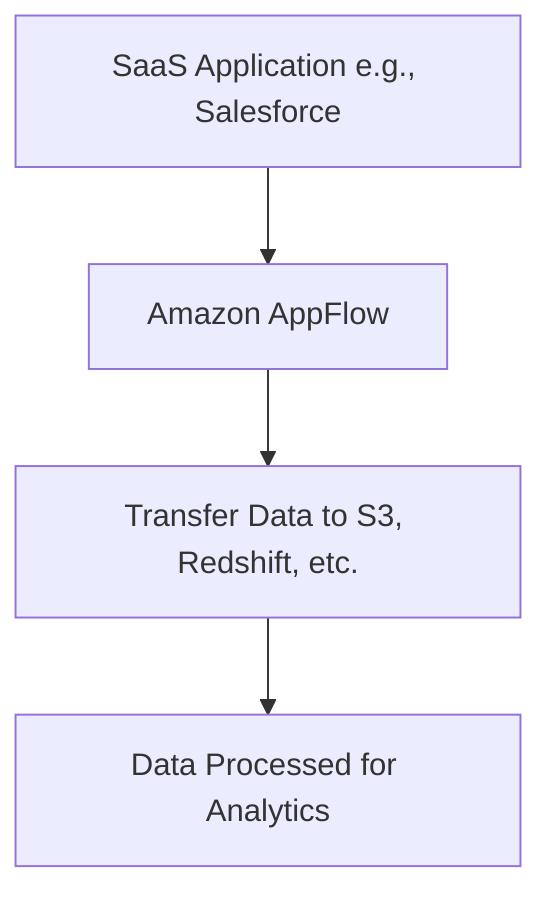
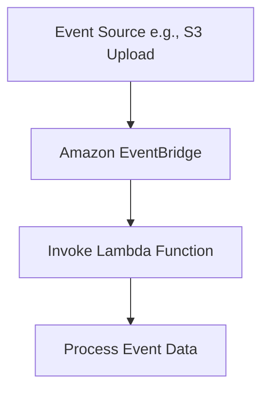
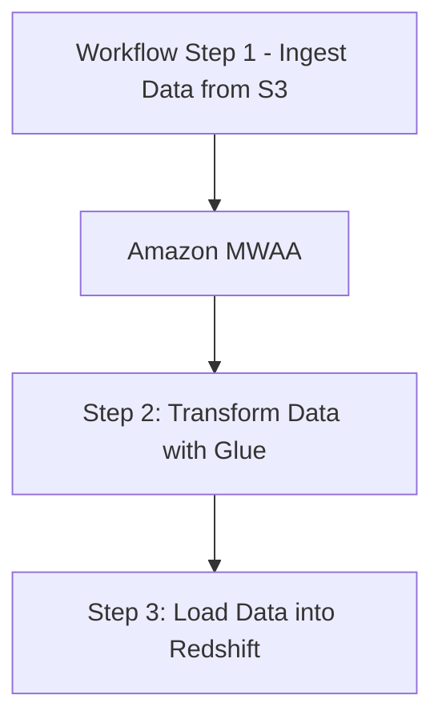
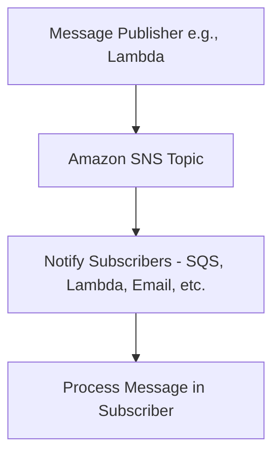
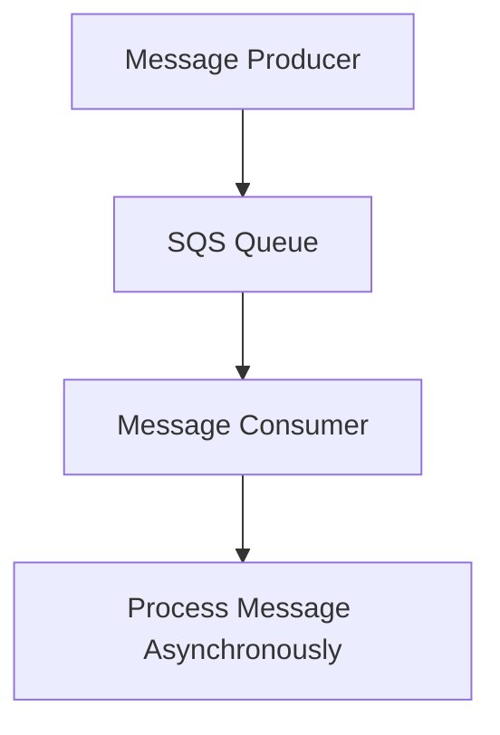
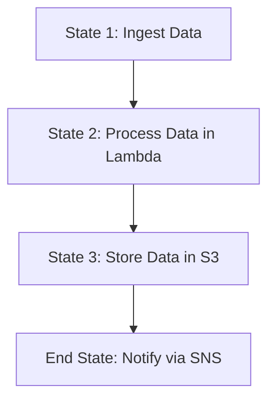

# Application Integration

### **1. Amazon AppFlow**

### **Primary Functions:**

- **Amazon AppFlow** is a fully managed integration service that enables the transfer of data between **SaaS applications** (like Salesforce, ServiceNow, etc.) and **AWS services** (like S3, Redshift).
- It supports **bidirectional data flow** between external applications and AWS services without needing custom development.

### **When to Use:**

- Use AppFlow to **integrate SaaS applications** with AWS for tasks like moving customer data from Salesforce to S3 for data processing or analytics.
- Ideal for automating data flows without managing complex ETL pipelines.

### **Antipatterns:**

- Avoid using AppFlow for real-time event-driven integrations; it’s better suited for scheduled, automated data transfers.

### **Mermaid Diagram: Amazon AppFlow Integration Workflow**

### **AWS Documentation Link:**

- [Amazon AppFlow](https://docs.aws.amazon.com/appflow/latest/userguide/what-is-appflow.html)

---

### **2. Amazon EventBridge**

### **Primary Functions:**

- **Amazon EventBridge** is a serverless event bus that allows you to **route events** between AWS services, custom applications, and **third-party SaaS applications**.
- It enables building **event-driven architectures** by triggering workflows, applications, or serverless functions based on events.

### **When to Use:**

- Use EventBridge to build **event-driven workflows** where services or applications react to events in real time (e.g., invoking a Lambda function when a file is uploaded to S3).
- Integrate multiple AWS services and SaaS apps using an event bus, ensuring **loosely coupled architectures**.

### **Antipatterns:**

- Avoid using EventBridge for high-throughput, low-latency messaging systems. It’s more suitable for use cases where event delivery latency is acceptable.

### **Mermaid Diagram: EventBridge Event-Driven Workflow**

### **AWS Documentation Link:**

- [Amazon EventBridge](https://docs.aws.amazon.com/eventbridge/latest/userguide/what-is-amazon-eventbridge.html)

---

### **3. Amazon Managed Workflows for Apache Airflow (Amazon MWAA)**

### **Primary Functions:**

- **Amazon MWAA** is a managed service for **Apache Airflow**, a popular tool for orchestrating complex workflows and automating ETL processes.
- It allows you to run and manage **Apache Airflow workflows** at scale in AWS without managing the underlying infrastructure.

### **When to Use:**

- Use MWAA for orchestrating **complex ETL workflows**, such as running data pipelines that integrate **S3**, **Redshift**, **EMR**, and other AWS services.
- Ideal for teams familiar with **Apache Airflow** that need a fully managed service for workflow automation.

### **Antipatterns:**

- Avoid using MWAA for simple automation tasks where **AWS Step Functions** or **Lambda** might be sufficient.

### **Mermaid Diagram: Amazon MWAA Workflow Orchestration**

### **AWS Documentation Link:**

- [Amazon MWAA](https://docs.aws.amazon.com/mwaa/latest/userguide/what-is-mwaa.html)

---

### **4. Amazon Simple Notification Service (Amazon SNS)**

### **Primary Functions:**

- **Amazon SNS** is a fully managed **publish/subscribe messaging service** that allows you to send messages from **publishers** to **subscribers** via **topics**.
- It supports multiple subscriber types like **SQS**, **Lambda**, **HTTP endpoints**, and **email/SMS notifications**.

### **When to Use:**

- Use SNS to implement **fan-out patterns**, where a single message needs to be sent to multiple subscribers.
- Ideal for sending notifications or alerts when events occur, such as system failures or data processing job completions.

### **Antipatterns:**

- Avoid using SNS as a message queue for processing jobs. If you need message persistence or ordered delivery, consider using **Amazon SQS**.

### **Mermaid Diagram: Amazon SNS Messaging Workflow**

### **AWS Documentation Link:**

- [Amazon SNS](https://docs.aws.amazon.com/sns/latest/dg/welcome.html)

---

### **5. Amazon Simple Queue Service (Amazon SQS)**

### **Primary Functions:**

- **Amazon SQS** is a fully managed **message queuing service** that allows you to decouple and scale microservices, distributed systems, and serverless applications.
- SQS ensures **message durability** and supports **standard queues** (which provide at-least-once delivery) and **FIFO queues** (which guarantee message ordering and exactly-once delivery).

### **When to Use:**

- Use SQS to **buffer** requests between different services or microservices to handle **asynchronous processing** and prevent overload.
- Ideal for scenarios where you need to process jobs in the background or handle bursts of requests without losing messages.

### **Antipatterns:**

- Avoid using SQS for real-time event-driven architectures where instant message delivery is required. **SNS** or **EventBridge** would be better suited.

### **Mermaid Diagram: Amazon SQS Workflow**

### **AWS Documentation Link:**

- [Amazon SQS](https://docs.aws.amazon.com/AWSSimpleQueueService/latest/SQSDeveloperGuide/welcome.html)

---

### **6. AWS Step Functions**

### **Primary Functions:**

- **AWS Step Functions** is a fully managed service that allows you to coordinate multiple **AWS services** into **serverless workflows**.
- It provides a visual interface to build workflows, define **state machines**, and handle **error handling** and **retry logic** automatically.

### **When to Use:**

- Use Step Functions to orchestrate **complex workflows**, especially when multiple AWS services (like Lambda, S3, and DynamoDB) are involved.
- It’s ideal for **long-running workflows**, **batch processing**, and **business process automation**.

### **Antipatterns:**

- Avoid using Step Functions for very simple tasks, where a single Lambda function or a lightweight workflow would suffice.

### **Mermaid Diagram: AWS Step Functions Workflow**

### **AWS Documentation Link:**

- [AWS Step Functions](https://docs.aws.amazon.com/step-functions/latest/dg/welcome.html)

---