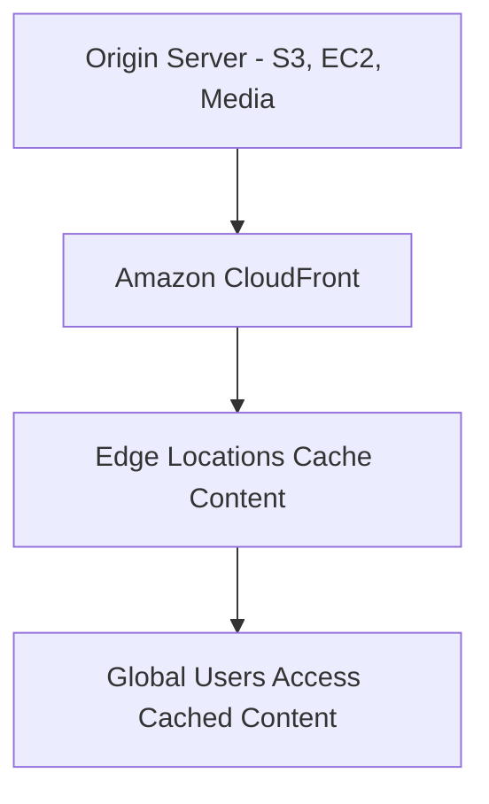
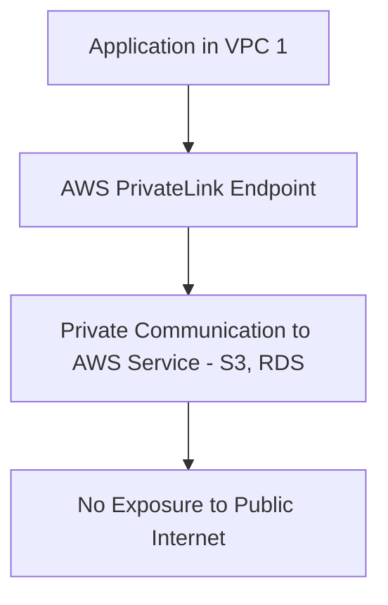
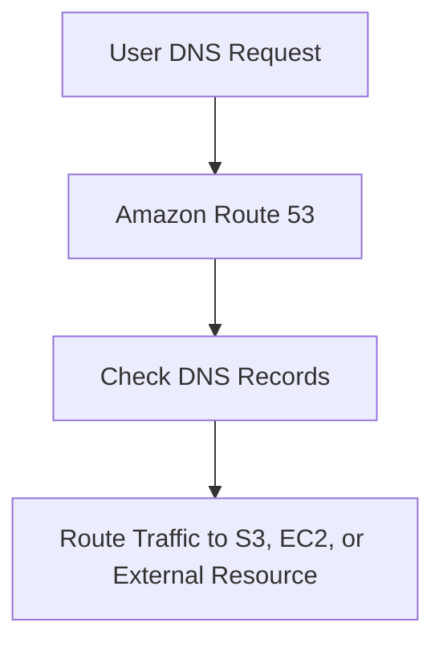
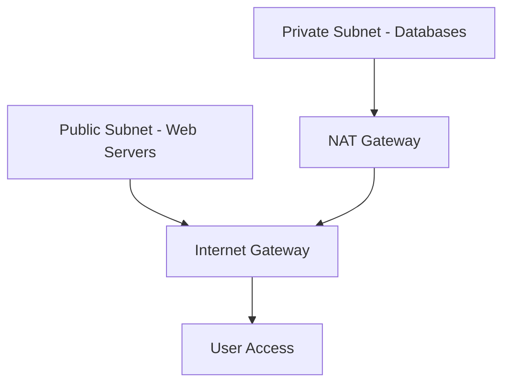

# Networking and Content Delivery

### **1. Amazon CloudFront**

### **Primary Functions:**

- **Amazon CloudFront** is a fast **content delivery network (CDN)** service that securely delivers **data, videos, applications, and APIs** to users globally with low latency and high transfer speeds.
- It uses a global network of **edge locations** to cache content closer to users, reducing load times and improving user experience.

### **When to Use:**

- Use CloudFront for delivering **static and dynamic web content**, such as **images, CSS files, JavaScript**, and **media files** to global users.
- Ideal for use cases requiring **low-latency content delivery** (e.g., video streaming, web applications, API acceleration).

### **Antipatterns:**

- Avoid using CloudFront for internal applications where global distribution is not required. Use **AWS Global Accelerator** for internal high-availability applications.
- Avoid using CloudFront for **pure storage**; use **Amazon S3** for large-scale storage and let CloudFront handle **distribution**.

### **Mermaid Diagram: CloudFront Content Delivery Workflow**

### **AWS Documentation Link:**

- [Amazon CloudFront](https://docs.aws.amazon.com/AmazonCloudFront/latest/DeveloperGuide/Introduction.html)

---

### **2. AWS PrivateLink**

### **Primary Functions:**

- **AWS PrivateLink** enables you to securely access AWS services or third-party services via **private endpoints** within your **VPC**, keeping traffic off the public internet.
- It ensures **secure, private communication** between VPCs, AWS services, and on-premises networks.

### **When to Use:**

- Use AWS PrivateLink to securely connect **VPCs to AWS services** or third-party SaaS applications without exposing traffic to the internet.
- Ideal for applications with **strict security and compliance requirements**, such as **financial services** or **healthcare** that require private communication channels.

### **Antipatterns:**

- Avoid using PrivateLink for **internet-facing applications**. If public access is required, **NAT Gateways** or **VPC Peering** may be more suitable.
- Avoid using PrivateLink for **large-scale data transfers**. For such cases, consider **VPC Peering** or **Direct Connect**.

### **Mermaid Diagram: AWS PrivateLink Workflow**

### **AWS Documentation Link:**

- [AWS PrivateLink](https://docs.aws.amazon.com/vpc/latest/privatelink/what-is-privatelink.html)

---

### **3. Amazon Route 53**

### **Primary Functions:**

- **Amazon Route 53** is a highly available and scalable **Domain Name System (DNS) web service** designed to route end-user requests to **AWS services**, **on-premises applications**, and **external domains**.
- Route 53 offers features such as **DNS failover**, **health checks**, and **traffic flow policies** for routing traffic based on location or latency.

### **When to Use:**

- Use Route 53 to manage **DNS records** for websites, applications, or APIs hosted on AWS or elsewhere. It’s ideal for setting up **custom domains** and **routing traffic based on health checks**.
- Use for **multi-region deployments**, where traffic needs to be routed to the nearest available AWS region for **latency-based routing**.

### **Antipatterns:**

- Avoid using Route 53 for **high-latency or geographically restricted applications** without configuring appropriate **routing policies** (e.g., latency-based routing or geolocation).
- Avoid using Route 53 for **short-lived, dynamically created DNS records**, as it may introduce complexity in managing frequent changes.

### **Mermaid Diagram: Route 53 DNS Routing Workflow**

### **AWS Documentation Link:**

- [Amazon Route 53](https://docs.aws.amazon.com/Route53/latest/DeveloperGuide/Welcome.html)

---

### **4. Amazon VPC (Virtual Private Cloud)**

### **Primary Functions:**

- **Amazon VPC** allows you to **provision isolated virtual networks** within the AWS Cloud. VPCs give you complete control over network configuration, including **IP address ranges**, **subnets**, **route tables**, and **network gateways**.
- VPCs provide network segmentation, **internet gateways**, **NAT gateways**, and **VPC peering** for connecting multiple VPCs securely.

### **When to Use:**

- Use Amazon VPC to deploy applications in **isolated, secure environments**, such as running **databases**, **web servers**, and **analytics platforms** with controlled access.
- Ideal for applications requiring **fine-grained network security** with **security groups**, **network ACLs**, and **private subnets** for sensitive workloads.

### **Antipatterns:**

- Avoid using **public subnets** in VPC for workloads requiring high levels of security or where **private communication** is needed—opt for **private subnets**.
- Avoid leaving **VPC peering connections** unused if not required, as they can introduce unnecessary complexity. Use **AWS PrivateLink** for specific services access.

### **Mermaid Diagram: Amazon VPC Network Architecture**

### **AWS Documentation Link:**

- [Amazon VPC](https://docs.aws.amazon.com/vpc/latest/userguide/what-is-amazon-vpc.html)

---