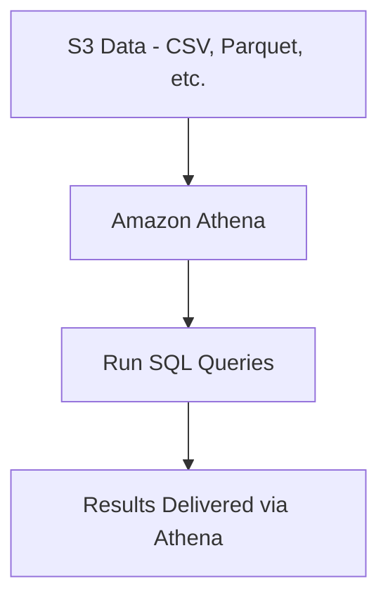
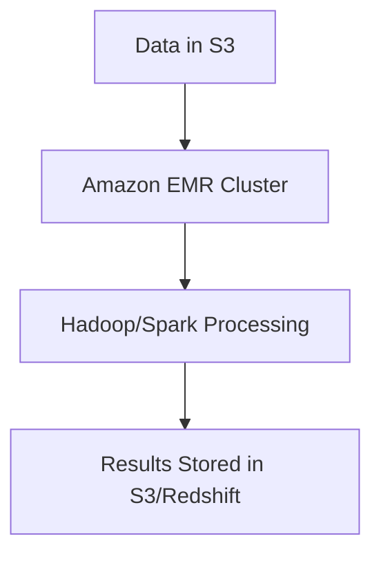
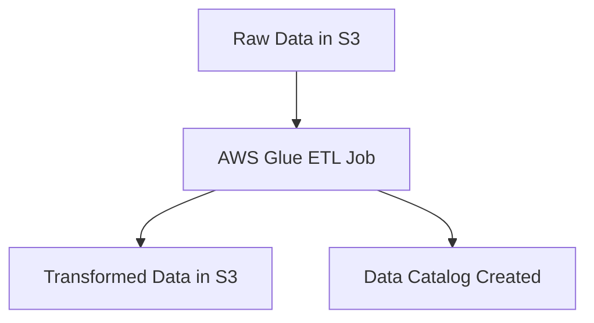
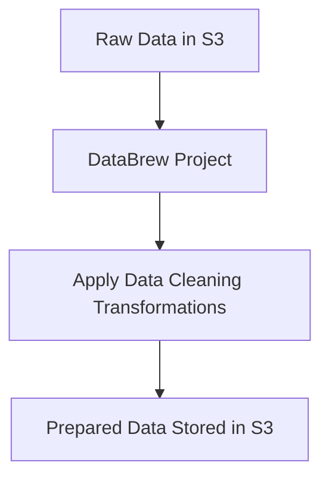
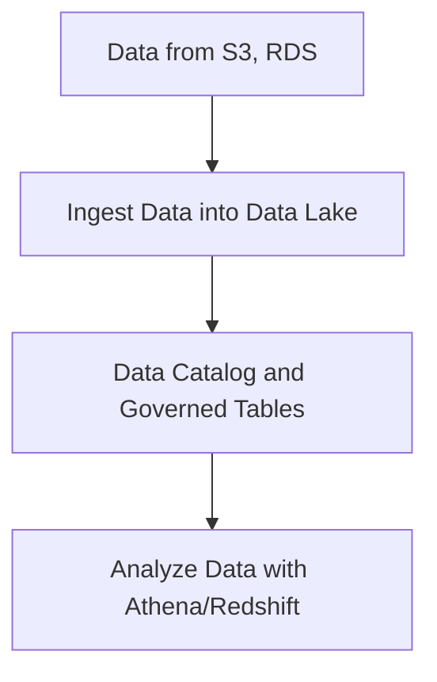
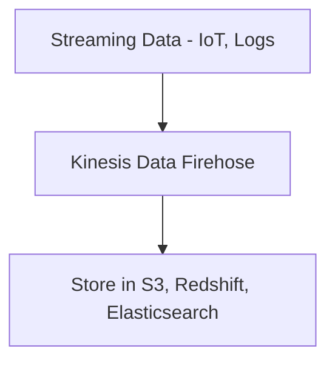
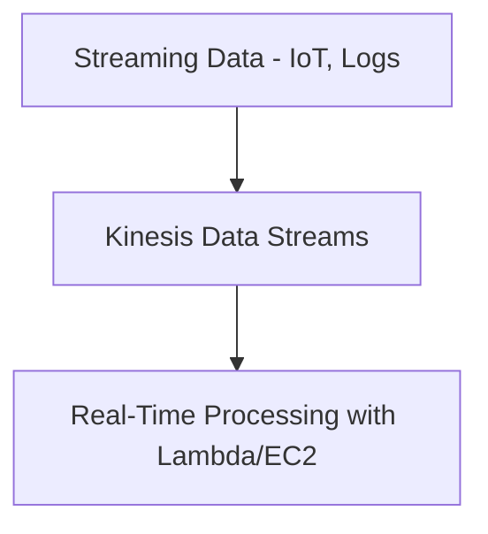
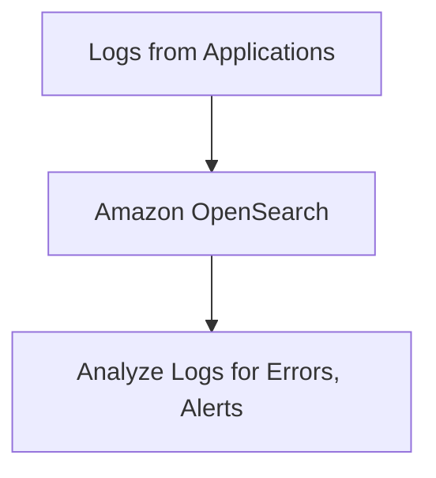
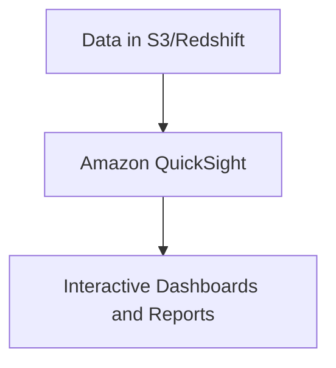

# Analytics

### **1. Amazon Athena**

### **Primary Functions:**

- **Amazon Athena** is a serverless, interactive query service that allows you to analyze data directly in **Amazon S3** using **standard SQL**.
- It works directly with data stored in various formats, such as **CSV**, **JSON**, **Parquet**, and **ORC**.

### **When to Use:**

- **Ad-hoc querying**: Use Athena when you need to quickly query large datasets stored in S3 without needing to set up complex infrastructure.
- **Serverless analytics**: Ideal for scenarios where you want to run queries without managing servers.

### **Antipatterns:**

- Avoid using Athena for continuous, low-latency analytics. It is better suited for **batch querying** than real-time data processing.

### **Mermaid Diagram: Basic Athena Workflow**

### **AWS Documentation Link:**

- [Amazon Athena](https://docs.aws.amazon.com/athena/latest/ug/what-is.html)

---

### **2. Amazon EMR**

### **Primary Functions:**

- **Amazon EMR (Elastic MapReduce)** is a cloud big data platform for processing vast amounts of data using **Apache Hadoop**, **Apache Spark**, and other big data frameworks.

### **When to Use:**

- Use EMR for **distributed processing** of large datasets across scalable clusters, especially for **ETL jobs**, **machine learning**, and **big data analytics**.

### **Antipatterns:**

- Avoid EMR for small-scale data processing as it may be overkill for basic data tasks. It can be costly if not properly managed.

### **Mermaid Diagram: Amazon EMR Processing Workflow**

### **AWS Documentation Link:**

- [Amazon EMR](https://docs.aws.amazon.com/emr/latest/ManagementGuide/emr-what-is-emr.html)

---

### **3. AWS Glue**

### **Primary Functions:**

- **AWS Glue** is a fully managed ETL (Extract, Transform, Load) service that automates data preparation for analytics.
- It integrates with a variety of AWS services and can catalog, clean, and transform data stored in **S3**, **RDS**, **Redshift**, and more.

### **When to Use:**

- Use Glue for **serverless ETL** operations and to **prepare data** for machine learning or analytics.
- Glue is also used to create a **Data Catalog** to organize and manage metadata.

### **Antipatterns:**

- Avoid Glue for small, real-time transformations where the startup time of Glue jobs can lead to inefficiencies.

### **Mermaid Diagram: AWS Glue ETL Workflow**

### **AWS Documentation Link:**

- [AWS Glue](https://docs.aws.amazon.com/glue/latest/dg/what-is-glue.html)

---

### **4. AWS Glue DataBrew**

### **Primary Functions:**

- **AWS Glue DataBrew** is a visual data preparation tool that allows users to clean and normalize data without writing code.

### **When to Use:**

- Use DataBrew when you need a **no-code solution** for data transformation or cleaning, especially for **non-technical users** who need to prepare data for analytics.

### **Antipatterns:**

- Avoid using DataBrew for complex ETL pipelines that require custom transformations. AWS Glue provides more flexibility for advanced ETL.

### **Mermaid Diagram: AWS Glue DataBrew Workflow**

### **AWS Documentation Link:**

- [AWS Glue DataBrew](https://docs.aws.amazon.com/databrew/latest/dg/what-is.html)

---

### **5. AWS Lake Formation**

### **Primary Functions:**

- **AWS Lake Formation** simplifies the process of building, securing, and managing a **data lake** in Amazon S3.
- It helps you ingest, catalog, cleanse, and transform data while managing access control policies for your lake.

### **When to Use:**

- Use Lake Formation when building a **secure, governed data lake** in AWS, where multiple teams and users need different levels of access to datasets.

### **Antipatterns:**

- Avoid using Lake Formation for temporary, small datasets that do not require centralized data governance.

### **Mermaid Diagram: AWS Lake Formation Workflow**

### **AWS Documentation Link:**

- [AWS Lake Formation](https://docs.aws.amazon.com/lake-formation/latest/dg/what-is-lake-formation.html)

---

### **6. Amazon Kinesis Data Firehose**

### **Primary Functions:**

- **Amazon Kinesis Data Firehose** is a real-time data streaming service that loads streaming data into **S3**, **Redshift**, **Elasticsearch**, and other services.

### **When to Use:**

- Use Kinesis Data Firehose for **real-time data delivery**, such as streaming logs from applications or IoT devices into AWS for analytics.

### **Antipatterns:**

- Avoid using Firehose when your application doesn’t require real-time data ingestion or where batch processing is sufficient.

### **Mermaid Diagram: Kinesis Data Firehose Workflow**

### **AWS Documentation Link:**

- [Amazon Kinesis Data Firehose](https://docs.aws.amazon.com/firehose/latest/dev/what-is-this-service.html)

---

### **7. Amazon Kinesis Data Streams**

### **Primary Functions:**

- **Amazon Kinesis Data Streams** is a service that enables **real-time streaming** of data for use cases like live data analytics and application monitoring.

### **When to Use:**

- Use Kinesis Data Streams when you need to process **real-time data** (e.g., clickstreams, IoT telemetry) at scale with low latency.

### **Antipatterns:**

- Avoid using Kinesis Data Streams for batch data ingestion or when near real-time is sufficient, as it can be over-engineered for simpler scenarios.

### **Mermaid Diagram: Kinesis Data Streams Workflow**

### **AWS Documentation Link:**

- [Amazon Kinesis Data Streams](https://docs.aws.amazon.com/streams/latest/dev/amazon-kinesis-streams.html)

---

### **8. Amazon Managed Service for Apache Flink**

### **Primary Functions:**

- **Amazon Managed Service for Apache Flink** enables you to build **stream processing applications** using Apache Flink in a fully managed environment.

### **When to Use:**

- Use this service for **real-time data analytics**, windowed aggregations, and data transformations across continuous data streams.

### **Antipatterns:**

- Avoid using Apache Flink for batch processing use cases, as it is designed for real-time stream processing.

### **AWS Documentation Link:**

- [Amazon Managed Service for Apache Flink](https://docs.aws.amazon.com/kinesisanalytics/latest/java/what-is.html)

---

### **9. Amazon Managed Streaming for Apache Kafka (MSK)**

### **Primary Functions:**

- **Amazon MSK** is a fully managed service that makes it easy to run **Apache Kafka** for ingesting and processing streaming data.

### **When to Use:**

- Use MSK when you need a **high-throughput streaming platform** to integrate with multiple applications (e.g., microservices architecture).

### **Antipatterns:**

- Avoid using MSK for simple real-time analytics when Kinesis Data Streams may suffice.

### **AWS Documentation Link:**

- [Amazon MSK](https://docs.aws.amazon.com/msk/latest/developerguide/what-is-msk.html)

---

### **10. Amazon OpenSearch Service**

### **Primary Functions:**

- **Amazon OpenSearch Service** (formerly Elasticsearch Service) is used for **log and search analytics** on data stored in OpenSearch clusters.

### **When to Use:**

- Use OpenSearch for use cases like **real-time log analysis**, **full-text search**, and **monitoring** of large datasets.

### **Antipatterns:**

- Avoid using OpenSearch for basic relational queries.

It is optimized for search and analytics on unstructured or semi-structured data.

### **Mermaid Diagram: OpenSearch Service Workflow**

### **AWS Documentation Link:**

- [Amazon OpenSearch Service](https://docs.aws.amazon.com/opensearch-service/latest/developerguide/what-is.html)

---

### **11. Amazon QuickSight**

### **Primary Functions:**

- **Amazon QuickSight** is a scalable, serverless **business intelligence** service that provides data visualization, reporting, and dashboards.

### **When to Use:**

- Use QuickSight for **interactive dashboards** and **business intelligence reports** built directly on top of data sources like S3, Redshift, and Athena.

### **Antipatterns:**

- Avoid using QuickSight as a data processing engine; it is designed for visualization and reporting rather than ETL tasks.

### **Mermaid Diagram: QuickSight Dashboard Workflow**

### **AWS Documentation Link:**

- [Amazon QuickSight](https://docs.aws.amazon.com/quicksight/latest/user/welcome.html)

---