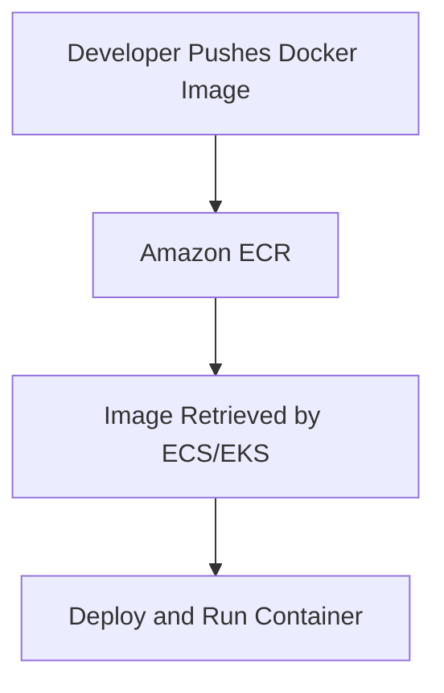
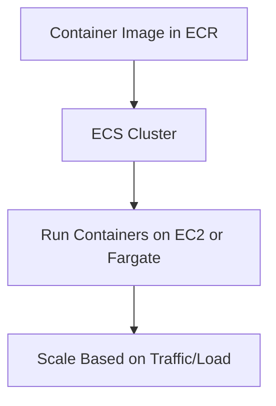
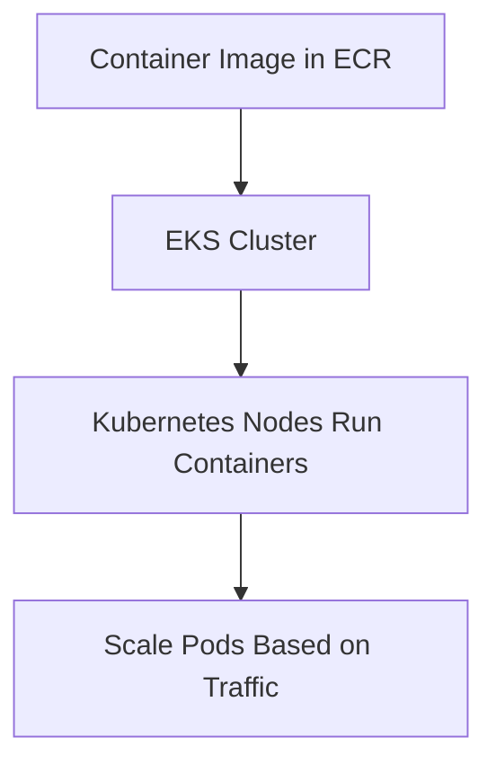

# Containers

### **1. Amazon Elastic Container Registry (Amazon ECR)**

### **Primary Functions:**

- **Amazon ECR** is a fully managed **Docker container registry** that makes it easy to store, manage, and deploy Docker container images.
- ECR integrates seamlessly with Amazon **ECS**, **EKS**, and **AWS Lambda** for container-based workloads.

### **When to Use:**

- Use Amazon ECR to **store and manage container images** for applications that are deployed on ECS or EKS.
- Ideal for developers using containerized applications that need a secure, scalable, and integrated container image storage solution.

### **Antipatterns:**

- Avoid using ECR for **non-containerized applications** or if you do not need a registry to manage Docker images.
- Avoid using ECR as a general-purpose artifact store; it is specifically designed for Docker containers.

### **Mermaid Diagram: ECR Workflow**

### **AWS Documentation Link:**

- [Amazon ECR](https://docs.aws.amazon.com/AmazonECR/latest/userguide/what-is-ecr.html)

---

### **2. Amazon Elastic Container Service (Amazon ECS)**

### **Primary Functions:**

- **Amazon ECS** is a fully managed container orchestration service that allows you to deploy, manage, and scale **containerized applications** using Docker.
- ECS can run containers on either **EC2 instances** or using **AWS Fargate** for a serverless approach.

### **When to Use:**

- Use ECS when you want a **fully managed, AWS-native container orchestration service** that integrates well with other AWS services (e.g., S3, RDS, Lambda).
- ECS with **Fargate** is ideal for use cases where you want to run containers without managing the underlying infrastructure.

### **Antipatterns:**

- Avoid using ECS for workloads that need Kubernetes features such as custom controllers or specific Kubernetes APIs; use **EKS** instead.
- Avoid managing your own EC2 instances for container orchestration if you prefer a serverless model; use **ECS with Fargate**.

### **Mermaid Diagram: Amazon ECS Workflow**

### **AWS Documentation Link:**

- [Amazon ECS](https://docs.aws.amazon.com/AmazonECS/latest/developerguide/Welcome.html)

---

### **3. Amazon Elastic Kubernetes Service (Amazon EKS)**

### **Primary Functions:**

- **Amazon EKS** is a fully managed service that enables you to run **Kubernetes** on AWS without needing to manage the underlying Kubernetes control plane.
- EKS simplifies running Kubernetes applications at scale and integrates with AWS services such as **IAM**, **VPC**, **ALB**, and **CloudWatch**.

### **When to Use:**

- Use EKS when you need the power and flexibility of **Kubernetes** to orchestrate containerized applications, especially if you have **multi-cloud** or **hybrid cloud** requirements.
- Ideal for teams that are already familiar with Kubernetes and want to run it on AWS without managing the control plane.

### **Antipatterns:**

- Avoid using EKS if you prefer to manage containers without the complexity of Kubernetes. For simpler use cases, **ECS** or **Fargate** might be a better fit.
- If your container orchestration needs are minimal or entirely within the AWS ecosystem, EKS may introduce unnecessary overhead.

### **Mermaid Diagram: Amazon EKS Workflow**

### **AWS Documentation Link:**

- [Amazon EKS](https://docs.aws.amazon.com/eks/latest/userguide/what-is-eks.html)

---

### **Comparison: ECS vs. EKS vs. Fargate**

| Feature | **Amazon ECS** | **Amazon EKS** | **AWS Fargate (for ECS/EKS)** |
| --- | --- | --- | --- |
| **Control Plane** | Managed by AWS | Managed by AWS | Managed by AWS (for serverless) |
| **Compute Resource Management** | EC2 or Fargate | EC2 or Fargate | No need to manage compute resources |
| **Orchestration Engine** | AWS Native | Kubernetes | ECS or EKS (serverless) |
| **Complexity** | Lower (AWS-native) | Higher (Kubernetes-based) | Simplest (no infrastructure management) |
| **Use Case** | Simple to medium container orchestration | Kubernetes-based workloads | Serverless containers |

---